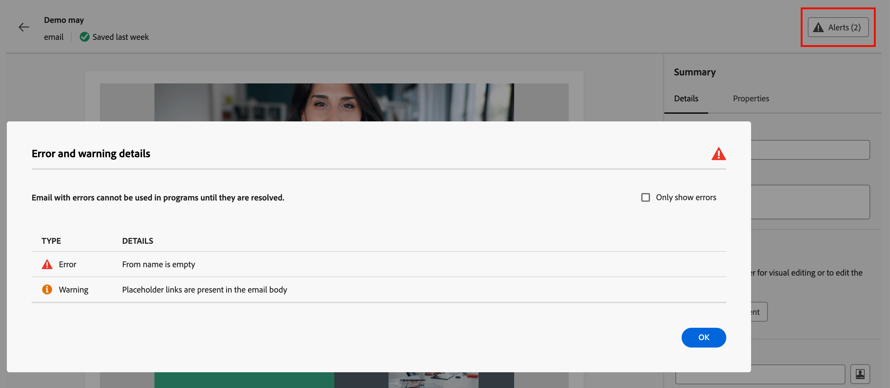

# Aggiungi un messaggio e-mail al percorso

Utilizza Adobe Journey Optimizer B2B edition per inviare messaggi e-mail ai clienti tramite percorsi di account. Puoi scegliere di creare, personalizzare e visualizzare in anteprima i messaggi nello spazio di progettazione delle e-mail. Dopo che le e-mail sono attive in percorsi, monitora l&#39;invio, la consegna e il coinvolgimento nel [report sulle prestazioni delle e-mail](../dashboards/email-performance-dashboard.md).

>[!NOTE]
>
>Se invii un’e-mail per la prima volta, assicurati che il canale e-mail sia configurato. Per ulteriori informazioni, consulta [Protocolli per il tracciamento e la consegna e-mail](../start/email-protocols.md).
>
>Per informazioni dettagliate sulla valutazione delle preferenze di consenso e-mail al momento della consegna, consulta [Preferenze di consenso](./channels-consent-preferences.md).

## Aggiungere un nodo di azione Invia e-mail {#send-email-node}

Puoi impostare le consegne e-mail in un percorso quando [aggiungi un _[!UICONTROL Esegui un&#39;azione]_ nodo](../journeys/action-nodes.md) ed esegui le seguenti operazioni:

1. _(Solo percorsi di account)_ Per l&#39;azione _[!UICONTROL Azione sulla destinazione]_, scegliere **[!UICONTROL Persone]**.

1. Scegliere **[!UICONTROL Invia messaggio di posta elettronica]** per l&#39;azione.

1. Fai clic su **[!UICONTROL Crea e-mail]**.

   {width="500"}

1. Nella finestra di dialogo _Crea nuova e-mail_, scegli di creare una nuova risorsa di contenuto e-mail o di duplicare una risorsa di contenuto e-mail esistente.

   * Scegli l&#39;opzione **[!UICONTROL Nuova e-mail]** quando vuoi creare un&#39;e-mail utilizzando un&#39;area di lavoro vuota o un modello e-mail.

     {width="400"}

     * Immetti un **[!UICONTROL Nome]** univoco per l&#39;e-mail e una **[!UICONTROL riga Oggetto]**.

     * Fai clic su **[!UICONTROL Crea]**.

   * Scegli l&#39;opzione **[!UICONTROL Duplica e-mail esistente]** quando vuoi creare un&#39;e-mail utilizzando un&#39;e-mail esistente dal percorso corrente o da un altro percorso.

     Puoi apportare modifiche all’e-mail duplicata in base all’obiettivo per il nodo di percorso.

     * Per **[!UICONTROL Messaggio e-mail esistente da duplicare]**, fai clic sull&#39;icona _Selezione_ (  ) e seleziona l&#39;e-mail che desideri duplicare e utilizzare per il nodo del percorso.

       Per filtrare l’elenco delle e-mail, inserisci una stringa di testo nel campo di ricerca in modo che corrisponda al nome dell’e-mail. Selezionare la casella di controllo per l&#39;e-mail che si desidera duplicare e fare clic su **[!UICONTROL Seleziona]**.

       {width="600" zoomable="yes"}

     * Immetti un **[!UICONTROL Nome]** univoco per l&#39;e-mail e una **[!UICONTROL riga Oggetto]**.

       {width="400"}

     * Fai clic su **[!UICONTROL Crea]**.

1. Fai clic su **[!UICONTROL Modifica e-mail]** per definire le [impostazioni](#email-settings) e il [contenuto](./email-authoring.md) dell&#39;e-mail.

   {width="500"}

## Definire le impostazioni e-mail {#email-settings}

Con la scheda **[!UICONTROL Dettagli]** selezionata nel pannello _Riepilogo_ a destra, scorri verso il basso per visualizzare e definire le impostazioni e-mail.

{width="700" zoomable="yes"}

| Opzione | Descrizione |
| ------ | ----------- |
| [!UICONTROL Da nome] | Nome del mittente utilizzato nell’intestazione dell’e-mail. Immettere il nome del mittente che si desidera venga visualizzato al destinatario. Fai clic sull&#39;icona _Personalizza_ (  ) per utilizzare un token di personalizzazione nel campo. |
| [!UICONTROL Da e-mail] | Indirizzo del mittente utilizzato nell’intestazione dell’e-mail. Il valore predefinito viene popolato dalle [impostazioni di consegna del canale e-mail](../admin/configure-channels-emails.md#delivery-settings). Fai clic sull&#39;icona _Personalizza_ (  ) per utilizzare un token di personalizzazione nel campo. |
| [!UICONTROL Indirizzo di risposta] | Indirizzo del mittente utilizzato nell’intestazione dell’e-mail. Il valore predefinito viene popolato dalle [impostazioni di consegna del canale e-mail](../admin/configure-channels-emails.md#delivery-settings) ([!UICONTROL Da etichetta]). Inserisci l’indirizzo e-mail che desideri compilare se il destinatario utilizza la funzione di risposta (può essere diverso o uguale all’indirizzo del mittente). Fai clic sull&#39;icona _Personalizza_ (  ) per utilizzare un token di personalizzazione nel campo. |
| [!UICONTROL Oggetto] | Testo visualizzato nel campo oggetto dell’e-mail. Il valore predefinito viene compilato dal testo immesso nella finestra di dialogo _[!UICONTROL Crea nuova e-mail]_. Se necessario, puoi modificare il testo. Fai clic sull&#39;icona _Personalizza_ (  ) per utilizzare un token di personalizzazione nel campo.<!-- Click the AI Assistant button ( {width="30" zoomable="no"} ) to generate the subject line based on the current email content.--> |
| [!UICONTROL Dominio di branding] | Se nel sistema sono definiti più di un [dominio di branding](../admin/configure-channels-emails.md#branding-domains), selezionare il dominio di branding da utilizzare per inviare l&#39;e-mail. Utilizza un dominio di branding specifico per inviare e-mail che sembrano provenire dal tuo marchio anziché dall’azienda nel suo insieme. Crea fiducia nel brand, personalizza l’esperienza e-mail e aumenta i tassi di apertura e risposta. |
| [!UICONTROL E-mail operativa] | Seleziona la casella di controllo se desideri che l’e-mail sia operativa. Le e-mail operative sono escluse dagli elenchi di rinuncia/annullamento dell’iscrizione e dai limiti di comunicazione. Seleziona questa opzione solo se il destinatario non può considerare il messaggio e-mail come un messaggio commerciale non richiesto (SPAM). |
| [!UICONTROL Includi visualizzazione come pagina Web] | Seleziona la casella di controllo per includere un collegamento a una pagina web generata dal contenuto del messaggio e-mail. I messaggi e-mail hanno funzionalità più limitate rispetto alle pagine web, quindi è utile per JavaScript, CSS esteso e moduli. Il testo utilizzato per generare il collegamento è configurato nelle [impostazioni di consegna del canale e-mail](../admin/configure-channels-emails.md#delivery-settings) ([!UICONTROL Visualizza come pagina Web HTML] e [!UICONTROL Visualizza come testo della pagina Web]). |
| [!UICONTROL Disabilita tracciamento aperto] | Seleziona la casella di controllo se non desideri tenere traccia dell’attività di apertura delle e-mail. Con la funzione disattivata, i conteggi delle attività aperte e-mail vengono incrementati solo quando una persona univoca apre l’e-mail. Puoi [gestire il tracciamento dei collegamenti dei contenuti e-mail](./email-authoring.md#edit-linked-url-tracking) quando progetti il contenuto del corpo dell&#39;e-mail. |
| [!UICONTROL Preheader] | Selezionare la casella di controllo per includere una preintestazione. Un preheader è il breve testo di riepilogo che viene visualizzato dopo la riga dell’oggetto in alcuni client e-mail. In genere fornisce un breve riepilogo dell’e-mail ed è in genere una singola frase. Immettere il testo di riepilogo nel campo<!-- , or click the AI Assistant button ( {width="30" zoomable="no"} ) to generate summary text based on the current email content -->. |

<!-- 
Removed, but may reappear elsewhere
| [!UICONTROL Dedicated IP] | If you have more than one dedicated IP addresses defined, select a dedicated IP address to use for sending the email. When you use a specific dedicated IP for your programs, you can track and monitor deliverability more closely and respond quickly to any changes in your delivery metrics. For more information about adding a dedicated IP for the connected Marketo Engage instance, refer to the [Marketo Engage documentation](https://experienceleague.adobe.com/it/docs/marketo/using/product-docs/email-marketing/deliverability/use-your-dedicated-ip-addresses-to-send-emails){target="_blank"}.|
| [!UICONTROL Fields used as CC addresses] | If available, select up to 25 Lead or Company fields that are set up in Marketo Engage using the `Email` type.  |
-->

## Controllare gli avvisi {#check-alerts}

Mentre definisci le impostazioni e-mail e il contenuto, gli avvisi vengono visualizzati nell’interfaccia (in alto a destra della pagina) quando mancano le impostazioni chiave. Se non trovi questo pulsante, non sono stati rilevati problemi.

{width="600" zoomable="yes"}

Esistono due tipi di avvisi:

* **_Avvisi_** che fanno riferimento a consigli e best practice, ad esempio:

  * `The opt-out link is not present in the email body`: è consigliabile aggiungere al corpo dell&#39;e-mail un collegamento per annullare l&#39;abbonamento.

    >[!NOTE]
    >
    >I messaggi e-mail in stile marketing devono includere un collegamento di rinuncia, che non è necessario per i messaggi transazionali.

  * `Text version of HTML is empty`: definisci una versione testuale del corpo dell&#39;e-mail, che viene utilizzata quando non è possibile visualizzare il contenuto HTML.

  * `Empty link is present in email body`: verificare che tutti i collegamenti presenti nel messaggio di posta elettronica siano corretti.

  * `Email size has exceeded the limit of 100KB`: per una consegna ottimale, assicurati che la dimensione dell&#39;e-mail non superi i 100 KB.

* **_Errori_** che impediscono di testare o attivare il percorso o la campagna finché non vengono risolti, ad esempio:

  * `From name is empty`: il campo e-mail _Da_ (obbligatorio) non è definito.

  * `The subject line is missing`: la riga dell&#39;oggetto dell&#39;e-mail (obbligatorio) non è definita.

  * `The email version of the message is empty`: il contenuto dell&#39;e-mail non è definito.
