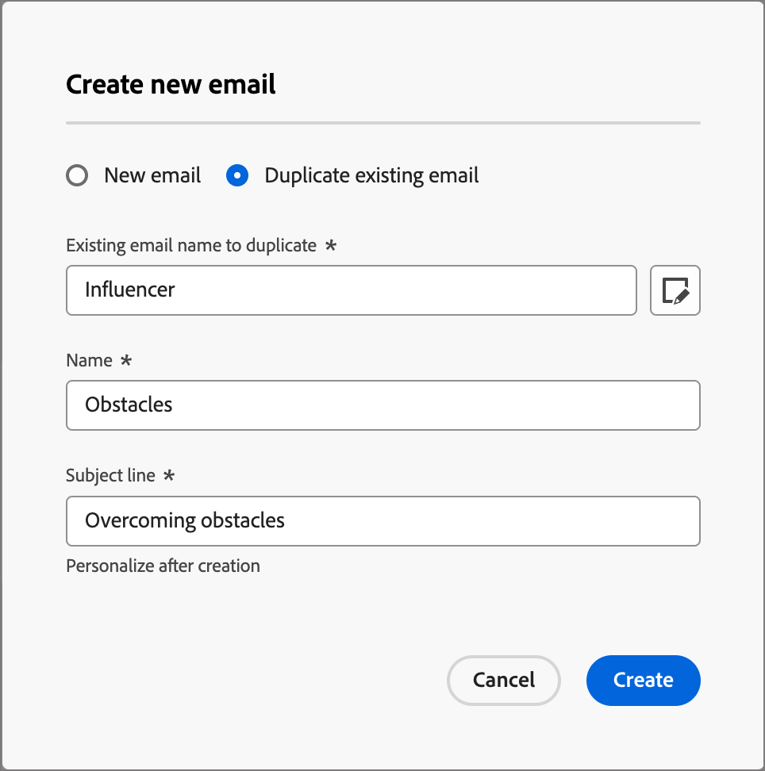
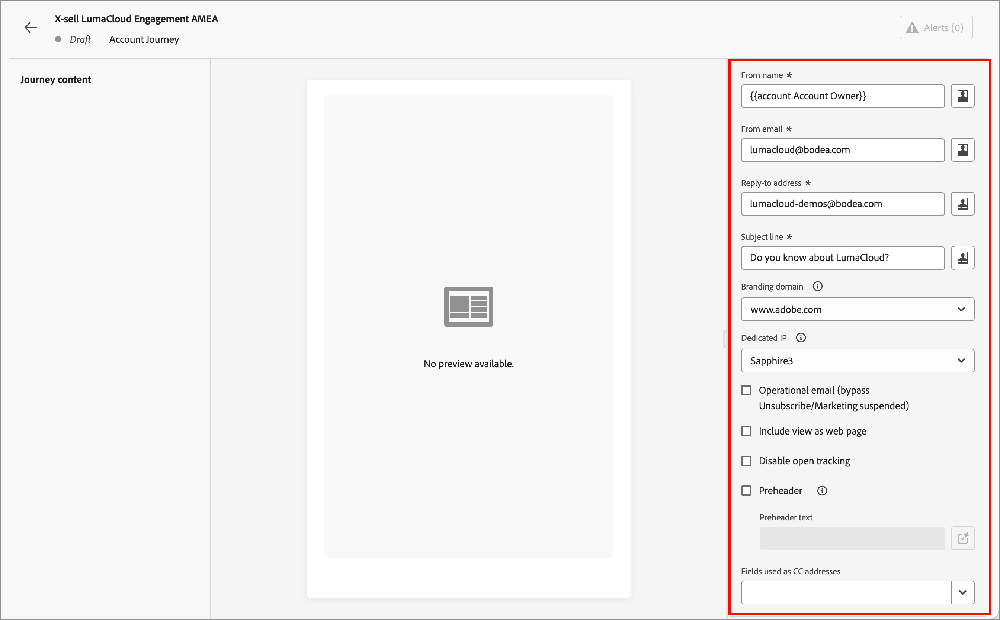

# Aggiungi un messaggio e-mail al percorso

Utilizza Adobe Journey Optimizer B2B edition per inviare messaggi e-mail ai clienti tramite percorsi di account. Puoi scegliere di creare, personalizzare e visualizzare in anteprima i messaggi nello spazio di progettazione delle e-mail. In alternativa, puoi scegliere di inviare un’e-mail già definita nell’istanza di Marketo Engage connessa.

>[!NOTE]
>
>Se invii un’e-mail per la prima volta, assicurati che il canale e-mail sia configurato dall’interno di Adobe Marketo Engage. Per ulteriori informazioni, consulta [Protocolli per il tracciamento e la consegna e-mail](../start/email-protocols.md).

## Aggiungere un nodo di azione e-mail in un percorso

Puoi impostare le consegne e-mail in un percorso quando [aggiungi un _[!UICONTROL Esegui un&#39;azione]_ nodo](../journeys/action-nodes.md) ed esegui le seguenti operazioni:

1. Per l&#39;azione _[!UICONTROL sulla destinazione]_, scegliere **[!UICONTROL Persone]**.

1. Per _[!UICONTROL Azione sulle persone]_, scegli **[!UICONTROL Invia e-mail]**.

1. Per l&#39;_[!UICONTROL origine e-mail]_, scegliere la modalità di origine dell&#39;e-mail da inviare.

   {width="700" zoomable="yes"}

   * Scegli **[!UICONTROL Crea nuova e-mail]** per creare l&#39;e-mail in modo nativo in Journey Optimizer B2B edition.

     Questa opzione consente di gestire il contenuto delle e-mail in modo nativo in Journey Optimizer B2B edition. Fai clic su **[!UICONTROL Crea e-mail]** per aprire la finestra di dialogo _Crea nuova e-mail_. Puoi creare una nuova risorsa di contenuto e-mail o duplicare una risorsa di contenuto e-mail esistente.

     +++Nuova e-mail

     Se desideri creare un&#39;e-mail utilizzando un&#39;area di lavoro o un modello e-mail vuoto, utilizza l&#39;opzione _[!UICONTROL Nuova e-mail]_.

      1. Nella finestra di dialogo, scegli **[!UICONTROL Nuova e-mail]**.

      1. Immetti un **[!UICONTROL Nome]** univoco per l&#39;e-mail e una **[!UICONTROL riga Oggetto]**.

         {width="400"}

      1. Fai clic su **[!UICONTROL Crea]**.

         Nella sezione _[!UICONTROL Proprietà e-mail]_ della pagina del contenuto e-mail, i campi _[!UICONTROL Da e-mail]_ e _[!UICONTROL Rispondi all&#39;indirizzo]_ sono già configurati. È possibile immettere valori per i campi _[!UICONTROL Da nome]_ e _[!UICONTROL Descrizione]_ (facoltativo).

      1. Fai clic su **[!UICONTROL Modifica e-mail]** per definire le [impostazioni](#define-the-email-settings) e progettare il [contenuto](./email-authoring.md).

     +++

     +++E-mail esistente duplicato

     Se desideri creare un messaggio e-mail utilizzando un messaggio e-mail esistente del percorso corrente o di un altro percorso, utilizza l&#39;opzione _[!UICONTROL Duplica messaggio e-mail esistente]_. Puoi apportare modifiche all’e-mail duplicata in base all’obiettivo per il nodo di percorso.

      1. Nella finestra di dialogo _[!UICONTROL Crea nuova e-mail]_, scegli **[!UICONTROL Duplica e-mail esistente]**.

      1. Per **[!UICONTROL Messaggio e-mail esistente da duplicare]**, fai clic sull&#39;icona _Selezione_ (  ) e seleziona l&#39;e-mail che desideri duplicare e utilizzare per il nodo del percorso.

         Per filtrare l’elenco delle e-mail, inserisci una stringa di testo nel campo di ricerca in modo che corrisponda al nome dell’e-mail.

         {width="600" zoomable="yes"}

         Selezionare la casella di controllo per l&#39;e-mail che si desidera duplicare e fare clic su **[!UICONTROL Seleziona]**.

      1. Immetti un **[!UICONTROL Nome]** univoco per l&#39;e-mail e una **[!UICONTROL riga Oggetto]**.

         {width="400"}

      1. Fai clic su **[!UICONTROL Crea]**.

         Nella sezione _[!UICONTROL Proprietà e-mail]_ della pagina del contenuto e-mail, i campi _[!UICONTROL Da e-mail]_ e _[!UICONTROL Rispondi all&#39;indirizzo]_ sono già configurati. È possibile immettere valori per i campi _[!UICONTROL Da nome]_ e _[!UICONTROL Descrizione]_ (facoltativo).

      1. Se necessario, fare clic su **[!UICONTROL Modifica e-mail]** per modificare le [impostazioni](#define-the-email-settings) e il [contenuto](./email-authoring.md).

     +++

   * Scegli **[!UICONTROL Seleziona e-mail da Adobe Marketo Engage]** per utilizzare una delle e-mail precreate in Marketo Engage e inviarla come parte del percorso.

     Se nell&#39;istanza di Market Engage connessa sono disponibili più aree di lavoro, selezionarle. Quindi, seleziona l’e-mail approvata che desideri inviare per il nodo di percorso.

     {width="500" zoomable="yes"}

     Con questa opzione, il nodo è impostato e il contenuto dell’e-mail non necessita di ulteriori definizioni nel percorso.

## Definire le impostazioni e-mail

Con la scheda **[!UICONTROL Dettagli]** selezionata nel pannello _Riepilogo_ a destra, scorri verso il basso per visualizzare e definire le impostazioni e-mail.

{width="700" zoomable="yes"}

| Opzione | Descrizione |
| ------ | ----------- |
| [!UICONTROL Da nome] | Nome del mittente utilizzato nell’intestazione dell’e-mail. Immettere il nome del mittente che si desidera venga visualizzato al destinatario. Fai clic sull&#39;icona _Personalizza_ (  ) per utilizzare un token di personalizzazione nel campo. |
| [!UICONTROL Da e-mail] | Indirizzo del mittente utilizzato nell’intestazione dell’e-mail. Il valore predefinito viene popolato dalle [impostazioni di consegna del canale e-mail](../admin/configure-channels-emails.md#delivery-settings). Fai clic sull&#39;icona _Personalizza_ (  ) per utilizzare un token di personalizzazione nel campo. |
| [!UICONTROL Indirizzo di risposta] | Indirizzo del mittente utilizzato nell’intestazione dell’e-mail. Il valore predefinito viene popolato dalle [impostazioni di consegna del canale e-mail](../admin/configure-channels-emails.md#delivery-settings) ([!UICONTROL Da etichetta]). Inserisci l’indirizzo e-mail che desideri compilare se il destinatario utilizza la funzione di risposta (può essere diverso o uguale all’indirizzo del mittente). Fai clic sull&#39;icona _Personalizza_ (  ) per utilizzare un token di personalizzazione nel campo. |
| [!UICONTROL Oggetto] | Testo visualizzato nel campo oggetto dell’e-mail. Il valore predefinito viene compilato dal testo immesso nella finestra di dialogo _[!UICONTROL Crea nuova e-mail]_. Se necessario, puoi modificare il testo. Fai clic sull&#39;icona _Personalizza_ (  ) per utilizzare un token di personalizzazione nel campo.<!-- Click the AI Assistant button ( {width="30" zoomable="no"} ) to generate the subject line based on the current email content.--> |
| [!UICONTROL Dominio di branding] | Se nel sistema sono definiti più di un [dominio di branding](../admin/configure-channels-emails.md#branding-domains), selezionare il dominio di branding da utilizzare per inviare l&#39;e-mail. Utilizza un dominio di branding specifico per inviare e-mail che sembrano provenire dal tuo marchio anziché dall’azienda nel suo insieme. Crea fiducia nel brand, personalizza l’esperienza e-mail e aumenta i tassi di apertura e risposta. |
| [!UICONTROL IP dedicato] | Se hai definito più di un indirizzo IP dedicato, seleziona un indirizzo IP dedicato da utilizzare per inviare l’e-mail. Quando utilizzi un IP dedicato specifico per i programmi, puoi monitorare e monitorare più da vicino il recapito dei messaggi e rispondere rapidamente a eventuali modifiche nelle metriche di consegna. Per ulteriori informazioni sull&#39;aggiunta di un IP dedicato per l&#39;istanza di Marketo Engage connessa, consultare la [documentazione di Marketo Engage](https://experienceleague.adobe.com/en/docs/marketo/using/product-docs/email-marketing/deliverability/use-your-dedicated-ip-addresses-to-send-emails){target="_blank"}. |
| [!UICONTROL E-mail operativa] | Seleziona la casella di controllo se desideri che l’e-mail sia operativa. Le e-mail operative sono escluse dagli elenchi di rinuncia/annullamento dell’iscrizione e dai limiti di comunicazione. Seleziona questa opzione solo se il destinatario non può considerare il messaggio e-mail come un messaggio commerciale non richiesto (SPAM). |
| [!UICONTROL Includi visualizzazione come pagina Web] | Seleziona la casella di controllo per includere un collegamento a una pagina web generata dal contenuto del messaggio e-mail. I messaggi e-mail hanno funzionalità più limitate rispetto alle pagine web, quindi è utile per JavaScript, CSS esteso e moduli. Il testo utilizzato per generare il collegamento è configurato nelle [impostazioni di consegna del canale e-mail](../admin/configure-channels-emails.md#delivery-settings) ([!UICONTROL Visualizza come pagina Web HTML] e [!UICONTROL Visualizza come testo della pagina Web]). |
| [!UICONTROL Disabilita tracciamento aperto] | Seleziona la casella di controllo se non desideri tenere traccia dell’attività di apertura delle e-mail. Con la funzione disattivata, i conteggi delle attività aperte e-mail vengono incrementati solo quando una persona univoca apre l’e-mail. Puoi [gestire il tracciamento dei collegamenti dei contenuti e-mail](./email-authoring.md#content-authoring---link-tracking) quando progetti il contenuto del corpo dell&#39;e-mail. |
| [!UICONTROL Preheader] | Selezionare la casella di controllo per includere una preintestazione. Un preheader è il breve testo di riepilogo che viene visualizzato dopo la riga dell’oggetto in alcuni client e-mail. In genere fornisce un breve riepilogo dell’e-mail ed è in genere una singola frase. Immettere il testo di riepilogo nel campo<!-- , or click the AI Assistant button ( {width="30" zoomable="no"} ) to generate summary text based on the current email content -->. |
| [!UICONTROL Campi utilizzati come indirizzi CC] | Se disponibili, selezionare fino a 25 campi Lead o Società configurati in Marketo Engage utilizzando il tipo `Email`. |

## Controllare gli avvisi

Durante la progettazione del contenuto dei messaggi e-mail, gli avvisi vengono visualizzati nell’interfaccia (in alto a destra della pagina) quando mancano le impostazioni chiave. Se non trovi questo pulsante, non sono stati rilevati problemi.

{width="600" zoomable="yes"}

È possibile rilevare due tipi di avvisi:

* **_Avvisi_** che fanno riferimento a consigli e best practice, ad esempio:

   * `The opt-out link is not present in the email body`: è consigliabile aggiungere un collegamento di annullamento all&#39;abbonamento nel corpo dell&#39;e-mail.

     >[!NOTE]
     >
     >I messaggi e-mail in stile marketing devono includere un collegamento di rinuncia, che non è necessario per i messaggi transazionali.

   * `Text version of HTML is empty`: non dimenticare di definire una versione testuale del corpo dell&#39;e-mail, che viene utilizzata quando non è possibile visualizzare il contenuto HTML.

   * `Empty link is present in email body`: verificare che tutti i collegamenti presenti nel messaggio di posta elettronica siano corretti.

   * `Email size has exceeded the limit of 100KB`: per una consegna ottimale, assicurati che la dimensione dell&#39;e-mail non superi i 100 KB.

* **_Errori_** che impediscono di testare o attivare il percorso o la campagna finché non vengono risolti, ad esempio:

   * `From name is empty`: il campo e-mail _Da_ (obbligatorio) non è definito.

   * `The subject line is missing`: la riga dell&#39;oggetto dell&#39;e-mail (obbligatorio) non è definita.

   * `The email version of the message is empty`: il contenuto dell&#39;e-mail non è definito.
