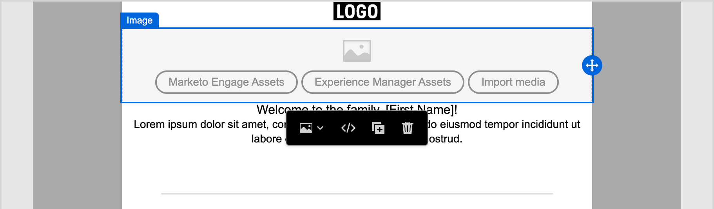

# Utilizzare le risorse di Experience Manager

Quando Adobe Experience Manager Assets as a Cloud Service è integrato con Adobe Journey Optimizer B2B edition, puoi individuare e accedere facilmente alle risorse digitali da utilizzare nei contenuti di marketing. Mentre crei i contenuti, le risorse sono accessibili dall&#39;elemento _Experience Manager Assets_ nell&#39;area di navigazione a sinistra e durante l&#39;authoring dei contenuti e-mail per un percorso di account.

{{aem-assets-licensing-note}}

Quando utilizzi queste risorse digitali, le modifiche più recenti in Assets as a Cloud Service si propagano automaticamente alle campagne e-mail live tramite riferimenti collegati. Se le immagini vengono eliminate in Adobe Experience Manager Assets as a Cloud Service, nelle e-mail vengono visualizzate con un riferimento non funzionante. Quando le risorse attualmente utilizzate nei percorsi di account vengono modificate o eliminate, gli autori del percorso ricevono una notifica sulle modifiche apportate all’immagine e sull’elenco dei percorsi che la utilizzano. Tutte le modifiche apportate alle risorse devono essere effettuate nell’archivio centrale di Adobe Experience Manager Assets.

Se nell&#39;ambiente sono presenti una o più connessioni a [archivi Assets](../admin/configure-aem-repositories.md), gli autori di contenuto possono utilizzare AEM Assets come origine per le risorse durante la creazione di un messaggio e-mail, un modello e-mail o un frammento visivo.

>[!IMPORTANT]
>
>Un amministratore deve aggiungere gli utenti che hanno bisogno di accedere ad Assets ai profili di prodotto Utenti consumer di Assets e Utenti di Assets. [Ulteriori informazioni](https://experienceleague.adobe.com/en/docs/experience-manager-cloud-service/content/security/ims-support#managing-products-and-user-access-in-admin-console){target="_blank"}

## Accedere alle immagini di AEM Assets

Nell&#39;editor del contenuto visivo, fai clic sull&#39;icona _Experience Manager Assets_ (  ) nella barra laterale a sinistra. In questo modo il pannello strumenti diventa un elenco delle risorse disponibili nell’archivio selezionato.

{width="700" zoomable="yes"}

>[!NOTE]
>
>Al momento, in Adobe Journey Optimizer B2B edition sono supportate solo le risorse immagine di Adobe Experience Manager Assets. Le modifiche alle risorse devono essere effettuate dall’archivio centrale di Adobe Experience Manager Assets. [Ulteriori informazioni](https://experienceleague.adobe.com/en/docs/experience-manager-cloud-service/content/assets/manage/manage-digital-assets){target="_blank"}

### Modificare l’archivio visualizzato

Se sono presenti più repository AEM connessi, fare clic sulla freccia del menu per **[!UICONTROL Repository]** per scegliere il repository che si desidera visualizzare nel pannello sinistro.

{width="700" zoomable="yes"}

Esistono diversi metodi per aggiungere una risorsa immagine all’area di lavoro visiva.

### Trascina un’immagine

1. Sfoglia le miniature delle immagini visualizzate nel pannello a sinistra.

1. Trascina la miniatura dell’immagine e rilasciala nell’area di lavoro, per aggiungere il nuovo componente immagine.

   {width="700" zoomable="yes"}

## Trovare e selezionare un&#39;immagine

1. Aggiungi un componente immagine all&#39;area di lavoro e fai clic su **[!UICONTROL Experience Manager Assets]** per aprire la finestra di dialogo _[!UICONTROL Seleziona Assets]_.

   {width="600" zoomable="yes"}

1. Dalla finestra di dialogo, scegli un’immagine utilizzando gli strumenti disponibili per individuare la risorsa necessaria:

   * Modifica l&#39;**[!UICONTROL Archivio]** in alto a destra.

   * Fai clic su **[!UICONTROL Gestisci risorse]** in alto a destra per aprire l&#39;archivio Assets in un&#39;altra scheda del browser e utilizzare gli strumenti di gestione AEM Assets.

   * Fai clic sul selettore _Tipo di visualizzazione_ in alto a destra per modificare la visualizzazione in **[!UICONTROL Vista a elenco]**, **[!UICONTROL Vista griglia]**, **[!UICONTROL Vista galleria]** o **[!UICONTROL Vista a cascata]**.

   * Fai clic sull&#39;icona _Ordinamento_ per modificare l&#39;ordinamento tra crescente e decrescente.

     {width="700" zoomable="yes"}

   * Fare clic sulla freccia del menu **[!UICONTROL Ordina per]** per modificare i criteri di ordinamento in **[!UICONTROL Nome]**, **[!UICONTROL Dimensione]** o **[!UICONTROL Modificato]**.

   * Fai clic sull&#39;icona _Filtro_ in alto a sinistra per filtrare gli elementi visualizzati in base ai criteri.

   * Immetti il testo da cercare nel campo Ricerca per filtrare gli elementi visualizzati in modo che corrispondano al nome della risorsa.

   {width="700" zoomable="yes"}

1. Fai clic su **[!UICONTROL Seleziona]**.
<!-- 

## Upload assets

To import files to Assets as a Cloud Service, you first need to browse or create the folder to be used for storage. You can then import an asset and add it to your email content. After assets are uploaded, you can [use the image assets as you author content](./assets-overview.md#add-assets-to-your-content).

1. While authoring your content in the email designer, drag an image element into the canvas. 

   The properties on the right reflect the image element selection. 

1. Click **[!UICONTROL Import media]** to open the _[!UICONTROL Upload image]_ dialog.

1. If your file system is open to your image file, drag and drop the file on the box in the dialog.

   {width="700" zoomable="yes"}

   You can also click the **[!UICONTROL Select a file from your computer]** link and use your file system to locate and select the image file. Click Open and the image file is displayed in the box.

1. Click **[!UICONTROL Import]**.
-->
