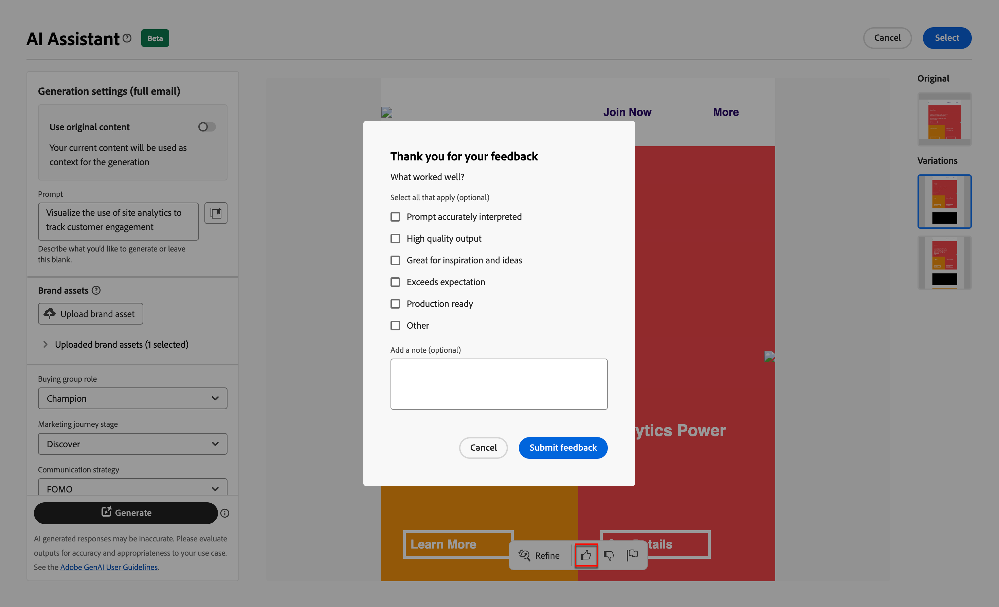
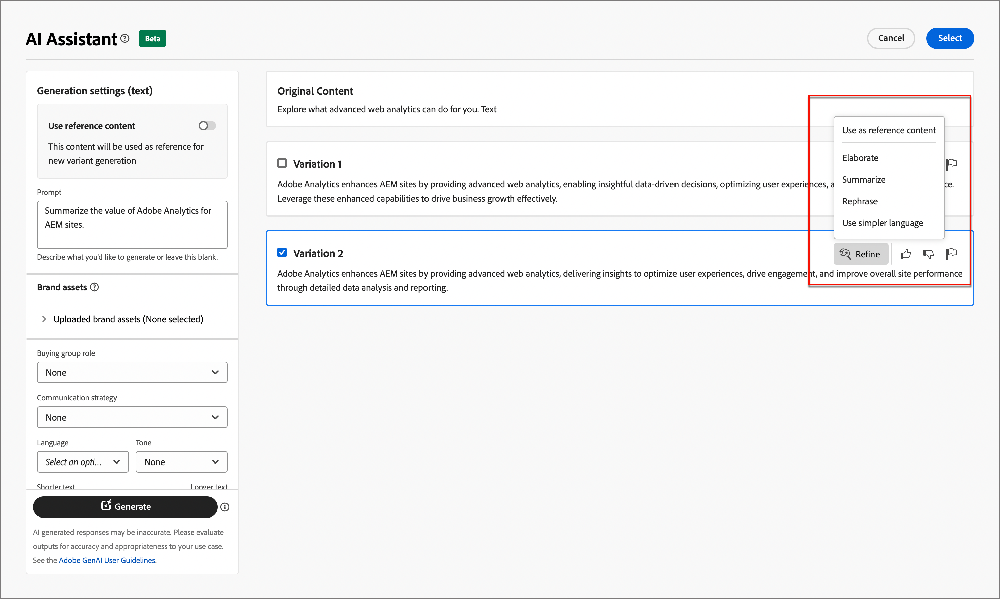

# Assistente AI per l’authoring delle e-mail

Con l&#39;aumento della competitività del settore Marketing, i marchi sono alla ricerca di metodi efficienti per generare contenuti di forte impatto in modo rapido ed efficiente. L’Assistente all’intelligenza artificiale per l’authoring delle e-mail in Adobe Journey Optimizer B2B Edition è la funzionalità di generazione di contenuti basata sull’intelligenza artificiale di Adobe che rivoluziona il modo in cui i professionisti del marketing creano contenuti e-mail professionali e coerenti con il brand. Con modelli GenAI avanzati e una profonda comprensione delle linee guida del brand, AI Assistant genera automaticamente contenuti personalizzati, coinvolgenti ed efficaci in base all’obiettivo di marketing, con contenuti ottimizzati per stili, layout, toni e altro ancora delineati dal brand. Ai Assistant rende la creazione e l’esecuzione di campagne di e-mail marketing intuitiva, semplice e senza problemi. L’aggiunta di questa funzionalità ai flussi di lavoro consente di risparmiare tempo, migliorare l’efficienza e ottenere risultati migliori.

Questa nuova funzionalità fornisce una generazione di testo basata su prompt, una generazione completa di e-mail e una generazione di contenuti all’interno delle strutture e-mail. Le immagini non vengono generate, ma sono consigliate dall’interno del catalogo delle immagini nella risorsa del brand di input per il modello. Puoi anche utilizzare questa funzionalità per generare linee oggetto e intestazioni preliminari ottimali con cui influire sul tasso di apertura.

>[!NOTE]
>
>Questa funzionalità è disponibile nella versione Beta e soggetta a modifiche senza preavviso.

## Linee guida e limitazioni

Prima di iniziare a utilizzare l’Assistente IA in Adobe Journey Optimizer B2B Edition per la generazione di contenuti e-mail, rivedi queste linee guida:

* L’obiettivo/prompt di marketing che definisci è un determinante chiave della qualità del contenuto generato. Utilizzate un prompt ben definito per consentire al modello GenAI di interpretare con precisione.
* Carica le risorse del brand in modo che siano accurate sui contenuti del brand. Senza queste risorse, il contenuto si basa su informazioni disponibili pubblicamente.
   * Le risorse caricate possono essere nei seguenti formati: PDF, JPEG, PNG o file ZIP (contenenti i formati di file supportati).
   * La dimensione massima per una risorsa marchio caricata è di 50 MB. Possono funzionare file di dimensioni maggiori o grandi quantità di immagini, ma il tempo di elaborazione aumenta.
* Per creare il contenuto delle e-mail, utilizza i modelli e-mail creati da Adobe Journey Optimizer B2B Edition, preferibilmente i modelli incorporati o di esempio, un modello specifico per il brand o un modello personalizzato. Si consigliano modelli di e-mail con un massimo di otto-dieci immagini.
* Assicurati di segnalare qualsiasi output problematico utilizzando le icone miniatura in basso o flag rispetto a una variante generata.
* L&#39;utilizzo dell&#39;Assistente per l&#39;intelligenza artificiale è soggetto alle [Linee guida per l&#39;utente generativo per l&#39;intelligenza artificiale di Adobe](https://www.adobe.com/it/legal/licenses-terms/adobe-gen-ai-user-guidelines.html).

Le seguenti limitazioni si applicano all’Assistente IA in Adobe Journey Optimizer B2B Edition per la generazione di contenuti e-mail:

* L’inglese è l’unica lingua supportata.
* È disponibile solo per il canale e-mail.
* Il contenuto GenAI potrebbe non essere accurato: condividi il tuo feedback in modo che gli ingegneri Adobi possano perfezionare i modelli.
* Puoi caricare più risorse per il brand, ma puoi sfruttarne una sola per una generazione specifica.

>[!BEGINSHADEBOX]

## Libreria dei prompt

Un prompt efficace è essenziale per generare i contenuti migliori possibili. Se hai bisogno di assistenza per creare la richiesta, accedi alla _Libreria richieste_. Questa libreria fornisce una vasta gamma di idee per migliorare la generazione dei contenuti.

{width="500" zoomable="no"}

Seleziona il prompt che meglio riflette gli obiettivi previsti e aggiungi i valori necessari che specificano il marchio, l’offerta, la campagna e i casi d’uso.

>[!ENDSHADEBOX]

## Acquisto di ruoli di gruppo

Adobe Journey Optimizer B2B Edition offre cinque ruoli di gruppo di acquisto B2B standard preconfigurati. Ogni ruolo del gruppo di acquisto ha un oggetto di messaggistica distinto:

| Ruolo | Stato attivo messaggistica |
| ---- | --------------- |
| Comitato esecutivo direttivo | Informazioni sul prodotto  Prezzi  Dettagli sull&#39;integrazione tecnica  Caratteristiche e funzioni del prodotto |
| Influencer | Prova di qualità  Facilità di implementazione  Competenze in materia  Vantaggi competitivi |
| Responsabile delle decisioni | Ritorno sull&#39;investimento  Valore finanziario (RoI)  Storie dei clienti |
| Professionista | Facilità di utilizzo  Funzionalità e funzionalità del prodotto  Compatibilità del prodotto  Facilità di integrazione del prodotto |
| Campione | Contenuto educativo  Contenuto leadership di pensiero  Storie dei clienti |

La scelta di uno di questi ruoli del gruppo di acquisto personalizza automaticamente l’output in base alle caratteristiche e agli argomenti di interesse per ciascuno di questi ruoli.

## Generare proprietà e-mail con l’Assistente IA

Quando [aggiungi un&#39;azione e-mail](./email-authoring.md#add-an-email-action-in-an-account-journey) a un percorso di account, definisci un set di proprietà e-mail utilizzate per inviare l&#39;e-mail. L&#39;Assistente AI può contribuire a migliorare il coinvolgimento e-mail generando il contenuto consigliato per l&#39;e-mail **riga oggetto** e **preheader**.

1. Crea un messaggio e-mail da un percorso di account o apri un messaggio e-mail esistente da un nodo di percorso.

   La pagina di anteprima e-mail viene visualizzata con le _[!UICONTROL proprietà e-mail]_ a destra.

1. Seleziona una delle seguenti schede per scoprire come utilizzare l’Assistente AI nell’authoring delle proprietà e-mail.

>[!BEGINTABS]

>[!TAB Generazione riga oggetto]

I passaggi seguenti descrivono la sequenza di attività per l’utilizzo dell’Assistente AI per generare una riga dell’oggetto ottimizzata per l’e-mail:

1. Nelle _[!UICONTROL Proprietà e-mail]_, fai clic sull&#39;icona dell&#39;Assistente di IA ( {width="30" zoomable="no"} ) a destra del campo **[!UICONTROL Oggetto]**.

   {width="600" zoomable="yes"}

   La finestra a comparsa Assistente AI si apre con le impostazioni di generazione per la riga dell’oggetto dell’e-mail.

   A seconda del contenuto dell’e-mail associato all’e-mail o di come desideri utilizzare la riga dell’oggetto in base allo scopo, sono disponibili alcune opzioni per la generazione del testo della riga dell’oggetto:

   * Puoi fare clic immediatamente su **[!UICONTROL Genera]** senza una richiesta o una risorsa del marchio per utilizzare il corpo dell&#39;e-mail esistente come contesto per la generazione dell&#39;oggetto.

   * (Consigliato) Puoi fornire un prompt, una risorsa del brand e altri valori di impostazione per fornire il contesto necessario per generare il testo dell’oggetto più ottimale per le tue esigenze. (Fasi da 2 a 7)

1. Nel campo **[!UICONTROL Prompt]** immettere una descrizione di ciò che si desidera generare.

   Utilizza la [Libreria prompt](#prompt-library) per ottenere informazioni utili sulla creazione di un prompt valido.

1. Specifica una risorsa del brand contenente il contenuto da usare come origine per la generazione del testo.

   * Seleziona la risorsa dal catalogo.

   * Fai clic su **[!UICONTROL Carica risorsa marchio]** per aggiungere il file della risorsa marchio.

   {width="600" zoomable="yes"}

1. Scorri se necessario e seleziona il **[!UICONTROL Ruolo gruppo acquisti]** da utilizzare come pubblico di destinazione per il testo generato.

1. Se necessario, utilizza le opzioni di messaggistica per adattare il contenuto:

   * **[!UICONTROL Strategia di comunicazione]** - Scegli lo stile di comunicazione più adatto al testo generato.
   * **[!UICONTROL Lingua]** - Seleziona la lingua in cui desideri generare il contenuto.
   * **[!UICONTROL Tono]** - Scegli un tono che risuona con il tuo pubblico. Se specifichi di voler essere informativo, giocoso o persuasivo, AI Assistant può adattare il messaggio di conseguenza.

1. Se necessario, utilizzare il dispositivo di scorrimento per impostare la lunghezza desiderata del testo da generare.

1. Modifica l&#39;opzione **[!UICONTROL Usa emoji]** (attivata o disattivata) in base alle tue preferenze.

1. Quando la richiesta e le impostazioni sono pronte, fare clic su **[!UICONTROL Genera]**.

1. Scorri il pannello Assistente AI e sfoglia le varianti generate per determinare quale sia la più adatta.

   * Fai clic su **[!UICONTROL Anteprima]** per visualizzare una versione a schermo intero di una variante selezionata.

   * Fornisci un feedback per le varianti generate facendo clic sull&#39;icona _Miniature in alto_, _Miniature in basso_ o _Contrassegna_ e scegli il motivo per il quale riepiloga meglio il feedback.

1. Passa alle opzioni _Perfeziona_ nella finestra Anteprima per accedere ad altre funzioni di personalizzazione:

   * **[!UICONTROL Usa come contenuto di riferimento]** - Selezionare questa opzione per utilizzare la variante come contenuto di riferimento per generare altri risultati.

   * **[!UICONTROL Riformula]** - L&#39;Assistente di IA può riformulare il messaggio in diversi modi, mantenendo la scrittura fresca e coinvolgente per diversi tipi di pubblico.

   * **[!UICONTROL Utilizza un linguaggio più semplice]**. Utilizza l&#39;Assistente AI per semplificare la lingua, garantendo chiarezza e accessibilità a un pubblico più ampio.

   {width="600" zoomable="yes"}

1. Fai clic su **[!UICONTROL Seleziona]** per sostituire il testo dell&#39;oggetto con la variante selezionata e tornare alle proprietà dell&#39;e-mail.

>[!TAB Generazione preheader]

Un preheader e-mail è il breve testo di riepilogo che segue la riga dell’oggetto quando un’e-mail viene visualizzata nella casella in entrata. Si tratta di un elemento facoltativo per un’e-mail, ma rappresenta una grande opportunità per migliorare il coinvolgimento. I passaggi seguenti descrivono la sequenza di attività per l’utilizzo dell’Assistente AI per generare un preheader ottimizzato per l’e-mail:

1. Nelle proprietà e-mail, seleziona la casella di controllo **[!UICONTROL Preheader]** e fai clic sull&#39;icona dell&#39;Assistente AI ( {width="30" zoomable="no"} ) a destra.

   {width="600" zoomable="yes"}

   Viene visualizzata la finestra a comparsa Assistente AI con le impostazioni di generazione per la preintestazione dell’e-mail.

   A seconda del contenuto dell’e-mail associato all’e-mail o di come desideri eseguirne il targeting, sono disponibili alcune opzioni per generare il preheader:

   * Puoi fare clic immediatamente su **[!UICONTROL Genera]** senza una richiesta o una risorsa del brand per utilizzare il corpo dell&#39;e-mail esistente come contesto per la generazione della preintestazione.

   * (Consigliato) Puoi fornire un prompt, una risorsa del brand e altri valori di impostazione per fornire il contesto necessario per generare il preheader più ottimale per le tue esigenze. (Fasi da 2 a 7)

1. Nel campo **[!UICONTROL Prompt]** immettere una descrizione di ciò che si desidera generare.

   Utilizza la [Libreria prompt](#prompt-library) per ottenere informazioni utili sulla creazione di un prompt valido.

1. Specifica una risorsa del brand contenente il contenuto da usare come origine per la generazione del testo.

   * Seleziona la risorsa dal catalogo.

   * Fai clic su **[!UICONTROL Carica risorsa marchio]** per aggiungere il file della risorsa marchio.

   {width="600" zoomable="yes"}

1. Scorri se necessario e seleziona il **[!UICONTROL Ruolo gruppo acquisti]** da utilizzare come pubblico di destinazione per il testo generato.

1. Se necessario, utilizza le opzioni di messaggistica per adattare il contenuto:

   * **[!UICONTROL Strategia di comunicazione]** - Scegli lo stile di comunicazione più adatto al testo generato.
   * **[!UICONTROL Lingua]** - Seleziona la lingua in cui desideri generare il contenuto.
   * **[!UICONTROL Tono]** - Scegli un tono che risuona con il tuo pubblico. Se specifichi di voler essere informativo, giocoso o persuasivo, AI Assistant può adattare il messaggio di conseguenza.

1. Se necessario, utilizzare il dispositivo di scorrimento per impostare la lunghezza desiderata del testo da generare.

1. Modifica l&#39;opzione **[!UICONTROL Usa emoji]** (attivata o disattivata) in base alle tue preferenze.

1. Quando la richiesta e le impostazioni sono pronte, fare clic su **[!UICONTROL Genera]**.

1. Scorri il pannello Assistente AI e sfoglia le varianti generate per determinare quale sia la più adatta.

   * Fai clic su **[!UICONTROL Anteprima]** per visualizzare una versione a schermo intero di una variante selezionata.

   * Fornisci un feedback per le varianti generate facendo clic sull&#39;icona _Miniature in alto_, _Miniature in basso_ o _Contrassegna_ e scegli il motivo per il quale riepiloga meglio il feedback.

1. Passa alle opzioni _Perfeziona_ nella finestra Anteprima per accedere ad altre funzioni di personalizzazione:

   * **[!UICONTROL Usa come contenuto di riferimento]** - Selezionare questa opzione per utilizzare la variante come contenuto di riferimento per generare altri risultati.

   * **[!UICONTROL Riformula]** - L&#39;Assistente di IA può riformulare il messaggio in diversi modi, mantenendo la scrittura fresca e coinvolgente per diversi tipi di pubblico.

   * **[!UICONTROL Utilizza un linguaggio più semplice]**. Utilizza l&#39;Assistente AI per semplificare la lingua, garantendo chiarezza e accessibilità a un pubblico più ampio.

   {width="600" zoomable="yes"}

1. Fai clic su **[!UICONTROL Seleziona]** per sostituire il preheader con la variante selezionata e tornare alle proprietà e-mail.

>[!ENDTABS]

## Generare contenuti del corpo dell’e-mail con l’Assistente AI

Dopo aver [creato e personalizzato l&#39;e-mail](./email-authoring.md#create-the-email-content), utilizza l&#39;Assistente IA in Adobe Journey Optimizer B2B Edition, basato su IA generativa per elevare il contenuto del corpo dell&#39;e-mail al livello successivo.

Nella finestra di progettazione e-mail, l’Assistente AI può aiutarti a ottimizzare l’impatto delle consegne generando l’intero corpo dell’e-mail, il contenuto di testo mirato e i consigli per le immagini che risuonano con il tuo pubblico. Questa ottimizzazione delle campagne e-mail è progettata per produrre un coinvolgimento migliore.

1. Crea un&#39;e-mail da un percorso di account e fai clic su **[!UICONTROL Apri Designer e-mail]** o **[!UICONTROL Aggiungi contenuto e-mail]**.

1. Seleziona e apri un modello e-mail nel designer e-mail visivo.

1. Personalizza l’e-mail in base alle esigenze per il nodo del percorso.

1. Seleziona una delle seguenti schede per scoprire come utilizzare l’Assistente AI nell’authoring dei contenuti del corpo dell’e-mail.

>[!BEGINTABS]

>[!TAB Generazione e-mail completa]

I passaggi seguenti descrivono la sequenza di attività per l’utilizzo dell’Assistente IA per perfezionare un modello e-mail esistente:

1. Nella finestra di progettazione e-mail, accedi al menu Assistente AI facendo clic sull&#39;icona ( {width="30" zoomable="no"} ) a destra.

   {width="600" zoomable="yes"}

   Le impostazioni dell&#39;Assistente AI a destra riflettono le _impostazioni di generazione (e-mail completa)_.

1. Nel campo **[!UICONTROL Prompt]** immettere una descrizione di ciò che si desidera generare.

   Utilizza la [Libreria prompt](#prompt-library) per ottenere informazioni utili sulla creazione di un prompt valido.

   {width="600" zoomable="yes"}

1. Specifica una risorsa del brand contenente contenuti che possano fornire ulteriore contesto per l’Assistente AI.

   * Seleziona la risorsa dal catalogo.

   * Fai clic su **[!UICONTROL Carica risorsa marchio]** per aggiungere il file della risorsa marchio.

   Questa risorsa di input funge da origine per la generazione di contenuti e per i consigli sulle immagini all’interno dell’e-mail.

1. Selezionare il **[!UICONTROL Ruolo gruppo di acquisto]** da utilizzare come pubblico di destinazione per la comunicazione e-mail.

1. Se necessario, utilizza le opzioni di messaggistica per adattare il contenuto:

   * **[!UICONTROL Strategia di comunicazione]** - Scegli lo stile di comunicazione più adatto al testo generato.
   * **[!UICONTROL Lingua]** - Seleziona la lingua in cui desideri generare il contenuto.
   * **[!UICONTROL Tono]** - Scegli un tono che risuona con il tuo pubblico. Se specifichi di voler essere informativo, giocoso o persuasivo, AI Assistant può adattare il messaggio di conseguenza.
   * **Tipo di contenuto** - Scegliere un&#39;opzione che rifletta la natura degli elementi visivi. Questa impostazione consente di distinguere tra diverse forme di rappresentazione visiva, ad esempio foto, grafica o grafica.

1. Quando il prompt è pronto, fare clic su **[!UICONTROL Genera]**.

1. Scorri il pannello Assistente AI e sfoglia le varianti generate per determinare quale sia la più adatta.

   * Fai clic su **[!UICONTROL Anteprima]** per visualizzare una versione a schermo intero di una variante selezionata.

   * Fornisci un feedback per le varianti generate facendo clic sull&#39;icona _Miniature in alto_, _Miniature in basso_ o _Contrassegna_ e scegli il motivo per il quale riepiloga meglio il feedback.

     {width="600" zoomable="yes"}

1. Fai clic su **[!UICONTROL Seleziona]** per sostituire il contenuto del modello con la variante selezionata e tornare alla finestra di progettazione e-mail.

   Nella finestra di progettazione e-mail, puoi utilizzare gli strumenti di modifica e formattazione nell&#39;area di lavoro per modificare il contenuto, nonché le opzioni _[!UICONTROL Impostazioni]_ e _[!UICONTROL Stile]_ a destra.

>[!TAB Generazione testo]

I passaggi seguenti descrivono la sequenza di attività per l’utilizzo dell’Assistente IA per perfezionare o migliorare il contenuto testuale di un’e-mail esistente:

1. Nella finestra di progettazione e-mail, accedi al menu Assistente AI facendo clic sull&#39;icona ( {width="30" zoomable="no"} ) a destra.

   {width="600" zoomable="yes"}

1. Seleziona un componente _Testo_ per eseguire il targeting del contenuto specifico.

   Le impostazioni dell&#39;Assistente IA a destra riflettono _Impostazioni di generazione (testo)_.

1. Nel campo **[!UICONTROL Prompt]** immettere una descrizione di ciò che si desidera generare.

   {width="600" zoomable="yes"}

   Utilizza la [Libreria prompt](#prompt-library) per ottenere informazioni utili sulla creazione di un prompt valido.

1. Specifica una risorsa del brand contenente il contenuto da usare come origine per la generazione del testo.

   * Seleziona la risorsa dal catalogo.

   * Fai clic su **[!UICONTROL Carica risorsa marchio]** per aggiungere il file della risorsa marchio.

1. Selezionare il **[!UICONTROL Ruolo gruppo acquisti]** da utilizzare come pubblico di destinazione per il testo generato.

1. Se necessario, utilizza la lingua e le opzioni di messaggistica per adattare il contenuto:

   * **[!UICONTROL Strategia di comunicazione]** - Scegli lo stile di comunicazione più adatto al testo generato.
   * **[!UICONTROL Lingua]** - Seleziona la lingua in cui desideri generare il contenuto.
   * **[!UICONTROL Tono]** - Scegli un tono che risuona con il tuo pubblico. Se specifichi di voler essere informativo, giocoso o persuasivo, AI Assistant può adattare il messaggio di conseguenza.

1. Se necessario, utilizzare il dispositivo di scorrimento per impostare la lunghezza desiderata del testo da generare.

1. Quando il prompt è pronto, fare clic su **[!UICONTROL Genera]**.

1. Sfoglia le _Varianti_ generate e fai clic su **[!UICONTROL Anteprima]** per visualizzare una versione a schermo intero della variante selezionata.

1. Passa alle opzioni _Perfeziona_ nella finestra Anteprima per accedere ad altre funzioni di personalizzazione:

   * **[!UICONTROL Usa come contenuto di riferimento]** - Selezionare questa opzione per utilizzare la variante come contenuto di riferimento per generare altri risultati.

   * **[!UICONTROL Elaborare]** - L&#39;Assistente all&#39;intelligenza artificiale può aiutarti a espandere argomenti specifici, fornendo ulteriori dettagli per una migliore comprensione e coinvolgimento.

   * **[!UICONTROL Riepiloga]** - Le informazioni lunghe possono sovraccaricare i destinatari delle e-mail. Utilizza l’Assistente AI per condensare i punti chiave in riepiloghi chiari e concisi che catturano l’attenzione e li incoraggiano a leggere ulteriormente.

   * **[!UICONTROL Riformula]** - L&#39;Assistente di IA può riformulare il messaggio in diversi modi, mantenendo la scrittura fresca e coinvolgente per diversi tipi di pubblico.

   * **[!UICONTROL Utilizza un linguaggio più semplice]**. Utilizza l&#39;Assistente AI per semplificare la lingua, garantendo chiarezza e accessibilità a un pubblico più ampio.

   {width="700" zoomable="yes"}

1. Quando hai il contenuto desiderato, fai clic su **[!UICONTROL Seleziona]** per sostituire il testo con la variante selezionata e tornare alla finestra di progettazione e-mail.

   Nella finestra di progettazione e-mail, puoi utilizzare gli strumenti di modifica e formattazione nell&#39;area di lavoro per modificare il testo, nonché le opzioni _[!UICONTROL Impostazioni]_ e _[!UICONTROL Stile]_ a destra.

>[!TAB Consigli per le immagini]

Puoi utilizzare l’Assistente AI per ottimizzare e migliorare le risorse e garantire un’esperienza più semplice da usare. I passaggi seguenti descrivono la sequenza di attività per l’utilizzo dell’Assistente IA per migliorare il contenuto dell’immagine dell’e-mail:

1. Accedi al menu Assistente AI facendo clic sull&#39;icona ( {width="30" zoomable="no"} ) a destra.

   {width="600" zoomable="yes"}

1. Seleziona un componente _Immagine_ per eseguire il targeting del contenuto specifico e accedere al menu dell&#39;Assistente IA.

   Le impostazioni a destra riflettono _[!UICONTROL Impostazioni di generazione (immagine)]_.

1. Per ottimizzare la risorsa, immetti una descrizione nel campo **[!UICONTROL Prompt]**.

   {width="600" zoomable="yes"}

   Utilizza la [Libreria prompt](#prompt-library) per ottenere informazioni utili sulla creazione di un prompt valido.

1. Fai clic su **[!UICONTROL Carica risorsa marchio]** per aggiungere qualsiasi risorsa marchio contenente contenuto che possa fornire ulteriore contesto per l&#39;Assistente IA.

   Se la risorsa necessaria è già disponibile, espandi **[!UICONTROL Risorse del brand caricate]** e seleziona la risorsa.

   La richiesta deve essere sempre associata a una risorsa esistente.

1. Utilizza le impostazioni immagine per perfezionare la richiesta:

   * **[!UICONTROL Proporzioni]** - Questa impostazione determina la larghezza e l&#39;altezza della risorsa. È possibile scegliere tra rapporti comuni, ad esempio 16:9, 4:3, 3:2 o 1:1, oppure immettere una dimensione personalizzata.
   * **[!UICONTROL Colore e tono]** - Questa impostazione influenza l&#39;aspetto complessivo dei colori all&#39;interno di un&#39;immagine e l&#39;umore o l&#39;atmosfera che trasmette.
   * **[!UICONTROL Tipo di contenuto]** - Questa impostazione categorizza la natura dell&#39;elemento visivo, distinguendo tra diverse forme di rappresentazione visiva, ad esempio foto, grafica o grafica.
   * **[!UICONTROL Illuminazione]** - Questa impostazione regola il fulmine presente in un&#39;immagine, che ne determina la forma dell&#39;atmosfera ed evidenzia elementi specifici.
   * **[!UICONTROL Composizione]** - Questa impostazione determina la disposizione degli elementi all&#39;interno del frame di un&#39;immagine.

1. Una volta completata la configurazione della richiesta, fare clic su **[!UICONTROL Genera]**.

   Ai Assistant elabora la richiesta e consiglia le immagini più adatte dall’interno della risorsa del brand di input e in base al prompt e ad altri input.

   >[!IMPORTANT]
   >
   >Se nella risorsa del brand di input non sono presenti immagini o non sono presenti immagini rilevanti per il prompt di input, l’output è vuoto.

1. Sfoglia le _[!UICONTROL Varianti]_ e seleziona quella più adatta all&#39;e-mail.

   Per visualizzare una versione a schermo intero della variante selezionata, fare clic su **[!UICONTROL Anteprima]**.

1. Evidenzia l&#39;immagine desiderata e fai clic su **[!UICONTROL Seleziona]** per sostituire l&#39;immagine o il segnaposto con l&#39;elemento selezionato e tornare alla finestra di progettazione e-mail.

   Nella finestra di progettazione e-mail, puoi utilizzare gli strumenti di modifica e formattazione nell&#39;area di lavoro per modificare il contenuto, nonché le opzioni _[!UICONTROL Impostazioni]_ e _[!UICONTROL Stile]_ a destra.

>[!ENDTABS]
