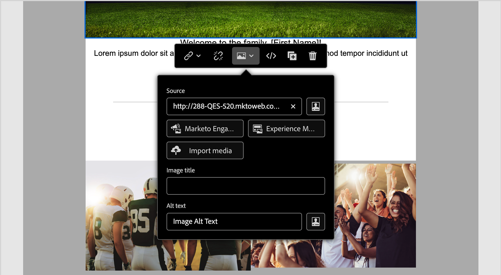
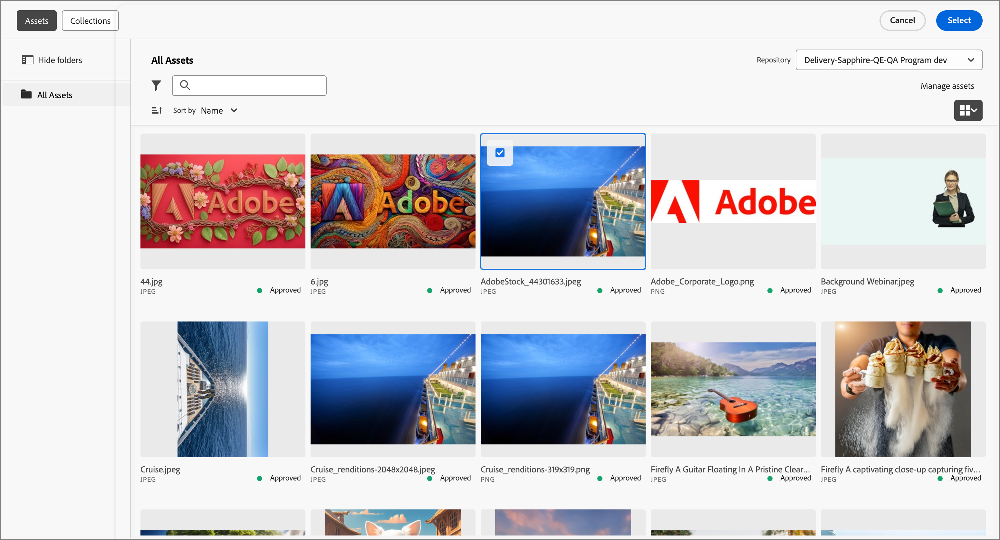
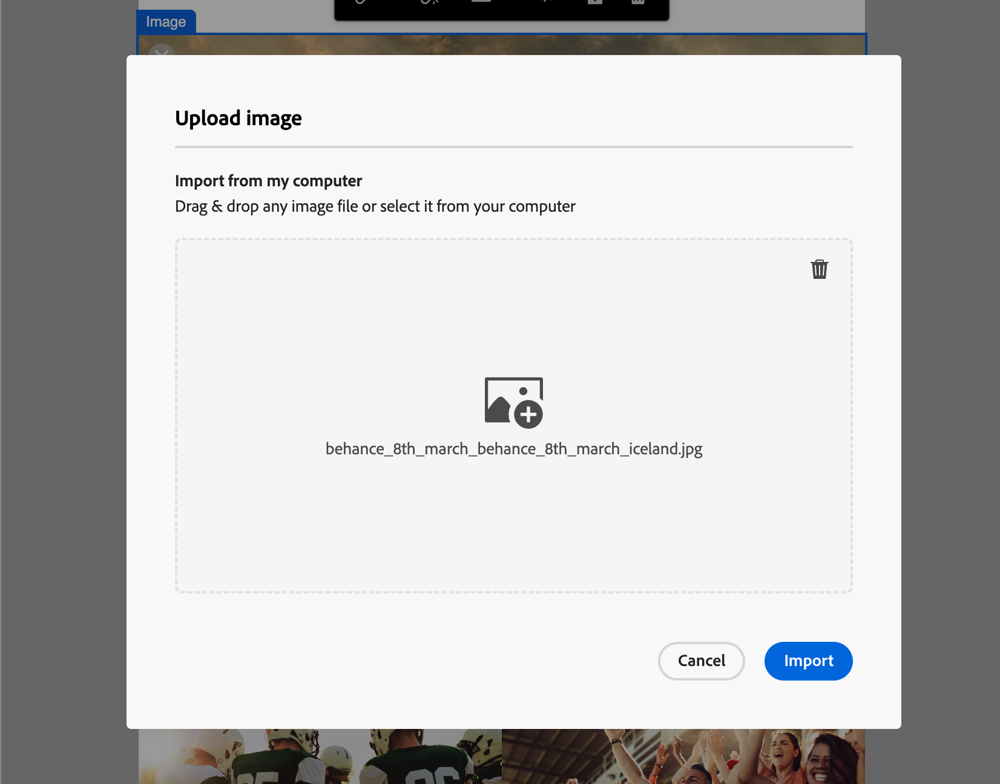

# Risorse

In Adobe Journey Optimizer B2B Edition, le risorse sono in genere le immagini utilizzate durante la progettazione di contenuti per supportare percorsi di account. Puoi utilizzare queste immagini nelle e-mail, nei modelli di e-mail e nei frammenti tramite un selettore di risorse o una semplice interfaccia di trascinamento all’interno dell’editor di contenuti visivi.

Adobe Journey Optimizer B2B Edition offre agli esperti di marketing l’accesso a due tipi di librerie di risorse: Adobe Marketo Engage Design Studio e Adobe Experience Manager Assets as a Cloud Service. Puoi utilizzare solo Adobe Marketo Engage Design Studio oppure entrambe le librerie configurate contemporaneamente (in base alla licenza di AEM Assets in tuo possesso).

## Gestione risorse

Se hai effettuato il provisioning con Adobe Experience Manager as a Cloud Services, potrai accedere agli archivi sia per Marketo Engage Design Studio che per Adobe Experience Manager Assets as a Cloud Service se il tuo account utente dispone delle autorizzazioni necessarie. Questi archivi sono separati e non sincronizzati. È possibile utilizzare immagini da entrambe le origini.

### Risorse di Adobe Marketo Engage

Per impostazione predefinita, l’archivio delle risorse di Adobe Marketo Engage Design Studio viene fornito con ogni abbonamento a Journey Optimizer B2B Edition. Ciò significa che hai accesso a qualsiasi risorsa di immagine archiviata in Adobe Marketo Engage ([!UICONTROL Design Studio] > [!UICONTROL Immagini e file]). Puoi utilizzare questo archivio come libreria locale di risorse, inclusa la possibilità di caricare e scaricare risorse. Puoi anche utilizzare queste risorse all’interno del contenuto del percorso.

Esistono guardrail integrati che impediscono le modifiche alle risorse Marketo Engage da Journey Optimizer B2B Edition e le operazioni di eliminazione e spostamento. Queste protezioni garantiscono la conservazione delle risorse di origine (Marketo Engage Design Studio) consentendo al tempo stesso la lettura e il riutilizzo senza interruzioni in Journey Optimizer B2B Edition.

Formati di file supportati: JPG, JPEG, GIF, PNG, EPS, SVG e RGB

### Adobe Experience Manager Assets as a Cloud Service

Unisci i flussi di lavoro di marketing e creatività utilizzando Adobe Experience Manager Assets. È integrato in modo nativo con Adobe Journey Optimizer B2B Edition, per consentirti di accedere facilmente ad Assets as a Cloud Service per scoprire e utilizzare le risorse digitali. Fornisce l’accesso al tuo archivio di risorse da utilizzare per compilare i messaggi.

Adobe Journey Optimizer B2B Edition può collegarsi ad Adobe Experience Manager Assets as a Cloud Service per la gestione centralizzata delle risorse, che estende il sistema creativo e unifica le risorse digitali per l’esperienza di consegna. Adobe Experience Manager Assets as a Cloud Service offre una soluzione cloud di facile utilizzo per operazioni efficienti di gestione risorse digitali e Dynamic Media. Incorpora perfettamente funzioni avanzate, tra cui l’intelligenza artificiale e l’apprendimento automatico.

Ulteriori informazioni nella [documentazione di Adobe Experience Manager as a Cloud Service](https://experienceleague.adobe.com/it/docs/experience-manager-cloud-service/content/assets/overview){target="_blank"}.

{{aem-assets-licensing-note}}

Accedi ad Adobe Experience Manager Assets direttamente in Journey Optimizer B2B Edition dall’elemento **[!UICONTROL Experience Manager Assets]** nel menu di navigazione a sinistra della progettazione di contenuti. Puoi anche accedere alle risorse e alle cartelle durante la progettazione di e-mail, modelli e-mail e contenuti di frammenti visivi.

Attualmente, in Adobe Journey Optimizer B2B Edition è possibile utilizzare solo immagini di Adobe Experience Manager Assets.

## Utilizzare le risorse per l’authoring dei contenuti

Utilizza le risorse durante l’authoring di e-mail, modelli di e-mail e frammenti visivi. L’editor di contenuti visivi consente di accedere alle immagini negli archivi delle risorse collegate. Se disponi di un abbonamento a Experience Manager Assets as a Cloud Service insieme ad Adobe Marketo Engage Design Studio, puoi scegliere le risorse immagine da entrambe le origini. Puoi anche caricare una risorsa immagine, che viene inserita nell’area di lavoro di Journey Optimizer B2B Edition dell’archivio Marketo Engage Design Studio connesso.

Puoi scegliere l’origine dell’immagine quando modifichi le impostazioni di un componente immagine o direttamente nell’area di lavoro.

* **_Impostazioni del componente immagine_**: se hai selezionato un componente immagine nel designer visivo, puoi visualizzare e modificare le impostazioni nel pannello a destra. Per aggiungere o modificare il file immagine visualizzato nel componente, scegli il tipo di origine e seleziona un file di immagine.

  {width="350"}

* **_Componente vuoto_**: quando aggiungi un componente immagine nel designer visivo, questo è vuoto e consente un facile accesso alla scelta dell’origine e alla selezione di un file immagine.

  {width="500"}

* **_Barra degli strumenti del componente immagine_**: se nel designer visivo è selezionato un componente immagine, la barra degli strumenti consente un facile accesso alla scelta dell’origine e alla selezione di un file immagine.

  {width="500"}

Puoi aggiungere una risorsa immagine, a seconda dell’origine, mentre esegui l’authoring del contenuto.

>[!BEGINTABS]

>[!TAB Risorse Marketo Engage]

Fai clic su **[!UICONTROL Risorse Marketo Engage]** per aprire il selettore risorse, in cui puoi scegliere un’immagine da un’area di lavoro Marketo Engage o Journey Optimizer B2B Edition.

{width="700" zoomable="yes"}

Puoi utilizzare la ricerca e i filtri per individuare la risorsa immagine desiderata. Seleziona la risorsa e fai clic su **[!UICONTROL Seleziona]** per utilizzarla per il componente immagine.

Per informazioni più dettagliate sull’utilizzo delle risorse immagine di Marketo Engage, consulta [Utilizzare le risorse nei contenuti](./marketo-engage-design-studio.md#use-assets-in-your-content).

>[!TAB Experience Manager Assets]

Fai clic su **[!UICONTROL Experience Manager Assets]** per aprire il selettore risorse, dove puoi scegliere un’immagine dall’archivio Experience Manager Assets.

{width="700" zoomable="yes"}

Puoi utilizzare la ricerca e i filtri per individuare la risorsa immagine desiderata. Seleziona la risorsa e fai clic su **[!UICONTROL Seleziona]** per utilizzarla per il componente immagine.

Per informazioni più dettagliate sull’utilizzo dei file di immagine da Experience Manager Assets, consulta [Accedere alle immagini di AEM Assets](./aem-assets.md#access-aem-assets-images).

>[!TAB Importare file multimediali]

Fai clic su **[!UICONTROL Importa file multimediali]** per selezionare un file di immagine e importarlo come risorsa da utilizzare per il contenuto di Journey Optimizer B2B Edition.

{width="500" zoomable="yes"}

Dopo aver trascinato il file o averlo selezionato dal sistema dei file, fai clic su **[!UICONTROL Importa]**. La risorsa importata viene memorizzata nell’area di lavoro Journey Optimizer B2B Edition dell’archivio Adobe Marketo Engage Design Studio.

>[!ENDTABS]
