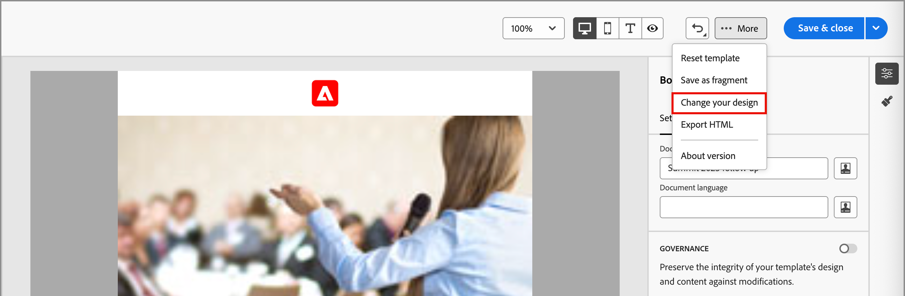
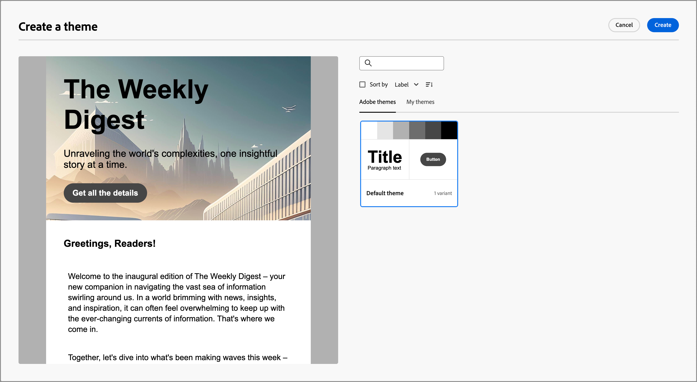
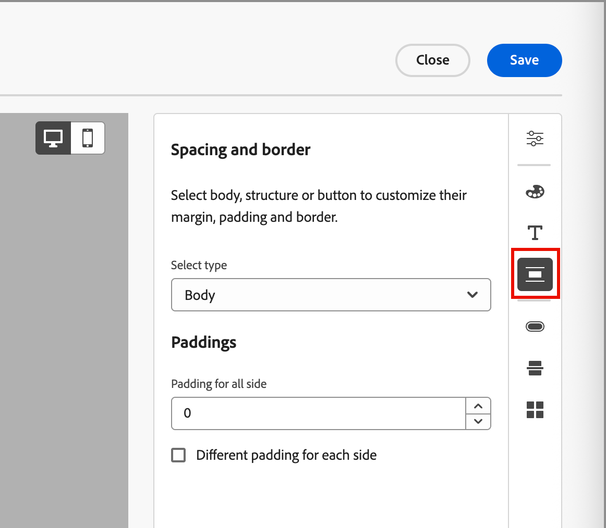
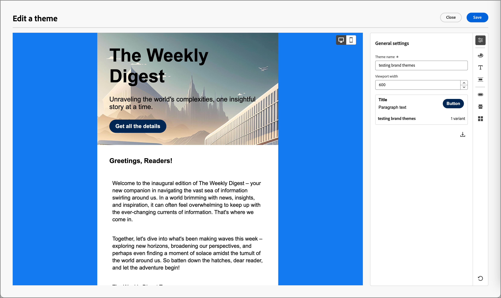
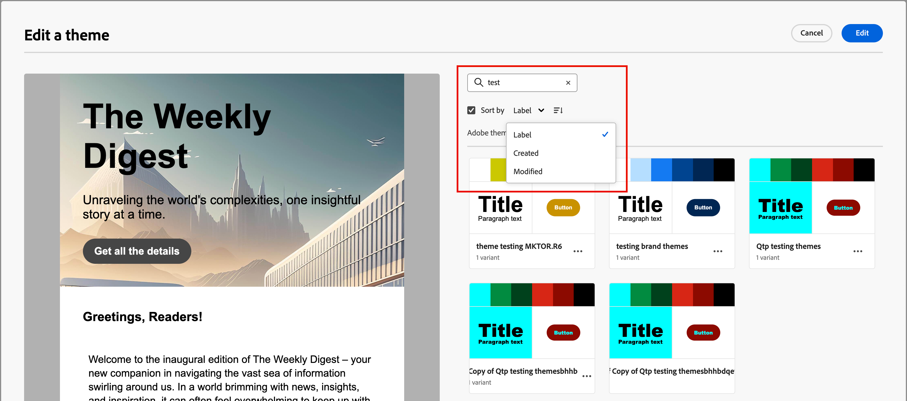

# Utilizzare i temi del brand per i contenuti e-mail {#email-brand-themes}

>[!CONTEXTUALHELP]
>id="ajo-b2b_email_brand_theme"
>title="Applicare un tema del brand al modello e-mail o e-mail"
>abstract="Seleziona un tema per l’e-mail o il modello e-mail per applicare uno stile specifico che si adatti al tuo marchio e design."

Con i temi, i designer non tecnici hanno la possibilità di creare linee guida per la progettazione di contenuti e-mail riutilizzabili, in linea con un marchio e uno stile specifici. I temi consentono agli addetti al marketing di sfruttare le e-mail visivamente accattivanti e coerenti con il brand in modo più rapido e con meno sforzo, e di fornire opzioni di personalizzazione avanzate per esigenze di progettazione univoche.

## Linee guida e limitazioni del tema {#themes-guidelines}

Quando lavori con i temi, tieni presenti le seguenti linee guida e limitazioni:

* Quando crei un modello e-mail o e-mail da un&#39;area di lavoro vuota (_progettazione da zero_), puoi scegliere _Modalità tema_ per iniziare a creare i contenuti utilizzando un tema per applicare uno stile specifico adatto al tuo marchio e design. Se si sceglie _Modalità manuale_, non sarà possibile applicare un tema a meno che non si reimposti la struttura per l&#39;e-mail o il modello e-mail.

* [I frammenti](./fragments.md) non sono compatibili tra la _modalità tema_ e la _modalità manuale_ nel contenuto dell&#39;e-mail. Per utilizzare un frammento nel contenuto dell&#39;e-mail in cui viene applicato un tema, è necessario creare il frammento anche in _modalità tema_.

* Le modifiche a un tema personalizzato non si sovrappongono automaticamente a tutti i messaggi e-mail o modelli e-mail che lo utilizzano già. Modifica il contenuto di ogni per aggiornare il tema.

* Se elimini un tema, questo non influisce su eventuali modelli e-mail o e-mail a cui è già stato applicato.
<!-- 
* If using a content created in HTML, you will be in [compatibility mode](existing-content.md) and you cannot apply themes to this content.
-->

## Creare un tema del brand {#create-theme}

Definisci il tema del tuo marchio da applicare ai contenuti delle e-mail e dei modelli e-mail nei contenuti delle e-mail future.

1. Accedere agli strumenti del tema utilizzando uno dei seguenti metodi:

   * [Crea un nuovo modello e-mail](./email-templates.md#create-an-email-template) e fai clic su **[!UICONTROL Modifica modello e-mail]** per avviare la pagina _[!UICONTROL Progetta modello]_.

   * Fare clic su **[!UICONTROL ... Altro]** in alto a destra nello spazio di progettazione del contenuto dell&#39;e-mail e scegli **[!UICONTROL Cambia la progettazione]**.

     {width="700" zoomable="yes"}

     Nella finestra di dialogo di conferma, fai clic su **[!UICONTROL Cambia modello]** per aprire la pagina di progettazione.

1. Nella pagina di progettazione scegliere **[!UICONTROL Crea o modifica temi]**.

   {width="800" zoomable="yes"}

1. Seleziona il tema predefinito o utilizza uno dei temi Adobe da utilizzare come punto di partenza.

   >[!NOTE]
   >
   >Se desideri utilizzare uno dei tuoi temi personalizzati (_[!UICONTROL I miei temi]_) come punto di partenza, puoi [duplicarlo](#delete-or-duplicate-a-theme) e modificare il nome del tema quando [modifichi il tema](#edit-a-theme).

1. Fai clic su **[!UICONTROL Crea]**.

   {width="750" zoomable="yes"}

   La pagina _[!UICONTROL Crea tema]_ fornisce un&#39;area di lavoro con gli elementi esistenti di tutti i tipi di testo, pulsanti e contenitori del tema iniziale.

1. Utilizza la navigazione a destra per accedere alle diverse schede di stile del tema e modificare le impostazioni del tema:

   * [Impostazioni generali](#general-settings)
   * [Colori](#colors)
   * [Impostazioni testo](#text-settings)
   * [Spaziatura e bordo](#spacing-and-border)
   * [Pulsante](#button)
   * [Divisore](#divider)
   * [Griglia](#grid)

   Gli elementi visivi cambiano nell’area di lavoro quando si definiscono le nuove impostazioni del tema. Se il risultato non è quello desiderato, puoi fare clic sull&#39;icona _Annulla_ ( {width="16"} ) nella parte inferiore del pannello di destra. Fai clic sull&#39;icona _Ripeti_ ( {width="16"} ) per applicare nuovamente la modifica.

1. Al termine della definizione del tema, fai clic su **[!UICONTROL Salva]**.

1. Fai clic su **[!UICONTROL Chiudi]** per tornare alla pagina _[!UICONTROL Crea tema]_, quindi su **[!UICONTROL Annulla]** per tornare alla pagina di progettazione.

   Puoi quindi scegliere **[!UICONTROL Progettazione da zero]** per aprire lo spazio di progettazione visiva e [utilizzare il tema](#use-your-theme-for-email-content-authoring) per l&#39;e-mail o il modello.

### Impostazioni generali

Nella scheda **[!UICONTROL Impostazioni generali]**, definisci i parametri di base per il tema:

* Immetti un **[!UICONTROL nome tema]** univoco.

* Regola la **[!UICONTROL larghezza del riquadro di visualizzazione]** per il contenuto e-mail (corpo). Utilizza le frecce su e giù per aumentare o diminuire la larghezza oppure immetti il valore (in pixel).

{width="450"}
<!--  and also export the current theme to [share it across sandboxes](../configuration/copy-objects-to-sandbox.md).-->

### Colori

Selezionare la scheda **[!UICONTROL Colori]** e utilizzare le impostazioni per definire la tavolozza dei colori del tema.

{width="450"}

* Fai clic su **[!UICONTROL Modifica]** per visualizzare la palette di colori che include i colori del tema.

  Scegli un **[!UICONTROL predefinito]** per usare una combinazione di colori per il tema o regola ogni colore del set. Puoi anche utilizzare una combinazione di entrambi.

  {width="350"}

  Per il quadrato di colore selezionato nella parte superiore, è possibile impostare il colore immettendo un valore RGB, HSL, HSB o esadecimale noto. In alternativa, è possibile utilizzare il cursore del colore e il campo del colore per selezionare il colore.

  Fai clic sulla freccia _Indietro_ per chiudere gli strumenti della tavolozza dei colori.

* Fai clic su **[!UICONTROL Aggiungi variante]** per creare più varianti di colore, ad esempio in modalità _chiaro_ e _scuro_, in cui ogni variante dispone di una propria palette di colori e controlli sfumatura. Puoi avere fino a sei varianti.

  Per ogni variante, fai clic sull&#39;icona _Modifica_ (  ). È possibile utilizzare la tavolozza predefinita o qualsiasi colore personalizzato.

  {width="450"}

  Per ogni colore che desideri modificare per la variante, sposta l’interruttore a sinistra o a destra per disabilitarlo o abilitarlo. Per un&#39;impostazione di colore abilitata, fare clic sul quadrato di colore per scegliere il colore.

  {width="450"}

  +++Impostazioni colore variante

  Le impostazioni sono raggruppate in base al tipo:

  | Tipo | Impostazioni | Descrizione |
  | ---- | -------- | ----------- |
  | [!UICONTROL Generale] | {width="300"} | Queste impostazioni consentono di impostare i colori per il corpo, le strutture, i contenitori, gli sfondi, i collegamenti, le griglie e i bordi. |
  | [!UICONTROL Intestazioni] | {width="300"} | Queste impostazioni si applicano agli elementi `Heading`, in cui è possibile impostare i colori del testo e del bordo per ciascuno dei sei livelli di intestazione. Espandere ogni livello di intestazione per cui si desidera impostare il colore per la variante. |
  | [!UICONTROL Paragrafi] | {width="300"} | Queste impostazioni si applicano agli elementi `Paragraph`, in cui è possibile impostare i colori del testo e del bordo per ciascuno dei tre tipi di paragrafo. Espandere ogni tipo di paragrafo per il quale si desidera impostare il colore per la variante. |
  | [!UICONTROL Pulsanti] | {width="300"} | Le impostazioni si applicano agli elementi dei pulsanti, in cui è possibile impostare il colore di riempimento, il colore del bordo e il colore del testo per ciascuno dei tre predefiniti per pulsanti: _Primario_, _Secondario_ e _Terziario_. |

  +++

### Impostazioni testo

Nella scheda **[!UICONTROL Impostazioni testo]** è possibile impostare i tipi di carattere, gli stili e le dimensioni globali che si desidera utilizzare per il tema. Per un controllo più granulare, è inoltre possibile modificare questi parametri per i tipi di intestazione e paragrafo.

{width="450"}

+++Impostazioni testo per tipo

| Tipo | Impostazioni | Descrizione |
| ---- | -------- | ----------- |
| [!UICONTROL Globale] | {width="300"} | Impostare la **[!UICONTROL libreria caratteri]** su _[!UICONTROL Standard]_ o _[!UICONTROL Caratteri Google]_. Scegliere quindi la famiglia di caratteri che si desidera utilizzare. Queste impostazioni globali di testo vengono applicate in tutto, a meno che non si impostino stili di testo diversi per i livelli di intestazione e i tipi di paragrafo. |
| [!UICONTROL Intestazioni] | {width="300"} | Per il livello di intestazione che si desidera impostare, selezionare **[!UICONTROL H1]**, **[!UICONTROL H2]** e così via. Impostare la **[!UICONTROL libreria caratteri]** su _[!UICONTROL Standard]_ o _[!UICONTROL Caratteri Google]_. Scegliere quindi la famiglia, la dimensione e lo stile del carattere. Scegli l&#39;**[!UICONTROL Allineamento testo]**: _Sinistra_, _Centrata_, _Destra_ o _Giustificata_. |
| [!UICONTROL Paragrafi] | {width="300"} | Per impostare il livello di intestazione, selezionare **[!UICONTROL P1]**, **[!UICONTROL HP]** e così via. Impostare la **[!UICONTROL libreria caratteri]** su _[!UICONTROL Standard]_ o _[!UICONTROL Caratteri Google]_. Scegliere quindi la famiglia, la dimensione e lo stile del carattere. Regola l&#39;altezza della **[!UICONTROL riga]** in base alle esigenze. Scegli l&#39;**[!UICONTROL Allineamento testo]**: _Sinistra_, _Centrata_, _Destra_ o _Giustificata_. |

+++

### Spaziatura e bordo

Nella scheda **[!UICONTROL Spaziatura]** è possibile impostare la spaziatura e il margine per i diversi tipi di elementi. Per **[!UICONTROL Seleziona tipo]**, scegli il tipo di contenuto. Quindi, impostare la spaziatura interna, i margini, gli angoli e i bordi applicabili per quel tipo di elemento.

{width="450"}

+++Impostazioni spaziatura

| Tipo | Impostazioni | Descrizione |
| ---- | -------- | ----------- |
| [!UICONTROL Margini] | {width="300"} | Scegli l&#39;icona _Margine_ per visualizzare le impostazioni che replicano il parametro CSS `margin`, che controlla lo spazio all&#39;esterno del bordo di un componente e lo separa da altri componenti o elementi. Crea un gap intorno al componente per influenzarne il posizionamento e il layout del contenuto circostante. Impostate i valori dei margini in pixel in base alle esigenze di progettazione. Puoi impostare il margine per tutti i lati, il bottone superiore, il lato sinistro-destro o ciascun lato del componente in modo indipendente. Fai clic sulle icone _Blocca_ e _Sblocca_ per sincronizzare o annullare la sincronizzazione dei valori dei margini superiore-inferiore e sinistro-destro. |
| [!UICONTROL Paddings] | {width="300"} | Scegli l&#39;icona _Spaziatura interna_ per visualizzare le impostazioni che replicano il parametro CSS `padding`, che è lo spazio tra il contenuto di un componente/elemento e il relativo bordo. La spaziatura interna consente di controllare la distanza tra il contenuto e il bordo del componente. Imposta i valori di spaziatura in pixel in base alle tue esigenze di progettazione. Puoi impostare la spaziatura per tutti i lati, il bottone superiore, il lato sinistro-destro o ciascun lato del componente in modo indipendente. Fai clic sulle icone _Blocca_ e _Sblocca_ per sincronizzare o annullare la sincronizzazione dei valori di spaziatura interna superiore-inferiore e sinistra-destra. |
| [!UICONTROL Angoli] | {width="300"} | Scegli l&#39;icona _Angoli_ per visualizzare le impostazioni che replicano il parametro CSS `border-radius`, che definisce il raggio degli angoli del componente/elemento. Impostate il valore numerico in base alla curva desiderata per gli angoli. Un valore pari a 0 (impostazione predefinita) produce un angolo al quadrato. |

+++

+++Impostazioni bordo

Sposta l&#39;interruttore **[!UICONTROL Bordo]** a destra per abilitare le opzioni di visualizzazione del bordo e impostarle in base ai criteri di progettazione:

* Per impostare la **[!UICONTROL dimensione bordo]** (larghezza linea), fare clic sulle icone della freccia su e giù per aumentare o diminuire il numero di pixel.

* Per impostare lo stile **[!UICONTROL Bordo]**, scegliere un valore dall&#39;elenco dei valori CSS `border-style` standard, ad esempio _Solido_, _Punteggiato_ e _Tratteggiato_.

* Per determinare la posizione di visualizzazione del bordo, selezionare ogni casella di controllo **[!UICONTROL Posizione bordo]**.

{width="250"}

+++

### Pulsanti

Nella scheda **[!UICONTROL Pulsanti]** è possibile impostare attributi diversi (diversi dal colore) per gli elementi dei pulsanti, ad esempio il raggio del bordo (forma), il testo e le dimensioni. È possibile modificare le impostazioni per ciascuno dei tre predefiniti di pulsante: _[!UICONTROL Primario]_, _[!UICONTROL Secondario]_ e _[!UICONTROL Terziario]_.

{width="450"}

+++Impostazioni dei pulsanti

| Tipo | Impostazioni | Descrizione |
| ---- | -------- | ----------- |
| [!UICONTROL Testo] | {width="300"} | Impostare la **[!UICONTROL libreria caratteri]** su _[!UICONTROL Standard]_ o _[!UICONTROL Caratteri Google]_. Scegliere quindi la famiglia, la dimensione e lo stile del carattere. Scegli l&#39;**[!UICONTROL Allineamento testo]**: _Sinistra_, _Centrata_, _Destra_ o _Giustificata_. |
| [!UICONTROL Bordo] | {width="300"} | Sposta l&#39;interruttore **[!UICONTROL Bordo]** a destra per abilitare le opzioni di visualizzazione del bordo del pulsante e impostarle in base ai criteri di progettazione. Impostare **[!UICONTROL Dimensione bordo]** (larghezza linea) aumentando o diminuendo il numero di pixel. Imposta lo **[!UICONTROL stile bordo]** scegliendo un valore dall&#39;elenco dei valori CSS `border-style` standard, ad esempio _Solido_, _Punteggiato_ e _Tratteggiato_. |
| [!UICONTROL Dimensione] | {width="300"} | Per l&#39;opzione **[!UICONTROL Altezza]**, fare clic sulle icone della freccia su e giù per aumentare o diminuire il numero di pixel. Il valore predefinito è un valore vuoto (Automatico) e l&#39;altezza del pulsante viene ridimensionata in base al contenuto. Per **[!UICONTROL Larghezza]**, utilizza l&#39;interruttore per impostare la larghezza in pixel o in percentuale. Per una larghezza percentuale, utilizzare il dispositivo di scorrimento per impostare il valore percentuale. La percentuale determina la dimensione del pulsante in base alla casella del contenuto del blocco contenitore, che esclude la spaziatura e i bordi. Ad esempio, un valore pari a 50 imposta la larghezza del pulsante sul 50% della larghezza del contenuto del blocco che lo contiene. Per una larghezza basata su pixel, fai clic sulle icone freccia su e giù per aumentare o diminuire il numero di pixel. Un valore vuoto (_Auto_) è l&#39;impostazione predefinita e ridimensiona la larghezza del pulsante in base al suo contenuto. |

+++

### Divisore

Nella scheda **[!UICONTROL Divider]** è possibile impostare lo stile della linea e le impostazioni del contenitore per un componente Divider.

{width="450"}

+++Impostazioni divisore

| Tipo | Impostazioni | Descrizione |
| ---- | -------- | ----------- |
| [!UICONTROL Line] | {width="300"} | Imposta lo **[!UICONTROL stile bordo]** scegliendo un valore dall&#39;elenco dei valori CSS `border-style` standard, ad esempio _Solido_, _Punteggiato_ e _Tratteggiato_. |
| [!UICONTROL Dimensione contenitore] | {width="300"} | Per l&#39;opzione **[!UICONTROL Altezza]**, fare clic sulle icone della freccia su e giù per aumentare o diminuire il numero di pixel per il componente o l&#39;elemento. Il valore predefinito è un valore vuoto (Automatico) e l&#39;altezza viene ridimensionata in base al contenuto (stile linea). Per **[!UICONTROL Larghezza]**, utilizza l&#39;interruttore per impostare la larghezza in pixel o in percentuale. Per una larghezza percentuale, utilizzare il dispositivo di scorrimento per impostare il valore percentuale. La percentuale determina la larghezza dell’elemento in base alla casella del contenuto del blocco contenitore. Ad esempio, un valore pari a 50 imposta la larghezza del divisore sul 50% della larghezza del contenuto del blocco che lo contiene. Per una larghezza basata su pixel, fai clic sulle icone freccia su e giù per aumentare o diminuire il numero di pixel. Un valore vuoto (_Auto_) è il valore predefinito e ridimensiona la larghezza del divisore in base al suo contenuto. |
| [!UICONTROL Allineamento] | {width="300"} | Scegli l&#39;allineamento orizzontale all&#39;interno del blocco contenitore: _Sinistra_, _Centrata_ o _Destra_. |

+++

### Griglia

Nella scheda **[!UICONTROL Griglia]** è possibile controllare gli spazi vuoti di colonne e righe per un elemento griglia:

* **[!UICONTROL Spazio tra colonne]** - Fare clic sulle icone freccia su e giù per aumentare o diminuire il numero di pixel per lo spazio tra le colonne della griglia. In alternativa, è possibile immettere un numero nel campo.

* **[!UICONTROL Spazio tra righe]** - Fare clic sulle icone freccia su e giù per aumentare o diminuire il numero di pixel per lo spazio tra le righe della griglia. In alternativa, è possibile immettere un numero nel campo.

{width="700" zoomable="yes"}

## Modificare un tema

È possibile modificare un tema utilizzando lo stesso flusso di lavoro e gli stessi strumenti utilizzati per creare un tema. La differenza sta nel fatto che si seleziona la scheda **[!UICONTROL I miei temi]** e si seleziona il tema personalizzato che si desidera modificare.

{width="750" zoomable="yes"}

Utilizza la barra a destra per spostarti tra le diverse schede e modificare le impostazioni del tema:

* [Impostazioni generali](#general-settings)
* [Colori](#colors)
* [Impostazioni testo](#text-settings)
* [Spaziatura e bordo](#spacing-and-border)
* [Pulsante](#button)
* [Divisore](#divider)
* [Griglia](#grid)

{width="800" zoomable="yes"}

Gli elementi visivi visualizzati cambiano quando si modificano le impostazioni. Se il risultato nell&#39;area di lavoro non è quello desiderato, è possibile fare clic sull&#39;icona _Annulla_ ( {width="16"} ) nella parte inferiore del pannello di destra. Fai clic sull&#39;icona _Ripeti_ ( {width="16"} ) per applicare nuovamente la modifica.

Al termine delle modifiche al tema, fai clic su **[!UICONTROL Salva]**.

>[!NOTE]
>
>Le modifiche salvate non vengono applicate automaticamente a catena a tutti i messaggi e-mail o modelli e-mail che utilizzano attualmente il tema. Modifica il contenuto di ogni per aggiornare il tema e adattarlo agli stili aggiornati.

## Gestire i temi personalizzati

Puoi gestire i temi personalizzati utilizzando lo stesso flusso di lavoro e gli stessi strumenti utilizzati per creare un tema. La differenza sta nel fatto che si seleziona la scheda **[!UICONTROL I miei temi]** e si gestiscono i temi nell&#39;elenco visualizzato.

Se hai un elenco esteso di temi personalizzati, utilizza il campo _Cerca_ e altri filtri per ridurre l&#39;elenco visualizzato. Quando gestisci l’elenco dei temi disponibili, puoi modificare, eliminare o duplicare un tema personalizzato in qualsiasi momento.

{width="750" zoomable="yes"}

### Modificare un tema

1. Seleziona il tema da modificare e fai clic su **[!UICONTROL Modifica]** in alto a destra.

   {width="750" zoomable="yes"}

1. Utilizza la navigazione a destra per utilizzare le diverse schede di stile e modificare le impostazioni del tema:

   * [Impostazioni generali](#general-settings)
   * [Colori](#colors)
   * [Impostazioni testo](#text-settings)
   * [Spaziatura e bordo](#spacing-and-border)
   * [Pulsante](#button)
   * [Divisore](#divider)
   * [Griglia](#grid)

   {width="800" zoomable="yes"}

   Gli elementi visivi visualizzati cambiano quando si modificano le impostazioni. Se il risultato sull&#39;area di lavoro non è quello desiderato, puoi fare clic sull&#39;icona _Annulla_ nella parte inferiore della barra a destra. Fai clic sull&#39;icona _Ripristina_ per applicare nuovamente la modifica.

1. Al termine delle modifiche al tema, fai clic su **[!UICONTROL Salva]**.

>[!NOTE]
>
>Le modifiche apportate al tema salvato non vengono applicate automaticamente a catena a tutti i modelli e-mail o e-mail che utilizzano attualmente il tema. Modifica il contenuto di ogni per aggiornare il tema e adattarlo agli stili aggiornati.

### Eliminare o duplicare un tema

Quando si individua il tema, fare clic sull&#39;icona _Altro menu_ (**...**) in basso a destra della scheda del tema e scegliere l&#39;azione che si desidera eseguire:

{width="220"}

* **[!UICONTROL Duplicato]** - Scegliere questa azione per duplicare il tema. Il nuovo tema è identico alla _copia di_ aggiunta al nome dell&#39;originale. Puoi cambiare il nome quando [modifichi il tema](#edit-a-theme).

* **[!UICONTROL Elimina]** - Scegliere questa azione per rimuovere il tema personalizzato. Nella finestra di dialogo di conferma, fai clic su **[!UICONTROL Elimina]**.

  >[!NOTE]
  >
  >L’eliminazione del tema non influisce su alcun modello e-mail o e-mail a cui è già applicato.

## Utilizza un tema per l’authoring dei contenuti delle e-mail {#use-email-theme}

Quando crei un nuovo modello e-mail o e-mail, puoi scegliere di utilizzare un tema del brand che semplifica il processo di authoring dei contenuti e assicura che la progettazione sia allineata agli standard definiti. Per un nuovo frammento, puoi anche applicare un tema prima di salvare il frammento. Il frammento rimane in _Modalità tema_ da quel momento ed è compatibile da aggiungere alle e-mail e ai modelli e-mail che sono anche in _Modalità tema_.

1. Selezionare una delle azioni seguenti:

   * Seleziona un modello di e-mail che incorpora un tema (creato in _Modalità tema_). Il tema specifico di ciascun modello viene applicato automaticamente.

   * Utilizza l&#39;opzione _[!UICONTROL Progetta da zero]_ e seleziona **[!UICONTROL Usa temi]** per iniziare con un tema di stile predefinito.

     {width="450"}

     >[!IMPORTANT]
     >
     >Se si sceglie la modalità _[!UICONTROL Stile manuale]_, è necessario reimpostare la struttura dell&#39;e-mail per applicare un tema.
     >
     >Se scegli la modalità _[!UICONTROL Temi]_, solo [frammenti](./fragments.md) creati anche in modalità _Temi_ sono disponibili per l&#39;aggiunta al contenuto dell&#39;e-mail.

1. Nello spazio di progettazione delle e-mail, fai clic sull&#39;icona _Temi_ (  ) a destra.

   {width="600" zoomable="yes"}

   Viene visualizzato il tema predefinito o applicato al modello. Puoi cambiare le varianti di colore per questo tema.

1. Fai clic sulla freccia accanto al tema visualizzato per visualizzare l’elenco dei temi personalizzati e Adobe disponibili.

1. Fai clic su **[!UICONTROL I miei temi]** e seleziona il tema personalizzato.

   {width="325"}

1. Fai clic all’esterno dell’elenco.

   Il tema personalizzato appena selezionato applica gli stili a tutti i componenti e-mail nell’area di lavoro. Puoi alternare tra le varianti di colore.

1. Se devi ignorare gli stili del tema per un componente selezionato, fai clic sull&#39;icona _Sblocca stili componente_ (  ).

   {width="600" zoomable="yes"}

   Nella finestra di dialogo di conferma, fai clic su **[!UICONTROL Sblocca]**.

   Seleziona la scheda **[!UICONTROL Stili]** nel pannello di destra per modificare le impostazioni del componente.

   {width="600" zoomable="yes"}

## Modificare il tema per il contenuto dell’e-mail

Per un e-mail o un modello e-mail creato in _Modalità tema_, puoi modificare il tema in qualsiasi momento. Il contenuto dell’e-mail rimane invariato, ma gli stili vengono aggiornati per riflettere il nuovo tema.

1. Apri il modello e-mail o e-mail nello spazio di progettazione.

1. Fai clic sull&#39;icona _Temi_ (  ) a destra.

   Il tema applicato viene visualizzato nel pannello di destra.

1. Fai clic sulla freccia accanto al tema visualizzato per visualizzare l’elenco dei temi personalizzati e Adobe disponibili.

1. Seleziona un altro tema.

1. Fai clic all’esterno dell’elenco.

   Il tema selezionato applica gli stili a tutti i componenti e-mail nell’area di lavoro. Puoi alternare tra le varianti di colore.

<!--
>[!NOTE]
> - Themes apply styles globally. Ensure your theme is finalized before applying it to multiple emails.
> - Switching themes may override custom styles applied to individual components.

>[!CAUTION]
> - When using fragments, the email's theme will override the fragment's styles. A warning will be displayed in the editor if there is a conflict.

## Example Use Cases {#example-use-cases}

### 1. Creating a New Theme
- A designer creates a theme with their brand's colors, fonts, and button styles.
- The theme is saved and reused by marketers to author multiple emails.

### 2. Switching Themes
- A marketer applies a holiday-themed design to an existing email by switching to a pre-designed holiday theme.-->
