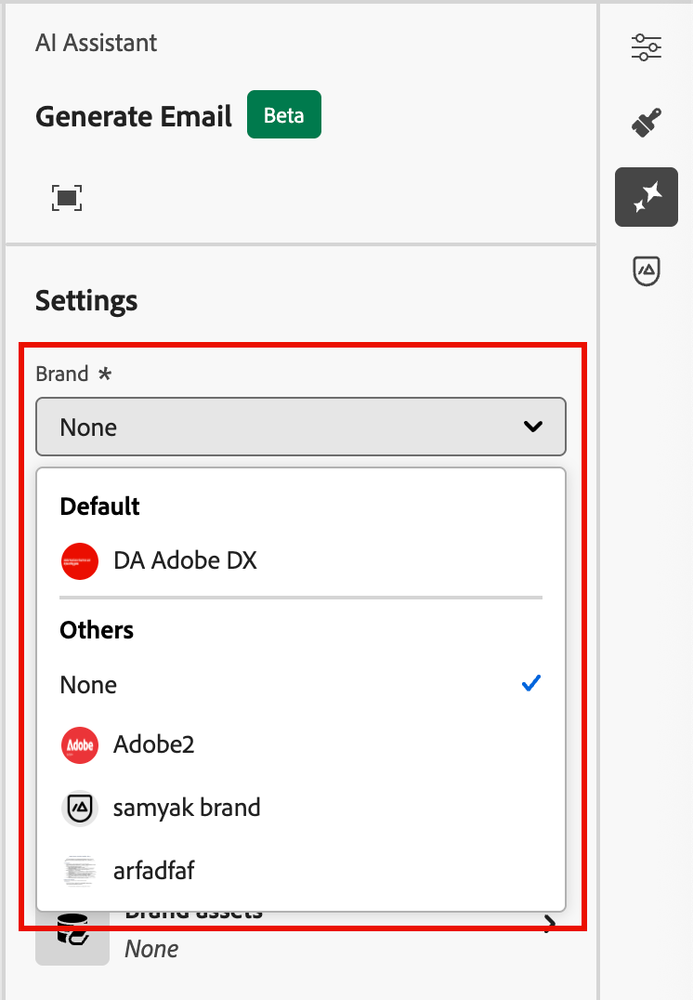
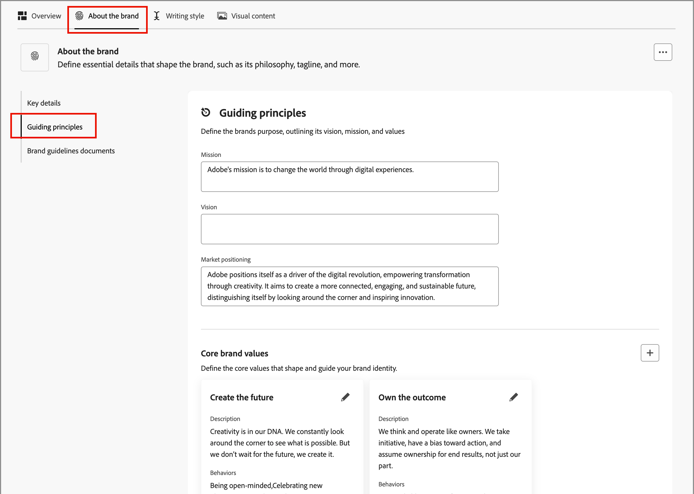

# Creare e gestire i brand {#brand-library}

Definisci un marchio per fornire un set dettagliato di regole e standard che stabiliscano un&#39;identità visiva e verbale. Queste linee guida forniscono un riferimento per mantenere una rappresentazione coerente del brand in tutte le piattaforme di marketing e comunicazione. Sfruttando linee guida del brand ben definite, le organizzazioni possono garantire che tutte le attività di creazione dei contenuti siano allineate agli obiettivi strategici e all’identità del brand complessiva. Questa coerenza non solo migliora il riconoscimento e la fiducia del marchio, ma contribuisce anche a creare un’esperienza del cliente più coesa e incisiva in tutti i punti di contatto.

In Journey Optimizer B2B edition puoi definire e organizzare manualmente le definizioni del brand e le risorse o caricare documenti di linee guida per il brand per l’estrazione automatica delle informazioni e delle risorse visive.

>[!AVAILABILITY]
>
>Questa funzionalità è attualmente disponibile come versione beta privata, con disponibilità progressiva pianificata per tutti i clienti nelle versioni future.
>
> 
>
>È necessario un [contratto utente](https://www.adobe.com/legal/licenses-terms/adobe-dx-gen-ai-user-guidelines.html){target="_blank"} prima di poter utilizzare le funzionalità basate sull&#39;intelligenza artificiale in Adobe Journey Optimizer B2B edition. Per ulteriori informazioni, contatta il tuo rappresentante Adobe.
>
> 
>
>Consulta [Autorizzazioni relative al marchio](./brands-overview.md#brand-related-permissions) per informazioni su come gli amministratori di prodotto possono abilitare queste funzioni.

## Accedere alla libreria del brand

Per accedere ai kit dei brand in Adobe Journey Optimizer B2B edition, passa alla navigazione a sinistra e fai clic su **[!UICONTROL Gestione contenuto]** > **[!UICONTROL Marchi]**. Questa azione apre una pagina in cui i brand creati vengono visualizzati come schede.

{width="800" zoomable="yes"}

Se non sono ancora stati creati marchi, verrà visualizzato un singolo elemento grafico con un pulsante per [creare il primo marchio](#create-and-define-a-brand).

### Azioni di gestione dei marchi

Per ogni scheda, puoi fare clic sull&#39;icona _Altro menu_ (  ) e scegliere un&#39;azione per il brand:

* **[!UICONTROL Visualizza marchio]** - Apri la pagina del marchio e visualizza le definizioni.
* **[!UICONTROL Contrassegna come marchio predefinito]** (solo Live) - [Contrassegna il marchio come predefinito](#default-brand) per l&#39;allineamento e la generazione dei contenuti.
* **[!UICONTROL Modifica]** - Apri la pagina del brand e modifica le linee guida, le esclusioni e gli esempi del brand.
* **[!UICONTROL Duplicato]** - Crea una copia come nuova bozza del marchio.
* **[!UICONTROL Pubblica]** (solo bozza) - [Pubblica il brand](#publish-the-brand) per renderlo disponibile all&#39;utilizzo con l&#39;allineamento e la generazione dei contenuti.
* **[!UICONTROL Annulla pubblicazione]** (solo Live): annulla la pubblicazione del brand per rimuoverlo dall&#39;utilizzo per l&#39;allineamento e la generazione dei contenuti.
* **[!UICONTROL Elimina]** - Rimuovi il brand dalla libreria del brand.

{width="440"}

### Marchio predefinito

Puoi designare un marchio predefinito da applicare automaticamente durante la generazione del contenuto e il calcolo dei punteggi di allineamento durante la creazione del contenuto. Solo un marchio pubblicato (_Live_) può essere il valore predefinito.

Nella libreria Marchi, la scheda marchio predefinita viene visualizzata con un flag.

{width="200"}

Puoi impostare qualsiasi marchio pubblicato (_Live_) come predefinito. Nella scheda marchio, fai clic sull&#39;icona _Altro menu_ (  ) e scegli **[!UICONTROL Contrassegna come marchio predefinito]**.

{width="350"}

## Creare e definire un brand {#create-brand}

>[!CONTEXTUALHELP]
>id="ajo-b2b_brands_create"
>title="Creare il brand"
>abstract="Inserisci il nome e carica il file delle linee guida del brand. Lo strumento estrarrà automaticamente i dettagli chiave, semplificando il mantenimento dell’identità del brand."

Per creare e definire le linee guida per il brand, puoi inserire i dettagli o caricare i documenti di riferimento da utilizzare per l’estrazione automatica.

### Aggiungi il brand

1. Nella parte superiore destra della pagina _[!UICONTROL Marchi]_, fai clic su **[!UICONTROL Crea marchio]**.

1. Immetti un **[!UICONTROL Nome]** per il tuo marchio.

1. Trascina e rilascia o seleziona il file per caricare le linee guida per il brand ed estrarre automaticamente le informazioni rilevanti per il brand.

   {width="500"}

   >[!NOTE]
   >
   >Se non hai salvato un documento in formato PDF, puoi aggiungere manualmente le linee guida e caricare singole risorse visive dopo la creazione del brand.

1. Fai clic su **[!UICONTROL Crea marchio]**.

   Se includi uno o più file per creare il brand, inizia il processo di estrazione delle informazioni. Il completamento potrebbe richiedere alcuni minuti.

   Al termine del processo di estrazione, i contenuti e gli standard di creazione visiva vengono popolati automaticamente.

   {width="700" zoomable="yes"}

### Perfezionare e aggiornare le linee guida per il brand

1. Sfoglia le diverse schede per adattarti e definire informazioni più dettagliate, se necessario.

   * [!UICONTROL Panoramica]

   * [[!UICONTROL Informazioni sul marchio]](#about-the-brand)

   * [[!UICONTROL Stile scrittura]](#writing-style)

   * [[!UICONTROL Contenuto visivo]](#visual-content)

   Se al momento della creazione del brand hai incluso uno o più documenti, il processo di estrazione delle informazioni ha creato le definizioni per le schede e le sezioni. La completezza dipende dall’ambito e dai dettagli inclusi in qualsiasi documento. Durante la revisione del risultato, è possibile modificare o rimuovere qualsiasi informazione.

   Dal menu _Altro_ (  ) per ogni scheda o categoria, puoi aggiungere documenti per estrarre automaticamente le informazioni rilevanti sul brand. Puoi anche cancellare il contenuto esistente.

   {width="500" zoomable="yes"}

   Se si desidera esaminare l&#39;origine delle informazioni estratte in una sottosezione, fare clic sul collegamento **[!UICONTROL Visualizza origine]**.

   {width="700" zoomable="yes"}

1. In ogni scheda dei dettagli, controlla le categorie e migliora il brand aggiungendo, rimuovendo e modificando le definizioni.

   Una sottosezione con etichetta **[!UICONTROL Do]** illustra le linee guida per la categoria. Utilizzare quest&#39;area per aggiungere descrizioni delle linee guida ed esempi delle linee guida.

   {width="500" zoomable="yes"}

   Una sottosezione con etichetta **[!UICONTROL Non inserire]** illustra le esclusioni. Utilizza questa area per aggiungere descrizioni di esclusione ed esempi delle esclusioni.

   {width="500" zoomable="yes"}

   * **Aggiungi una linea guida o un&#39;esclusione**.

     Nella sezione in cui desideri aggiungere una linea guida, fai clic sull&#39;icona _Aggiungi_ (  ) a destra. Nella finestra di dialogo a comparsa, immetti la linea guida e seleziona le caselle di controllo per designare i canali e gli elementi a cui si applica la linea guida. Quindi fare clic su **[!UICONTROL Aggiungi]**.

     {width="600" zoomable="yes"}

   * **Modificare una linea guida o un&#39;esclusione**.

     Nella sezione in cui si desidera rimuovere una linea guida, fare clic sul relativo widget. Nella finestra di dialogo a comparsa, modifica il contenuto della linea guida e delle caselle di controllo selezionate in base alle esigenze. Quindi fare clic su **[!UICONTROL Aggiorna]**.

     {width="600" zoomable="yes"}

   * **Rimuovere una linea guida o un&#39;esclusione**.

     Nella sezione in cui si desidera rimuovere una linea guida, fare clic sul relativo widget. Nella finestra di dialogo a comparsa, fai clic sull&#39;icona _Elimina_ (  ) nella parte superiore.

   * **Aggiungi o rivedi esempi delle linee guida e delle esclusioni**.

     Nel riquadro di esempio visualizzato fare clic sull&#39;icona _Modifica_ (  ) per modificare l&#39;esempio oppure fare clic sull&#39;icona _Elimina_ (  ) per rimuoverlo.

1. Dopo aver definito tutto, fai clic su **[!UICONTROL Salva]**.

   Puoi continuare ad apportare modifiche al brand della bozza fino a quando non decidi che è pronto per la pubblicazione.

### Pubblicare il brand

Quando il tuo marchio include un set completo di definizioni e soddisfa le tue esigenze, fai clic su **[!UICONTROL Pubblica]** per rendere le linee guida del tuo marchio disponibili per l&#39;allineamento e la generazione dei contenuti.

I brand pubblicati sono accessibili dall&#39;opzione **[!UICONTROL Brand]** negli strumenti di IA [brand alignment](./brand-alignment.md) e generazione dei contenuti. <!-- [Learn more about content generation](gs-generative.md) -->

{width="300"}

## Definizioni del brand

Le definizioni del brand sono organizzate in tre categorie, visualizzate come schede. Seleziona ogni scheda per completare e aggiornare le linee guida del brand.

### Informazioni sul brand {#about-brand}

Utilizza la scheda **[!UICONTROL Informazioni sul brand]** per stabilire l&#39;identità di base del brand. Queste informazioni delineano il suo scopo, la sua personalità, la sua tagline e altri attributi di alto livello.

1. Aggiungi le informazioni fondamentali per il tuo marchio nella categoria **[!UICONTROL Dettagli chiave]**:

   * **[!UICONTROL Brand kit name]** - Aggiorna il brand name.

   * **[!UICONTROL Quando utilizzare]** - Specificare scenari o contesti in cui applicare il brand.

   * **[!UICONTROL Marchio]** - Immettere il nome ufficiale del marchio.

   * **[!UICONTROL Descrizione del marchio]** - Fornisci una panoramica di ciò che questo marchio rappresenta.

   * **[!UICONTROL Tagline (predefinito)]** - Aggiungi la tagline principale associata al brand.

   {width="600" zoomable="yes"}

1. Nella categoria **[!UICONTROL Principi guida]**, chiarisci la direzione e la filosofia di base del tuo marchio:

   * **[!UICONTROL Missione]** - Descrivi lo scopo del brand.

   * **[!UICONTROL Visione]** - Descrive l&#39;obiettivo a lungo termine o lo stato futuro desiderato.

   * **[!UICONTROL Posizionamento sul mercato]** - Spiega come il brand è posizionato sul mercato.

   {width="600" zoomable="yes"}

   Dalla categoria **[!UICONTROL Valori del brand di base]**, controlla i valori del brand definiti e modificali in base alle esigenze.

   * Per definire un nuovo valore di base, fai clic sull&#39;icona _Aggiungi_ (  ) a destra e completa i dettagli:

     {width="500" zoomable="yes"}

      * **[!UICONTROL Valore]** - Immetti il nome per il valore del marchio principale.

      * **[!UICONTROL Descrizione]** - Spiega cosa significa questo valore per il tuo marchio.

      * **[!UICONTROL Comportamenti]** - Descrive le azioni o gli atteggiamenti che riflettono questo valore nella pratica.

      * **[!UICONTROL Manifestazioni]** - Fornisci esempi di come questo valore è espresso nel branding reale.

   * Per modificare o eliminare un valore di base, fai clic sull&#39;icona _Modifica_ (  ) per aggiornare o eliminare un valore di marchio di base.

     {width="500" zoomable="yes"}

     Modifica i dettagli e fai clic su **[!UICONTROL Aggiorna]**. Oppure fai clic sull&#39;icona _Elimina_ (  ) nella parte superiore per rimuovere il valore core.

1. Nella categoria **[!UICONTROL Documenti sulle linee guida per i marchi]**, controlla i documenti utilizzati per generare le linee guida per i marchi.

   Fai clic sull’icona del menu Altro e scegli un’opzione per aggiornare le linee guida del brand utilizzando i documenti di riferimento caricati:

   * **[!UICONTROL Riestrarre le linee guida]** - Scegliere questa azione per eseguire un processo di estrazione utilizzando i documenti correnti.
   * **[!UICONTROL Aggiungi riferimento per l&#39;estrazione]** - Scegli questa azione per caricare un altro documento ed eseguire un processo di estrazione.

   {width="600" zoomable="yes"}

Puoi continuare a perfezionare le [linee guida, esclusioni ed esempi sullo stile di scrittura](#writing-style) o [contenuto visivo](#visual-content), oppure puoi [pubblicare il tuo marchio](#publish-the-brand).

### Stile di scrittura {#writing-style}

>[!CONTEXTUALHELP]
>id="ajo_brand_writing_style"
>title="Punteggio di allineamento dello stile di scrittura"
>abstract="La sezione Stile di scrittura definisce gli standard per lingua, formattazione e struttura al fine di garantire contenuti chiari e coerenti. Il punteggio di allineamento, valutato da alto a basso, mostra con quanta efficacia il contenuto segue queste linee guida ed evidenzia le aree da migliorare."

Le definizioni di _[!UICONTROL Stile scrittura]_ descrivono gli standard per la scrittura dei contenuti e descrivono come utilizzare linguaggio, formattazione e struttura per mantenere chiarezza, coerenza e coerenza in tutti i materiali.

Selezionare la scheda **[!UICONTROL Stile scrittura]** e rivedere ogni categoria.

{width="600" zoomable="yes"}

| Categoria | Sottocategoria | Esempio di linee guida | Esempio di esclusioni |
|----------------------------|----------------|-----------------------|-----------------------|
| [!UICONTROL Stile comunicazione marchio] | [!UICONTROL Caratteristiche di Brand Personality] | Amichevole e accessibile. | Non essere disfattista. |
|                            | [!UICONTROL Meccanica scrittura] | Mantieni le frasi brevi e di impatto. | Non usare un gergo eccessivo. |
|                            | [!UICONTROL Tono situazionale] | Mantenere un tono professionale nelle comunicazioni di crisi. | Non essere sprezzante nelle comunicazioni di supporto. |
|                            | [!UICONTROL Linee guida per la scelta di Word] | Usa parole come _innovative_ e _smart_. | Evita parole come _a buon mercato_ o _hack_. |
|                            | [!UICONTROL Standard lingua] | Segui le convenzioni inglesi americane. | Non mescolare ortografia britannica con quella americana. |
| [!UICONTROL Standard di messaggistica del marchio] | [!UICONTROL Standard di messaggistica del marchio] | Innovazione e messaggistica personalizzata. | Non esagerare con le funzionalità dei prodotti. |
|                            | [!UICONTROL Utilizzo tagline] | Posiziona la tagline sotto il logo su tutte le risorse di marketing digitale. | Non modificare o tradurre la tagline. |
|                            | [!UICONTROL Messaggistica di base] | Enfatizzare la dichiarazione dei principali vantaggi, ad esempio una maggiore produttività. | Non utilizzare proposte di valore non correlate. |
|                            | [!UICONTROL Standard di denominazione] | Utilizza nomi semplici e descrittivi come _ProScheduler_. | Non utilizzare termini complessi o caratteri speciali. |
| [!UICONTROL Standard di conformità legale] | [!UICONTROL Standard marchio] | Utilizza sempre il simbolo ™ o ®. | Non omettere i simboli legali quando necessario. |
|                            | [!UICONTROL Standard di copyright] | Includi avvisi di copyright sul materiale di marketing. | Non utilizzare contenuti di terze parti senza autorizzazione. |
|                            | [!UICONTROL Standard disclaimer] | Visualizzare le liberatorie in modo leggibile sulle risorse digitali. | Non nascondere le liberatoria in aree non visibili. |

<!-- #### Preferred and avoided terms

Supplement your work choice guidelines by adding preferred and avoided terms. 

#### Primary tagline and variations

#### Brand names and variations

#### Approved and restricted statements
-->

### Contenuto visivo {#visual-content}

>[!CONTEXTUALHELP]
>id="ajo-b2b_brand_imagery"
>title="Punteggio di allineamento del contenuto visivo"
>abstract="Il punteggio di allineamento del contenuto visivo, indica con quanta efficacia il contenuto corrisponde alle linee guida del brand configurate. Con una valutazione da alto a basso, consente di stimare l’allineamento all’instante. Esplora le diverse categorie per identificare le aree da migliorare e individuare gli elementi che potrebbero non rispecchiare il brand."

Le definizioni di _[!UICONTROL contenuto visivo]_ delineano gli standard per immagini e design e descrivono le specifiche necessarie per mantenere un aspetto di marchio unificato e coerente.

Seleziona la scheda **[!UICONTROL Contenuto visivo]** e controlla ogni categoria.

{width="600" zoomable="yes"}

| Categoria | Esempio di linee guida | Esempi di esclusioni |
|------------------------|---------------------|---------------------|
| [!UICONTROL Standard per la fotografia] | Utilizza l&#39;illuminazione naturale per le riprese in esterni. | Evita le immagini eccessivamente modificate o con pixel. |
| [!UICONTROL Standard illustrazione] | Utilizza stili puliti e minimalisti. | Evita di essere troppo complessi. |
| [!UICONTROL Standard icona] | Utilizza un sistema di griglia a 24 px coerente. | Non combinare le dimensioni delle icone, non utilizzare pesi di traccia incoerenti o non discostarsi dalle regole della griglia. |
| [!UICONTROL Linee guida per l&#39;utilizzo] | Scegliete uno stile di vita che rifletta i clienti reali che usano il prodotto in ambienti professionali. | Non utilizzare immagini che contraddicono il tono del marchio o che appaiono fuori contesto. |

<!-- #### Styles

To define the overall style for the category, click **[!UICONTROL Add style]**. In the popup dialog, enter the style type and description. 

{width="500" zoomable="yes"}

#### Specifications

-->

#### Immagini di esempio

Per aggiungere un&#39;immagine che mostri un utilizzo corretto o errato, scegli **[!UICONTROL Esempio]** nella _[!UICONTROL finestra di dialogo a comparsa]_ o _[!UICONTROL Aggiungi esclusione]_. Fai clic su **[!UICONTROL Seleziona immagine]** per scegliere un file di immagine dal sistema. Fai clic su **[!UICONTROL Aggiungi]** per caricare l&#39;immagine e visualizzare la miniatura per l&#39;area.

{width="500" zoomable="yes"}

## Modificare un brand pubblicato

Non puoi apportare modifiche a un brand pubblicato (Live), ma puoi creare una bozza da modificare. Quando pubblichi la bozza con le tue modifiche, tale versione sostituisce la versione live.

1. Apri la pagina del brand e fai clic su **[!UICONTROL Modifica brand]** in alto a destra.

1. Nella finestra di dialogo di conferma, fai clic su **[!UICONTROL Modifica marchio]**.

   Questa azione crea una bozza di copia del brand.

1. Sfoglia le diverse schede per aggiornare le informazioni sul brand in base alle esigenze.

   * Panoramica

   * [Informazioni sul brand](#about-the-brand)

   * [Stile di scrittura](#writing-style)

   * [Contenuto visivo](#visual-content)

1. Fai clic su **[!UICONTROL Salva]** mentre lavori con gli aggiornamenti delle bozze, quindi su **[!UICONTROL Pubblica]** quando sei pronto a sostituire la versione _Live_.
