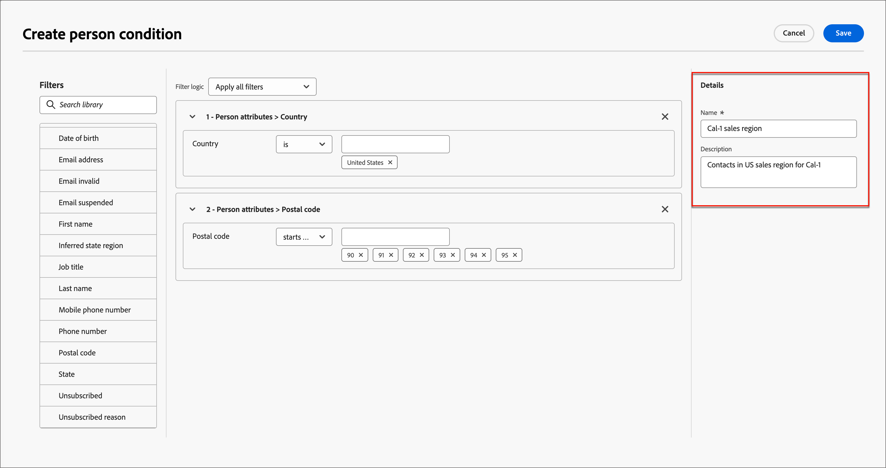

# Contenuto condizionale

Il contenuto condizionale consente di adattare il contenuto delle e-mail in base alle regole condizionali. Queste regole vengono definite utilizzando gli attributi di profilo o gli eventi contestuali. Puoi creare regole condizionali nel generatore di regole e memorizzarle per riutilizzarle nei vari percorsi di account.

Per aggiungere contenuto condizionale ai messaggi di posta elettronica, Adobe Journey Optimizer consente di applicare le regole condizionali memorizzate nella libreria _Conditions_. Applica regole condizionali all&#39;interno di e-mail designer mentre [crei un&#39;e-mail all&#39;interno di un percorso di account](./email-authoring.md).

## Aggiungere contenuto condizionale alle e-mail {#email-content}

>[!CONTEXTUALHELP]
>id="ajo-b2b_conditional_content"
>title="Contenuto condizionale"
>abstract="Utilizza le regole condizionali per creare più varianti di un componente di contenuto. Se nessuna delle condizioni è soddisfatta durante l’invio del messaggio, viene visualizzato il contenuto della variante predefinita."

>[!CONTEXTUALHELP]
>id="ajo-b2b_conditional_rule_select"
>title="Contenuto condizionale"
>abstract="Utilizza una regola condizionale salvata nella libreria o creane una nuova."

Quando crei un’e-mail per il percorso di account in e-mail designer, utilizza le regole condizionali per definire più varianti per un componente di contenuto.

1. Seleziona un componente di contenuto e fai clic sull&#39;icona **[!UICONTROL Abilita contenuto condizionale]** nella barra degli strumenti del componente.

   Il componente è evidenziato in arancione per indicare che è attivato come componente condizionale. Il riquadro **[!UICONTROL Contenuto condizionale]** viene visualizzato a sinistra con _Variante predefinita_ e _Variante - 1.

   {width="700" zoomable="yes"}

   Il contenuto originale selezionato e attivato è quello predefinito e si applica quando nessuna delle regole condizionali è soddisfatta per nessuna delle varianti definite.

   Da questo riquadro è possibile definire più varianti per il componente di contenuto selezionato utilizzando le regole condizionali.

1. Passa il puntatore del mouse sulla prima variante (_Variante - 1_) e fai clic sull&#39;icona _Seleziona condizione_ (  ).

   {width="700" zoomable="yes"}

   Viene visualizzata la finestra di dialogo _[!UICONTROL Seleziona condizione]_ in cui è visualizzata la libreria delle condizioni.

   Se si desidera visualizzare i dettagli di una condizione per assicurarsi che sia ciò che si desidera, fare clic sull&#39;icona _Altro menu_ (**...**) e scegliere **[!UICONTROL Visualizza informazioni]**.

   {width="600" zoomable="yes"}

   Se la condizione necessaria non esiste, [creare una regola condizionale](#create-a-conditional-rule) facendo clic su **[!UICONTROL Crea nuovo]**.

1. Seleziona la regola condizionale e fai clic su **[!UICONTROL Seleziona]** per associarla alla variante.

   È possibile rivedere la condizione associata facendo clic sull&#39;icona _Altro menu_ (**...**) per la variante e scegliendo **[!UICONTROL Visualizza condizione]**.

   {width="600" zoomable="yes"}

   Fai clic su X in alto a destra per chiudere la finestra a comparsa.

   {width="500"}

1. Per una migliore leggibilità, rinominare la variante facendo clic sull&#39;icona _Altro menu_ (**...**) per la variante e scegliendo **[!UICONTROL Rinomina]**.

   Immetti un nome significativo per la variante che ti aiuti a identificare la variante e il relativo intento.

   {width="600" zoomable="yes"}

1. Con la variante selezionata nel riquadro a sinistra, modifica il componente in modo da modificarne la modalità di visualizzazione nel messaggio e-mail quando la condizione è true.

   In questo esempio, la variante del componente testo utilizza una descrizione diversa in base all’area geografica del destinatario.

   {width="600" zoomable="yes"}

1. Se necessario, definire un&#39;altra variante facendo clic su **[!UICONTROL Aggiungi variante]**.

   Ripeti i passaggi da 2 a 5 per selezionare una condizione, rinominare la variante e modificare il componente per la variante.

   Puoi aggiungere tutte le varianti necessarie per il componente contenuto. Modifica la variante selezionata nel riquadro a sinistra in qualsiasi momento per verificare come il componente contenuto viene visualizzato per la condizione.

   >[!IMPORTANT]
   >
   >Il contenuto condizionale viene valutato in base alle regole associate nell’ordine in cui sono elencate le varianti. La prima variante con una condizione che restituisce true viene utilizzata per il componente.
   >
   >Se nessuna delle condizioni della variante definita restituisce true durante l&#39;invio dell&#39;e-mail, il componente contenuto viene visualizzato in base alla **[!UICONTROL variante predefinita]**.

1. Per eliminare una variante, fai clic sull&#39;icona _Altro menu_ (**...**) per la variante e scegli **[!UICONTROL Elimina]**.

   Fai clic su **[!UICONTROL Elimina]** nella finestra di dialogo di conferma.

## Regole condizionali

Le regole condizionali sono un insieme di espressioni condizionali che possono essere valutate come true o false. Puoi utilizzare queste regole per determinare quale variante di contenuto visualizzare in un messaggio e-mail in base a vari criteri, ad esempio attributi di profilo o eventi contestuali.

Le regole condizionali vengono memorizzate nella libreria delle condizioni, dove sono disponibili per il riutilizzo in tutto il contenuto del percorso per l’organizzazione.
<!-- 

>[!NOTE]
>
>You need the [Manage Library Items](../administration/ootb-product-profiles.md) permission to save or delete conditional rules. Saved conditions are available for use by all users within an organization. -->

### Creare una regola condizionale {#create-condition}

>[!CONTEXTUALHELP]
>id="ajo-b2b_conditions_rule_editor"
>title="Creare una condizione"
>abstract="Combina attributi ed eventi contestuali per creare regole che determinano la variante di contenuto da visualizzare nei messaggi e-mail."

Puoi accedere al generatore di regole condizionali da e-mail designer quando selezioni una condizione per una variante di componente.

1. Nella finestra di dialogo _[!UICONTROL Seleziona condizione]_, fai clic su **[!UICONTROL Crea nuova]** e scegli il tipo di condizione:

   * **[!UICONTROL Condizione persona]** - Scegliere questo tipo per generare la regola condizionale utilizzando gli attributi persona e gli eventi contestuali.
   * **[!UICONTROL Condizione account]** - Scegliere questo tipo per generare la regola condizionale utilizzando gli attributi dell&#39;account.

   {width="600" zoomable="yes"}

1. Crea la regola condizionale in base alle tue esigenze.

   Per ogni attributo o evento che desideri includere nella regola, trascina e rilascia l’elemento nell’area di lavoro della regola. Espandi il filtro e completa l’espressione.

   {width="600" zoomable="yes"}

   Se includi più di un filtro, imposta la **[!UICONTROL logica filtro]**:

   * **[!UICONTROL Applica tutti i filtri]** - La regola restituisce true se **tutti** i filtri sono true.
   * **[!UICONTROL Applica qualsiasi filtro]**. La regola restituisce true se **any** dei filtri è true.

1. A destra immettere **[!UICONTROL Nome]** e **[!UICONTROL Descrizione]** (facoltativo) per la regola.

   Utilizza un nome significativo e una descrizione utile per aiutare gli altri utenti dell’organizzazione a riutilizzarlo invece di creare un’altra condizione duplicata.

   {width="600" zoomable="yes"}

1. Al termine della regola condizionale, fare clic su **[!UICONTROL Salva]**.

   La regola condizionale viene salvata nella libreria e puoi selezionarla per la variante corrente. È incluso anche nella libreria per l’utilizzo da parte di qualsiasi altra variante di contenuto dinamico tra percorsi di account.

### Duplicare una regola

Le regole condizionali salvate nella libreria non possono essere modificate. Tuttavia, puoi duplicare una regola esistente e modificarla per crearne una nuova.

1. Fai clic sull&#39;icona _Altro menu_ (**...**) per la variante e scegli **[!UICONTROL Duplica]**.

   Nel generatore di regole viene aperto un duplicato della regola. Utilizza il duplicato come punto di partenza per la regola da generare.

   {width="600" zoomable="yes"}

1. Nel generatore di regole, modifica, aggiungi o elimina le condizioni in base alle tue esigenze.

1. Modifica il nome e la descrizione in modo che corrispondano allo scopo o agli elementi nella regola.

1. Al termine della regola condizionale, fare clic su **[!UICONTROL Salva]**.
