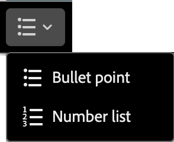

# Componenti per contenuti {#content-components}

>[!CONTEXTUALHELP]
>id="ajo-b2b_content_components_email"
>title="Informazioni sui componenti per contenuti"
>abstract="I componenti per contenuti sono dei segnaposti di contenuto vuoti che possono essere utilizzati per progettare un’e-mail."

>[!CONTEXTUALHELP]
>id="ajo-b2b_content_components_landing_page"
>title="Informazioni sui componenti per contenuti"
>abstract="I componenti per contenuti sono dei segnaposti di contenuto vuoti che possono essere utilizzati per progettare una pagina di destinazione."

>[!CONTEXTUALHELP]
>id="ajo-b2b_content_components_fragment"
>title="Informazioni sui componenti per contenuti"
>abstract="I componenti per contenuti sono dei segnaposti di contenuto vuoti che possono essere utilizzati per progettare un frammento."

>[!CONTEXTUALHELP]
>id="ajo-b2b_content_components_template"
>title="Informazioni sui componenti per contenuti"
>abstract="I componenti per contenuti sono dei segnaposti di contenuto vuoti che possono essere utilizzati per progettare un modello."

Quando si progetta contenuto per e-mail, pagine di destinazione, modelli e frammenti visivi, utilizzare [!UICONTROL Componenti contenuto] per aggiungere elementi di progettazione visiva. Puoi aggiungere tutti i componenti di contenuto necessari all’interno di uno o più componenti struttura, che definiscono il layout.

## Libreria dei contenuti

La sezione **[!UICONTROL Contents]** nella parte inferiore della libreria dei componenti visualizza i componenti di contenuto disponibili:

| Icona | Componente | Descrizione |
| --------- | ---- | ----------- |
|  | [Contenitore](#container) | Aggiungete questo componente alla progettazione per includere un contenitore rettangolare che potete utilizzare per raggruppare i componenti o applicare uno stile di sfondo o bordo a un&#39;area. |
|  | [Pulsante](#button) | Aggiungi questo componente alla progettazione per includere un elemento pulsante cliccabile. |
|  | [Testo](#text) | Aggiungi questo componente alla progettazione per includere un corpo di testo. |
|  | [Divisore](#divider) | Aggiungi questo componente alla progettazione per includere una linea orizzontale in aree separate del contenuto. |
|  | [HTML](#html) | Aggiungi questo componente alla progettazione per copiare e incollare le diverse parti del HTML esistente. Utilizza questo componente per creare un blocco HTML modulare gratuito per riutilizzare alcuni contenuti esterni. |
|  | [Immagine](#image) | Aggiungi questo componente alla progettazione per inserire un file di immagine. |
|  | [Social](#social) | Aggiungi questo componente alla tua progettazione per inserire collegamenti a pagine di social media. |
|  | [Modulo](#form) | **_Disponibile solo per le pagine di destinazione._** Aggiungi questo componente alla tua progettazione per inserire un modulo creato. |

## Barre degli strumenti del componente Contenuto

Ogni tipo di componente contenuto visualizza una barra degli strumenti quando la selezioni nell’area di lavoro. Gli strumenti disponibili, che variano in base al tipo di componente, forniscono un modo semplice per lavorare con il componente direttamente nel contenuto renderizzato. Include funzionalità di formattazione e funzionalità applicabili al tipo di componente.

{width="450"}

### Strumenti di formattazione

+++Modificare lo stile del testo

<table>
    <tr>
        <th style="width: 30%;">Strumento</th>
        <th style="width: 50%;">Utilizzo</th>
        <th style="width: 20%;">Componenti</th>
    </tr>
    <tr>
        <td></td>
        <td>Applica il grassetto, il corsivo, la sottolineatura o il barrato, il pedice o il pedice alla stringa di testo selezionata.</td>
        <td><li>Pulsante <li>Testo</td>
    </tr>
</table>

+++

+++Allineamento orizzontale

<table>
    <tr>
        <th style="width: 30%;">Strumento</th>
        <th style="width: 50%;">Utilizzo</th>
        <th style="width: 20%;">Componenti</th>
    </tr>
    <tr>
        <td></td>
        <td>Applica un tipo di allineamento orizzontale al contenuto del componente. Scegliere sinistra, centrata, destra o giustificata. </td>
        <td><li>Pulsante <li>Testo</td>
    </tr>
</table>

+++

+++Crea elenco

<table>
    <tr>
        <th style="width: 30%;">Strumento</th>
        <th style="width: 50%;">Utilizzo</th>
        <th style="width: 20%;">Componenti</th>
    </tr>
    <tr>
        <td></td>
        <td>Applica la formattazione di elenco ordinata o non ordinata al testo del componente.</td>
        <td><li>Testo</td>
    </tr>
</table>

+++

+++Imposta intestazione

<table>
    <tr>
        <th style="width: 20%;">Strumento</th>
        <th style="width: 60%;">Utilizzo</th>
        <th style="width: 20%;">Componenti</th>
    </tr>
    <tr>
        <td></td>
        <td>Applica la formattazione a livello di titolo al paragrafo per la posizione del cursore.</td>
        <td><li>Pulsante <li>Testo</td>
    </tr>
</table>

+++

+++Dimensione font

<table>
    <tr>
        <th style="width: 20%;">Strumento</th>
        <th style="width: 60%;">Utilizzo</th>
        <th style="width: 20%;">Componenti</th>
    </tr>
    <tr>
        <td></td>
        <td>Applica la dimensione del carattere al testo selezionato. Fate clic sullo strumento e scegliete le dimensioni o immettete il valore px.</td>
        <td><li>Pulsante <li>Testo</td>
    </tr>
</table>

+++

+++Colore font

<table>
    <tr>
        <th style="width: 40%;">Strumento</th>
        <th style="width: 40%;">Utilizzo</th>
        <th style="width: 20%;">Componenti</th>
    </tr>
    <tr>
        <td></td>
        <td>Applica il colore del carattere al testo selezionato. Scegliete un colore dal selettore e utilizzate il cursore del colore e il campo del colore per selezionare il colore. In alternativa, è possibile immettere un valore RGB, HSL, HSB o esadecimale noto. </td>
        <td><li>Pulsante <li>Testo</td>
    </tr>
</table>

+++

+++Inserisci collegamento

<table>
    <tr>
        <th style="width: 40%;">Strumento</th>
        <th style="width: 40%;">Utilizzo</th>
        <th style="width: 20%;">Componenti</th>
    </tr>
    <tr>
        <td></td>
        <td>Crea un collegamento cliccabile (URL esterno o pagina di destinazione) per il testo o l’elemento selezionato.</td>
        <td><li>Pulsante <li>Testo <li>Immagine </td>
    </tr>
</table>

+++

+++Rimuovi collegamento

<table>
    <tr>
        <th style="width: 15%;">Strumento</th>
        <th style="width: 60%;">Utilizzo</th>
        <th style="width: 25%;">Componenti</th>
    </tr>
    <tr>
        <td></td>
        <td> Rimuovi il collegamento cliccabile (URL esterno o pagina di destinazione) per il testo o l’elemento selezionato.</td>
        <td><li>Pulsante <li>Testo <li>Immagine </td>
    </tr>
</table>

+++

### Strumenti funzionali

| Strumento | Nome | Utilizzo |
| ---- | ---- | ----- |
| {width="40"} | Aggiungere personalizzazione | Utilizza l’editor di personalizzazione per inserire i token di personalizzazione nel contenuto del componente. [Ulteriori informazioni](./email-authoring.md#personalize-content) |
| {width="40"} | Mostra il codice sorgente | Visualizza il codice sorgente HTML per il componente in una finestra a comparsa di sola lettura.  {width="200"} |
| {width="40"} | Abilita contenuto condizionale | (E-mail e frammenti) Abilita le varianti condizionali per il componente. [Ulteriori informazioni](./conditional-content.md) |
| {width="40"} | Duplica | Crea una copia del componente e aggiungilo direttamente qui sotto. |
| {width="40"} | Elimina | Rimuovi il componente. |

## Aggiungere un componente di contenuto alla progettazione

1. Nello spazio di progettazione visivo, utilizza un modello esistente o aggiungi i componenti struttura necessari in un’area di lavoro vuota per definire il layout.

1. Nella libreria **[!UICONTROL Componenti]**, afferra l&#39;_handle di trascinamento_  per il componente contenuto desiderato, quindi trascinalo sui componenti struttura.

   Puoi aggiungere più componenti in un singolo componente struttura e in ogni colonna di un componente struttura.

   {width="600" zoomable="yes"}

1. Regola la visualizzazione del componente utilizzando le schede **[!UICONTROL Impostazioni]** e **[!UICONTROL Stile]** a destra oppure la barra degli strumenti di contesto visualizzata nell&#39;area di lavoro.

   Ad esempio, puoi modificare lo stile del testo, la spaziatura interna o il margine del componente.

   {width="600" zoomable="yes"}

Mentre lavori con la progettazione, puoi anche [rimuovere](#remove-a-content-component) o [duplicare](#duplicate-a-content-component) un componente.

## Impostazioni e stili dei componenti di contenuto

Dopo aver aggiunto un componente, questo viene selezionato nello spazio di progettazione visiva e le relative proprietà vengono visualizzate nel pannello di destra. Puoi anche selezionare un componente in qualsiasi momento per modificare le impostazioni e gli stili. Molte impostazioni e stili sono specifici del componente, ma alcune impostazioni e stili standard possono essere applicati a qualsiasi componente di contenuto selezionato.

### Opzioni di visualizzazione

Se desideri escludere il componente dalla visualizzazione del desktop o del dispositivo mobile, modifica l&#39;impostazione **[!UICONTROL Opzioni di visualizzazione]**. Il valore predefinito, _[!UICONTROL Mostra su tutti i dispositivi]_, consente la visualizzazione su tutti i dispositivi. Scegli un’altra impostazione per rendere il componente esclusivo per tipo di dispositivo:

* _[!UICONTROL Mostra solo su dispositivi desktop]_ - Scegliere questa impostazione quando si desidera visualizzare il componente su dispositivi desktop ed escluderlo per dispositivi mobili.
* _[!UICONTROL Mostra solo su dispositivi mobili]_ - Scegliere questa impostazione per visualizzare il componente su dispositivi mobili, ad esempio telefoni e tablet, ed escluderlo per i dispositivi desktop.

{width="400" zoomable="yes"}

### Contenitore

Utilizza un contenitore per applicare uno stile specifico a un gruppo di componenti di contenuto. Aggiungere un componente [!UICONTROL Container], quindi aggiungere altri componenti di contenuto al suo interno. Questo componente è simile alla modalità di utilizzo di un elemento `div` in HTML. Puoi applicare uno stile distinto al contenitore, che è diverso dallo stile applicato ai componenti di contenuto in esso contenuti.

Aggiungere ad esempio un componente _[!UICONTROL Container]_ e quindi un componente _[!UICONTROL Button]_ in tale contenitore. Puoi utilizzare uno stile di area specifico per il contenitore e assegnare al pulsante e al relativo sfondo lo stile desiderato.

{width="600" zoomable="yes"}

+++Informazioni di base

{{styles-background}}

+++

+++Bordo

{{styles-border}}

+++

+++Dimensione

{{styles-size}}

+++

+++Margine

{{styles-margin}}

+++

+++Riempimento

{{styles-padding}}

+++

### Pulsante

Utilizza il componente [!UICONTROL Button] per inserire uno o più pulsanti selezionabili nel contenuto. Utilizza i pulsanti per reindirizzare i visualizzatori di pagina o i destinatari e-mail al contenuto di supporto (pagina di destinazione pubblicata o un collegamento esterno).

#### Aggiungere il testo del pulsante

Quando il componente Pulsante viene visualizzato nell’area di lavoro, la barra degli strumenti include opzioni per la formattazione del testo, nonché per la personalizzazione e le varianti condizionali. Per ulteriori informazioni sulle opzioni della barra degli strumenti dell’editor, consulta #.

Quando si immette il testo dell&#39;etichetta del pulsante e si imposta la formattazione, il pulsante viene ridimensionato per contenere il contenuto.

{width="500" zoomable="yes"}

#### Impostare le opzioni del collegamento

Nella scheda _[!UICONTROL Impostazioni]_, utilizza le opzioni **[!UICONTROL Collegamento]** per definire il testo del pulsante, la destinazione del collegamento e il comportamento del browser per il caricamento della pagina di destinazione.

1. Imposta **[!UICONTROL Tipo]** per il collegamento:

   * **[!UICONTROL Collegamento esterno]** - Scegliere questo tipo per utilizzare un URL standard come destinazione del collegamento.

     In **[!UICONTROL Url]**, immettere l&#39;URL per la destinazione del collegamento. Fai clic sull&#39;icona _Personalizza_ (  ) per utilizzare un token di personalizzazione come parametro nell&#39;URL.

     {width="200"}

   * **Pagina di destinazione** - Scegliere questo tipo per selezionare una pagina di destinazione pubblicata nell&#39;istanza di Marketo Engage connessa <!-- Journey Optimizer B2B Edition (_Beta_) or -->.

     Per l&#39;opzione **[!UICONTROL Pagina di destinazione]**, selezionare la pagina di destinazione pubblicata. Fai clic sull&#39;icona _Seleziona pagina_ (  ) e [seleziona la pagina di destinazione pubblicata](./landing-pages.md#link-to-a-landing-page).

     {width="200"}

1. Per **[!UICONTROL Etichetta]**, immettere il testo che si desidera visualizzare all&#39;interno del pulsante.

   Il ridimensionamento del pulsante viene regolato in base al testo e allo stile impostati.

1. Per **[!UICONTROL Target**], scegli come viene reindirizzata la destinazione collegata dall&#39;e-mail o dalla pagina:

   * _[!UICONTROL Nessuno]_ - Apre il collegamento utilizzando il browser predefinito o il comportamento del client (impostazione predefinita).
   * _[!UICONTROL Vuoto]_ - Apre il collegamento in una nuova finestra o scheda.
   * _[!UICONTROL Autonomo]_ - Apre il collegamento nello stesso frame.
   * _[!UICONTROL Elemento padre]_ - Apre il collegamento nel frame padre.
   * _[!UICONTROL Top]_ - Apre il collegamento nel corpo completo della finestra.

#### Impostare gli stili

Personalizza lo stile del pulsante nella scheda **[!UICONTROL Stili]**.

+++Informazioni di base

{{styles-background}}

+++

+++Testo

{{styles-text}}

+++

+++Bordo

{{styles-border}}

+++

+++Dimensione

{{styles-size}}

+++

+++Allineamento

+++

+++Margine pulsante

+++

+++Margine contenitore

{{styles-margin}}

+++

+++Riempimento

{{styles-padding}}

+++

+++Avanzate

{{styles-advanced}}

+++

### Testo

Utilizza il componente Testo per inserire un blocco di testo nel contenuto. Quando il componente testo è selezionato nell’area di lavoro, immetti il testo e utilizza le opzioni della barra degli strumenti per aggiungere formattazione in linea e opzioni, inclusi i token di personalizzazione e le varianti condizionali. <!-- For detailed information about crafting text, including inline styling and options, in the design space, see [Text authoring](#). -->

Personalizza lo stile del componente testo nella scheda **[!UICONTROL Stili]**.

+++Informazioni di base

{{styles-background}}

+++

+++Testo

Questi stili vengono applicati all&#39;intero blocco di testo. È possibile applicare lo stile in linea a una stringa di testo selezionata.

{{styles-text}}

+++

+++Bordo

{{styles-border}}

+++

+++Dimensione

{{styles-size}}

+++

+++Margine

{{styles-margin}}

+++

+++Riempimento

{{styles-padding}}

+++

+++Avanzate

{{styles-advanced}}

+++

### Divisore

Aggiungi un componente _Divider_ per incorporare una divisione lineare tra le sezioni del contenuto.

+++Informazioni di base

{{styles-background}}

+++

+++LINE

+++

+++Dimensione

{{styles-size}}

+++

+++Allineamento

{{styles-alignment-h}}

+++

+++Margine

{{styles-margin}}

+++

+++Riempimento

{{styles-padding}}

+++

+++Avanzate

{{styles-advanced}}

+++

### HTML

Utilizza il componente HTML per aggiungere parti del HTML esistente. Questo componente consente di creare facilmente elementi modulari di HTML che riutilizzano il contenuto esterno.

1. Selezionare il componente nell&#39;area di lavoro e fare clic sull&#39;icona _Mostra codice sorgente_ nella barra degli strumenti.

   [Apri l&#39;editor di codice per aggiungere HTML](./assets/content-components-html-show-code.png){width="450"}

1. Incolla il HTML nella casella di testo e fai clic su **[!UICONTROL Salva]**.

   [Finestra di dialogo Modifica HTML](./assets/content-components-html-edit-dialog.png){width="600" zoomable="yes"}

   Se HTML è valido, esegue il rendering dell’elemento nell’area di lavoro. Se si tratta di un elemento associato a uno degli altri componenti di contenuto, puoi modificare le impostazioni e gli stili nel pannello di destra in base al tipo di componente. In caso contrario, rimane come componente di HTML.

Per un componente HTML, puoi impostare i seguenti stili per l’intero componente HTML nel pannello di destra:

+++Informazioni di base

{{styles-background}}

+++

+++Bordo

{{styles-border}}

+++

+++Dimensione

{{styles-size}}

+++

+++Allineamento

{{styles-alignment-h-v}}

+++

+++Margine

{{styles-margin}}

+++

+++Riempimento

{{styles-padding}}

+++

+++Avanzate

{{styles-advanced}}

+++

### Immagine

Utilizza il componente [!UICONTROL Immagine] per inserire una risorsa immagine nel contenuto. Quando il componente _Immagine_ è selezionato nell&#39;area di lavoro, è possibile aggiungere o modificare il file di risorse immagine visualizzato.

{width="400" zoomable="yes"}

#### Aggiungi la risorsa immagine

Scegliere il tipo di origine [risorsa](./assets-overview.md) e selezionare un file di immagine:

* **[!UICONTROL Marketo Engage Assets]** - Scegliere questo tipo per sfogliare e selezionare una risorsa immagine dalla libreria Journey Optimizer B2B edition o dall&#39;istanza connessa di Market Engage.

  {width="700" zoomable="yes"}

  Dalla finestra di dialogo, puoi scegliere un’immagine dall’archivio selezionato. Fai clic su **[!UICONTROL Seleziona]** per aggiungere la risorsa.

  Sono disponibili alcuni strumenti per individuare la risorsa di cui hai bisogno:

   * Fai clic sull&#39;icona _Filtro_ in alto a sinistra per filtrare gli elementi visualizzati in base ai criteri.

   * Immetti il testo nel campo _Ricerca_ per filtrare gli elementi visualizzati in modo che corrispondano al nome della risorsa.

     {width="700" zoomable="yes"}

* **[!UICONTROL Experience Manager Assets]** - Scegliere questo tipo per sfogliare e selezionare una risorsa immagine da un [archivio Experience Manager Assets configurato](../admin/configure-aem-repositories.md).

  Nella finestra di dialogo _[!UICONTROL Seleziona Assets]_, scegli un&#39;immagine utilizzando gli strumenti disponibili per individuare la risorsa necessaria e fai clic su **[!UICONTROL Seleziona]**.:

   * Modifica l&#39;**[!UICONTROL Archivio]** in alto a destra.

   * Fai clic su **[!UICONTROL Gestisci risorse]** in alto a destra per aprire l&#39;archivio Assets in un&#39;altra scheda del browser e utilizzare gli strumenti di gestione AEM Assets.

   * Fai clic sul selettore _Tipo di visualizzazione_ in alto a destra per modificare la visualizzazione in **[!UICONTROL Vista a elenco]**, **[!UICONTROL Vista griglia]**, **[!UICONTROL Vista galleria]** o **[!UICONTROL Vista a cascata]**.

   * Fai clic sull&#39;icona _Ordinamento_ per modificare l&#39;ordinamento tra crescente e decrescente.

     {width="700" zoomable="yes"}

   * Fare clic sulla freccia del menu **[!UICONTROL Ordina per]** per modificare i criteri di ordinamento in **[!UICONTROL Nome]**, **[!UICONTROL Dimensione]** o **[!UICONTROL Modificato]**.

   * Fai clic sull&#39;icona _Filtro_ in alto a sinistra per filtrare gli elementi visualizzati in base ai criteri.

   * Immetti il testo nel campo _Ricerca_ per filtrare gli elementi visualizzati in modo che corrispondano al nome della risorsa.

  {width="700" zoomable="yes"}

* **[!UICONTROL Importa file multimediali]** - Scegliere questo tipo per selezionare un file dal sistema e importarlo nella libreria di risorse di Journey Optimizer B2B edition.

  Nella finestra di dialogo _[!UICONTROL Carica immagine]_, trascina un file dal sistema alla casella del file. La dimensione massima del file è 100 MB.

  {width="450"}

  I nomi dei file delle immagini selezionate vengono visualizzati nella finestra di dialogo. I nomi dei file di risorse devono essere univoci (per tutte le cartelle) e, se esiste già un file con questo nome, viene visualizzato un messaggio. I nomi possono contenere un massimo di 100 caratteri e non possono contenere caratteri speciali (ad esempio `;`, `:`, `\` e `|`).

  Fai clic su **[!UICONTROL Importa]**.

Nel pannello di destra potete aggiungere un titolo immagine e un testo alternativo per l&#39;immagine.

{width="250"}

#### Impostare le opzioni del collegamento

Nella scheda _[!UICONTROL Impostazioni]_, utilizza le opzioni **[!UICONTROL Collega]** per collegare l&#39;immagine a una destinazione e il comportamento del browser per caricare la pagina di destinazione.

1. Imposta **[!UICONTROL Tipo]** per il collegamento:

   * **[!UICONTROL Collegamento esterno]** - Scegliere questo tipo per utilizzare un URL standard come destinazione del collegamento.

     In **[!UICONTROL Url]**, immettere l&#39;URL per la destinazione del collegamento. Fai clic sull&#39;icona _Personalizza_ (  ) per utilizzare un token di personalizzazione come parametro nell&#39;URL.

     {width="250"}

   * **Pagina di destinazione** - Scegliere questo tipo per selezionare una pagina di destinazione pubblicata nell&#39;istanza di Marketo Engage connessa <!-- Journey Optimizer B2B Edition (_Beta_) or -->.

     Per l&#39;opzione **[!UICONTROL Pagina di destinazione]**, selezionare la pagina di destinazione pubblicata. Fai clic sull&#39;icona _Seleziona pagina_ (  ) e [seleziona la pagina di destinazione pubblicata](./landing-pages.md#link-to-a-landing-page).

     {width="250"}

1. Per **[!UICONTROL Etichetta]**, immettere il testo che si desidera visualizzare all&#39;interno del pulsante.

   Il ridimensionamento del pulsante viene regolato in base al testo e allo stile impostati.

1. Per **[!UICONTROL Target**], scegli come viene reindirizzata la destinazione collegata dall&#39;e-mail o dalla pagina:

   * _[!UICONTROL Nessuno]_ - Apre il collegamento utilizzando il browser predefinito o il comportamento del client (impostazione predefinita).
   * _[!UICONTROL Vuoto]_ - Apre il collegamento in una nuova finestra o scheda.
   * _[!UICONTROL Autonomo]_ - Apre il collegamento nello stesso frame.
   * _[!UICONTROL Elemento padre]_ - Apre il collegamento nel frame padre.
   * _[!UICONTROL Top]_ - Apre il collegamento nel corpo completo della finestra.

#### Impostare gli stili

Imposta gli stili del componente immagine nel pannello di destra.

+++Informazioni di base

{{styles-background}}

+++

+++Bordo

{{styles-border}}

+++

+++Dimensione

{{styles-size}}

+++

+++Allineamento

{{styles-alignment-h}}

+++

+++Margine

{{styles-margin}}

+++

+++Riempimento

{{styles-padding}}

+++

+++Avanzate

{{styles-advanced}}

+++

### Social

Utilizza il componente _Social_ per inserire nel contenuto collegamenti a pagine di social media. Include tre tipi di social media predefiniti, ma puoi aggiungere o rimuovere i tipi in base alle tue esigenze.

{width="600" zoomable="yes"}

* Per aggiungere un tipo di social media, fai clic sull&#39;icona _Aggiungi_ ( **+** ) e scegli un tipo di social media da aggiungere.

  {width="250"}

* Per rimuovere un tipo di social media, fai clic su **X** accanto all&#39;icona del social media.

Con un tipo di social media selezionato, imposta le opzioni per quel tipo:

* **[!UICONTROL URL]** - Immetti l&#39;URL del social media che desideri collegare all&#39;icona o al grafico del social media.
* **[!UICONTROL Source]** - Se desideri utilizzare una tua immagine invece di quella predefinita, scegli una risorsa immagine. Puoi selezionare un’immagine dal repository di risorse Marketo Engage collegato, da un repository Experience Manager Assets (se configurato) o importare un file di immagine dal sistema. Per informazioni dettagliate sulla selezione e l&#39;importazione delle risorse immagine, consultare [Informazioni sul componente immagine](#add-the-image-asset).
* **[!UICONTROL Testo alt]** - Immettere il testo alt per l&#39;immagine visualizzata.

  {width="250"}

Per definire una dimensione di visualizzazione coerente per tutti gli elementi grafici dei social media, imposta la **[!UICONTROL dimensione delle immagini]**.

È possibile impostare le seguenti opzioni di stile per il componente _Social_:

+++Informazioni di base

{{styles-background}}

+++

+++Bordo

{{styles-border}}

+++

+++Dimensione

{{styles-size}}

+++

+++Allineamento

{{styles-alignment-h}}

+++

+++Margine

{{styles-margin}}

+++

+++Riempimento

{{styles-padding}}

+++

+++Avanzate

{{styles-advanced}}

+++

### Modulo (pagine di destinazione)

[!BADGE Beta]{type=Informative url="/help/user/content/forms.md" tooltip="Funzione Beta"}

Utilizza il componente _Modulo_ per aggiungere un modulo pubblicato a una pagina di destinazione o a un modello di pagina di destinazione. Per ulteriori informazioni sulla creazione e la pubblicazione di moduli, vedere [Forms](./forms.md).

1. Fai clic sullo strumento _Modulo_ nella barra degli strumenti del componente oppure utilizza le proprietà **[!UICONTROL Incorpora modulo]** a destra per selezionare il modulo pubblicato.

   {width="600"}

1. Se si desidera ignorare il tipo di **[!UICONTROL completamento]** predefinito per il modulo, modificare l&#39;impostazione in base ai requisiti della pagina o del modello.

   Questa pagina è anche nota come _pagina di ringraziamento_ per il modulo e questa impostazione determina cosa accade quando un visitatore invia il modulo:

   * **[!UICONTROL Resta a pagina]** - Scegli questa opzione per mantenere il visitatore sulla stessa pagina al momento dell&#39;invio del modulo.

   * **[!UICONTROL Pagina di destinazione]** - Scegli questa opzione per selezionare una pagina di destinazione Journey Optimizer B2B edition o Marketo Engage come follow-up.

   * **[!UICONTROL URL esterno]** - Scegliere questa opzione per specificare qualsiasi URL come pagina di follow-up. Dopo che il visitatore ha inviato il modulo, il browser carica l’URL designato.

     >[!TIP]
     >
     >Se desideri utilizzare il modulo per scaricare un file, puoi specificare un URL per il file ospitato. Con questa configurazione, il pulsante Invia funziona come un pulsante di download.

     {width="280"}

Se necessario, seleziona la scheda **[!UICONTROL Stili]** nel pannello di destra per impostare i margini del modulo all&#39;interno del componente struttura.

{{styles-margin}}
