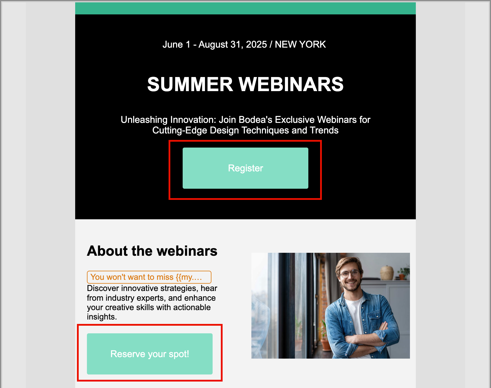

# Aggiungi CSS personalizzato per il contenuto

Puoi aggiungere un CSS personalizzato direttamente nell’e-mail o nello spazio di progettazione della pagina di destinazione. Utilizza CSS personalizzato per applicare uno stile avanzato e specifico, per una maggiore flessibilità e un maggiore controllo sull’aspetto del contenuto.

Il file CSS personalizzato viene aggiunto alla sezione `<head>` all&#39;interno di un tag `<style>` utilizzando l&#39;attributo `data-name="global-custom"`. Questa struttura garantisce che gli stili personalizzati vengano applicati globalmente al contenuto.

+++ Implementazione di esempio

```html
<!DOCTYPE html>
<html>
  <head>
    <meta charset="utf-8">
    <meta name="content-version" content="3.3.31">
    <meta name="x-apple-disable-message-reformatting">
    <meta name="viewport" content="width=device-width,initial-scale=1.0">
    <style data-name="default" type="text/css">
      td { padding: 0; }
      th { font-weight: normal; }
    </style>
    <style data-name="grid" type="text/css">
      .acr-grid-table { width: 100%; }
    </style>
    <style data-name="acr-theme" type="text/css" data-theme="default" data-variant="0">
      body { margin: 0; font-family: Arial; }
    </style>
    <style data-name="media-default-max-width-500px" type="text/css">
      @media screen and (max-width: 500px) {
        body { width: 100% !important; }
      }
    </style>
    <style data-name="global-custom" type="text/css">
      /* Add you custom CSS here */
    </style>
  </head>
  <body>
    <!-- Minimal content -->
  </body>
</html>
```

+++

>[!NOTE]
>
>Il CSS personalizzato non viene riflesso o convalidato nel pannello _[!UICONTROL Stili]_ per un componente selezionato. È completamente indipendente e può essere modificata solo tramite l&#39;opzione [!UICONTROL Aggiungi CSS personalizzato] a livello di componente corpo.

## Aggiungi CSS personalizzato

1. Con almeno un componente di contenuto aggiunto nell&#39;area di lavoro, seleziona il componente **[!UICONTROL Corpo]** nell&#39;area di navigazione a sinistra.

1. Seleziona la scheda _Stili_ a destra e fai clic su **[!UICONTROL Aggiungi CSS personalizzato]**.

   {width="800" zoomable="yes"}

   >[!NOTE]
   >
   >Il pulsante _[!UICONTROL Aggiungi CSS personalizzato]_ è disponibile solo quando è selezionato il componente _[!UICONTROL Body]_. Tuttavia, puoi applicare stili CSS personalizzati a tutti i componenti al suo interno.

   L&#39;editor a comparsa _[!UICONTROL Aggiungi CSS]_ personalizzato viene visualizzato con i commenti del codice segnaposto.

1. Immetti il codice CSS nell’editor.

   Assicurati che il CSS personalizzato sia valido e segua la sintassi corretta. Se il CSS immesso non è valido, viene visualizzato un messaggio di errore e non è possibile salvarlo. Per ulteriori informazioni, consulta [Validità CSS](#css-validity).

   {width="450"}

1. Fai clic su **[!UICONTROL Salva]** per salvare il file CSS personalizzato.

   Il foglio di stile personalizzato viene applicato al contenuto esistente. Puoi verificare che il CSS personalizzato sia applicato in base alle tue esigenze. Per informazioni su come apportare modifiche e regolare l&#39;applicazione del foglio di stile, vedere [Risoluzione dei problemi](#troubleshooting).

   {width="600" zoomable="yes"}

## Validità CSS

>[!CAUTION]
>
>Gli utenti sono responsabili della sicurezza dei CSS personalizzati. Assicurati che il CSS non introduca vulnerabilità o conflitti con il contenuto esistente.
>
>Evita l’utilizzo di CSS che potrebbero interrompere involontariamente il layout o la funzionalità del contenuto.

+++ Esempi di CSS validi

```css
.acr-component[data-component-id="form"] {
  display: flex;
  justify-content: center;
  background: none;
}

.acr-Form {
  width: 100%;
  padding: 20px 100px;
  border-spacing: 0px 8px;
  box-sizing: border-box;
  margin: 0;
}

.acr-Form .spectrum-FieldLabel {
  width: 20%;
}

.acr-Form.spectrum-Form--labelsAbove .spectrum-FieldLabel,
.acr-Form [data-form-item="checkbox"] .spectrum-FieldLabel {
  width: auto;
}

.acr-Form .spectrum-Textfield {
  width: 100%;
}

#acr-form-error,
#acr-form-confirmation {
  width: 100%;
  padding: var(--spectrum-global-dimension-static-size-500);
  display: flex;
  align-items: center;
  flex-direction: column;
  justify-content: center;
  gap: var(--spectrum-global-dimension-static-size-200);
}

.spectrum-Form-item.is-required .spectrum-FieldLabel:after{
  content: '*';
  font-size: 1.25rem;
  margin-left: 5px;
  position: absolute;
}

/* Error field placeholder */
.spectrum-HelpText {
  display: none !important;
}

.spectrum-HelpText.is-invalid,
.is-invalid ~ .spectrum-HelpText {
  display: flex !important;
}
```

```css
@media only screen and (min-width: 600px) {
  .acr-paragraph-1 {
    width: 100% !important;
  }
}
```

+++

+++ Esempi di CSS non valido

L&#39;utilizzo di `<style>` tag non è accettato:

```html
<style type="text/css">
  .acr-Form {
    width: 100%;
    padding: 20px 100px;
    border-spacing: 0px 8px;
    box-sizing: border-box;
    margin: 0;
  }
</style>
```

Sintassi non valida, ad esempio parentesi graffe mancanti, non accettata:

```css
body {
  background: red;
```

+++

## CSS nel contenuto importato

Se desideri utilizzare CSS personalizzati con il contenuto importato nell’e-mail o nello spazio di progettazione della pagina di destinazione, considera quanto segue:

* Se si importa contenuto HTML esterno, inclusi i file CSS, <!-- unless converting that content, -->verrà popolato in [!UICONTROL Modalità di compatibilità] e la sezione [!UICONTROL Stili CSS] non sarà disponibile.

* Se importi contenuto creato originariamente nell&#39;area di progettazione dell&#39;e-mail o della pagina di destinazione con l&#39;opzione [!UICONTROL Aggiungi CSS personalizzato], il CSS applicato sarà visibile e modificabile dalla stessa opzione.

## Risoluzione dei problemi

Se il CSS personalizzato non viene applicato come previsto, utilizza gli strumenti di sviluppo del browser per esaminare il contenuto e verificare che il CSS esegua il targeting dei selettori corretti. Quando rivedi il codice di stile, considera quanto segue:

* Verifica che il CSS sia valido e privo di errori di sintassi (ad esempio parentesi graffe mancanti, nomi di proprietà errati).

* Verifica che il tuo CSS sia stato aggiunto al tag `<style>` con l&#39;attributo `data-name="global-custom"`.

* Verifica se l&#39;attributo `global-custom` del tag di stile `data-disabled` è impostato su true, ad esempio:

  `<style data-name="global-custom" type="text/css" data-disabled="true"> body: { color: red; } </style>`

* Verifica che il CSS non venga sostituito in un punto del contenuto, ad esempio lo stile in linea applicato.

* Aggiungi `!important` alle tue dichiarazioni per assicurarti che abbiano la precedenza, ad esempio:

  ```
  .acr-Form {
  background: red !important;
  }
  ```
