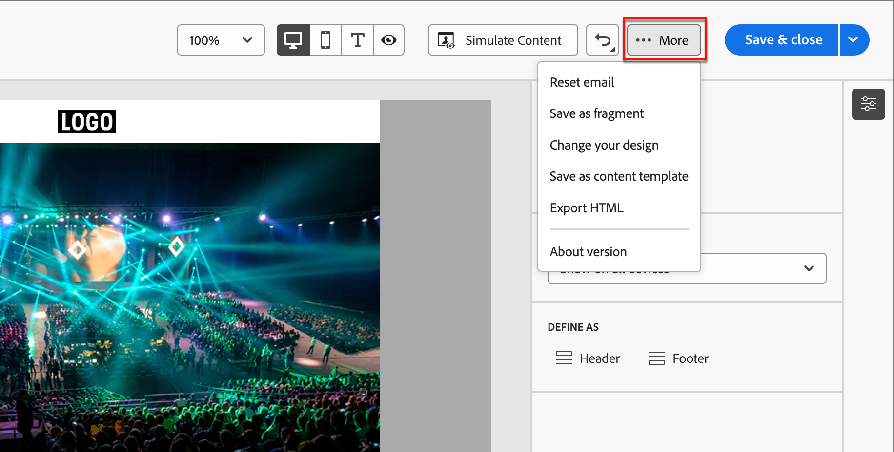

# Authoring di e-mail

Utilizza Adobe Journey Optimizer B2B edition per inviare messaggi e-mail ai clienti. Puoi creare, personalizzare e visualizzare in anteprima i messaggi nella finestra di progettazione visiva.

## Aggiungere un’azione e-mail in un percorso di account

Puoi impostare le consegne e-mail in un Percorso di account quando aggiungi un nodo _[!UICONTROL Esegui un&#39;azione]_ ed effettua le seguenti operazioni:

1. Per l&#39;azione _[!UICONTROL sulla destinazione]_, scegliere **[!UICONTROL Persone]**.
1. Per _[!UICONTROL Azione sulle persone]_, scegli **[!UICONTROL Invia e-mail]**.
1. Per l&#39;_[!UICONTROL origine e-mail]_, scegli **[!UICONTROL Crea nuova e-mail]**.

   In alternativa, è possibile selezionare l&#39;opzione _[!UICONTROL Seleziona e-mail da Adobe Marketo Engage]_ per utilizzare una delle e-mail precreate in Marketo Engage e inviarla come parte del Percorso di account.

   >[!NOTE]
   >
   >Se stai creando un’e-mail per la prima volta, assicurati che il canale e-mail sia configurato dall’interno di Adobe Marketo Engage. Per ulteriori informazioni, consulta [Assicurare il recapito messaggi e-mail](https://experienceleague.adobe.com/en/docs/marketo/using/getting-started/initial-setup/setup-steps#ensure-email-deliverability) nella documentazione di Marketo Engage.

   {width="700" zoomable="yes"}

1. Nella parte inferiore del pannello _[!UICONTROL Esegui un&#39;azione]_, fai clic su **[!UICONTROL Crea e-mail]**.

1. Nella finestra di dialogo, immetti un **[!UICONTROL Nome]** univoco per l&#39;e-mail e una **[!UICONTROL riga Oggetto]**.

   {width="400"}

1. Fai clic su **[!UICONTROL Crea]**.

   Nella sezione _[!UICONTROL Proprietà e-mail]_ della pagina del contenuto e-mail, i campi _[!UICONTROL Da e-mail]_ e _[!UICONTROL Rispondi all&#39;indirizzo]_ sono già configurati. È possibile immettere valori per i campi _[!UICONTROL Da nome]_ e _[!UICONTROL Descrizione]_ (facoltativo).

## Creare il contenuto dell’e-mail

Fai clic su **[!UICONTROL Aggiungi contenuto e-mail]** nella parte superiore del pannello di anteprima _[!UICONTROL E-mail]_.

{width="700" zoomable="yes"}

Questa azione avvia E-mail Designer, dove puoi scegliere come progettare il messaggio e-mail dalle seguenti opzioni:

* [Progetta il tuo indirizzo e-mail da zero](#design-your-email-from-scratch) utilizzando l&#39;interfaccia di E-mail Designer.

* [Importa contenuto HTML esistente](#import-existing-html-content) da un file o da una cartella .zip.

* [Selezionare un modello esistente](#select-a-template) da un elenco di modelli di posta elettronica predefiniti o personalizzati.

Per configurare e personalizzare l&#39;oggetto con l&#39;editor di espressioni, fare clic sull&#39;icona _Personalization_ e aggiungere i token di Marketo Engage.

Dopo aver creato e personalizzato il contenuto dell’e-mail, puoi esportarlo per la convalida o per un utilizzo successivo. Fai clic su **[!UICONTROL Esporta HTML]** per salvare il contenuto come file .zip che include il HTML e le risorse.

>[!TIP]
>
>Utilizza l’Assistente AI in Adobe Journey Optimizer B2B edition, basato su intelligenza artificiale generativa, per elevare i contenuti al livello successivo. L’Assistente AI può aiutarti a ottimizzare l’impatto delle consegne generando e-mail intere, contenuto di testo mirato e ricevendo consigli dall’Assistente AI per le immagini che risuonano con il tuo pubblico. [Ulteriori informazioni](./ai-assistant-emails.md)

### Creare e-mail da zero {#design-from-scratch}

>[!CONTEXTUALHELP]
>id="ajo-b2b_structure_components_landing_page"
>title="Aggiungere i componenti Struttura"
>abstract="I componenti della struttura definiscono il layout della pagina di destinazione. Per iniziare a progettare il contenuto della pagina di destinazione, trascina un componente **Struttura** nell’area di lavoro."

>[!CONTEXTUALHELP]
>id="ajo-b2b_content_components_landing_page"
>title="Informazioni sui componenti per contenuti"
>abstract="I componenti dei contenuti sono dei segnaposto di contenuto vuoti che possono essere utilizzati per creare il layout di una pagina di destinazione."

Utilizza l’editor di contenuto visivo per definire la struttura del contenuto dell’e-mail. Aggiungendo e spostando componenti strutturali con semplici azioni di trascinamento della selezione, puoi progettare la forma del contenuto dell’e-mail riutilizzabile in pochi secondi.

1. Dalla home page di _[!UICONTROL Progetta modello]_, seleziona l&#39;opzione **[!UICONTROL Progetta da zero]**.

1. [Aggiungi struttura e contenuto](#add-structure-and-content) al messaggio di posta elettronica.
1. [Aggiungi risorse immagine](#add-assets) al messaggio e-mail.
1. [Personalizzare il contenuto dell&#39;e-mail](#personalize-content).
1. [Rivedi e aggiorna i collegamenti](#preview-and-edit-linked-urls).

<!-- If needed, you can further personalize your email by clicking **[!UICONTROL Switch to code editor]** from the advanced menu. The code editor allows you to edit the email source code, such as adding tracking or custom HTML tags.

>[!CAUTION]
>
>You cannot revert back to the visual designer for this email after switching to the code editor. -->

Al termine, fai clic su **[!UICONTROL Simula contenuto]** in alto per verificare il rendering. È possibile scegliere la visualizzazione desktop o mobile.

Quando si è soddisfatti del contenuto, fare clic su **[!UICONTROL Salva]**.

### Importa contenuto HTML esistente

{{$include /help/_includes/content-design-import.md}}

{width="500"}

>[!NOTE]
>
>L&#39;utilizzo di un tag `<table>` come primo livello in un file HTML può causare la perdita di stile, incluse le impostazioni di sfondo e larghezza nel tag del livello superiore.

Puoi personalizzare il contenuto importato in base alle esigenze con gli strumenti dell’editor e-mail visivo.

### Seleziona un modello

{{$include /help/_includes/content-design-select-template.md}}

>[!NOTE]
>
> Ai modelli salvati possono essere applicate impostazioni di governance (blocco del contenuto) a uno o più componenti. La finestra di progettazione visiva fornisce indicazioni sui componenti bloccati quando si [crea un messaggio e-mail da un modello gestito](./email-authoring-governance.md).

## Aggiungere struttura e contenuto {#structure-content}

>[!CONTEXTUALHELP]
>id="ajo-b2b_structure_components_email"
>title="Aggiungere i componenti Struttura"
>abstract="I componenti della struttura definiscono il layout del messaggio e-mail. Per iniziare a progettare il contenuto delle e-mail, trascina un componente **Struttura** nell’area di lavoro."

>[!CONTEXTUALHELP]
>id="ajo-b2b_content_components_email"
>title="Informazioni sui componenti per contenuti"
>abstract="I componenti di contenuto sono segnaposto di contenuto vuoti che puoi utilizzare per creare il layout di un’e-mail."

{{$include /help/_includes/content-design-components.md}}

### Aggiungi frammenti

Nell&#39;editor del contenuto visivo, l&#39;icona _Frammenti_ è visualizzata a sinistra. L’esempio seguente illustra i passaggi per aggiungere frammenti al contenuto del modello.

1. Per aprire l&#39;elenco dei frammenti, fare clic sull&#39;icona _Frammenti_.

   Puoi eseguire le seguenti operazioni:

   * Ordina l’inserzione.
   * Sfoglia, Cerca o filtra l’inserzione.
   * Consente di passare dalla visualizzazione Anteprima alla visualizzazione Elenco.
   * Aggiorna l’elenco per riflettere eventuali frammenti creati di recente.

   {width="700" zoomable="yes"}

1. Trascina uno dei frammenti nel segnaposto del componente strutturale.

   L’editor esegue il rendering del frammento all’interno della sezione/elemento della struttura e-mail.

Il contenuto del frammento viene aggiornato dinamicamente all’interno della struttura per mostrare come appare il contenuto nell’e-mail.

>[!TIP]
>
>Per aggiungere il frammento in modo che occupi l’intero layout orizzontale all’interno dell’e-mail, aggiungi una struttura di colonne 1:1 e quindi trascina e rilascia il frammento al suo interno.

Dopo il salvataggio, l&#39;e-mail viene visualizzata nella pagina dei dettagli del frammento quando si seleziona la scheda _[!UICONTROL Usato da]_ nel riepilogo. I frammenti aggiunti a un modello e-mail non sono modificabili all’interno del modello: il frammento di origine definisce il contenuto.

### Aggiungere risorse

{{$include /help/_includes/content-design-assets.md}}

### Spostarsi tra livelli, impostazioni e stili

{{$include /help/_includes/content-design-navigation.md}}

### Personalizzare il contenuto

{{$include /help/_includes/content-design-personalization.md}}

### Modifica tracciamento URL collegato

{{$include /help/_includes/content-design-links.md}}

### Opzioni di visualizzazione

Sfrutta le opzioni di convalida di visualizzazione e contenuto disponibili nell’editor e-mail visivo.

* Zoom in/out del contenuto tra le opzioni di zoom predefinite.

* Cambia la visualizzazione del contenuto tra desktop, dispositivi mobili o solo testo/solo testo.
   * Fai clic sull&#39;icona _Visualizza_ per l&#39;anteprima del contenuto tra i dispositivi.
   * Seleziona uno dei dispositivi predefiniti o immetti dimensioni personalizzate per visualizzare in anteprima il contenuto.

### Altre opzioni

Dal menu _[!UICONTROL Altro ...]_ nella parte superiore della finestra di progettazione e-mail, puoi eseguire le azioni seguenti:

{width="500"}

* **[!UICONTROL Reimposta e-mail]** - Fare clic su questa opzione per cancellare l&#39;area di lavoro di progettazione e-mail visiva in una lavagna vuota e riavviare la creazione del contenuto.
* **[!UICONTROL Salva come frammento]** - Salva tutte o alcune parti dell&#39;e-mail come frammento da riutilizzare in più e-mail o modelli di e-mail. Fornisci un nome e una descrizione per il frammento, quindi salvalo nell’elenco dei frammenti disponibili.
* **[!UICONTROL Modifica la progettazione]** - Torna alla pagina _Progetta la tua e-mail_. Da lì, puoi scegliere un altro modello per riavviare il processo di progettazione o scegliere di progettare il contenuto da zero in un&#39;area di lavoro nera.\
* **[!UICONTROL Salva come modello di contenuto]** - Salva il corpo dell&#39;e-mail come modello e-mail da riutilizzare in più e-mail o modelli e-mail. Fornisci un nome e una descrizione per il modello, quindi salvalo nell’elenco dei modelli e-mail salvati.
* **[!UICONTROL Esporta HTML]** - Scarica il contenuto nell&#39;area di lavoro visiva nel tuo sistema locale in formato HTML racchiuso in un file zip.

## Controllare gli avvisi

Durante la progettazione del contenuto dei messaggi e-mail, gli avvisi vengono visualizzati nell’interfaccia (in alto a destra della pagina) quando mancano le impostazioni chiave.

Se non trovi questo pulsante, non sono stati rilevati problemi.

È possibile rilevare due tipi di avvisi:

* **_Avvisi_** che fanno riferimento a consigli e best practice, ad esempio:

   * `The opt-out link is not present in the email body`: è consigliabile aggiungere un collegamento di annullamento all&#39;abbonamento nel corpo dell&#39;e-mail.

     >[!NOTE]
     >
     >I messaggi e-mail in stile marketing devono includere un collegamento di rinuncia, che non è necessario per i messaggi transazionali.

   * `Text version of HTML is empty`: non dimenticare di definire una versione testuale del corpo dell&#39;e-mail, che viene utilizzata quando non è possibile visualizzare il contenuto HTML.

   * `Empty link is present in email body`: verificare che tutti i collegamenti presenti nel messaggio di posta elettronica siano corretti.

   * `Email size has exceeded the limit of 100KB`: per una consegna ottimale, assicurati che la dimensione dell&#39;e-mail non superi i 100 KB.

* **_Errori_** che impediscono di testare o attivare il percorso o la campagna finché non vengono risolti, ad esempio:

   * `The subject line is missing`: l&#39;oggetto dell&#39;e-mail è obbligatorio.

   * `The email version of the message is empty`: questo errore viene visualizzato quando il contenuto dell&#39;e-mail non è stato configurato.

## Controllare e testare l’e-mail {#preview-test}

>[!CONTEXTUALHELP]
>id="ajo-b2b_email_preview_simulate"
>title="Controllare come viene eseguito il rendering del contenuto"
>abstract="Una volta definito il contenuto, puoi visualizzarne l’anteprima e verificare se il rendering è corretto in base al canale in uso."

Una volta definito il contenuto del messaggio, puoi utilizzare i profili di test per visualizzarne l’anteprima, inviare bozze e controllarne il rendering nei client desktop, mobili e basati su Web più diffusi. Se hai inserito dei contenuti personalizzati, puoi visualizzare in anteprima come questi contenuti vengono visualizzati nel messaggio utilizzando i dati del profilo di test.

Per visualizzare in anteprima il contenuto dell&#39;e-mail, fai clic su **[!UICONTROL Simula contenuto]** e quindi aggiungi un profilo di test per verificare il messaggio utilizzando i dati del profilo di test.

{width="700" zoomable="yes"}
