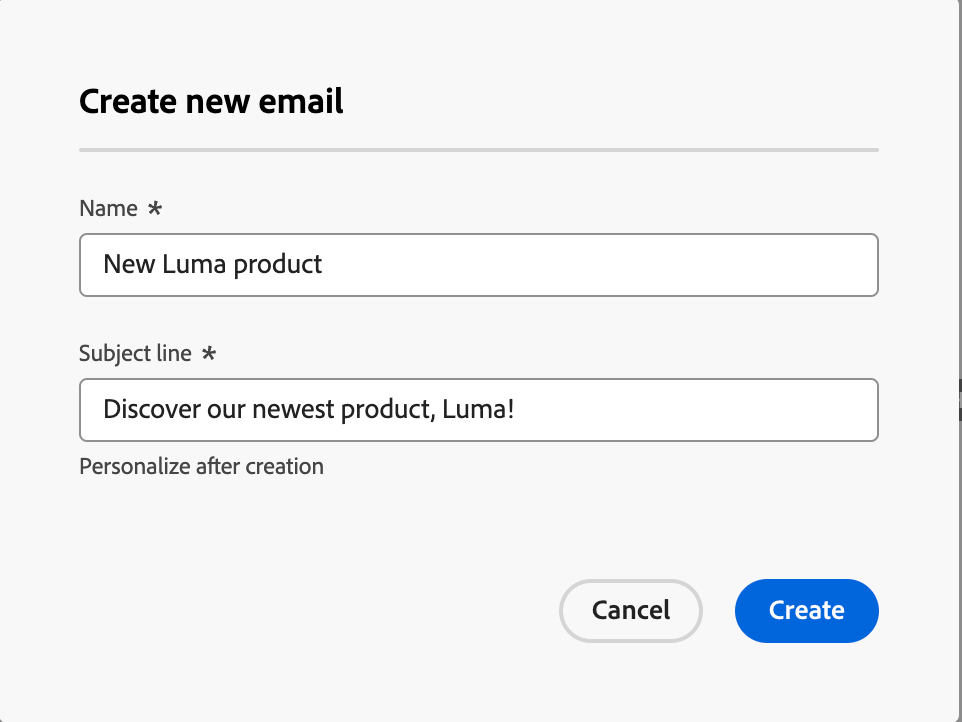

# Authoring di e-mail

Utilizza Adobe Journey Optimizer B2B Edition per inviare messaggi e-mail ai clienti. È possibile creare, personalizzare e visualizzare in anteprima i messaggi in E-mail designer.

## Aggiungere un’azione e-mail in un percorso di account

Puoi impostare le consegne e-mail in un Percorso di account quando aggiungi un nodo _[!UICONTROL Esegui un&#39;azione]_ ed effettua le seguenti operazioni:

1. Per l&#39;azione _[!UICONTROL sulla destinazione]_, scegliere **[!UICONTROL Persone]**.
1. Per _[!UICONTROL Azione sulle persone]_, scegli **[!UICONTROL Invia e-mail]**.
1. Per l&#39;_[!UICONTROL origine e-mail]_, scegli **[!UICONTROL Crea nuova e-mail]**.

   In alternativa, è possibile selezionare l&#39;opzione `Select email from Adobe Marketo Engage` per utilizzare una delle e-mail precreate nel Marketo Engage e inviarla come parte del Percorso di account.

   >[!NOTE]
   >
   >Se stai creando un’e-mail per la prima volta, assicurati che il canale e-mail sia configurato dall’interno di Adobe Marketo Engage. Per ulteriori informazioni, consulta [Assicurare il recapito messaggi e-mail](https://experienceleague.adobe.com/en/docs/marketo/using/getting-started/initial-setup/setup-steps#ensure-email-deliverability) nella documentazione del Marketo Engage.

   {width="700" zoomable="yes"}

1. Nella parte inferiore del pannello _[!UICONTROL Esegui un&#39;azione]_, fai clic su **[!UICONTROL Crea e-mail]**.

1. Nella finestra di dialogo, immetti un **[!UICONTROL Nome]** univoco per l&#39;e-mail e una **[!UICONTROL riga Oggetto]**.

   {width="400"}

1. Fai clic su **[!UICONTROL Crea]**.

   Nella sezione _[!UICONTROL Proprietà e-mail]_ della pagina del contenuto e-mail, i campi _[!UICONTROL Da e-mail]_ e _[!UICONTROL Rispondi all&#39;indirizzo]_ sono già configurati. È possibile immettere valori per i campi _[!UICONTROL Da nome]_ e _[!UICONTROL Descrizione]_ (facoltativo).

## Creare il contenuto dell’e-mail

Fai clic su **[!UICONTROL Aggiungi contenuto e-mail]** nella parte superiore del pannello di anteprima _[!UICONTROL E-mail]_.

{width="700" zoomable="yes"}

Questa azione avvia E-mail Designer, dove puoi scegliere come progettare il messaggio e-mail dalle seguenti opzioni:

* [Progetta il tuo indirizzo e-mail da zero](#design-your-email-from-scratch) utilizzando l&#39;interfaccia di E-mail Designer.

* [Importa contenuto HTML esistente](#import-existing-html-content) da un file o da una cartella .zip.

* [Selezionare un modello esistente](#select-a-template) da un elenco di modelli di posta elettronica predefiniti o personalizzati.

Per configurare e personalizzare l&#39;oggetto con l&#39;editor di espressioni, fare clic sull&#39;icona _Personalization_ e aggiungere i token di Marketo Engage.

Dopo aver creato e personalizzato il contenuto dell’e-mail, puoi esportarlo per la convalida o per un utilizzo successivo. Fai clic su **[!UICONTROL Esporta HTML]** per salvare il contenuto come file .zip che include i tuoi HTML e le tue risorse.

>[!TIP]
>
>Utilizza AI Assistant in Adobe Journey Optimizer B2B Edition, basato su IA generativa per elevare i contenuti al livello successivo. L’Assistente AI può aiutarti a ottimizzare l’impatto delle consegne generando e-mail intere, contenuto di testo mirato e ricevendo consigli dall’Assistente AI per le immagini che risuonano con il tuo pubblico. [Ulteriori informazioni](./ai-assistant-emails.md)

### Creare un messaggio e-mail da zero

1. Dalla home page di Designer, selezionare l&#39;opzione **[!UICONTROL Progetta da zero]**.

1. Per iniziare la progettazione del contenuto, trascina un elemento dalle **[!UICONTROL Strutture]** e rilascialo nell&#39;area di lavoro.

   Ripeti questo passaggio per ogni componente struttura per creare il layout del messaggio e-mail.

1. Aggiungi tutti gli elementi da _Strutture_ necessari e modifica le impostazioni per ciascuno nel riquadro a destra.

   Seleziona il componente colonna n:n per definire il numero di colonne desiderato (tra tre e 10). Puoi anche definire la larghezza di ciascuna colonna spostando le frecce sotto di essa.

   Le dimensioni di ogni colonna non possono essere inferiori al 10% della larghezza totale del componente struttura. È possibile rimuovere solo colonne vuote.

1. Espandi la sezione **[!UICONTROL Contents]** e aggiungi tutti gli elementi necessari in uno o più componenti della struttura.

1. Se necessario, puoi effettuare ulteriori personalizzazioni per ciascun componente nelle schede _[!UICONTROL Impostazioni]_ o _[!UICONTROL Stile]_.

   Ad esempio, puoi modificare lo stile del testo, la spaziatura interna o il margine di ciascun componente.

1. Dal selettore delle risorse, puoi selezionare direttamente le risorse memorizzate nella libreria Assets.

   Fai doppio clic sulla cartella che contiene le risorse. Trascina e rilascia gli elementi in un componente struttura.

1. Inserisci campi di personalizzazione per personalizzare il contenuto da attributi di profili, iscrizioni di pubblico, attributi contestuali e altro ancora.

1. Fai clic su **[!UICONTROL Abilita contenuto condizione]** per aggiungere contenuto dinamico e adattare il contenuto ai profili target in base alle regole condizionali.

1. Seleziona la scheda **[!UICONTROL Collegamenti]** dal riquadro a sinistra per visualizzare tutti gli URL del contenuto tracciati.

   Puoi modificare il Tipo di tracciamento o l’Etichetta e aggiungere i tag, se necessario.

Se necessario, puoi personalizzare ulteriormente la tua e-mail facendo clic su **[!UICONTROL Passa all&#39;editor di codice]** dal menu avanzato. L’editor di codice consente di modificare il codice sorgente dell’e-mail, ad esempio aggiungendo tag di tracciamento o HTML personalizzati.

>[!CAUTION]
>
>Dopo il passaggio all’editor di codice, non puoi tornare al designer visivo per questo messaggio e-mail.

Al termine, fai clic su **[!UICONTROL Simula contenuto]** in alto per verificare il rendering. È possibile scegliere la visualizzazione desktop o mobile.

Al termine, fai clic su Salva.

### Importa contenuto HTML esistente

Il contenuto importato può essere:

* Un file HTML con un foglio di stile incorporato
* Una cartella .zip che include un file HTML, il foglio di stile (.css) e i file immagine

>[!NOTE]
>
>La struttura del file .zip non è soggetta a vincoli. Tuttavia, i riferimenti devono essere relativi e adattarsi alla struttura ad albero della cartella .zip.

_Per importare un file contenente contenuto HTML:_

1. Dalla home page di E-mail Designer, seleziona **[!UICONTROL Importa HTML]**.

1. Trascina e rilascia il file HTML o .zip contenente il contenuto HTML e fai clic su [!UICONTROL Importa].

   Al termine del caricamento del contenuto di HTML, il contenuto si trova in _modalità di compatibilità_. In questa modalità, puoi solo personalizzare il testo, aggiungere collegamenti o includere risorse nel contenuto.

### Seleziona un modello

Puoi scegliere tra:

* Modelli di esempio. L’interfaccia di Journey Optimizer offre 20 modelli e-mail preconfigurati tra cui puoi scegliere.

* Modelli salvati.

* Un modello personalizzato creato da zero utilizzando il menu _Modelli_ oppure salvato da un&#39;e-mail in un percorso utilizzando l&#39;opzione _[!UICONTROL Salva come modello di contenuto]_.

_Per iniziare a creare il contenuto con uno dei modelli di esempio o salvati:_

1. Accedi a _Invia e-mail a Designer_ dall&#39;area di lavoro di modifica del contenuto e-mail.

   Nella pagina _[!UICONTROL Crea messaggio e-mail]_, la scheda **[!UICONTROL Modelli di esempio]** è selezionata per impostazione predefinita.

1. Per utilizzare un modello personalizzato, selezionare la scheda **[!UICONTROL Modelli salvati]**.

   Viene visualizzato l’elenco di tutti i modelli di contenuto creati nella sandbox corrente. Puoi ordinarli per nome, Ultima modifica o Ultima creazione.

1. Seleziona dall’elenco il modello desiderato.

1. Dopo aver selezionato una categoria, puoi spostarti tra tutti i modelli della categoria (campione o salvato a seconda della selezione) utilizzando le frecce destra e sinistra.

1. Fai clic su **[!UICONTROL Usa questo modello]** in alto a destra della pagina.

1. Modificare il contenuto in base alle esigenze in _E-mail Designer_.

## Verifica avvisi

Durante la progettazione del contenuto dei messaggi e-mail, gli avvisi vengono visualizzati nell’interfaccia (in alto a destra della pagina) quando mancano le impostazioni chiave.

Se non trovi questo pulsante, non sono stati rilevati problemi.

È possibile rilevare due tipi di avvisi:

* **_Avvisi_** che fanno riferimento a consigli e best practice, ad esempio:

   * `The opt-out link is not present in the email body`: è consigliabile aggiungere un collegamento di annullamento all&#39;abbonamento nel corpo dell&#39;e-mail.

     >[!NOTE]
     >
     >I messaggi e-mail in stile marketing devono includere un collegamento di rinuncia, che non è necessario per i messaggi transazionali.

   * `Text version of HTML is empty`: non dimenticare di definire una versione testuale del corpo dell&#39;e-mail, che viene utilizzata quando non è possibile visualizzare il contenuto di HTML.

   * `Empty link is present in email body`: verificare che tutti i collegamenti presenti nel messaggio di posta elettronica siano corretti.

   * `Email size has exceeded the limit of 100KB`: per una consegna ottimale, assicurati che la dimensione dell&#39;e-mail non superi i 100 KB.

* **_Errori_** che impediscono di testare o attivare il percorso o la campagna finché non vengono risolti, ad esempio:

   * `The subject line is missing`: l&#39;oggetto dell&#39;e-mail è obbligatorio.

   * `The email version of the message is empty`: questo errore viene visualizzato quando il contenuto dell&#39;e-mail non è stato configurato.

## Verifica e verifica l’e-mail

Una volta definito il contenuto del messaggio, puoi utilizzare i profili di test per visualizzarne l’anteprima, inviare bozze e controllarne il rendering nei client desktop, mobili e basati su Web più diffusi. Se hai inserito dei contenuti personalizzati, puoi visualizzare in anteprima come questi contenuti vengono visualizzati nel messaggio utilizzando i dati del profilo di test.

Per visualizzare in anteprima il contenuto dell&#39;e-mail, fai clic su **[!UICONTROL Simula contenuto]** e quindi aggiungi un profilo di test per verificare il messaggio utilizzando i dati del profilo di test.

{width="700" zoomable="yes"}
