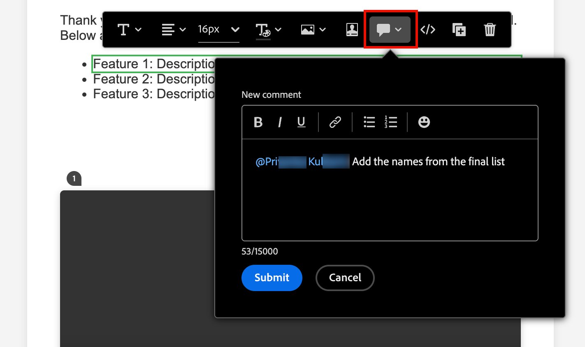
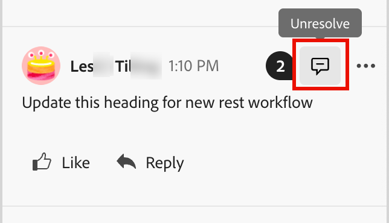

# Strumenti di collaborazione e-mail

Lo [spazio di progettazione e-mail](./email-authoring.md) include strumenti di collaborazione per la creazione di commenti e la risoluzione, in modo che i team di marketing possano esaminare, discutere e finalizzare le risorse e-mail direttamente in [!DNL Journey Optimizer B2B Edition]. Invece di condividere le bozze su strumenti esterni (come chat, thread e-mail o fogli di calcolo), gli utenti possono commentare, suggerire modifiche e risolvere feedback all’interno dell’area di progettazione delle e-mail. Utilizza questi strumenti per semplificare il flusso di lavoro, ridurre gli errori e garantire che le parti interessate siano allineate prima di lanciare la tua campagna e-mail all’interno di un percorso di account:

* **_Feedback centralizzato_**: raccogli e tieni traccia di tutti i feedback in un&#39;unica posizione.

* **_Revisioni più veloci_** - I collaboratori possono esaminare la copia e-mail e le risorse all&#39;interno dell&#39;ambiente di authoring.

* **_Maggiore precisione_** - Riduce il rischio di comunicazioni errate mantenendo tutte le modifiche collegate all&#39;e-mail stessa.

* **_Trasparenza_** - Tutti i commenti e le risoluzioni rimangono registrati, rendendo chiari i cambiamenti suggeriti e implementati.

* **_Collaboration nel contesto_** - Controlla la copia del corpo dell&#39;e-mail, le immagini e gli elementi call-to-action (CTA) all&#39;interno del layout.

<!-- Enable asynchronous collaboration between team members for an email asset
Allow users to attach comments to specific design elements
Provide a unified interface for viewing and managing all comments within a project
Support comment placement, editing, deleting, and navigation
Display visual indicators (badges) for elements with associated comments -->

## Abilitare gli strumenti di collaborazione e-mail per i revisori

Gli amministratori di prodotto possono abilitare l&#39;accesso agli strumenti di collaborazione e-mail assegnando l&#39;autorizzazione **[!UICONTROL Gestione e-mail B2B]** tramite l&#39;interfaccia utente _Autorizzazioni_ in Adobe Experience Cloud.

+++ Abilita autorizzazioni e-mail

1. Nell&#39;app Autorizzazioni, vai alla scheda **[!UICONTROL Ruoli]** e seleziona il [ruolo](https://experienceleague.adobe.com/it/docs/experience-platform/access-control/abac/permissions-ui/roles){target="_blank"} desiderato.

1. Fai clic su **[!UICONTROL Modifica]** per modificare le autorizzazioni.

1. Aggiungi la risorsa **[!UICONTROL B2B Assets]**, quindi seleziona **[!UICONTROL Gestisci e-mail B2B]**.

   {width="700" zoomable="yes"}

1. Fai clic su **[!UICONTROL Salva]** per applicare le modifiche.

   Le autorizzazioni vengono aggiornate automaticamente per tutti gli utenti già assegnati al ruolo.

1. Per assegnare questo ruolo a nuovi utenti, seleziona la scheda **[!UICONTROL Utenti]** nel dashboard _[!UICONTROL Ruoli]_ e fai clic su **[!UICONTROL Aggiungi utente]**.

   * Inserisci il nome utente e l’indirizzo e-mail oppure scegli un utente esistente dall’elenco.

     Se l&#39;utente non è ancora stato creato, consulta la [documentazione di Experience Platform](https://experienceleague.adobe.com/it/docs/experience-platform/access-control/abac/permissions-ui/users){target="_blank"}.

   * Fai clic su **[!UICONTROL Salva]** per applicare le modifiche.

+++

## Visualizzare strumenti di collaborazione e commenti

Durante la creazione, la modifica o la revisione del contenuto nell&#39;area di progettazione delle e-mail, puoi accedere al pannello _Collaboration_ per aggiungere o gestire commenti per il contenuto delle e-mail.

Fai clic sull&#39;icona _Collaboration_ (  ) nella navigazione a destra.

{width="700" zoomable="yes"}

## Flusso di lavoro di Collaboration

Puoi utilizzare gli strumenti di collaborazione per seguire un flusso di lavoro dei contenuti standard:

1. [Invita](#invite-collaborators-and-reviewers) i tuoi collaboratori e revisori.
1. Revisori [aggiungi commenti](#add-comments).
1. Leggi i commenti, [aggiungi risposte](#reply-to-a-comment) per discutere i commenti e apportare le modifiche necessarie.
1. I revisori o gli autori [risolvono i commenti](#resolve-comments).

>[!BEGINSHADEBOX]

**Best practice per l&#39;utilizzo degli strumenti di collaborazione**

* Utilizza l&#39;assegnazione tag `@` in modo che il feedback raggiunga rapidamente il membro del team corretto.

* Raggruppa i feedback correlati in un singolo thread di commenti invece di più note sparse.

* Risolvi sempre i commenti non appena vengono indirizzati, per mantenere un flusso di lavoro pulito.

* Salva una versione finale approvata a scopo di conformità/audit.

>[!ENDSHADEBOX]

### Invita collaboratori e revisori

1. Seleziona il corpo dell’e-mail.

1. Fai clic sull&#39;icona _Collaboration_ (  ) nella navigazione a destra.

1. Nella parte superiore del pannello a destra, inserisci il testo dell’invito agli utenti per collaborare e fornire feedback.

   Utilizza il simbolo `@` per indirizzare e avvisare gli utenti. Questi utenti ricevono notifiche e-mail e notifiche di impulsi interne al prodotto.

   Quando si immettono le prime lettere del nome dopo il simbolo, un elenco a comparsa visualizza i nomi utente corrispondenti. Puoi immettere più lettere nel nome per migliorare i risultati.

   {width="550"}

   Seleziona il nome da aggiungere per la notifica.

   Aggiungere tutti i collaboratori o revisori che si desidera includere nell&#39;invito.

   {width="700" zoomable="yes"}

1. Fai clic su **[!UICONTROL Invia]**.

### Aggiungi commenti

In qualità di collaboratore e-mail o di revisore, apri l’e-mail nello spazio di progettazione e aggiungi il tuo feedback. È possibile immettere un feedback generale nel pannello _Collaboration_ oppure selezionare i componenti nell&#39;area di lavoro e aggiungere un commento specifico per l&#39;elemento di progettazione. Assegna tag ai colleghi utilizzando `@`, ad esempio _@John Aggiorna la copia di CTA_.

Ogni nuovo commento avvia un thread in cui i collaboratori possono utilizzare _Reply_ per continuare la discussione. Ogni commento/thread associato a un elemento di progettazione viene numerato in modo da poter identificare facilmente l&#39;elemento in cui viene applicato.

#### Commenti generali e feedback

Nel pannello _Collaboration_, utilizza il campo di testo nella parte superiore per immettere un commento generale sul contenuto dell&#39;e-mail. Utilizza il simbolo `@` per indirizzare e avvisare gli utenti.

{width="400"}

Fai clic su **[!UICONTROL Invia]** per registrare il commento e inviare notifiche agli utenti taggati.

#### Commenti dei componenti

1. Seleziona una struttura o un componente di contenuto.

1. Nella barra degli strumenti fare clic sullo strumento _Collaboration_.

   {width="600"}

1. Immettere il commento nel campo di testo.

1. Fai clic su **[!UICONTROL Invia]**.

I collaboratori possono fare clic sull&#39;icona del pin numerato nell&#39;area di lavoro dell&#39;e-mail per visualizzare i commenti.

{width="450"}

#### Rispondi a un commento

Per ogni commento è possibile utilizzare la funzione _[!UICONTROL Rispondi]_ per continuare una discussione o rispondere a una domanda.

Fai clic su **[!UICONTROL Rispondi]** nella parte inferiore del commento e immetti il testo per la risposta. Per includere una citazione del commento corrente nella risposta, fare clic sull&#39;icona _Altro menu_ ( **...** ) e scegliere **[!UICONTROL Risposta preventivo]**.

{width="350"}

### Risolvi commenti

In qualità di autore o designer, valuta il feedback dei revisori e determina quali modifiche desideri apportare. Quando le modifiche sono state completate e la richiesta è stata soddisfatta, fare clic sull&#39;icona _Altro menu_ ( **...** ) e scegliere **[!UICONTROL Risolvi]**.

{width="350"}

Nella finestra di dialogo di conferma, fai clic su **[!UICONTROL Risolvi]**.

## Gestisci commenti

Gestisci i commenti e i thread per valutare lo stato della tua collaborazione.

### Inserisci un commento

Se un commento non è associato a un elemento nell&#39;area di lavoro e-mail, puoi _fissare_ il commento a un elemento in base alle esigenze. Fare clic sull&#39;icona _Altro menu_ ( **...** ) e scegliere **[!UICONTROL Inserisci commento]**. Quindi, seleziona il componente Progettazione nell’area di lavoro.

{width="350"}

### Rimuovere o eliminare commenti

Per pulire il registro dei commenti, rimuoverli ed eliminarli. Fai clic sull&#39;icona _Altro menu_ ( **...** ) e scegli **[!UICONTROL Rimuovi commento]** o **[!UICONTROL Elimina]**.

{width="350"}

* Quando si rimuove un commento, questo viene separato dall&#39;elemento di progettazione (selezionato al momento della creazione del commento). Il commento fa ancora parte del record del commento per l’e-mail.

* Quando si elimina un commento, questo viene eliminato definitivamente dal record.

### Commenti risolti

Per impostazione predefinita, i commenti risolti sono nascosti nel pannello _Collaboration_. È possibile visualizzare i commenti risolti in qualsiasi momento cancellando il filtro. Fai clic sull&#39;icona _Filtro_ (  ) e deseleziona la casella di controllo **[!UICONTROL Nascondi commenti risolti]**.

{width="350"}

I commenti risolti includono l&#39;icona _Non risolvere_ (  ). Se si stabilisce che un commento o un thread non è stato risolto e sono necessarie ulteriori modifiche, fare clic sull&#39;icona per rimuovere la designazione _[!UICONTROL Risolto]_.

{width="300"}
