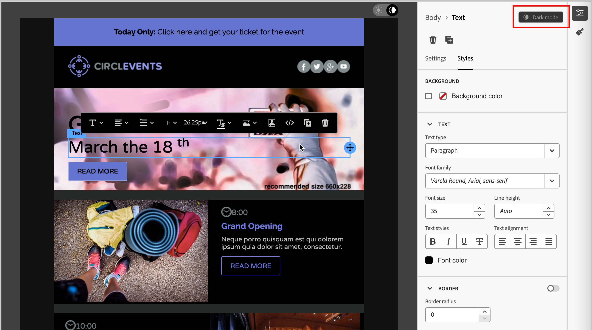

# Modalità scura per il contenuto delle e-mail {#dark-mode}

>[!CONTEXTUALHELP]
>id="ajo-b2b_dark_mode"
>title="Passare alla modalità scura"
>abstract="Passa alla modalità scura per visualizzare in anteprima il rendering e definire impostazioni personalizzate specifiche.  Il rendering finale dipende dal client di posta elettronica del destinatario. Tutti i client e-mail non supportano la modalità scura personalizzata."

>[!CONTEXTUALHELP]
>id="ajo-b2b_dark_mode_preview"
>title="Passare alla modalità scura"
>abstract="Passare alla modalità scura per visualizzare in anteprima il rendering nei client e-mail che la supportano.  Il rendering finale dipende dal client di posta elettronica del destinatario. Tutti i client e-mail non supportano la modalità scura."

_Modalità scura_ consente a un client e-mail o a un&#39;app di supporto di visualizzare e-mail con sfondi più scuri e colori più chiari per testo, pulsanti e altri elementi visivi. Questo tipo di display può ridurre l&#39;affaticamento degli occhi, ridurre la durata della batteria e migliorare la leggibilità in ambienti scarsamente illuminati, per un&#39;esperienza di visualizzazione più confortevole. In quanto tendenza in crescita tra i principali sistemi operativi e app, ora è un elemento importante nella progettazione di e-mail moderne per garantire che il contenuto rimanga leggibile e visivamente attraente per tutti gli utenti.

{width="50%"}

Quando [crei il contenuto delle e-mail](./email-authoring.md) nello spazio di progettazione visiva [!DNL Journey Optimizer B2B Edition], puoi passare alla visualizzazione _**[!UICONTROL modalità scura]**_. In questa visualizzazione, puoi anche definire impostazioni personalizzate specifiche per il supporto dei client e-mail quando è abilitata la modalità scura.

## Considerazioni sul client e-mail

Esiste una varianza significativa nel modo in cui i diversi client e-mail e le diverse app applicano la modalità scura. Per questo motivo, è necessario considerare con cautela le aspettative relative al rendering in modalità scura. Prima di utilizzare la modalità scura nell’area di progettazione delle e-mail, considera i seguenti casi di utilizzo del client e-mail:
<!--
* Check out the list of [email clients supporting dark mode](https://www.caniemail.com/search/?s=dark){target="_blank"}

* Learn more on Dark mode in this [Litmus blog post](https://www.litmus.com/blog/the-ultimate-guide-to-dark-mode-for-email-marketers){target="_blank"}
-->

+++Client che non supportano la modalità scura

Alcuni client di posta elettronica non supportano affatto questa funzione, ad esempio:

* [!DNL Yahoo! Mail]
* [!DNL AOL]

Se definisci le impostazioni personalizzate della modalità scura nella progettazione delle e-mail, questi client e-mail non possono visualizzare alcun rendering in modalità scura. <!--Regardless of whether the interface is in light or dark mode, your email will render the same.-->

+++

+++Client che applicano la propria modalità scura {#default-support}

Alcuni client di posta elettronica applicano sistematicamente la propria modalità scura predefinita a tutte le e-mail ricevute. Regolano automaticamente colori, sfondi, immagini e altri elementi in base alle impostazioni della modalità scura e alle impostazioni esterne. Questi clienti includono:

* Gmail (Posta sul desktop, iOS, Android™, Posta sul Web mobile)
* Windows di Outlook
* Outlook Windows Mail

<!--It is important to note that less than 25% of email clients offer customization options for dark mode. Clients such as Gmail implement their own dark mode rendering, which is not subject to external modification.-->
In questo caso, le impostazioni della modalità scura client sovrascriveranno le impostazioni della modalità scura personalizzata definite in [!DNL Journey Optimizer B2B Edition]

+++

+++Client che supportano la modalità scura personalizzata

Molti dei client di posta elettronica più popolari offrono l&#39;opzione di eseguire il rendering della modalità scura personalizzata con la query `@media (prefers-color-scheme: dark)`, che è il metodo utilizzato dagli stili di posta elettronica [!DNL Journey Optimizer B2B Edition]. Questo elenco di client include:

* Apple Mail macOS
* Apple Mail iOS
* Outlook macOS
* Outlook.com
* IOS di Outlook
* Android di Outlook™

In questo caso, viene eseguito il rendering delle impostazioni specifiche definite in [!DNL Journey Optimizer B2B Edition]. Tuttavia, potrebbero essere applicate alcune restrizioni in base a ciascun client e-mail. Ad esempio, alcuni client (come Apple Mail 16 (macOS 13)) non generano la modalità scura se le immagini sono presenti nel contenuto dell’e-mail.

Per risultati ottimali, verifica il contenuto con i client e-mail di destinazione. Per visualizzare una simulazione che si avvicina il più possibile al risultato finale per ogni client, utilizzare l&#39;integrazione del rendering del test e-mail [Litmus](./email-test-rendering.md) nello spazio di progettazione e-mail.

+++

## Design per modalità scura

Quando si applica uno stile al contenuto delle e-mail per la modalità scura in [!DNL Journey Optimizer B2B Edition], lo spazio di progettazione visiva offre due tipi di strumenti:

* Utilizza la funzione [anteprima](#preview-default-dark-mode) per rivedere il rendering predefinito in modalità scura per la maggior parte dei client e-mail che supportano.

* Se desideri ignorare le impostazioni predefinite di supporto dei client e-mail, definisci e applica impostazioni personalizzate della modalità scura al contenuto delle e-mail. [Ulteriori informazioni](#define-custom-dark-mode)

### Anteprima modalità scura predefinita {#preview-dark-mode}

<!-- Should work with templates and themes, NOT for LP and fragments - but TBC with eng. 
>[!NOTE]
>
>Currently you may not be able to switch to dark mode if you select an [email template](use-email-templates.md) or if you apply a [theme](apply-email-themes.md).-->

1. Apri il contenuto dell’e-mail nello spazio di progettazione e-mail.

   In alto a destra nell’area di lavoro, è presente un selettore luce-buio che attiva la visualizzazione del contenuto tra la modalità chiara (predefinita) e scura.

   {width="700" zoomable="yes"}

1. Cambia il selettore in _modalità scura_ (  ).

   L’area di lavoro visualizza il contenuto utilizzando l’anteprima in modalità scura predefinita.x

   Per impostazione predefinita, l&#39;anteprima in modalità scura applica la combinazione di colori `full color invert` a tutti gli elementi ad eccezione di immagini e icone. Questa combinazione di colori rileva le aree con elementi chiari e scuri e le inverte. Gli sfondi chiari diventano scuri e il testo scuro diventa chiaro, gli sfondi scuri diventano chiari e il testo chiaro diventa scuro.

   {width="700" zoomable="yes"}

>[!CAUTION]
>
>Il rendering finale può variare a seconda del client e-mail del destinatario. Per visualizzare una simulazione che si avvicina il più possibile al risultato finale per ogni client di posta elettronica, utilizzare l&#39;integrazione [Rendering e-mail test Litmus](./email-test-rendering.md).

### Definire le impostazioni personalizzate della modalità scura {#custom-dark-mode}

>[!CONTEXTUALHELP]
>id="ajo-b2b_dark_mode_image"
>title="Utilizzare un’immagine specifica per la modalità scura"
>abstract="È possibile selezionare un&#39;altra immagine da visualizzare quando è attiva la modalità scura.  L&#39;aggiunta di un&#39;immagine specifica per la modalità scura non garantisce il corretto rendering in tutti i client di posta elettronica. Tutti i client e-mail non supportano la modalità scura personalizzata."

Dopo il passaggio alla modalità scura, puoi scegliere di modificare elementi di stile specifici del contenuto che vengono visualizzati solo quando la modalità scura è abilitata nel client e-mail del destinatario (purché supporti tale funzione).

>[!NOTE]
>
>Il rendering finale in modalità scura dipende da ciascun client e-mail, pertanto i risultati possono variare da un client all’altro. Rivedi le [considerazioni sul client e-mail](#email-client-considerations) per ulteriori informazioni.

Lo stile modalità scura personalizzato nello spazio di progettazione e-mail utilizza <!-- `@media (prefers-color-scheme: dark)` method--> Query CSS `@media (prefers-color-scheme: dark)` che rileva se il client di posta elettronica è impostato sulla modalità scura e applica la struttura a tema scuro definita nell&#39;e-mail.

_Per definire le impostazioni personalizzate della modalità scura :_

1. Se necessario, sposta il selettore in _modalità scura_ (  ) in alto a destra nell&#39;area di progettazione.

1. Modificare gli attributi dei colori di stile, ad esempio testo, sfondi o pulsanti.

   {width="700" zoomable="yes"}

1. Per le immagini e le icone, definisci risorse specifiche solo per la modalità scura.

   Non è possibile modificare i colori delle immagini e delle icone, ma è possibile definire risorse alternative da utilizzare per la modalità scura. È possibile sperimentare diverse combinazioni di colori per le icone o apportare regolazioni per il colore e la saturazione delle immagini fotografiche.

   {width="80%"}

   Seleziona un&#39;immagine e passa alla **[!UICONTROL modalità scura]** utilizzando l&#39;interruttore dedicato nel riquadro **[!UICONTROL Impostazioni]**. Quindi, seleziona un’altra risorsa immagine.

   {width="700" zoomable="yes"}

   Per ulteriori informazioni sulla selezione di una risorsa immagine, consulta [Aggiungi risorse immagine](./email-authoring.md#add-image-assets).

1. In qualsiasi momento durante le modifiche alla progettazione, seleziona **[!UICONTROL Passa alla visualizzazione attiva]** per verificare come il contenuto potrebbe essere riprodotto su dispositivi di varie dimensioni.

   Da questa visualizzazione, modifica il selettore in _modalità scura_ (  ) per visualizzare in anteprima la versione in modalità scura dei contenuti tra i diversi dispositivi.

   {width="800" zoomable="yes"}

   >[!CAUTION]
   >
   >La visualizzazione live è un’anteprima generica progettata per confrontare l’aspetto del rendering tra le varie dimensioni dei dispositivi. Il rendering finale può variare a seconda del client e-mail del destinatario.

1. Al termine della modifica della modalità scura, fare clic su **[!UICONTROL Simula contenuto]**.

   {width="700" zoomable="yes"}

   Utilizza gli strumenti di anteprima e verifica per testare la progettazione delle e-mail. Per ulteriori informazioni, consulta [Anteprima e verifica del contenuto delle e-mail](./email-simulate-content.md).

1. Se disponi di un account Litmus Enterprise, seleziona **[!UICONTROL Rendering e-mail]** per visualizzare il rendering finale in modalità scura per vari client e-mail in Litmus.

   Per ulteriori informazioni, vedi [Test del rendering di e-mail con Litmus](./email-test-rendering.md).

   >[!CAUTION]
   >
   >Anche se la simulazione si avvicina molto al modo in cui le e-mail vengono visualizzate in modalità scura, il rendering effettivo potrebbe variare a causa delle variazioni nei provider di servizi e-mail o nelle impostazioni a livello di dispositivo.

## Best practice {#best-practices}

Poiché l&#39;adozione della modalità scura aumenta tra i principali client e-mail, è essenziale considerare il rendering delle e-mail in ambienti chiari e scuri, indipendentemente dal fatto che si utilizzi la [modalità scura personalizzata](#define-custom-dark-mode) o meno.

La modalità scura può alterare i colori, gli sfondi e le immagini, a volte ignorando le scelte di progettazione. Per garantire coerenza visiva, accessibilità e integrità del brand, segui queste best practice:

| Esercitazione |            |
| -------- | ---------- |
| Ottimizzazione di immagini e loghi | Elenco di controllo:<ul><li>Salvare logo e icone come file PNG con sfondi trasparenti per evitare la presenza di caselle bianche visibili in modalità scura. <li>Evitare le immagini con sfondi bianchi o chiari codificati. <li>Se la trasparenza non è un&#39;opzione, posizionate le immagini su uno sfondo a tinta unita nel progetto per evitare scomode inversioni di colore. |
| Guarda i tuoi sfondi | Elenco di controllo:<ul><li>Assicurati un contrasto sufficiente tra il testo e i colori di sfondo per garantire leggibilità sia nelle modalità chiara che in quelle scure. <li>Evita di utilizzare solo i colori di sfondo per i contenuti critici. Alcuni client ignorano i colori di sfondo in modalità scura, quindi assicurati che le informazioni chiave siano ancora visibili. |
| Progettare contenuti accessibili in modalità scura | Elenco di controllo:<ul><li>Utilizza combinazioni di colori facili da distinguere per le persone con daltonismo. <li>Utilizza una palette di mezzitoni per garantire il contrasto sia contro gli sfondi chiari che scuri. <li>Utilizza combinazioni di colori accessibili con contrasto elevato per migliorare la leggibilità e soddisfare gli standard [!DNL Web Content Accessibility Guidelines (WCAG)]. Utilizza strumenti come [!DNL WebAIM Contrast Checker] per verificare il contrasto dei colori. <li>Evita i font sottili in quanto possono influire sulla leggibilità. Se il tuo marchio richiede un font sottile, grassetto in modalità scura. <li>Salta il bianco puro sul nero puro, che può causare affaticamento degli occhi e potrebbe essere invertito automaticamente in alcuni client e-mail. <li>Se la modalità scura non è supportata, fornisci uno stile di fallback accessibile. |
| Verifica le e-mail in un ambiente in modalità scura | Elenco di controllo:<ul><li>Utilizza l&#39;[anteprima in modalità scura](#preview-dark-mode) nello spazio di progettazione delle e-mail, che utilizza combinazioni di colori invertite per individuare i problemi in anticipo. <li>Utilizza un account Litmus Enterprise con l&#39;opzione [[!UICONTROL Rendering e-mail]](./email-test-rendering.md) per simulare le progettazioni tra i principali client e-mail (ad esempio Apple Mail, Gmail e Outlook) e vedere come si comportano i colori e le immagini in modalità scura. |

<!--KEEP dark mode accessibility best practices IN ONE SINGLE LOCATION - for now listed on this page.
If needed, it can be moved to the Design accessible content page:
The best practices for designing accesible content in dark mode are listed in [this section](accessible-content.md#dark-mode).-->

<!--**Inline critical styles**

Inline CSS helps maintain more control over styling, as some clients strip external styles in dark mode.-->
