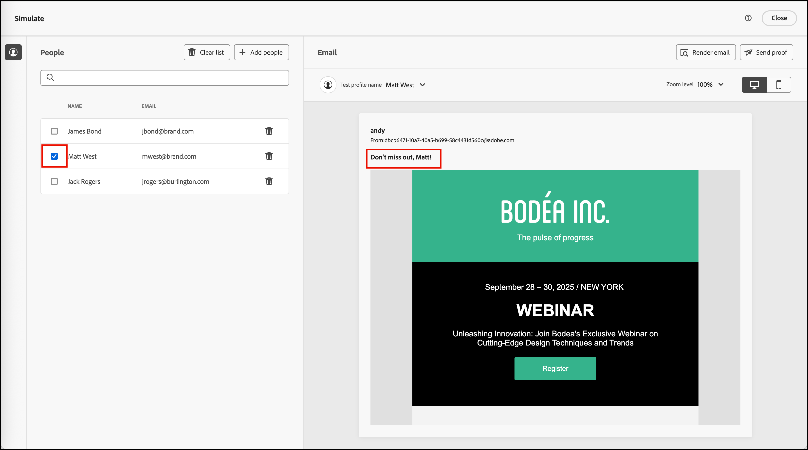
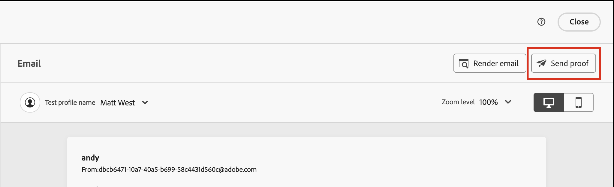
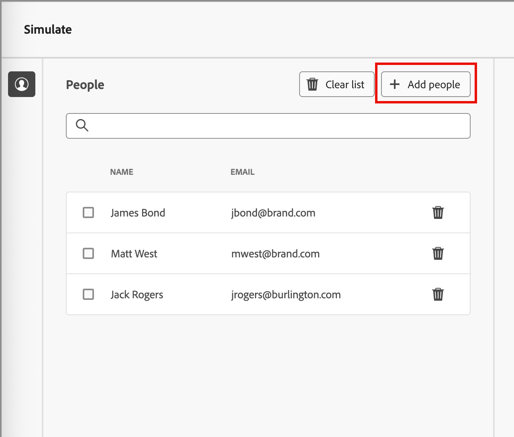
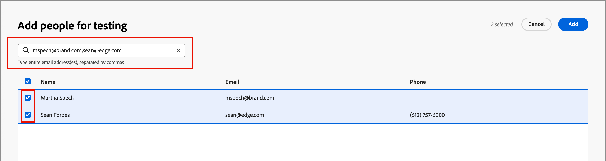

# Anteprima e test del contenuto dell’e-mail {#preview-simulate}

>[!CONTEXTUALHELP]
>id="ajo-b2b_email_preview_simulate"
>title="Controllare come viene eseguito il rendering del contenuto"
>abstract="Una volta definito il contenuto, puoi visualizzarne l’anteprima e verificare se viene riprodotto correttamente per il canale in uso."

Utilizza la funzione _Simula contenuto_ per visualizzare in anteprima il contenuto dell&#39;e-mail e inviare le consegne di prova a destinatari specifici. Per accedere alle funzionalità di anteprima e test, è necessario definire i campi e-mail obbligatori, tra cui _[!UICONTROL Nome mittente]_, _[!UICONTROL Indirizzo mittente]_, _[!UICONTROL Indirizzo destinatario risposta]_ e _[!UICONTROL Riga oggetto]_.

>[!IMPORTANT]
>
>Non puoi visualizzare l’anteprima del messaggio e-mail in presenza di errori. Controlla _Avvisi_ per assicurarti che non ci siano errori che bloccano le funzioni di anteprima. Gli avvisi non bloccano l’anteprima, ma è necessario indirizzarli prima di pubblicare il percorso che attiva la consegna e-mail.

## Visualizzare l’anteprima e-mail

Puoi accedere all&#39;anteprima del rendering dallo [spazio di progettazione e-mail](./email-authoring.md) o dal _[!UICONTROL Riepilogo]_ quando [apri un&#39;e-mail dall&#39;elenco e-mail](./emails-list.md#edit-emails).

1. Fai clic su **[!UICONTROL Simula contenuto]** in alto.

   {width="800" zoomable="yes"}

   >[!NOTE]
   >
   >Questo pulsante non è disponibile in caso di errori o se per l’e-mail non sono stati definiti campi obbligatori.

1. Nella pagina _[!UICONTROL Simula]_, seleziona un profilo persona nell&#39;elenco **[!UICONTROL Persone]** da utilizzare per il rendering dell&#39;e-mail.

   Nell’anteprima del contenuto, gli elementi personalizzati vengono compilati in base al profilo della persona selezionato.

   {width="800" zoomable="yes"}

   Se l&#39;elenco _[!UICONTROL Persone]_ a sinistra è vuoto, [aggiungi persone](#add-people-to-the-profiles-list) utilizzando i contatti dell&#39;istanza di Marketo Engage connessa.

   >[!TIP]
   >
   >È inoltre possibile utilizzare l&#39;[Integrazione rendering test Litmus](./email-test-rendering.md) per controllare il rendering dei messaggi di posta elettronica nei client desktop, mobili e basati su Web più diffusi.

## Regolare le opzioni di visualizzazione

Utilizza gli strumenti di visualizzazione per modificare l’anteprima in base al tipo di dispositivo o al livello di zoom:

* Seleziona l&#39;icona _Desktop_ (  ) per visualizzare l&#39;anteprima utilizzando lo stile del desktop e le proporzioni.
* Seleziona l&#39;icona _Mobile_ (  ) per visualizzare l&#39;anteprima utilizzando lo stile e le proporzioni del dispositivo mobile.
* Fare clic sulla freccia _Livello di zoom_ e selezionare una percentuale di zoom per verificare come cambia il contenuto in base al livello di zoom.

{width="600" zoomable="yes"}

## Inviare bozze

Una bozza è un messaggio di test consegnato che consente a te e ai membri del gruppo di rivedere un messaggio e-mail prima di inviarlo ai membri di un pubblico. I destinatari della bozza possono controllare il rendering, il contenuto, le impostazioni di personalizzazione e la configurazione dei messaggi. Puoi inviare bozze utilizzando un profilo di test selezionato.

1. Fai clic su **[!UICONTROL Invia bozza]** in alto a destra.

   {width="500"}

1. Nella pagina _Invia bozza_ immettere l&#39;indirizzo di posta elettronica del primo destinatario.

1. Per ogni destinatario aggiuntivo che si desidera includere nella revisione, fare clic su **[!UICONTROL Aggiungi destinatario]** e immettere il relativo indirizzo di posta elettronica nel campo **[!UICONTROL Invia a]**.

   Puoi aggiungere fino a dieci destinatari per la consegna della bozza.

1. Per ogni destinatario, imposta il campo **[!UICONTROL Simula come]** selezionando un profilo di test da utilizzare per personalizzare il contenuto del messaggio.

   {width="700" zoomable="yes"}

1. Fai clic su **[!UICONTROL Invia bozza]**.

## Aggiungere persone all’elenco dei profili

1. Nella parte superiore dell&#39;elenco _[!UICONTROL Persone]_ fare clic su **[!UICONTROL Aggiungi persone]**.

   {width="500"}

1. Nella finestra di dialogo _[!UICONTROL Aggiungi persone per il test]_, immetti l&#39;indirizzo e-mail completo del contatto.

   Per aggiungere più contatti, immettere più indirizzi separati da una virgola.

1. Seleziona la casella di controllo per ogni contatto corrispondente che desideri aggiungere all’elenco dei profili di test.

   {width="700" zoomable="yes"}

1. Fai clic su **[!UICONTROL Aggiungi]** in alto a destra.
