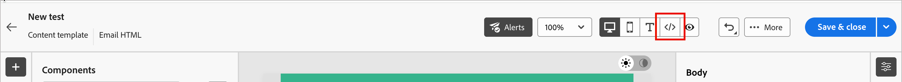

# Modalità HTML avanzata per la progettazione di modelli e-mail

_La modalità HTML avanzata_ fornisce una visualizzazione che consente agli utenti esperti di visualizzare e modificare direttamente il codice sorgente non elaborato per il contenuto del modello e-mail. Questa modalità è ideale quando si desidera inserire espressioni sofisticate, come la logica condizionale, direttamente nella sorgente. È utile anche per apportare regolazioni strutturali che vadano oltre ciò che gli strumenti di progettazione visiva espongono.

<!-- We don't have the code editor at this point 
>[!NOTE]
>
>_Advanced HTML mode_ is different from the code editor option that is available when you start a new design. The code editor does not allow you to change to the visual design space. With _advanced HTML mode_, you can toggle back and forth between the HTML source view and the visual design view at any time. -->

>[!AVAILABILITY]
>
>Questa funzionalità è attualmente disponibile in _Disponibilità limitata_ e non è disponibile per tutti gli utenti.

## Limitazioni importanti

Prima di utilizzare la modalità HTML avanzata per l&#39;authoring dei modelli di posta elettronica , accertati di comprendere le seguenti limitazioni:

* **Nessuna convalida** - L&#39;editor di HTML non esegue la verifica della sintassi o del layout. Rivedi attentamente il codice prima di salvarlo.

* **Aggiornamenti del contenuto** — le future modifiche del sistema potrebbero influire sulle modifiche apportate al markup predefinito in modalità avanzata di HTML o sovrascriverle. Controlla il contenuto dopo gli aggiornamenti del prodotto per assicurarti che venga riprodotto come previsto.

* **Supporto limitato** — Adobe non è in grado di risolvere i problemi di rendering o gli errori di contenuto derivanti da modifiche al codice personalizzato apportate in modalità HTML avanzata.

* **Limitazioni per l&#39;anteprima** — La simulazione del contenuto (anteprima con profili) è disponibile solo nella visualizzazione desktop e non direttamente nella visualizzazione origine di HTML.

### Accedere alla modalità avanzata di HTML

La modalità HTML avanzata è accessibile dalla barra degli strumenti nella parte superiore dello spazio di progettazione visiva quando nell’area di lavoro è caricato un modello e-mail.

1. Aprire o [creare un modello di posta elettronica](./email-templates.md#create-an-email-template) e aprire lo spazio di progettazione per modificare il contenuto.

1. Nello spazio di progettazione fare clic sull&#39;icona _[!UICONTROL HTML]_ (  ) nella barra degli strumenti.

   {width="750" zoomable="yes"}

   Se è la prima volta che apri la modalità avanzata di HTML (o se è trascorso un mese o più), viene visualizzato un messaggio di avviso. Rivedi le informazioni e fai clic su **[!UICONTROL OK]** per continuare.

   {width="500"}

   L’area di lavoro di progettazione passa alla vista sorgente HTML non elaborata.

1. Rivedi il codice e aggiungi le modifiche desiderate al contenuto dell’e-mail.

   In _modalità HTML avanzata_, puoi accedere direttamente all&#39;origine HTML completa del contenuto del modello e-mail:

   * Visualizzare e modificare qualsiasi parte del markup HTML non elaborato.
   * Inserisci [espressioni di personalizzazione avanzate](./personalization.md) direttamente nell&#39;origine.
   * Aggiungi la logica [del contenuto condizionale](./conditional-content.md) utilizzando la sintassi dell&#39;espressione.
   * Aggiungere attributi HTML personalizzati, tag di tracciamento o altri tag non disponibili tramite i controlli dell&#39;editor visivo.

   {width="800" zoomable="yes"}

   >[!IMPORTANT]
   >
   >Assicurati di immettere il codice HTML e CSS corretto; Adobe non fornisce la convalida della sintassi o il supporto per il codice personalizzato.

   La simulazione e il salvataggio dei contenuti non sono disponibili in modalità HTML avanzata per motivi di compatibilità. Puoi tornare alla vista desktop per visualizzare in anteprima il contenuto e salvare il modello. Tutte le modifiche apportate vengono mantenute quando si passa dalla vista origine di HTML alla vista progettazione visiva.

   Se fai clic su **[!UICONTROL Salva]** o **[!UICONTROL Salva e chiudi]** in alto a destra mentre sei in modalità HTML avanzata, viene visualizzata una finestra di avviso che informa che devi uscire dalla modalità HTML avanzata prima di salvare il modello e uscire dallo spazio di progettazione.

   {width="500"}

1. Fai clic sull&#39;icona _[!UICONTROL Desktop]_ (  ) nella barra degli strumenti per passare dalla modalità avanzata di HTML (visualizzazione origine di HTML) all&#39;area di lavoro di progettazione visiva.

   Le modifiche apportate vengono mantenute quando si passa da una visualizzazione all&#39;altra.
