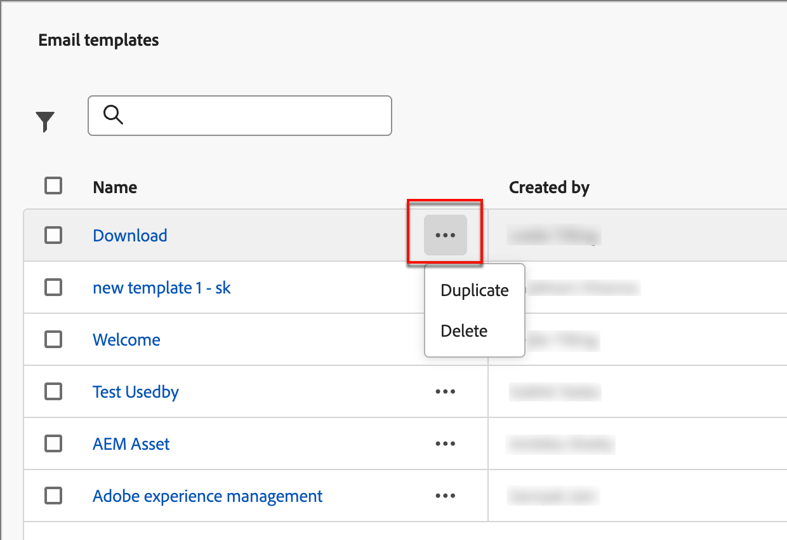

# Modelli e-mail

Per una progettazione più rapida e migliorata, puoi creare modelli e-mail autonomi per riutilizzare contenuti personalizzati in percorsi di account Adobe Journey Optimizer B2B Edition. Tramite i modelli, i membri del gruppo orientati al contenuto possono lavorare sul contenuto delle e-mail al di fuori dei percorsi. Gli esperti di marketing possono quindi riutilizzare e adattare questi modelli autonomi all’interno dei loro percorsi di account. Ad esempio, un membro del team è responsabile solo del contenuto, senza accesso ai percorsi di account. Tuttavia, possono creare un modello e-mail che gli esperti di marketing possono selezionare come punto di partenza per le comunicazioni e-mail e personalizzarlo in base ai requisiti del percorso.

## Accedere e gestire i modelli e-mail

Per accedere ai modelli e-mail nell&#39;edizione B2B di Adobe Journey Optimizer, vai alla navigazione a sinistra e fai clic su **[!UICONTROL Gestione contenuto]** > **[!UICONTROL Modelli]**. Questa azione apre una pagina di elenco con tutti i modelli e-mail creati nell’istanza elencata in una tabella.

La tabella è ordinata in base alla colonna _[!UICONTROL Modificato]_. Per impostazione predefinita, i modelli aggiornati più di recente sono elencati per primi. Fai clic sul titolo della colonna per passare da crescente a decrescente.

Per cercare un modello per nome, immettere una stringa di testo nella barra di ricerca. Fai clic sull&#39;icona _Filtro_ in alto a sinistra per filtrare l&#39;elenco in base alle date di creazione o modifica e ai modelli creati o modificati.

{width="700" zoomable="yes"}

Personalizzare le colonne da visualizzare nella tabella facendo clic sull&#39;icona _Personalizza tabella_ in alto a destra. Selezionare le colonne da visualizzare e fare clic su **[!UICONTROL Applica]**.

Dalla pagina dell&#39;elenco è possibile eseguire le azioni descritte nelle sezioni seguenti.

## Creare modelli e-mail

Puoi creare un nuovo modello di e-mail dalla pagina di elenco dei modelli di e-mail facendo clic su **[!UICONTROL Crea modello]** in alto a destra.

1. Nella finestra di dialogo, immetti un **[!UICONTROL Nome]** e una **[!UICONTROL Descrizione]** utili (facoltativi).

   {width="400"}

1. Imposta l&#39;**[!UICONTROL origine immagine]** iniziale.

   Se disponi di una sottoscrizione per Experience Manager Assets insieme all’as a Cloud Service Adobe Marketo Engage Design Studio, puoi scegliere le risorse immagine da entrambe le origini. A questo scopo, seleziona l’origine dell’immagine al momento della creazione per un modello e-mail o un frammento visivo. Tuttavia, puoi anche selezionare l’origine dell’immagine quando modifichi il contenuto.

   Per ulteriori informazioni sulle origini immagini, vedere [Assets](./assets-overview.md).

1. Fai clic su **[!UICONTROL Crea]**.

Viene visualizzata la pagina _[!UICONTROL Progetta modello]_ contenente più opzioni per la creazione del modello: _[!UICONTROL Progetta da zero]_, _[!UICONTROL Importa HTML]_ o _[!UICONTROL Seleziona modello struttura]_.

{width="800" zoomable="yes"}

### Creare da zero

Utilizza l’editor di contenuto visivo per definire la struttura del contenuto dell’e-mail. Aggiungendo e spostando componenti strutturali con semplici azioni di trascinamento della selezione, puoi progettare la forma del contenuto dell’e-mail riutilizzabile in pochi secondi.

>[!NOTE]
>
>Gli strumenti di progettazione disponibili equivalgono agli strumenti utilizzati per la creazione di [e-mail](./email-authoring.md). La differenza è che questo contenuto viene quindi salvato come modello che può essere riutilizzato su più nodi e-mail di invio all’interno di percorsi di account.

1. Dalla home page di _[!UICONTROL Progetta modello]_, seleziona l&#39;opzione **[!UICONTROL Progetta da zero]**.

1. [Aggiungi struttura e contenuto](#add-structure-and-content) al modello.

### Importa HTML

Adobe Journey Optimizer B2B Edition consente di importare contenuti HTML esistenti per progettare modelli e-mail.

{{$include /help/_includes/content-design-import.md}}

{width="500"}

>[!NOTE]
>
>L&#39;utilizzo di un tag `<table>` come primo livello in un file HTML può causare la perdita di stile, incluse le impostazioni di sfondo e larghezza nel tag del livello superiore.

Puoi personalizzare il contenuto importato in base alle esigenze con gli strumenti dell’editor e-mail visivo.

### Seleziona un modello struttura

{{$include /help/_includes/content-design-select-template.md}}

## Aggiungere struttura e contenuto {#structure-content}

>[!CONTEXTUALHELP]
>id="ajo-b2b_structure_components_template"
>title="Aggiungere i componenti Struttura"
>abstract="I componenti della struttura definiscono il layout del modello. Per iniziare a progettare il contenuto del modello, trascina un componente **Struttura** nell’area di lavoro."

>[!CONTEXTUALHELP]
>id="ajo-b2b_content_components_template"
>title="Informazioni sui componenti per contenuti"
>abstract="I componenti di contenuto sono segnaposto di contenuto vuoti che possono essere utilizzati per creare il layout di un modello."

{{$include /help/_includes/content-design-components.md}}

### Aggiungi frammenti

Nell&#39;editor del contenuto visivo, l&#39;icona _Frammenti_ è visualizzata a sinistra. L’esempio seguente illustra i passaggi per aggiungere frammenti al contenuto del modello.

1. Per aprire l&#39;elenco dei frammenti, fare clic sull&#39;icona _Frammenti_.

   Puoi eseguire le seguenti operazioni:

   * Ordina l’inserzione.
   * Sfoglia, Cerca o filtra l’inserzione.
   * Consente di passare dalla visualizzazione Anteprima alla visualizzazione Elenco.
   * Aggiorna l’elenco per riflettere eventuali frammenti creati di recente.

   {width="700" zoomable="yes"}

1. Trascina uno dei frammenti nel segnaposto del componente strutturale.

   L’editor esegue il rendering del frammento all’interno della sezione/elemento della struttura e-mail.

Il contenuto del frammento viene aggiornato dinamicamente all’interno della struttura per mostrare come appare il contenuto nell’e-mail.

>[!TIP]
>
>Se desideri aggiungere il frammento in modo che occupi l’intero layout orizzontale all’interno dell’e-mail, aggiungi una struttura di colonne 1:1 e quindi trascina e rilascia il frammento all’interno di esso.

Dopo il salvataggio, l&#39;e-mail viene visualizzata nella pagina dei dettagli del frammento quando si seleziona la scheda _[!UICONTROL Usato da]_ nel riepilogo. I frammenti aggiunti a un modello e-mail non sono modificabili all’interno del modello, in quanto il contenuto è definito dal frammento di origine.

### Aggiungere risorse

{{$include /help/_includes/content-design-assets.md}}

### Spostarsi tra livelli, impostazioni e stili

{{$include /help/_includes/content-design-navigation.md}}

### Personalizzare il contenuto

{{$include /help/_includes/content-design-personalization.md}}

### Modifica tracciamento URL collegato

{{$include /help/_includes/content-design-links.md}}

### Opzioni di visualizzazione

Sfrutta le opzioni di convalida di visualizzazione e contenuto disponibili nell’editor e-mail visivo.

* Zoom in/out del contenuto tra le opzioni di zoom predefinite.

* Cambia la visualizzazione del contenuto tra desktop, dispositivi mobili o solo testo/solo testo.
   * Fai clic sull&#39;icona _Occhio_ per visualizzare l&#39;anteprima del contenuto tra i dispositivi.
   * Seleziona uno dei dispositivi predefiniti o immetti dimensioni personalizzate per visualizzare in anteprima il contenuto.

### Altre opzioni

Dal selettore _Altre opzioni_ nell&#39;editor di contenuto visivo, è possibile eseguire le azioni seguenti:

{width="500"}

* **Ripristina modello** - Fare clic su questa opzione per cancellare l&#39;area di lavoro di progettazione e-mail visiva in un&#39;area di lavoro vuota e riavviare la creazione del contenuto.
* **Salva come frammento** - Salva tutto o parte del frammento come frammento da riutilizzare in più e-mail o modelli di e-mail. Fornisci un nome e una descrizione per i frammenti e li inserisci nell’elenco dei frammenti disponibili.
* **Modifica la progettazione** - Torna alla pagina _Progetta modello_. Da qui puoi intraprendere qualsiasi azione come descritto nella sezione &quot;Creare modelli e-mail&quot;.
* **Esporta HTML** - Scarica il contenuto nell&#39;area di lavoro visiva nel sistema locale in formato HTML compresso come file zip.

## Visualizza dettagli modello e-mail

Nella pagina di elenco Modelli, fai clic sul nome di un modello e-mail per aprire la pagina dei dettagli del modello e-mail. Da qui puoi visualizzare le proprietà di base del modello e-mail e accedere all’editor del contenuto visivo per apportare modifiche al contenuto del modello.

{width="700" zoomable="yes"}

* Visualizza i dettagli del modello e-mail, ad esempio nome e descrizione. Queste impostazioni possono essere modificate. Fare clic all&#39;esterno della casella della descrizione per salvare automaticamente le modifiche.

* Visualizza le proprietà del modello e-mail, ad esempio creato da, creato in data, aggiornato da ultimo in data e modificato da.

* Fai clic su **[!UICONTROL Altro]** in alto a destra per eseguire azioni rapide sul modello e-mail, ad esempio _Duplica_ e _Elimina_.

* Se sono presenti avvisi attivi (errori e avvisi per il modello e-mail), fai clic su **[!UICONTROL Avvisi]** in alto a destra per visualizzare le informazioni.

  Anche se questi avvisi non vietano l’utilizzo del modello e-mail per la creazione di e-mail, forniscono visibilità agli esperti di marketing del team su ciò che potrebbe non funzionare e sugli aggiornamenti richiesti prima che possano essere utilizzati per la consegna.

## Visualizza modello e-mail utilizzato da riferimenti

Nella pagina dei dettagli dei modelli e-mail, fai clic sulla scheda **[!UICONTROL Usato da]** per visualizzare i dettagli di dove questo modello e-mail viene utilizzato nelle e-mail tra percorsi di account.

{width="400"}

Le e-mail in Journey Optimizer B2B Edition sono incorporate e create all’interno di percorsi, pertanto il percorso principale dell’e-mail che utilizza il modello viene visualizzato in riferimenti.

* Fai clic sul collegamento per passare all’e-mail del percorso corrispondente in cui viene utilizzato il modello e-mail.

* Uscire dalla visualizzazione in qualsiasi momento facendo clic sulla freccia Indietro, che consente di tornare alla pagina dell&#39;elenco.

## Modifica modelli e-mail

Questa azione può essere intrapresa da:

* La pagina dei dettagli - Fai clic su **[!UICONTROL Modifica modello e-mail]**.
* Pagina dell&#39;elenco - Fai clic sui puntini di sospensione (**...**) accanto a un modello di e-mail e scegli **[!UICONTROL Modifica]**.

Questa azione ti porta alla pagina _Progetta il modello_ o alla pagina dell&#39;editor di contenuti visivi in base all&#39;ultimo stato salvato del modello e-mail. Da qui puoi modificare il contenuto del modello e-mail in base alle esigenze. Per informazioni sulle opzioni di modifica, consulta [Creare modelli e-mail](#create-email-templates).

## Modelli e-mail duplicati

Puoi duplicare un modello e-mail utilizzando uno dei seguenti metodi:

* Dai dettagli del modello e-mail a destra, espandi **[!UICONTROL Altro]** e fai clic su **[!UICONTROL Duplica]**.

  {width="400"}

* Dalla pagina di elenco dei _modelli di posta elettronica_, fai clic sui puntini di sospensione (...) accanto al modello e scegli **[!UICONTROL Duplica]**.

Nella finestra di dialogo, inserisci un nome utile (univoco) e una descrizione. Fai clic su **[!UICONTROL Duplica]** per completare l&#39;azione.

Il (nuovo) modello e-mail duplicato viene quindi visualizzato nell&#39;elenco _Modelli e-mail_.

## Elimina modelli e-mail

Una rimozione del modello e-mail non può essere annullata, pertanto controlla prima di avviare un’azione di eliminazione. Puoi eliminare un modello e-mail utilizzando uno dei seguenti metodi:

* Dai dettagli del modello a destra, espandi **[!UICONTROL Altro]** e fai clic su **[!UICONTROL Elimina]**.
* Dalla pagina di elenco dei _modelli di posta elettronica_, fai clic sui puntini di sospensione (...) accanto al modello e scegli **[!UICONTROL Elimina]**.

  {width="500"}

Questa azione apre una finestra di dialogo di conferma. È possibile interrompere il processo facendo clic su **[!UICONTROL Annulla]** oppure su **[!UICONTROL Elimina]** per confermare la rimozione.

## Eseguire azioni in blocco

Dalla pagina di elenco dei modelli e-mail, seleziona più modelli alla volta selezionando le caselle di controllo a sinistra. Quando selezioni più modelli, nella parte inferiore viene visualizzato un banner.

{width="600"}

**[!UICONTROL Elimina]** - È possibile eliminare fino a un massimo di 20 modelli alla volta. Una finestra di dialogo di conferma consente di interrompere l’azione o confermare la rimozione dei modelli.

## Authoring di un’e-mail da un modello salvato

Dalla schermata _Crea e-mail_, utilizza la sezione _Seleziona modello struttura_ per iniziare a creare il contenuto da un modello.

Per iniziare a creare i contenuti con uno dei modelli e-mail creati, procedi come segue:

1. Accedi al Designer di posta elettronica dalla pagina _Modifica contenuto_.

   Nella pagina _Crea messaggio e-mail_, la scheda _Modelli di esempio_ è selezionata per impostazione predefinita.

1. Per utilizzare un modello e-mail personalizzato, seleziona la scheda **[!UICONTROL Modelli salvati]**.

   In questa scheda viene visualizzato un elenco di tutti i modelli e-mail creati nella sandbox. Puoi ordinarli _Per nome_, _Ultima modifica_ e _Ultima creazione_.

1. Seleziona dall’elenco il modello desiderato.

   Dopo la selezione, viene visualizzata un&#39;anteprima del modello. In modalità anteprima puoi spostarti tra tutti i modelli di una categoria (campione o salvato, a seconda della selezione) utilizzando le frecce destra e sinistra.

1. Fai clic su **[!UICONTROL Usa questo modello]** in alto a destra.

1. Dalla finestra di progettazione del contenuto visivo, modifica il contenuto in base alle esigenze.
