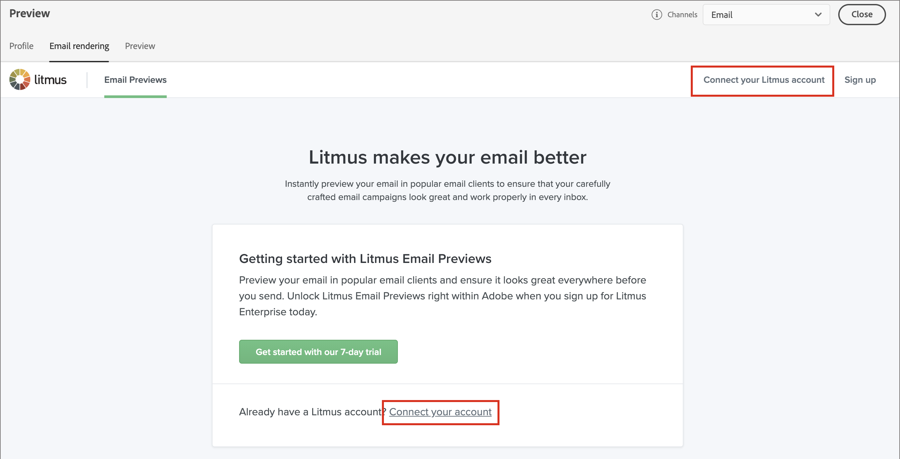
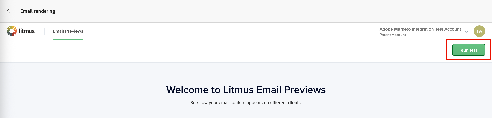
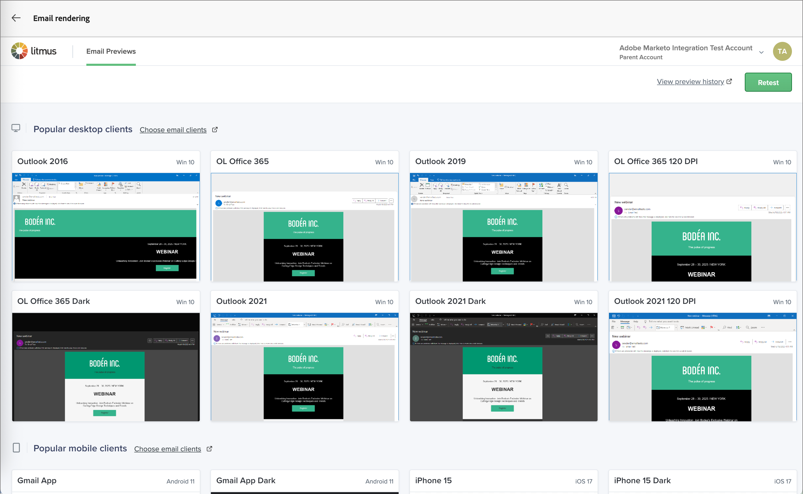

# Test del rendering di e-mail con Litmus

Per verificare le e-mail, puoi sfruttare un account [Litmus](https://www.litmus.com/email-testing){target="_blank"} in Journey Optimizer B2B edition. Con questa integrazione, puoi visualizzare in anteprima il rendering delle e-mail nei client e-mail più diffusi. Questo strumento ti aiuta a garantire che il contenuto delle e-mail si presenti in modo ottimale e funzioni come previsto in ogni casella in entrata.

1. Quando la progettazione delle e-mail è completa e pronta per essere testata, fai clic su **[!UICONTROL Simula contenuto]** nell&#39;area di progettazione delle e-mail.

1. Fai clic su **[!UICONTROL Rendering e-mail]** in alto a destra.

   {width="700" zoomable="yes"}

   Se non hai ancora effettuato la connessione all’account Litmus da Journey Optimizer B2B edition, la pagina visualizzata offre un’opzione per avviare un account di prova o per connettersi all’account esistente.

1. Fai clic su **[!UICONTROL Connetti il tuo account Litmus]** in alto a destra oppure utilizza il collegamento all&#39;interno della pagina.

   {width="700" zoomable="yes"}

1. Immetti le credenziali del tuo account Litmus e fai clic su **[!UICONTROL Accedi]**.

1. Fai clic su **[!UICONTROL Connetti]** per confermare la connessione tra Litmus e Journey Optimizer B2B edition e inviare il contenuto dell&#39;e-mail per il rendering.

   >[!IMPORTANT]
   >
   >Quando connetti il tuo account Litmus con Journey Optimizer B2B edition, accetti che i messaggi di prova vengano inviati a Litmus. Questo contenuto viene quindi gestito all’interno di Litmus e non in Adobe. Di conseguenza, i criteri e-mail di conservazione dei dati di Litmus si applicano a tali e-mail, inclusi i dati di personalizzazione che possono essere inclusi nei messaggi di test.

1. Fai clic su **[!UICONTROL Esegui test]** in alto a destra per generare anteprime e-mail.

   {width="700" zoomable="yes"}

1. Controlla i contenuti delle e-mail nei client desktop, mobili e basati su Web più diffusi.

   Fai clic sulla miniatura visualizzata per visualizzare i dettagli di qualsiasi test client sottoposto a rendering.

   {width="700" zoomable="yes"}

1. Al termine della revisione, fare clic sulla freccia indietro (  ) in alto a sinistra per tornare alla pagina Simula contenuto.

   Puoi selezionare un altro profilo ed eseguire un altro test di rendering, oppure tornare allo spazio di progettazione delle e-mail per apportare le modifiche necessarie in base alla revisione.
