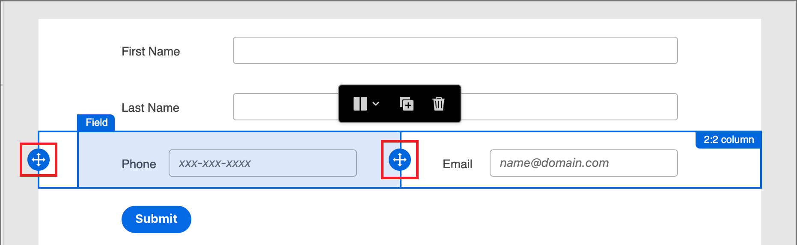
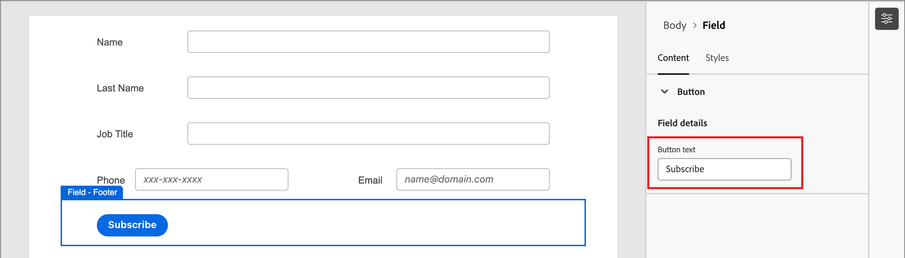
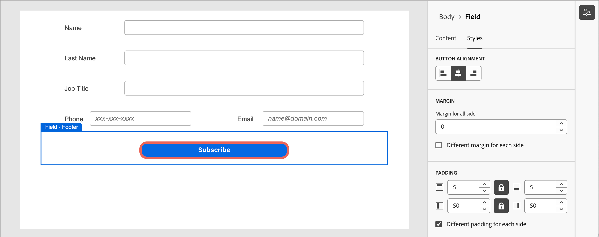

# Progettazione del modulo

Dopo aver [creato un modulo](./forms.md#create-forms), lo spazio di progettazione visiva apre una bozza con una definizione di modulo di base predefinita. Nel pannello _[!UICONTROL Riepilogo]_ a destra, fai clic su **[!UICONTROL Modifica modulo]** e utilizza lo spazio di progettazione visiva per definire lo stile del modulo e i componenti campo.

{width="700" zoomable="yes"}

## Campi

I campi modulo vengono utilizzati per acquisire i dati del profilo della persona che possono essere utilizzati per eseguire il targeting delle persone e associarle ad account e gruppi di acquisto. Tutti i nuovi moduli iniziano con i campi seguenti in un layout a colonna singola:

* Nome
* Cognome
* Indirizzo e-mail

Utilizza gli strumenti di progettazione dei campi per creare il set di campi e il layout necessari per raccogliere i dati necessari per le attività di marketing basate sull’account.

### Aggiungi un campo {#add-field}

1. Nel pannello _[!UICONTROL Componenti]_ a sinistra, trascina il componente di contenuto **[!UICONTROL Campo]** e rilascialo nell&#39;area di lavoro.

   {width="700" zoomable="yes"}

1. Fare clic su **[!UICONTROL Seleziona attributo campo]**.

1. Nella finestra di dialogo _[!UICONTROL Seleziona attributo campo]_, seleziona la casella di controllo per l&#39;attributo profilo persona che desideri utilizzare per il campo e fai clic su **[!UICONTROL Seleziona]**.

   Gli [schemi aziendali XDM](../data/field-mapping.md#xdm-business-person-attributes) determinano gli attributi disponibili.  Sono inoltre disponibili eventuali campi personalizzati definiti per l’istanza di Journey Optimizer B2B edition. Utilizzare la casella di testo Cerca per filtrare l&#39;elenco in base al nome oppure fare clic sull&#39;icona Filtro per filtrare l&#39;elenco in base allo schema o al tipo di dati.

   {width="700" zoomable="yes"}

   Nell’area di lavoro, l’etichetta del campo predefinito per l’attributo selezionato viene compilata nell’area di lavoro. I **[!UICONTROL Dettagli campo]** sono visualizzati nel pannello a destra.

1. Se necessario, modificare il testo **[!UICONTROL Label]**.

   Il testo viene visualizzato accanto al campo nel modulo. Il testo predefinito viene compilato dall’attributo del campo.

1. Imposta **[!UICONTROL Tipo di campo]** in base al tipo di dati per il campo:

   | Tipo di campo | Utilizzo | Esempio |
   | ---------- | ----- | ------- |
   | **[!UICONTROL Casella di controllo]** | Utilizza questo tipo in modo che i visitatori possano selezionare un valore _true_ (selezionato) o _false_ (non selezionato). | |
   | **[!UICONTROL Gruppo di caselle di controllo]** | Utilizza questo tipo in modo che i visitatori possano selezionare un valore _true_ (selezionato) o _false_ (non selezionato) per più elementi. | |
   | **[!UICONTROL Valuta]** | Utilizzare questo tipo per consentire un campo float che rappresenta il tipo di valuta predefinito selezionato per l&#39;istanza di Journey Optimizer B2B edition. | |
   | **[!UICONTROL Data]** | Utilizzare questo tipo per limitare l&#39;immissione a un formato data e fornire un selettore calendario nel campo. | |
   | **[!UICONTROL Doppio]** |  | |
   | **[!UICONTROL E-mail]** | Utilizzare questo tipo per limitare l&#39;immissione a un formato di indirizzo e-mail. | |
   | **[!UICONTROL Numero]** | Utilizzare questo tipo per limitare il campo a un valore numerico. | |
   | **[!UICONTROL Gruppo pulsanti di scelta]** | Usa questo tipo per consentire ai visitatori di selezionare una delle opzioni disponibili. | |
   | **[!UICONTROL Seleziona]** | Utilizza questo tipo per consentire ai visitatori di selezionare una delle opzioni disponibili in un elenco a discesa. | |
   | **[!UICONTROL Cursore]** | Usa questo tipo per consentire ai visitatori di impostare un valore numerico utilizzando un cursore. | |
   | **[!UICONTROL Telefono]** | Utilizzare questo tipo per un campo di immissione numeri telefonici. | |
   | **[!UICONTROL Testo]** | Utilizzare questo tipo per un campo di immissione testo standard (stringa). | |
   | **[!UICONTROL Area testo]** | Utilizzare questo tipo per supportare l&#39;immissione di testo più lunga. | |
   | **[!UICONTROL URL]** | Utilizzare questo tipo per limitare l&#39;immissione di testo a un URL, incluso il protocollo URL standard. | |

1. A seconda del tipo di campo selezionato, impostare le altre opzioni per l&#39;immissione e la convalida del campo:

   {width="400" zoomable="yes"}

   * **[!UICONTROL Segnaposto]**: il valore segnaposto per il campo che fornisce al visitatore un esempio di ciò che è previsto per il campo.

   * **[!UICONTROL Istruzioni]** - Testo istruttivo che aiuta il visitatore a completare il campo. Immetti il testo da visualizzare come _testo al passaggio del mouse_ per il campo.

     >[!TIP]
     >
     >_Istruzioni e testo segnaposto_ 
     >
     >Utilizza queste due proprietà per guidare i visitatori nella compilazione del campo. Quando si passa il puntatore del mouse sul campo, il testo delle istruzioni viene visualizzato come testo di descrizione comando o testo a comparsa. Il testo segnaposto viene visualizzato _inattivo_ all&#39;interno del campo e scompare quando il visitatore inserisce il testo nel campo. È possibile utilizzare entrambi i metodi o solo uno.

   * **[!UICONTROL Valore predefinito]** - Utilizzare questa opzione per specificare un valore predefinito per il campo.

   * **[!UICONTROL Messaggio di convalida]** - Utilizzare questa opzione per specificare un messaggio di convalida per il campo. Questo messaggio viene visualizzato se il visitatore immette un valore non valido per il campo. Il messaggio _[!UICONTROL Standard]_ è impostato per impostazione predefinita. Scegli **[!UICONTROL Personalizzato]** e immetti il tuo messaggio.

   * **Lunghezza massima** - Immettere il numero massimo di caratteri che è possibile immettere nel campo.

1. Imposta **[!UICONTROL Comportamenti campo]** in base alle esigenze:

   * **Obbligatorio** - Selezionare la casella di controllo per rendere obbligatorio l&#39;input del campo per l&#39;invio del modulo.

   * **Abilita maschera di input** - Selezionare la casella di controllo per limitare l&#39;input del visitatore utilizzando una maschera di input. Ad esempio, potrebbe essere utile che i visitatori immettano i numeri di telefono in un formato specifico. Nella finestra di dialogo, immetti la maschera utilizzando `9` per qualsiasi numero, `a` per qualsiasi lettera e `*` per entrambe. Fare clic su Salva per attivare la maschera di input specificata.

     {width="500" zoomable="yes"}

### Modificare lo stile dei campi {#field-styling}

Seleziona la scheda **[!UICONTROL Stili]** nel pannello di destra per modificare lo stile del campo selezionato.

* **[!UICONTROL Sfondo]** - Selezionare la casella di controllo per applicare un colore di sfondo al campo. Il bianco è il colore predefinito. Fare clic sul quadrato **[!UICONTROL Colore di sfondo]** per aprire il selettore colore popup e scegliere un colore per lo sfondo del campo.

  {width="600" zoomable="yes"}

* **[!UICONTROL Etichetta]** - Lo stile dell&#39;etichetta controlla le caratteristiche visive del testo visualizzato accanto al campo. Scegli una visualizzazione dell’etichetta superiore o laterale relativa al campo. È possibile impostare la dimensione del carattere, l&#39;altezza della linea, lo stile e l&#39;allineamento del testo. Fare clic sul quadrato **[!UICONTROL Colore carattere]** per aprire il selettore colore popup e scegliere un colore per il testo dell&#39;etichetta.

  {width="600" zoomable="yes"}

* **[!UICONTROL Bordo]** - Fare clic sul quadrato **[!UICONTROL Colore bordo]** per aprire il selettore colore popup e scegliere un colore per il bordo. È possibile definire un bordo per il campo, inclusi il colore e lo spessore della linea. Deselezionare la casella di controllo per rimuovere il bordo del campo visualizzato. È inoltre possibile modificare le impostazioni relative alla dimensione del bordo (larghezza in pixel), allo stile e al raggio degli angoli.

  {width="600" zoomable="yes"}

* **[!UICONTROL Dimensione]** - Selezionare un&#39;impostazione di dimensione per determinare la larghezza di visualizzazione del campo. Scegliere _[!UICONTROL Larghezza intera]_, _[!UICONTROL Larghezza dimezzata]_ o _[!UICONTROL Automatica]_.

* **[!UICONTROL Margine]** - Imposta i margini (in pixel) intorno al campo. È possibile impostare lo stesso margine su tutti e quattro i lati oppure selezionare la casella di controllo **[!UICONTROL Margine diverso per ciascun lato]** per impostare separatamente i margini orizzontale e verticale.

* **[!UICONTROL Spaziatura interna]** - Imposta spaziatura interna (in pixel) intorno al campo. È possibile impostare lo stesso margine su tutti e quattro i lati oppure selezionare la casella di controllo **[!UICONTROL Spaziatura interna diversa per ciascun lato]** per impostare i margini orizzontale e verticale separatamente.

  {width="600" zoomable="yes"}

### Riordina campi {#field-reorder}

Puoi spostare i campi modulo direttamente nell’area di lavoro visiva. Fai clic sullo strumento _Sposta_ sul bordo destro del campo selezionato e trascinalo in una nuova posizione.

Aggiungi componenti strutturali al modulo e sposta i campi in colonne per raggrupparli e modificare il layout. Fai clic sullo strumento _Sposta_ sul bordo sinistro del componente colonna selezionato e trascinalo in una nuova posizione all&#39;interno del modulo.

{width="500"}

### Eliminare o duplicare un campo {#field-delete-duplicate}

Fai clic sull&#39;icona _Elimina_ (  ) nella barra degli strumenti o nel pannello di destra per eliminare un campo selezionato. Nella finestra di dialogo di conferma, fai clic su **[!UICONTROL Elimina]**.

Fai clic sull&#39;icona _Duplica_ (  ) nella barra degli strumenti o nel pannello di destra per duplicare un campo selezionato. Il nuovo campo viene visualizzato immediatamente sotto il campo originale. Fare clic su **[!UICONTROL Seleziona attributo campo]** per impostare l&#39;attributo per il campo. Imposta il tipo di campo, i dettagli e gli stili in base alle esigenze.

{width="600" zoomable="yes"}

## Pulsante Invia

Per impostazione predefinita, il pulsante Invia (campo piè di pagina) fa parte del modulo e non può essere rimosso. Selezionate il componente pulsante/piè di pagina nel modulo per modificare il testo e lo stile del pulsante.

### Modificare il contenuto del pulsante {#button-content}

Nella scheda _[!UICONTROL Contenuto]_ visualizzata nel pannello di destra, modifica il testo nel campo **[!UICONTROL Testo pulsante]**. Il ridimensionamento del pulsante viene regolato in base alla lunghezza del testo.

{width="600" zoomable="yes"}

### Personalizzare lo stile del pulsante Invia {#button-styles}

Seleziona la scheda **[!UICONTROL Stili]** nel pannello di destra per modificare lo stile del componente pulsante/piè di pagina selezionato.

* **[!UICONTROL Sfondo]** - Selezionare la casella di controllo per applicare un colore di sfondo al pulsante. Blu è il colore predefinito. Fare clic sul quadrato **[!UICONTROL Colore di sfondo]** per aprire il selettore colore popup e scegliere un colore per lo sfondo del pulsante.

  {width="600" zoomable="yes"}

* **[!UICONTROL Etichetta]** - Lo stile dell&#39;etichetta controlla le caratteristiche visive del testo all&#39;interno del pulsante. È possibile impostare la dimensione del carattere, l&#39;altezza della linea, lo stile e l&#39;allineamento del testo. Fare clic sul quadrato **[!UICONTROL Colore carattere]** per aprire il selettore colore popup e scegliere un colore per il testo dell&#39;etichetta.

* **[!UICONTROL Bordo]** - Fare clic sul quadrato **[!UICONTROL Colore bordo]** per aprire il selettore colore popup e scegliere un colore per il bordo. È possibile definire un bordo per il pulsante, inclusi il colore e lo spessore della linea. Deselezionare la casella di controllo per rimuovere il bordo del pulsante visualizzato. È inoltre possibile modificare le dimensioni del bordo (larghezza in pixel), lo stile e l&#39;impostazione del raggio per gli angoli arrotondati.

* **[!UICONTROL Dimensioni]** - Selezionare un&#39;impostazione di dimensione per determinare la larghezza di visualizzazione del pulsante. Scegliere _[!UICONTROL Larghezza intera]_, _[!UICONTROL Larghezza dimezzata]_ o _[!UICONTROL Automatica]_. La spaziatura viene regolata in base alle impostazioni di dimensione e allineamento.

  {width="600" zoomable="yes"}

* **[!UICONTROL Allineamento pulsante]** - Quando si sceglie una dimensione di _Metà larghezza_ o _Automatico_ per il pulsante, impostare l&#39;allineamento a sinistra, a destra o al centro. La spaziatura viene regolata in base alle impostazioni di dimensione e allineamento.

* **[!UICONTROL Margine]** - Imposta i margini (in pixel) intorno al campo. È possibile impostare lo stesso margine su tutti e quattro i lati oppure selezionare la casella di controllo **[!UICONTROL Margine diverso per ciascun lato]** per impostare separatamente i margini orizzontale e verticale.

* **[!UICONTROL Spaziatura interna]** - Imposta spaziatura interna (in pixel) intorno al campo. È possibile impostare lo stesso margine su tutti e quattro i lati oppure selezionare la casella di controllo **[!UICONTROL Spaziatura interna diversa per ciascun lato]** per impostare i margini orizzontale e verticale separatamente. La spaziatura viene regolata se si modificano le impostazioni di dimensione e allineamento.

  {width="600" zoomable="yes"}

## Stile modulo {#form-styling}

È possibile modificare gli stili dell&#39;area del modulo quando si fa clic all&#39;esterno dei componenti strutturali o del modulo. I componenti del modulo (campi e pulsante) ereditano gli stili _Corpo_ definiti negli stili di livello superiore, a meno che non siano definiti altri stili a livello di campo o di pulsante/piè di pagina.

{width="600" zoomable="yes"}

### Stili CSS

Nei nuovi moduli viene utilizzato il CSS predefinito per lo stile. Se desideri modificare gli stili modificando il CSS, puoi copiarlo e quindi utilizzarlo per definire un CSS personalizzato per il modulo.

_Per definire un CSS personalizzato per il modulo :_

1. Fai clic su **[!UICONTROL Visualizza CSS]** nel pannello di destra per rivedere il codice CSS.

   {width="450" zoomable="yes"}

1. Seleziona il codice CSS nella finestra di scorrimento e copialo negli Appunti.

1. Fai clic su **[!UICONTROL Chiudi]**.

1. (Facoltativo) Incolla il codice copiato nello strumento CSS preferito e modifica il CSS in base allo stile desiderato.

1. Fai clic su **[!UICONTROL Aggiungi CSS personalizzato]** nel pannello di destra.

1. Incolla il codice CSS nella finestra.

   {width="450" zoomable="yes"}

   Potete modificare il testo incollato in questa finestra.

1. Fai clic su **[!UICONTROL Salva]**.

### Stile manuale

Modificate le impostazioni nel pannello di destra per definire la visualizzazione per l&#39;intero modulo.

* **[!UICONTROL Colore di sfondo]** - Selezionare la casella di controllo per applicare un colore di sfondo attorno all&#39;area del modulo. Il bianco è il colore predefinito. Fare clic sul quadrato del colore per aprire il selettore colore popup e scegliere un colore per lo sfondo del modulo.

* **[!UICONTROL Sfondo del riquadro di visualizzazione]** - Selezionare la casella di controllo per applicare un colore di sfondo a tutti i componenti del modulo. L&#39;impostazione predefinita è nessun colore (eredita dallo sfondo esterno). Fate clic sul quadrato del colore per aprire il selettore colore popup e scegliete un colore per i componenti strutturali del modulo.

  {width="600" zoomable="yes"}

* **[!UICONTROL Testo]** - Scegliere una **[!UICONTROL Famiglia di caratteri]** per il modulo, che influisce sulle etichette, sui suggerimenti e sul testo segnaposto per i campi modulo. Influisce anche sul testo predefinito del pulsante Invia.

* **[!UICONTROL Dimensioni]** - Modifica le dimensioni (larghezza) del modulo in pixel.

* **[!UICONTROL Margine]** - Imposta i margini (in pixel) intorno ai componenti del modulo. È possibile impostare lo stesso margine su tutti e quattro i lati oppure selezionare la casella di controllo **[!UICONTROL Margine diverso per ciascun lato]** per impostare separatamente i margini orizzontale e verticale.

  {width="600" zoomable="yes"}
