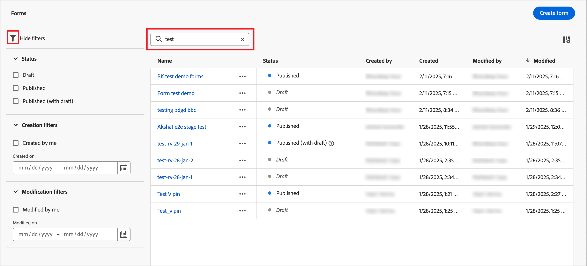
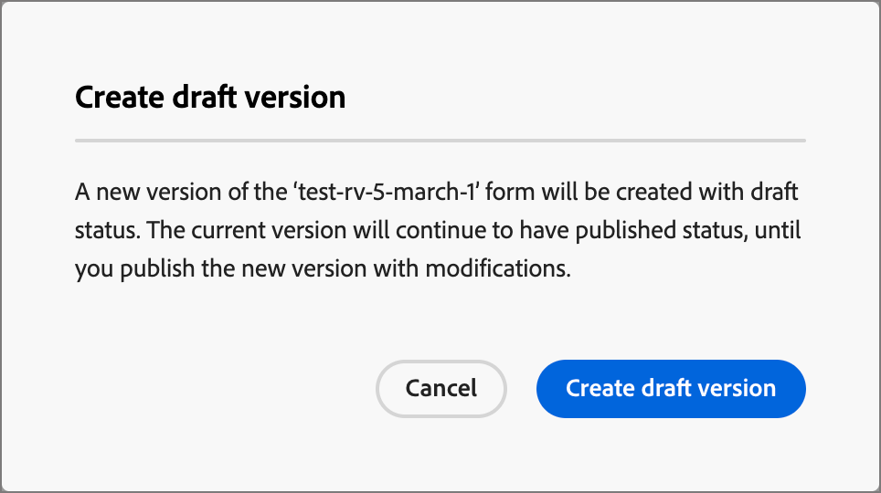

# Forms

Per acquisire informazioni dai visitatori delle pagine web, crea moduli e aggiungili alle pagine di destinazione. Un modulo è un insieme di campi che i visitatori della pagina completano e inviano per ottenere un qualche tipo di contenuto o offerta, ad esempio un white paper, un webinar on-demand o una versione di prova gratuita.

La quantità di informazioni che il modulo deve acquisire dipende dal valore del contenuto o dell’offerta. Se offri qualcosa di semplice, come un white paper, devi raccogliere solo informazioni minime, come il nome, l’e-mail e l’azienda. Se l’offerta presenta un valore superiore, ad esempio una demo o una versione di prova gratuita, puoi raccogliere ulteriori informazioni. La richiesta di un modulo inviato per consentire la visualizzazione del contenuto è denominata _contenuto gestito_. L&#39;organizzazione decide quale contenuto deve essere gestito e quale non è (_libero_). La best practice prevede l’autorizzazione gratuita di alcuni contenuti e l’accesso solo ai contenuti premium o ad alta richiesta.

## Accedere e gestire i moduli

Per accedere ai moduli in Journey Optimizer B2B edition, vai alla navigazione a sinistra e fai clic su **[!UICONTROL Gestione contenuto]** > **[!UICONTROL Forms]**. Questa azione apre una pagina di elenco con tutti i moduli creati nell&#39;istanza elencata in una tabella.

{width="700" zoomable="yes"}

La tabella è ordinata in base alla colonna _[!UICONTROL Modificato]_, con i moduli aggiornati più di recente nella parte superiore per impostazione predefinita. Fai clic sul titolo della colonna per passare da crescente a decrescente.

### Stato e ciclo di vita del modulo

Lo stato del modulo determina la disponibilità del modulo per l’utilizzo in una pagina di destinazione o in un modello di pagina di destinazione e le modifiche che è possibile apportare.

| Stato | Descrizione |
| -------------------- | ----------- |
| Bozza | Quando si crea un modulo, il modulo si trova nello stato Bozza. Rimane in questo stato mentre definisci o modifichi i campi fino a quando non li pubblichi per l’utilizzo in una pagina di destinazione o in un modello di pagina di destinazione. Azioni disponibili: <ul><li>Modifica tutti i dettagli<li>Modifica nello spazio di progettazione visiva<li>Pubblica<li>Duplica<li>Elimina |
| Pubblicato | Quando pubblichi un modulo, questo diventa disponibile per l’utilizzo in una pagina di destinazione o in un modello di pagina di destinazione. Il contenuto del modulo pubblicato non può essere modificato nello spazio di progettazione visiva. Azioni disponibili: <ul><li>Modifica nome, descrizione o pagina di ringraziamento<li>Aggiungi a una pagina di destinazione o a un modello di pagina di destinazione<li>Crea versione bozza<li>Duplica<li>Elimina (se non in uso)<li>Codice da incorporare |
| Pubblicato con bozza | Quando crei una bozza da un modulo pubblicato, la versione pubblicata rimane disponibile per l’utilizzo in una pagina di destinazione o in un modello. Il contenuto della bozza può essere modificato nello spazio di progettazione visiva. Se pubblichi la versione bozza, questa sostituisce la versione pubblicata corrente e il contenuto viene aggiornato nelle pagine di destinazione o nei modelli di pagina di destinazione in cui è in uso. Azioni disponibili: <ul><li>Modificare le pagine di nome, descrizione o ringraziamento<li>Aggiungi a una pagina di destinazione o a un modello di pagina di destinazione<li>Modifica versione bozza in Visual Design Space<li>Pubblica versione bozza<li>Duplica<li>Elimina (se non in uso)<li>Codice da incorporare |

{zoomable="yes"}

### Filtrare l’elenco dei moduli

Per cercare un modulo per nome, immettere una stringa di testo nella barra di ricerca per trovare una corrispondenza. Fai clic sull&#39;icona _Filtro_ (  ) per visualizzare le opzioni di filtro disponibili e modificare le impostazioni per filtrare gli elementi visualizzati in base ai criteri specificati.

{width="700" zoomable="yes"}

### Personalizzare la visualizzazione delle colonne

Personalizza le colonne da visualizzare nella tabella facendo clic sull&#39;icona _Personalizza tabella_ (  ) in alto a destra.

Nella finestra di dialogo, seleziona le colonne da visualizzare e fai clic su **[!UICONTROL Applica]**.

{width="300"}

## Creare moduli

Prima di iniziare a creare moduli riutilizzabili in Journey Optimizer B2B edition è necessario considerare diversi aspetti:

* Determinare i moduli necessari.

  Può essere possibile utilizzare solo quattro moduli standard. Uno per accedere ai contenuti scaricabili, uno per accedere alle pagine web premium, uno per visualizzare i video e uno per registrarsi per elementi come i webinar. Se hai bisogno di modificare un campo in un modulo, è più semplice aggiornare quattro moduli standard utilizzati a livello globale invece di modificare più moduli distribuiti in tutti i programmi di marketing. <!-- Global forms also make progressive profiling much easier to implement. -->

* Per ogni modulo standard, determina quali campi utilizzare e come presentarli.

  Considera l’utilizzo di forme più brevi, in quanto si è dimostrato che sono migliori per le conversioni. Quando si analizza ogni modulo, stabilire quali campi sono ragionevoli e necessari per il relativo scopo.

  Valuta se precompilare i campi del modulo in modo che le informazioni di base, come nome e e-mail, siano precompilate. Ma altre informazioni, come la qualifica e le dimensioni dell&#39;organizzazione, non lo sono. In questo modo, il visitatore deve compilare solo due campi e inviare il modulo. Puoi anche utilizzare un modulo social compilato con dati provenienti da Facebook o Twitter.

* Pianifica la pagina di follow-up visualizzata dopo l&#39;invio di un modulo da parte di un visitatore (_grazie_).

  Tutti ottengono la stessa pagina o è dinamica e basata sui loro dati? Ad esempio, un utente del settore sanitario potrebbe visualizzare una pagina con un contenuto diverso rispetto a un utente del settore tecnologico.

* Valutare se ignorare completamente un modulo se si dispone già delle informazioni necessarie.

  Quando consenti il bypass di un modulo a una persona nota che visita la pagina di destinazione, può semplicemente accedere al contenuto direttamente. Ignorando il modulo si ottiene un’esperienza del visitatore più semplice.

### Aggiungi un nuovo modulo

Puoi creare un modulo in Journey Optimizer B2B edition facendo clic su **[!UICONTROL Crea modulo]** in alto a destra nella pagina dell&#39;elenco _[!UICONTROL Forms]_.

1. Nella finestra di dialogo _[!UICONTROL Crea modulo]_, immetti un **[!UICONTROL Nome]** (obbligatorio) e una **[!UICONTROL Descrizione]** (facoltativo) utili.

   Requisiti del modulo:

   * Nome: massimo 100 caratteri, deve essere univoco, senza distinzione tra maiuscole e minuscole

   * Descrizione: massimo 300 caratteri

   * Alpha, caratteri numerici e speciali sono consentiti

   * I caratteri riservati sono **_non consentiti_**: `\ / : * ? " < > |`

   {width="400"}

1. Fai clic su **[!UICONTROL Crea]**.

   Viene visualizzata la pagina dei dettagli del modulo con una definizione di base predefinita.

   {width="700" zoomable="yes"}

### Modificare la struttura predefinita del modulo

Utilizza gli strumenti di progettazione visiva per modificare il contenuto del modulo in base alle esigenze:

* [Aggiungi campi](./form-design.md#add-a-field)
* [Modificare lo stile dei campi](./form-design.md#change-field-styling)
* [Riordina campi](./form-design.md#reorder-fields)
* [Modificare il testo e lo stile del pulsante di invio](./form-design.md#edit-and-style-the-submit-button)
* [Modificare lo stile del modulo](./form-design.md#change-form-styling)

Fai clic su **[!UICONTROL Salva e chiudi]** per salvare le modifiche alla struttura del contenuto del modulo e passare ai dettagli del modulo.

### Impostare la pagina di ringraziamento

Nel pannello _[!UICONTROL Riepilogo]_ a destra, scorri fino alla sezione **[!UICONTROL Pagina di ringraziamento]** e utilizza l&#39;impostazione **[!UICONTROL Completa con]** per definire cosa accade quando un visitatore invia il modulo:

* **[!UICONTROL Resta a pagina]** - Scegli questa opzione per mantenere il visitatore sulla stessa pagina al momento dell&#39;invio del modulo.

* **[!UICONTROL Pagina di destinazione]** - Scegli questa opzione per selezionare una pagina di destinazione Journey Optimizer B2B edition o Marketo Engage come follow-up.

* **[!UICONTROL URL esterno]** - Scegliere questa opzione per specificare qualsiasi URL come pagina di follow-up. Dopo che il visitatore ha inviato il modulo, il browser carica l’URL designato.

  >[!TIP]
  >
  >Se desideri utilizzare il modulo per scaricare un file, puoi specificare un URL per il file ospitato. Con questa configurazione, il pulsante Invia funziona come un pulsante di download.

### Pubblicare la bozza del modulo

Quando sei pronto a rendere il modulo disponibile per l&#39;utilizzo in una pagina di destinazione o in un modello di pagina di destinazione, fai clic su **[!UICONTROL Pubblica]**.

{width="400"}

Questa azione apre una finestra di dialogo di conferma. È possibile interrompere il processo di pubblicazione facendo clic su **[!UICONTROL Annulla]** oppure su **[!UICONTROL Pubblica]** per confermare.

## Visualizza dettagli modulo

Fai clic sul nome di un modulo nella pagina elenco per aprire la pagina dei dettagli del frammento. È possibile modificare il modulo, rinominarlo o aggiornarne la descrizione. Per salvare automaticamente le modifiche, apporta gli aggiornamenti e fai clic all’esterno del campo nome o descrizione.

>[!NOTE]
>
>Se un modulo pubblicato è utilizzato da una pagina di destinazione o da un modello di pagina di destinazione, non è possibile modificare il contenuto o la pagina di ringraziamento. È possibile creare una bozza di versione se si desidera apportare modifiche ai form.s

{width="600" zoomable="yes"}

Fare clic su **[!UICONTROL Modifica modulo]** per aprire il frammento nello spazio di progettazione visiva.

Uscire dalla visualizzazione in qualsiasi momento facendo clic sulla freccia _Indietro_ in alto a sinistra, per tornare alla pagina dell&#39;elenco _[!UICONTROL Forms]_.

## Visualizza riferimenti modulo utilizzato da

Nel pannello _[!UICONTROL Riepilogo]_ a destra, fai clic sulla scheda **[!UICONTROL Usato da]** per visualizzare i dettagli sulla posizione in cui il modulo è attualmente utilizzato in Journey Optimizer B2B edition, tra le pagine di destinazione e i modelli di pagina di destinazione.

>[!IMPORTANT]
>
>Non è possibile eliminare i moduli attualmente utilizzati da pagine di destinazione o modelli di pagine di destinazione.

{width="600" zoomable="yes"}

I riferimenti vengono visualizzati in base alla categoria: _Pagina di destinazione_ o _Modello pagina di destinazione_. Fare clic sul collegamento per aprire la pagina o il modello corrispondente in cui viene utilizzato il modulo.

## Elimina moduli

Non è possibile eliminare i moduli attualmente utilizzati da una pagina di destinazione o da un modello di pagina di destinazione. Prima di avviare la rimozione di un modulo, è possibile controllare i riferimenti _used-by_. Inoltre, una rimozione non può essere annullata, pertanto controlla prima di avviare un’azione di eliminazione.

È possibile eliminare un modulo utilizzando uno dei metodi seguenti:

* In alto a destra, fai clic su **[!UICONTROL ... Altro]** e scegliere **[!UICONTROL Elimina]**.
* Dalla pagina dell&#39;elenco _[!UICONTROL Forms]_, fare clic sui puntini di sospensione accanto al nome del modulo e scegliere **[!UICONTROL Elimina]**.

Questa azione apre una finestra di dialogo di conferma. È possibile interrompere il processo facendo clic su **[!UICONTROL Annulla]** oppure su **[!UICONTROL Elimina]** per confermare l&#39;eliminazione.

{width="400"}

Se il modulo è attualmente in uso, l&#39;azione apre una finestra di dialogo informativa che avvisa che non è possibile eliminarlo. Fare clic su **[!UICONTROL OK]** per interrompere l&#39;azione di eliminazione.

{width="400"}

## Duplicare i moduli

Duplicare un modulo per creare in modo rapido e semplice un nuovo modulo utilizzando un modulo esistente come punto di partenza per la progettazione del modulo.

È possibile duplicare un modulo utilizzando uno dei metodi seguenti:

* Nella parte superiore destra della pagina dei dettagli del modulo fare clic su **[!UICONTROL ... Altro]** e scegli **[!UICONTROL Duplicato]**.
* Dalla pagina dell&#39;elenco _[!UICONTROL Forms]_, fai clic sui puntini di sospensione accanto al nome del modulo e scegli **[!UICONTROL Duplica]**.

{width="450"}

Nella finestra di dialogo, inserisci un nome utile (univoco) e una descrizione. Fai clic su **[!UICONTROL Duplica]** per completare l&#39;azione.

{width="400"}

Modificate il modulo duplicato per modificare il nome in base alle esigenze e modificare il modulo per l&#39;uso previsto.

## Modifica moduli

Le modifiche a un modulo dipendono dal suo stato corrente:

* Quando un modulo è nello stato _Bozza_, è possibile modificarne i dettagli e il contenuto (campi, pulsante e stile).
* Quando un modulo è nello stato _Pubblicato_, è possibile modificarne il nome o la descrizione. Non è possibile modificare il contenuto.
* Quando un modulo è in stato _Pubblicato con bozza_, è possibile modificarne il nome o la descrizione. Nella versione bozza, puoi anche modificare il contenuto e le pagine di ringraziamento.

>[!BEGINTABS]

>[!TAB Bozza]

1. Nella pagina dell&#39;elenco _[!UICONTROL Forms]_ fare clic sul nome del modulo per aprirlo.

   Viene visualizzata un’anteprima del contenuto del modulo, con i dettagli del modulo a destra.

1. Modifica uno dei dettagli, ad esempio nome e descrizione.

   {width="600" zoomable="yes"}

1. Per apportare modifiche al modulo nello spazio di progettazione visivo, fare clic su **[!UICONTROL Modifica modulo]**.

   Utilizza gli strumenti di progettazione visiva secondo necessità:

   * [Aggiungi campi](./form-design.md#add-a-field)
   * [Modificare lo stile dei campi](./form-design.md#change-field-styling)
   * [Riordina campi](./form-design.md#reorder-fields)
   * [Modificare il testo e lo stile del pulsante di invio](./form-design.md#submit-button)
   * [Modificare lo stile del modulo](./form-design.md#change-form-styling)

   Fai clic su **[!UICONTROL Salva e chiudi]** per tornare ai dettagli del modulo.

1. Quando il modulo soddisfa i criteri e desideri renderlo disponibile per l&#39;utilizzo in una pagina di destinazione o in un modello di pagina di destinazione, fai clic su **[!UICONTROL Pubblica]**.

>[!TAB Pubblicato]

1. Nella pagina dell&#39;elenco _[!UICONTROL Forms]_ fare clic sul nome del modulo per aprirlo.

   Viene visualizzata un’anteprima del contenuto del modulo, con i dettagli del modulo a destra.

1. Per creare una bozza della versione per la modifica del modulo, fai clic su **[!UICONTROL Modifica modulo]** nel pannello _[!UICONTROL Riepilogo]_ a destra.

1. Fare clic su **[!UICONTROL Crea bozza versione]** nella finestra di dialogo per aprire la bozza versione nello spazio di progettazione visivo.

   {width="400"}

1. Utilizza gli strumenti di progettazione visiva necessari per aggiornare il contenuto del modulo:

   * [Aggiungi campi](./form-design.md#add-a-field)
   * [Modificare lo stile dei campi](./form-design.md#change-field-styling)
   * [Riordina campi](./form-design.md#reorder-fields)
   * [Modificare il testo e lo stile del pulsante di invio](./form-design.md#submit-button)
   * [Modificare lo stile del modulo](./form-design.md#change-form-styling)

   Fai clic su **[!UICONTROL Salva e chiudi]** per tornare ai dettagli del modulo.

1. Quando la bozza del modulo soddisfa i criteri e desideri rendere le modifiche disponibili per l&#39;utilizzo in una pagina di destinazione o in un modello di pagina di destinazione, fai clic su **[!UICONTROL Pubblica]**.

   Quando pubblichi la versione bozza, questa sostituisce la versione pubblicata corrente e il contenuto del modulo viene aggiornato nelle pagine di destinazione o nei modelli di pagina di destinazione in cui è già in uso.

>[!TAB Pubblicato con bozza]

1. Fare clic sul nome del modulo per aprirlo.

1. Selezionare la scheda **[!UICONTROL Bozza]**.

   Viene visualizzata un’anteprima del contenuto del modulo della versione bozza, con i dettagli del modulo a destra.

   {width="700" zoomable="yes"}

1. Fai clic su **[!UICONTROL Modifica modulo]** nel riquadro _[!UICONTROL Riepilogo]_ a destra e utilizza gli strumenti di progettazione visiva in base alle esigenze:

   * [Aggiungi campi](./form-design.md#add-a-field)
   * [Modificare lo stile dei campi](./form-design.md#change-field-styling)
   * [Riordina campi](./form-design.md#reorder-fields)
   * [Modificare il testo e lo stile del pulsante di invio](./form-design.md#submit-button)
   * [Modificare lo stile del modulo](./form-design.md#change-form-styling)

   Fai clic su **[!UICONTROL Salva e chiudi]** per tornare ai dettagli del modulo.

1. Quando la bozza del modulo soddisfa i criteri e desideri rendere le modifiche disponibili per l&#39;utilizzo in pagine di destinazione e modelli di pagina di destinazione, fai clic su **[!UICONTROL Pubblica]**.

   Quando pubblichi la versione bozza, questa sostituisce la versione pubblicata corrente e il modulo viene aggiornato nelle pagine di destinazione e nei modelli in cui è già in uso.

>[!ENDTABS]

## Aggiungere moduli a una pagina di destinazione o a un modello

Forms è progettato per essere riutilizzato e può essere inserito quando si progetta una [pagina di destinazione](./landing-page-design.md) o un [modello di pagina di destinazione](./landing-page-templates.md).

{{$include /help/_includes/content-design-add-forms.md}}

## Azioni modulo per la creazione di pagine e modelli

Quando un modulo viene incluso in una pagina di destinazione o in un modello di pagina di destinazione, il contenuto del modulo non può essere modificato all’interno della pagina o del modello. Tuttavia, puoi applicare le seguenti azioni:

* **[!UICONTROL Elimina]** - Questa azione rimuove il modulo dalla pagina corrente o dal contenuto del modello (l&#39;origine del frammento non è interessata).
* **[!UICONTROL Duplica]** - Questa azione duplica il modulo all&#39;interno della stessa pagina o dello stesso modello all&#39;interno dell&#39;editor, con le stesse dimensioni e aggiunto appena sotto di esso.
* **[!UICONTROL Visualizza HTML]** - Questa azione apre un popup con HTML per il modulo. Puoi modificare il HTML o copiarlo per utilizzarlo in altri contenuti web.
* **[!UICONTROL Modifica modulo]** - Questa azione apre una nuova scheda del browser con la pagina e i dettagli dell&#39;editor moduli.

Quando selezioni il modulo nello spazio di progettazione della pagina di destinazione, queste azioni sono disponibili nella barra degli strumenti contestuale e nel pannello delle proprietà a destra.

{width="600" zoomable="yes"}
