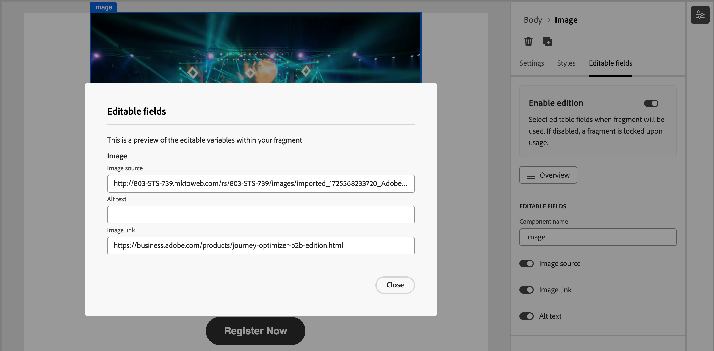

# Authoring dei frammenti

Dopo aver [creato un frammento](./fragments.md#create-fragments), utilizza lo spazio di progettazione visiva per creare la struttura e i componenti di contenuto nel frammento.

## Aggiungere struttura e contenuto {#design-fragment}

{{$include /help/_includes/content-design-components.md}}

## Aggiungere risorse

{{$include /help/_includes/content-design-assets.md}}

## Spostarsi tra livelli, impostazioni e stili

{{$include /help/_includes/content-design-navigation.md}}

## Personalizzazione dei contenuti

{{$include /help/_includes/content-design-personalization.md}}

## Contenuto condizionale

Per aggiungere contenuto condizionale che adatta il contenuto ai profili di destinazione in base alle regole, selezionare un componente di contenuto e fare clic sul pulsante **[!UICONTROL Abilita contenuto condizionale]** nella barra degli strumenti del componente. Quando il frammento pubblicato viene incluso in un messaggio e-mail, le regole condizionali determinano la variante di un componente condizionale di cui viene eseguito il rendering nel messaggio e-mail.

Per ulteriori informazioni, vedere [_Contenuto condizionale_](./conditional-content.md).

## Abilita personalizzazione frammento

Quando un autore aggiunge un frammento a un [e-mail](./email-authoring.md#content-authoring---use-visual-fragments) o [modello e-mail](./email-template-authoring.md#content-authoring---use-visual-fragments), il contenuto del frammento è bloccato per impostazione predefinita. Eventuali modifiche apportate al frammento pubblicato vengono propagate automaticamente a tutte le risorse di contenuto in cui viene utilizzato il frammento. Quando imposti un parametro per un componente del frammento come modificabile, l’autore dell’e-mail o del modello può specificare un valore di campo personalizzato specifico per le sue esigenze. Questo flag di personalizzazione è limitato ai componenti visivi immagine, testo e pulsante.

Ad esempio, se progetti un banner riutilizzabile che include un pulsante cliccabile, puoi designare il parametro URL per il pulsante come modificabile. Gli autori delle e-mail possono quindi utilizzare un URL più specifico per la propria campagna e-mail. Con questi campi personalizzabili, gli addetti al marketing possono gestire e personalizzare contenuti riutilizzabili senza la necessità di creare blocchi di contenuto completamente nuovi o interrompere gli aggiornamenti ereditati dal frammento originale.

1. Nell’editor di contenuto visivo, seleziona l’immagine, il testo o l’elemento pulsante in cui desideri abilitare la personalizzazione.

1. Nei dettagli del componente a destra, seleziona la scheda **[!UICONTROL Campi modificabili]**.

1. Fai clic sull&#39;opzione **[!UICONTROL Abilita edizione]** e imposta i campi modificabili.

   {width="700" zoomable="yes"}

   Puoi abilitare la personalizzazione per i campi visualizzati, che dipendono dal tipo di componente e dai parametri definiti nel frammento.

   Cambia l’opzione in uno stato abilitato per ogni campo in cui desideri consentire la personalizzazione.

1. Fai clic su **[!UICONTROL Panoramica]** per esaminare tutti i campi modificabili e i relativi valori predefiniti.

   {width="700" zoomable="yes"}

1. Salva le modifiche.

## Modifica tracciamento URL collegato

{{$include /help/_includes/content-design-links.md}}
