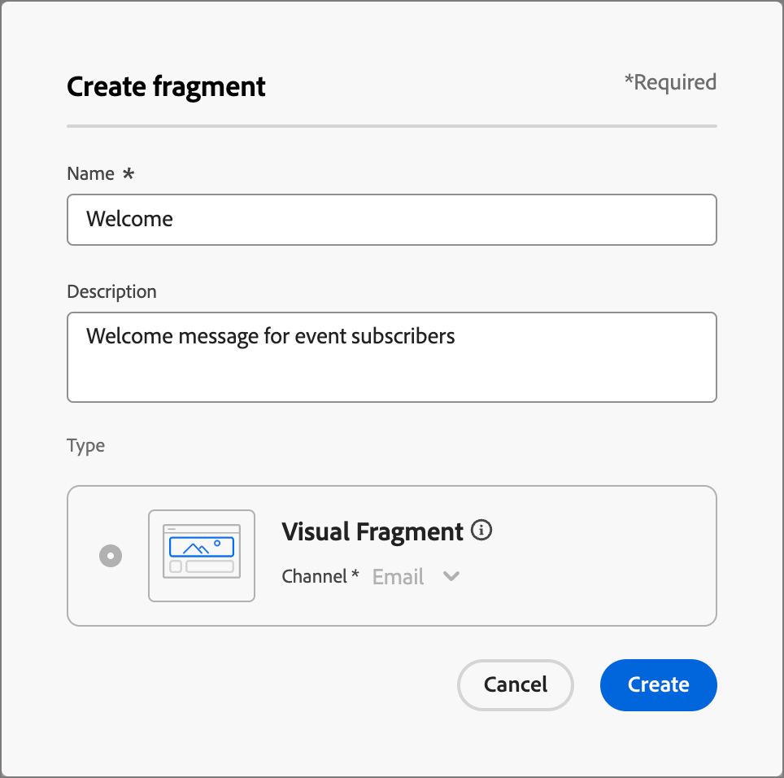

# Frammenti

Un frammento è un componente riutilizzabile a cui è possibile fare riferimento in una o più e-mail e modelli e-mail in Adobe Journey Optimizer B2B Edition. In genere si tratta di un blocco di contenuto (testo, immagine o entrambi) che può essere precreato e inserito rapidamente in un modello e-mail o e-mail. Con questa funzionalità, puoi precreare più blocchi di contenuto personalizzati che possono essere utilizzati dai membri del team di marketing per assemblare contenuti e-mail e migliorare così il processo di progettazione. I casi d’uso comuni includono blocchi di contenuto di intestazione/piè di pagina per e-mail, banner di invito per eventi e saluti stagionali.

Per utilizzare al meglio i frammenti nei flussi di lavoro:

* _Crea frammenti personalizzati_ - Crea frammenti visivi da zero o salvando il contenuto come frammento in qualsiasi momento dall&#39;editor di contenuti visivi.
* _Riutilizza i frammenti: utilizzali il numero di volte necessario nel contenuto.

## Frammenti visivi

I frammenti visivi sono blocchi visivi predefiniti creati utilizzando l’editor di contenuto visivo che puoi riutilizzare in più e-mail o modelli e-mail. L’ambito corrente di Journey Optimizer B2B Edition e questa documentazione sono quelli dei soli frammenti visivi. I frammenti basati su espressioni non sono ancora supportati in Journey Optimizer B2B Edition.

## Accedere e gestire i frammenti

Per accedere ai frammenti visivi nell&#39;edizione B2B di Adobe Journey Optimizer, vai alla navigazione a sinistra e fai clic su **[!UICONTROL Gestione contenuto]** > **[!UICONTROL Frammenti]**. Questa azione apre una pagina di elenco con tutti i frammenti creati nell’istanza elencata in una tabella.

{width="700" zoomable="yes"}

La tabella è ordinata in base alla colonna _[!UICONTROL Modificato]_, con i frammenti aggiornati più di recente nella parte superiore dell&#39;elenco per impostazione predefinita. Fai clic sul titolo della colonna per passare da crescente a decrescente.

Cerca un frammento inserendo una stringa di testo nella barra di ricerca per trovare una corrispondenza in base al nome del frammento. Fai clic sull&#39;icona _Filtro_ per filtrare gli elementi visualizzati in base ai criteri specificati.

{width="700" zoomable="yes"}

Personalizzare le colonne da visualizzare nella tabella facendo clic sull&#39;icona _Personalizza tabella_ in alto a destra. Selezionare le colonne da visualizzare e fare clic su **[!UICONTROL Applica]**.

## Creare i frammenti

È possibile creare nuovi frammenti visivi in Journey Optimizer B2B Edition facendo clic su **[!UICONTROL Crea frammento]** in alto a destra.

1. Nella finestra di dialogo _[!UICONTROL Crea frammento]_, immetti un **[!UICONTROL Nome]** e una **[!UICONTROL Descrizione]** utili (facoltativi).

   Requisiti dei frammenti:

   * Nome: massimo 100 caratteri, deve essere univoco, senza distinzione tra maiuscole e minuscole

   * Descrizione: massimo 300 caratteri

   * Alpha, sono consentiti caratteri numerici e speciali

   * Caratteri riservati non consentiti: `\ / : * ? " < > |`

   {width="500"}

1. Fai clic su **[!UICONTROL Crea]**.

   L’editor di contenuto visivo si apre con un’area di lavoro vuota. Per creare un frammento utilizzando l’editor di contenuto visivo, consulta gli argomenti relativi all’authoring dei contenuti:

<!-- To be linked to the corresponding sections on this page: Adobe Journey Optimizer B2B Edition - Email Templates

Adding structure & content
Adding assets
Navigating the layers
Previewing & editing URLs
View options
More options -->

## Visualizza dettagli frammento

Fai clic sul nome di un frammento nella pagina dell’elenco per aprire la pagina dei dettagli del frammento.

Da qui puoi scegliere di modificare il frammento, rinominarlo o aggiornare la descrizione del frammento (effettua gli aggiornamenti e fai clic all’esterno della casella nome/descrizione per salvare automaticamente le modifiche).

Fai clic su **[!UICONTROL Modifica]** per aprire il frammento nell&#39;editor di contenuti visivi.

Uscire dalla visualizzazione in qualsiasi momento facendo clic sulla freccia _Indietro_ in alto a sinistra, per tornare alla pagina dell&#39;elenco _Frammenti_.

## Visualizza frammento utilizzato da riferimenti

Nella pagina dei dettagli del frammento, fai clic sulla scheda **[!UICONTROL Usato da]** per visualizzare i dettagli sulla posizione in cui il frammento è attualmente utilizzato in Journey Optimizer B2B Edition, tra e-mail, modelli e frammenti di posta elettronica.

>[!IMPORTANT]
>
>Non è possibile eliminare i frammenti attualmente utilizzati da e-mail o modelli e-mail.

I riferimenti vengono visualizzati in base alla categoria: _E-mail_ o _Modello e-mail_. Le e-mail in Journey Optimizer B2B Edition sono incorporate e create all’interno di percorsi di account, pertanto il percorso principale dell’e-mail che utilizza il frammento viene visualizzato in riferimenti.

Fai clic sul collegamento per aprire l’e-mail o il modello e-mail corrispondente in cui viene utilizzato il frammento.

## Elimina frammenti

Qualsiasi frammento attualmente utilizzato da un messaggio e-mail o da un modello e-mail non può essere eliminato. Prima di avviare la rimozione di un frammento, assicurati di controllare i riferimenti a _usato da_. Inoltre, una rimozione non può essere annullata, pertanto controlla prima di avviare un’azione di eliminazione.

Puoi eliminare un frammento utilizzando uno dei seguenti metodi:

* Dai dettagli del frammento a destra, fai clic su **[!UICONTROL Elimina]**.
* Nella pagina dell&#39;elenco _[!UICONTROL Frammenti]_, fare clic sui puntini di sospensione accanto al frammento e scegliere **[!UICONTROL Elimina]**.

Questa azione apre una finestra di dialogo di conferma. È possibile interrompere il processo facendo clic su **[!UICONTROL Annulla]** oppure su **[!UICONTROL Elimina]** per confermare l&#39;eliminazione.

Se il frammento è attualmente in uso, l’azione apre una finestra di dialogo informativa che avvisa che non è possibile eliminarlo. Fare clic su **[!UICONTROL OK]** per interrompere l&#39;eliminazione.

## Modificare i frammenti

Puoi modificare un frammento utilizzando uno dei seguenti metodi:

* Dai dettagli del frammento a destra, fai clic su **[!UICONTROL Modifica]**.
* Dalla pagina dell&#39;elenco _[!UICONTROL Frammenti]_, fai clic sui puntini di sospensione accanto al frammento e scegli **[!UICONTROL Modifica]**.

Questa azione consente di aprire il frammento in un editor di contenuti visivi, in cui è possibile modificare il frammento utilizzando una qualsiasi delle funzionalità per la [creazione di un frammento](#create-fragments).

## Frammenti duplicati

Puoi duplicare un frammento utilizzando uno dei seguenti metodi:

* Dai dettagli del frammento a destra, fai clic su **[!UICONTROL Duplica]**.
* Dalla pagina dell&#39;elenco _[!UICONTROL Frammenti]_, fai clic sui puntini di sospensione accanto al frammento e scegli **[!UICONTROL Duplica]**.

Nella finestra di dialogo, inserisci un nome utile (univoco) e una descrizione. Fai clic su **[!UICONTROL Duplica]** per completare l&#39;azione.

Il frammento duplicato (nuovo) viene quindi visualizzato nell&#39;elenco _Frammenti_.

## Salvare un frammento dall’editor e-mail o modello

Ogni volta che ti trovi nell’editor di contenuto visivo per creare/modificare un’e-mail o un modello e-mail, puoi scegliere di salvare tutto o parte del contenuto come frammento in modo che sia disponibile per il riutilizzo.

1. Quando hai del contenuto da salvare come frammento, fai clic su **[!UICONTROL Altro]** e scegli **[!UICONTROL Salva come frammento]**.

1. Seleziona i diversi elementi da includere nel frammento.

   Selezionare più strutture tenendo premuto il pulsante CTRL

   È possibile selezionare solo strutture adiacenti e l&#39;interfaccia non consente di selezionare elementi non adiacenti.

1. Con il contenuto selezionato, fai clic su **[!UICONTROL Crea]** in alto a destra.

1. Nella finestra di dialogo, immetti un nome e una descrizione utili per il frammento. Quindi fare clic su **[!UICONTROL Crea]**.

   Il nuovo frammento viene quindi visualizzato nella pagina di elenco _Frammenti_ ed è disponibile anche all&#39;interno di e-mail e modelli di e-mail.

## Aggiungere frammenti visivi a un’e-mail o a un modello

I frammenti sono progettati per il riutilizzo e possono essere inseriti per la creazione di modelli e-mail e e-mail. Puoi aggiungere fino a 30 frammenti in un determinato messaggio e-mail o modello. I frammenti possono essere nidificati fino a un solo livello.

>[!BEGINTABS]

>[!TAB Aggiungere frammenti a un&#39;e-mail]

1. Passare a Percorsi di conti e aprire un percorsi percorso esistente o crearne uno nuovo.

1. Crea un nodo &quot;Azione > Azione persone > Invia e-mail&quot;.

1. Crea o modifica il contenuto delle e-mail per il nodo.

1. Trascina e rilascia un elemento dal menu Componenti per fornire una _struttura_ per il frammento.

1. Per aprire l&#39;elenco dei frammenti, fare clic sull&#39;icona _Frammenti_.

   È possibile:
   * Ordina l’inserzione.
   * Sfoglia, Cerca, Filtra l’inserzione.
   * Consente di passare dalla visualizzazione Anteprima alla visualizzazione Elenco.
   * Aggiorna l’elenco per riflettere eventuali frammenti creati di recente.

1. Trascina e rilascia uno dei frammenti nel segnaposto del componente struttura.

   L’editor esegue il rendering del frammento all’interno della sezione/elemento della struttura e-mail.

Il contenuto del frammento viene aggiornato dinamicamente all’interno della struttura per eseguire il rendering di un’immagine del modo in cui il contenuto viene visualizzato nell’e-mail.

Se desideri aggiungere il frammento in modo che occupi l’intero layout orizzontale all’interno dell’e-mail, aggiungi una struttura di colonne 1:1 e quindi trascina e rilascia il frammento all’interno di esso.

Dopo il salvataggio, l’e-mail viene visualizzata nella pagina dei dettagli del frammento > Utilizzato da. I frammenti aggiunti a un’e-mail non sono modificabili all’interno dell’e-mail: il contenuto è definito dal frammento di origine.

>[!TAB Aggiungere frammenti a un modello di e-mail]

1. Nel menu di navigazione a sinistra, fai clic su **[!UICONTROL Gestione contenuto]** > **[!UICONTROL Modelli]**.

1. Crea un nuovo modello o apri un modello e-mail esistente e fai clic su **[!UICONTROL Modifica modello e-mail]**.

1. Trascina e rilascia un elemento dal menu Componenti per fornire una _struttura_ per il frammento.

1. Per aprire l&#39;elenco dei frammenti, fare clic sull&#39;icona _Frammenti_.

   È possibile:
   * Ordina l’inserzione.
   * Sfoglia, Cerca, Filtra l’inserzione.
   * Consente di passare dalla visualizzazione Anteprima alla visualizzazione Elenco.
   * Aggiorna l’elenco per riflettere eventuali frammenti creati di recente.

1. Trascina e rilascia uno dei frammenti nel segnaposto del componente struttura.

   L’editor esegue il rendering del frammento all’interno della sezione/elemento della struttura del modello e-mail.

1. Trascina e rilascia uno dei frammenti nel segnaposto del componente struttura.

   L’editor esegue il rendering del frammento all’interno della sezione/elemento della struttura del modello e-mail.

Se desideri aggiungere il frammento in modo che occupi l’intero layout orizzontale all’interno del modello e-mail, aggiungi una struttura di colonne 1:1 e quindi trascina e rilascia il frammento al suo interno.

Dopo il salvataggio, il modello e-mail viene visualizzato nella pagina dei dettagli del frammento > _[!UICONTROL Usato da]_ sezione. I frammenti aggiunti a un modello e-mail non sono modificabili all’interno del modello: il contenuto è definito dal frammento di origine.

>[!ENDTABS]

## Azioni frammento durante l’authoring

Dopo l’aggiunta di un frammento a un’e-mail o a un modello e-mail, il contenuto del frammento non può essere modificato all’interno dell’e-mail o del modello. Tuttavia, puoi applicare le seguenti azioni:

* **[!UICONTROL Elimina]** - Questa azione rimuove il frammento dal contenuto del modello e-mail o e-mail corrente (l&#39;origine del frammento non è interessata).
* **[!UICONTROL Aggiorna]** - Questa azione aggiorna il contenuto del frammento nel modello e-mail o e-mail corrente. Questa funzione ti consente di riflettere eventuali modifiche recenti apportate al frammento dopo che è stato aggiunto al modello e-mail o e-mail.
* **[!UICONTROL Duplicato]** - Questa azione duplica il frammento all&#39;interno dello stesso e-mail o modello e-mail all&#39;interno dell&#39;editor, con le stesse dimensioni e aggiunto appena sotto di esso.
* **[!UICONTROL Apri frammento]** - Questa azione apre una nuova scheda del browser con la pagina e i dettagli dell&#39;editor frammenti.
* **[!UICONTROL Interrompi ereditarietà]** - Questa azione interrompe l&#39;ereditarietà del frammento (e delle relative modifiche) dall&#39;origine. Utilizza questa azione per rendere il contenuto del frammento disponibile come contenuto indipendente e modificabile all’interno del modello e-mail o e-mail. Questa azione rimuove anche il modello e-mail o e-mail dal riferimento _Usato da_ per il frammento originale.

Quando selezioni il frammento nella pagina dell’editor, queste azioni sono disponibili nella barra degli strumenti contestuale e nel pannello delle proprietà a destra.
