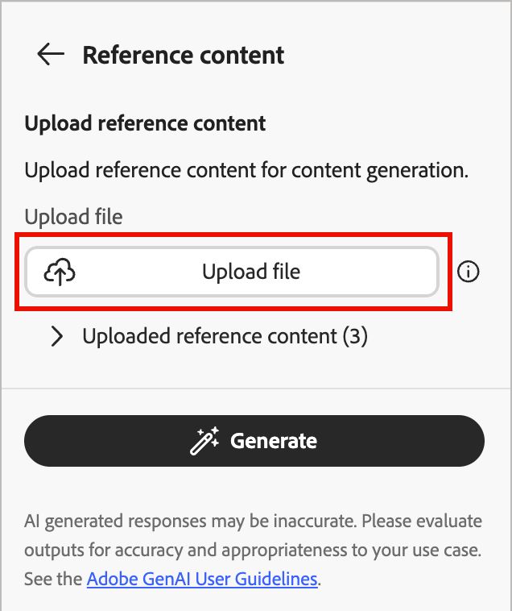
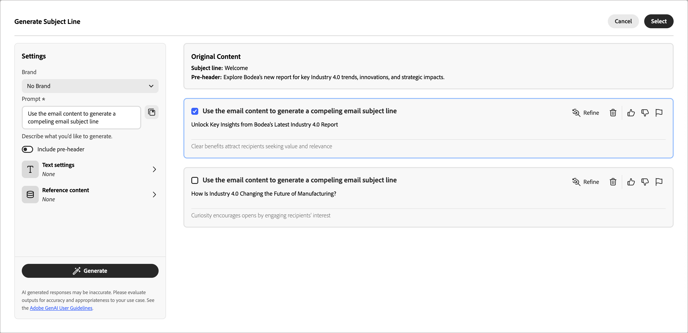
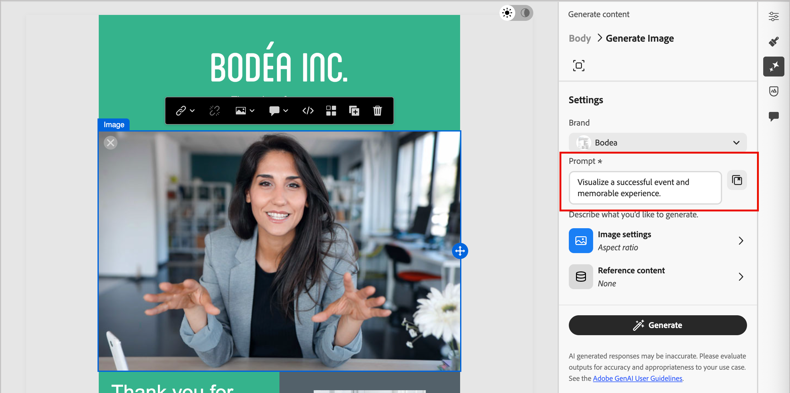

# Generare contenuti e-mail

Man mano che il settore del marketing diventa più competitivo, i brand cercano modi efficienti per generare contenuti di impatto. [!DNL Adobe Journey Optimizer B2B Edition] include la generazione di contenuti basati sull&#39;intelligenza artificiale che consente agli addetti al marketing di creare contenuti e-mail professionali e coerenti con il marchio. Con modelli di intelligenza artificiale generativi avanzati e una profonda comprensione delle linee guida del brand, genera automaticamente contenuti personalizzati, coinvolgenti ed efficaci. Utilizza il tuo obiettivo di marketing e ottimizza i contenuti per stili, layout, toni e altro ancora. L’utilizzo di questi strumenti rende la creazione e l’esecuzione di campagne di e-mail marketing intuitiva, semplice ed efficiente. L’aggiunta di questa funzionalità ai flussi di lavoro consente di risparmiare tempo, migliorare l’efficienza e ottenere risultati migliori.

Questa nuova funzionalità fornisce la generazione di contenuti basata su messaggi immediati per la generazione completa di e-mail o mirata all’interno dei componenti strutturali e-mail. Per le immagini, puoi generare nuove risorse immagine o generare consigli dall’interno del catalogo delle immagini nella risorsa del marchio di input. Puoi anche utilizzare questa funzionalità per generare linee dell’oggetto e intestazioni preliminari ottimali in modo da influire sul tasso di apertura delle e-mail.

>[!PREREQUISITES]
>
>Per accedere a queste funzionalità in Adobe Journey Optimizer B2B edition, è necessario disporre dell&#39;autorizzazione _[!UICONTROL Assistente AI]_ > _[!UICONTROL Genera contenuto]_. Per ulteriori informazioni su come un amministratore di prodotto può concedere le autorizzazioni per le funzionalità, vedere [Modifica ruoli per le autorizzazioni per il prodotto](../admin/user-management.md#edit-roles-for-product-permissions).

## Linee guida e limitazioni

Prima di iniziare a utilizzare questa funzionalità, controlla le [linee guida e limitazioni](./generative-ai-content.md#general-guidelines-and-limitations). Per poter utilizzare le funzionalità di intelligenza artificiale in [!DNL Journey Optimizer B2B Edition] è inoltre necessario accettare il [Contratto utente](https://www.adobe.com/it/legal/licenses-terms/adobe-gen-ai-user-guidelines.html){target="_blank"}. Per ulteriori informazioni, contatta il tuo rappresentante Adobe.

Adobe applica [credenziali contenuto](https://helpx.adobe.com/firefly/web/get-started/learn-the-basics/content-credentials-overview.html){target="_blank"} alle risorse generate da Firefly al momento del download o dell&#39;esportazione per promuovere la trasparenza.

Le limitazioni e le linee guida seguenti si applicano alla generazione di contenuti e-mail in [!DNL Journey Optimizer B2B Edition]:

* L’inglese è l’unica lingua supportata.
* I contenuti generati potrebbero non essere accurati: condividi il tuo feedback in modo che i tecnici Adobe possano perfezionare i modelli.
* Puoi caricare più risorse di riferimento di contenuto, ma puoi sfruttarne una sola per una generazione specifica.
* Utilizza un modello personalizzato o specifico per il brand per generare contenuti per un’e-mail completa. Si consigliano modelli e-mail con un massimo di 8-10 immagini.
* Assicurati di segnalare eventuali output problematici utilizzando le icone thumb up, thumb down o flag quando selezioni le varianti generate.

## Input e impostazioni per la generazione di contenuti

Puoi generare contenuto completo per un messaggio e-mail o per i componenti selezionati nell’e-mail. Quando si utilizzano gli strumenti di generazione dei contenuti, è possibile fornire prompt, contenuto di riferimento e impostazioni per testo e immagini.

### Prompt

Utilizza prompt ben definiti per il modello di intelligenza artificiale generativo per interpretare con precisione. L’obiettivo/prompt di marketing che fornisci influisce sulla qualità del contenuto generato.

{width="320"}

Per ulteriori informazioni sulla creazione di prompt effettivi, vedere _[Best practice per i prompt](./generative-ai-content.md#generative-ai-prompting-guide)_.

>[!BEGINSHADEBOX]

#### Libreria dei prompt

Un prompt efficace è essenziale per generare i contenuti migliori possibili. Se desideri assistenza per la creazione del prompt, fai clic sull&#39;icona _Libreria prompt_  per accedere a una libreria di idee prompt organizzate in base agli obiettivi. Immettere il testo nel campo di ricerca per trovare un prompt basato su una stringa di parole chiave.

{width="600" zoomable="no"}

Selezionare il prompt che meglio riflette gli obiettivi desiderati e fare clic su **[!UICONTROL Prova questo prompt]**. Nel campo _[!UICONTROL Chiedi conferma]_, sostituisci i segnaposto (ad esempio `[Key Feature/Information]`) con i dettagli del tuo marchio, offerta, campagna e caso d&#39;uso.

>[!ENDSHADEBOX]

### Impostazioni testo

Espandi le **[!UICONTROL Impostazioni testo]** nel pannello di destra e imposta le opzioni per il testo generato.

* **[!UICONTROL Gruppo di acquisto]** - Scegli il [ruolo gruppo di acquisto](../buying-groups/buying-groups-role-templates.md) da utilizzare per il targeting dei messaggi. [!DNL Journey Optimizer B2B Edition] offre cinque ruoli standard del gruppo di acquisto B2B preconfigurati. Ogni ruolo del gruppo di acquisto ha un oggetto di messaggistica distinto:

  | Ruolo | Stato attivo messaggistica |
  | ---- | --------------- |
  | Comitato esecutivo direttivo | Informazioni sul prodotto  Prezzi  Dettagli sull&#39;integrazione tecnica  Caratteristiche e funzioni del prodotto |
  | Influencer | Prova di qualità  Facilità di implementazione  Competenze in materia  Vantaggi competitivi |
  | Responsabile delle decisioni | Ritorno sull&#39;investimento  Valore finanziario (RoI)  Storie dei clienti |
  | Professionista | Facilità di utilizzo  Funzionalità e funzionalità del prodotto  Compatibilità del prodotto  Facilità di integrazione del prodotto |
  | Campione | Contenuto educativo  Contenuto leadership di pensiero  Storie dei clienti |

* **[!UICONTROL Fase percorso marketing]** - Scegli la [fase gruppo acquisti](../buying-groups/buying-group-stages.md) da utilizzare per il targeting dei messaggi.
* **[!UICONTROL Strategia di comunicazione]** - Scegli lo stile di comunicazione più adatto al testo generato.
* **[!UICONTROL Lingua]** - Scegli la lingua del contenuto generato.
* **[!UICONTROL Tono]** - Tono che risuona con il pubblico. Ad esempio, puoi impostare il messaggio in modo che abbia un suono informativo, giocoso o persuasivo.

{width="350" zoomable="yes"}

Fare clic sulla freccia sinistra per tornare alle _[!UICONTROL Impostazioni]_ principali.

### Impostazioni immagine

Per includere le immagini nel contenuto generato, espandi le **[!UICONTROL Impostazioni immagine]** nel pannello di destra e imposta le opzioni.

Per impostazione predefinita, il sistema disabilita l&#39;opzione **[!UICONTROL Genera immagini utilizzando IA]**. Abilita questa funzione e imposta le seguenti opzioni per includere le immagini generate nelle varianti di contenuto proposte:

* **[!UICONTROL Modello generativo]**: seleziona dal modello fornito da Adobe pronto per l’uso, dal modello partner per funzionalità specializzate o dai modelli personalizzati configurati addestrati sulle risorse del tuo marchio. Per ulteriori informazioni sui modelli generativi, consulta _[Modelli di intelligenza artificiale generativa per l&#39;allineamento del brand](generative-ai-models.md)_.
* **[!UICONTROL Proporzioni]**: quando è selezionato un componente immagine, questa impostazione determina la larghezza e l&#39;altezza della risorsa. Scegliete uno dei rapporti più comuni, ad esempio 16:9, 4:3, 3:2 o 1:1, oppure immettete un rapporto personalizzato.
* **[!UICONTROL Tipo di contenuto]**: il tipo categorizza la natura dell&#39;elemento visivo, distinguendo tra diverse forme di rappresentazione visiva, come foto, grafica o grafica.
* **[!UICONTROL Intensità visiva]**: controlla l&#39;impatto dell&#39;immagine regolandone l&#39;intensità. Un&#39;impostazione più bassa (ad esempio 2) crea un aspetto più morbido e più contenuto, mentre un&#39;impostazione più alta (ad esempio 10) rende l&#39;immagine più vibrante e visivamente potente.
* **[!UICONTROL Colore e tono]**: l&#39;aspetto complessivo dei colori all&#39;interno di un&#39;immagine e l&#39;umore o l&#39;atmosfera che trasmette.
* **[!UICONTROL Illuminazione]**: lo stile di illuminazione utilizzato per l&#39;immagine, che ne forma l&#39;atmosfera ed evidenzia elementi specifici.
* **[!UICONTROL Composizione]**: disposizione degli elementi all&#39;interno della cornice di un&#39;immagine.

{width="350" zoomable="yes"}

Fare clic sulla freccia sinistra per tornare alle _[!UICONTROL Impostazioni]_ principali.

### Contenuto di riferimento

Carica le risorse di contenuto di riferimento per generare contenuti precisi per il brand. In caso contrario, il contenuto generato si basa su informazioni disponibili pubblicamente. Il contenuto di riferimento funge da origine per la generazione di contenuti e per i consigli sulle immagini. Per le linee guida e le best practice, consulta _[Contenuto di riferimento ottimizzato](./generative-ai-content.md#reference-content)_.

Dalle impostazioni del **[!UICONTROL contenuto di riferimento]**, fare clic su **[!UICONTROL Carica file]** per aggiungere qualsiasi risorsa contenente contenuto da utilizzare per il contesto aggiuntivo.

{width="350" zoomable="yes"}

Il file da caricare può essere nei seguenti formati: PDF, JPEG, PNG o file ZIP (contenenti i formati di file supportati). La dimensione massima per una risorsa marchio caricata è di 50 MB. È possibile utilizzare file più grandi o un numero elevato di immagini, ma questo aumenta il tempo di elaborazione.

Se desideri selezionare un file caricato in precedenza, espandi l&#39;elenco **[!UICONTROL Contenuto di riferimento caricato]** e abilita la risorsa da utilizzare per la generazione dei contenuti.

{width="350" zoomable="yes"}

## Genera proprietà e-mail

Quando [aggiungi un&#39;azione e-mail](./add-email.md#add-an-email-action-node-in-a-journey) a un percorso di account, definisci un set di proprietà e-mail utilizzate per inviare l&#39;e-mail. Gli strumenti di intelligenza artificiale generativi possono contribuire a migliorare il coinvolgimento nelle e-mail generando il contenuto consigliato per l&#39;e-mail **_riga dell&#39;oggetto_** e **_preheader_**.

Quando crei un messaggio e-mail da un percorso o apri un messaggio e-mail esistente da un nodo del percorso, la pagina di anteprima e-mail viene visualizzata con le _[!UICONTROL proprietà e-mail]_ a destra. Nella scheda _[!UICONTROL Riepilogo]_ è possibile utilizzare gli strumenti di generazione del contenuto per generare un oggetto, un preheader o entrambi.

>[!BEGINTABS]

>[!TAB Generazione riga oggetto]

I passaggi seguenti descrivono la sequenza di attività per la generazione di un oggetto ottimizzato per l’e-mail:

1. Nel pannello _Riepilogo_ con la scheda _Dettagli_ selezionata, scorri verso il basso fino al campo **[!UICONTROL Oggetto]**.

1. Fai clic sull&#39;icona _Genera contenuto_ ( {width="30"} ) a destra del campo.

   {width="600" zoomable="yes"}

   Viene visualizzata la finestra di dialogo _[!UICONTROL Genera riga oggetto]_ con le impostazioni di generazione per la riga dell&#39;oggetto dell&#39;e-mail.

1. (Obbligatorio) Nel campo **[!UICONTROL Prompt]**, inserisci una descrizione di ciò che desideri generare.

   Utilizza la [Libreria prompt](#prompt-library) per ottenere informazioni utili sulla creazione di un prompt valido.

1. (Facoltativo) Per fornire un input aggiuntivo per la generazione della preintestazione, completa le impostazioni di guida del contenuto:

   * [**[!UICONTROL Impostazioni testo]**](#text-settings) - Fornire indicazioni per il contenuto di testo generato.
   * [**[!UICONTROL Contenuto di riferimento]**](#reference-content) - Fornisci la risorsa di contenuto che funge da origine per la generazione di contenuti.

1. Quando la richiesta e le impostazioni sono pronte, fare clic su **[!UICONTROL Genera]**.

   Le varianti generate vengono visualizzate nella finestra di dialogo.

   {width="600" zoomable="yes"}

1. Scorri il pannello _Genera contenuto_ e sfoglia le varianti generate per determinare quale sia la più adatta.

   Puoi [inviare feedback](#submit-variation-feedback) per una variante generata facendo clic sull&#39;icona _Miniature in alto_, _Miniature in basso_ o _Contrassegna_ e scegliendo il motivo che riepiloga meglio il feedback.

1. Fai clic sull&#39;opzione **[!UICONTROL Perfeziona]** per accedere ad altre funzioni di personalizzazione:

   * **[!UICONTROL Riformula]** - Riscrivi il messaggio conservandone il significato. Questa opzione consente di generare una formulazione alternativa o di regolare la formulazione senza modificare il messaggio principale.

   * **[!UICONTROL Usa un linguaggio più semplice]**: semplifica la lingua, garantendo chiarezza e accessibilità a un pubblico più ampio.

   * **[!UICONTROL Traduci]** - Traduci il testo in un&#39;altra lingua. Attualmente, l’inglese è l’unica lingua supportata. Altre lingue sono pianificate per le versioni future.)

   * **[!UICONTROL Cambia tono]** - Regola il tono del messaggio in base allo stile di comunicazione, ad esempio rendendolo più amichevole, professionale, urgente o stimolante.

   * **[!UICONTROL Cambia strategia di comunicazione]** - Modifica l&#39;approccio di messaggistica in base agli obiettivi, ad esempio la creazione di problemi urgenti o l&#39;enfasi sull&#39;aspetto convincente.

   {width="600" zoomable="yes"}

1. Fai clic su **[!UICONTROL Seleziona]** per sostituire il testo dell&#39;oggetto con la variante selezionata e tornare alle proprietà dell&#39;e-mail.

>[!TAB Generazione preheader]

Un preheader e-mail è il breve testo di riepilogo che segue la riga dell’oggetto quando un’e-mail viene visualizzata nella casella in entrata. È un elemento facoltativo per un’e-mail, ma un’opportunità efficace per migliorare il coinvolgimento. I passaggi seguenti descrivono la sequenza di attività per la generazione di un preheader ottimizzato per l’e-mail:

1. Nel pannello _Riepilogo_ con la scheda _Dettagli_ selezionata, scorri verso il basso e seleziona la casella di controllo **[!UICONTROL Preheader]**.

   {width="600" zoomable="yes"}

   Viene visualizzata la finestra di dialogo _[!UICONTROL Genera preintestazione]_ con le impostazioni di generazione per la preintestazione e-mail.

1. (Obbligatorio) Nel campo **[!UICONTROL Prompt]**, inserisci una descrizione di ciò che desideri generare.

   Utilizza la [Libreria prompt](#prompt-library) per ottenere informazioni utili sulla creazione di un prompt valido.

1. (Facoltativo) Per fornire un input aggiuntivo per la generazione della preintestazione, completa le impostazioni di guida del contenuto:

   * [**[!UICONTROL Impostazioni testo]**](#text-settings) - Fornire indicazioni per il contenuto di testo generato.
   * [**[!UICONTROL Contenuto di riferimento]**](#reference-content) - Fornisci la risorsa di contenuto che funge da origine per la generazione di contenuti.

1. Quando la richiesta e le impostazioni sono pronte, fare clic su **[!UICONTROL Genera]**.

   Le varianti generate vengono visualizzate nella finestra di dialogo.

   {width="600" zoomable="yes"}

1. Scorri verso il basso il pannello _Genera contenuto_ e sfoglia le varianti generate per determinare quale sia la più adatta.

   Puoi [inviare feedback](#submit-variation-feedback) per una variante generata facendo clic sull&#39;icona _Miniature in alto_, _Miniature in basso_ o _Contrassegna_ e scegliendo il motivo che riepiloga meglio il feedback.

1. Fai clic sull&#39;opzione **[!UICONTROL Perfeziona]** per accedere ad altre funzioni di personalizzazione:

   * **[!UICONTROL Riformula]** - Riscrivi il messaggio conservandone il significato. Questa opzione consente di generare una formulazione alternativa o di regolare la formulazione senza modificare il messaggio principale.

   * **[!UICONTROL Usa un linguaggio più semplice]**: semplifica la lingua, garantendo chiarezza e accessibilità a un pubblico più ampio.

   * **[!UICONTROL Traduci]** - Traduci il testo in un&#39;altra lingua. Attualmente, l’inglese è l’unica lingua supportata. Altre lingue sono pianificate per le versioni future.)

   * **[!UICONTROL Cambia tono]** - Regola il tono del messaggio in base allo stile di comunicazione, ad esempio rendendolo più amichevole, professionale, urgente o stimolante.

   * **[!UICONTROL Modifica strategia di comunicazione]** - Modifica l&#39;approccio di messaggistica in base agli obiettivi, ad esempio la creazione di messaggi urgenti o l&#39;enfasi sull&#39;aspetto interessante.

   {width="500" zoomable="yes"}

1. Fai clic su **[!UICONTROL Seleziona]** per sostituire il preheader con la variante selezionata e tornare alle proprietà e-mail.

>[!ENDTABS]

## Genera contenuto corpo dell’e-mail {#generative-ai-email-design}

Dopo aver [creato e personalizzato l&#39;e-mail](./email-authoring.md), utilizza gli strumenti di intelligenza artificiale generativi di Adobe per migliorare il contenuto del corpo dell&#39;e-mail.

Nello spazio di progettazione delle e-mail, gli strumenti di intelligenza artificiale generativi possono aiutarti a ottimizzare l’impatto delle consegne generando l’intero corpo dell’e-mail, il contenuto di testo mirato e le immagini che risuonano con il tuo pubblico. Questa ottimizzazione delle campagne e-mail è progettata per produrre un coinvolgimento migliore. Selezionare _Genera contenuto_ ( {width="25" zoomable="no"} ) per visualizzare gli strumenti di generazione del contenuto disponibili per la selezione del contenuto corrente.

{width="600" zoomable="yes"}

Utilizza i seguenti passaggi in base al tipo di generazione di contenuti e-mail che desideri utilizzare:

>[!BEGINTABS]

>[!TAB Generazione e-mail completa]

Per generare un’e-mail completa perfezionando un modello e-mail esistente, effettua le seguenti operazioni:

1. Dopo [aver creato l&#39;e-mail](./add-email.md), fai clic su **[!UICONTROL Modifica contenuto e-mail]**.

1. Seleziona un modello.

   La generazione completa dei contenuti richiede un modello. Può essere un modello standard fornito da Adobe o un modello salvato. È inoltre possibile utilizzare l&#39;opzione _[!UICONTROL Importa HTML]_ per importare un modello.

   Per ulteriori informazioni sull&#39;utilizzo di un modello di posta elettronica, vedere _[Selezionare un modello](./email-authoring.md#select-a-template)_.

1. Nello spazio di progettazione delle e-mail, fai clic sull&#39;icona _Genera contenuto_ ( {width="25"} ) a destra.

   Le impostazioni a destra riflettono _Genera e-mail_.

   {width="600" zoomable="yes"}

1. Seleziona il tuo **[!UICONTROL Marchio]** per assicurarti che il contenuto generato dall&#39;intelligenza artificiale sia allineato alle specifiche del tuo marchio.

   Se non sono presenti marchi pubblicati, fai clic su **[!UICONTROL Crea un marchio]** per definire le [linee guida per i marchi riutilizzabili](./brands-overview.md).

1. Nel campo **[!UICONTROL Prompt]** immettere una descrizione di ciò che si desidera generare.

   Utilizza la [Libreria prompt](#prompt-library) per ottenere informazioni utili sulla creazione di un prompt valido.

   >[!TIP]
   >
   >Se non hai ancora richiesto il contenuto generato, consulta le _[Best practice per la richiesta](./generative-ai-content.md#generative-ai-prompting-guide)_.

1. Per adattare il contenuto generato, completa le impostazioni di guida del contenuto:

   * [**[!UICONTROL Impostazioni testo]**](#text-settings) - Fornire indicazioni per il contenuto di testo generato.
   * [**[!UICONTROL Impostazioni immagine]**](#image-settings) - Se desideri includere le immagini nel contenuto generato, abilita la generazione delle immagini e fornisci indicazioni.
   * [**[!UICONTROL Contenuto di riferimento]**](#reference-content) - Fornisci la risorsa di contenuto che funge da origine per la generazione di contenuti.

1. Quando la richiesta e le impostazioni sono pronte, fare clic su **[!UICONTROL Genera]**.

   Le varianti generate vengono visualizzate nel pannello di destra.

1. Sfoglia le varianti generate o fai clic sull&#39;icona _Schermo intero_ (  ) per aprire la finestra di dialogo _[!UICONTROL Genera e-mail]_.

   La finestra di dialogo fornisce spazio aggiuntivo per confrontare le varianti, regolare le impostazioni del testo e del contenuto di riferimento (se necessario) e rigenerare le varianti.

   Puoi anche perfezionare una variante applicando azioni di ottimizzazione e inviare feedback per le varianti generate. Consulta _[Anteprima e ottimizzazione dei contenuti](#refine-finalize)_ per ulteriori dettagli sull&#39;ottimizzazione delle varianti e sul feedback.

   {width="700" zoomable="yes"}

1. Fai clic su **[!UICONTROL Seleziona]** per sostituire il contenuto del modello con la variante selezionata e tornare allo spazio di progettazione delle e-mail.

   Puoi utilizzare gli strumenti di modifica e formattazione nell&#39;area di lavoro per modificare il contenuto generato, nonché le opzioni _[!UICONTROL Impostazioni]_ e _[!UICONTROL Stile]_ a destra.

>[!TAB Solo testo]

Per perfezionare o migliorare il contenuto del testo di un messaggio e-mail esistente, effettua le seguenti operazioni:

1. Nell&#39;area di progettazione delle e-mail, seleziona un componente _Testo_ per eseguire il targeting del contenuto specifico.

1. Nella barra esterna del pannello di destra, seleziona l&#39;icona _Genera contenuto_ ( {width="25"} ).

   Le impostazioni a destra riflettono le impostazioni di generazione del contenuto per il componente testo.

1. Seleziona il tuo **[!UICONTROL Marchio]** per assicurarti che il contenuto generato dall&#39;intelligenza artificiale sia allineato alle specifiche del tuo marchio.

   Se non sono presenti marchi pubblicati, fai clic su **[!UICONTROL Crea un marchio]** per [definire le linee guida per i marchi riutilizzabili](./brands-overview.md).

1. Nel campo **[!UICONTROL Prompt]** immettere una descrizione di ciò che si desidera generare.

   {width="600" zoomable="yes"}

   Utilizza la [Libreria prompt](#prompt-library) per ottenere informazioni utili sulla creazione di un prompt valido.

1. Per adattare il contenuto generato, completa le impostazioni di guida del contenuto:

   * [**[!UICONTROL Impostazioni testo]**](#text-settings) - Fornire indicazioni per il contenuto di testo generato.

   * [**[!UICONTROL Contenuto di riferimento]**](#reference-content) - Fornisci le risorse di contenuto che fungono da origine per la generazione del contenuto.

1. Quando la richiesta e le impostazioni sono pronte, fare clic su **[!UICONTROL Genera]**.

1. Sfoglia le varianti generate o fai clic sull&#39;icona _Schermo intero_ (  ) per aprire la finestra di dialogo _[!UICONTROL Genera testo]_.

   La finestra di dialogo fornisce spazio aggiuntivo per confrontare le varianti, regolare le impostazioni del testo e del contenuto di riferimento (se necessario) e rigenerare le varianti.

   Puoi anche perfezionare una variante applicando azioni di ottimizzazione e inviare feedback per le varianti generate. Consulta _[Anteprima e ottimizzazione dei contenuti](#preview-and-refine-the-content)_ per ulteriori dettagli sull&#39;ottimizzazione delle varianti e sul feedback.

   {width="700" zoomable="yes"}

1. Quando hai il contenuto desiderato, fai clic su **[!UICONTROL Seleziona]** per sostituire il testo con la variante selezionata e tornare allo spazio di progettazione delle e-mail.

   Puoi utilizzare gli strumenti di modifica e formattazione nell&#39;area di lavoro per modificare il testo, nonché le opzioni _[!UICONTROL Impostazioni]_ e _[!UICONTROL Stile]_ a destra.

>[!TAB Solo immagine]

Per perfezionare o migliorare il contenuto dell’immagine per un messaggio e-mail esistente, effettua le seguenti operazioni:

1. Nell&#39;area di progettazione delle e-mail, seleziona un componente _Immagine_ per eseguire il targeting del contenuto specifico.

1. Nella barra esterna del pannello di destra, seleziona l&#39;icona _Genera contenuto_ ( {width="25"} ).

   Le impostazioni a destra riflettono le impostazioni di generazione del componente immagine.

1. Seleziona il tuo **[!UICONTROL Marchio]** per assicurarti che il contenuto generato dall&#39;intelligenza artificiale sia allineato alle specifiche del tuo marchio.

   Se non sono presenti marchi pubblicati, fai clic su **[!UICONTROL Crea un marchio]** per [definire le linee guida per i marchi riutilizzabili](./brands-overview.md).

1. Immettere una descrizione nel campo **[!UICONTROL Prompt]**.

   {width="600" zoomable="yes"}

   Utilizza la [Libreria prompt](#prompt-library) per ottenere informazioni utili sulla creazione di un prompt valido.

1. Per adattare il contenuto generato, completa le impostazioni di guida del contenuto:

   * [**[!UICONTROL Impostazioni immagine]**](#image-settings) - Se desideri includere le immagini nel contenuto generato, abilita la generazione delle immagini e utilizza le impostazioni di guida.

   * [**[!UICONTROL Contenuto di riferimento]**](#reference-content) - Fornisci le risorse di contenuto che fungono da origine per la generazione del contenuto.

1. Quando si è soddisfatti della richiesta e delle impostazioni, fare clic su **[!UICONTROL Genera]**.

   Il sistema elabora la richiesta e genera le immagini più adatte in base al prompt e ad altri input.

   >[!IMPORTANT]
   >
   >Se nel contenuto di riferimento non sono presenti immagini o non sono presenti immagini rilevanti per il prompt di input, l&#39;output è vuoto.

1. Sfoglia le varianti generate o fai clic sull&#39;icona _Schermo intero_ (  ) per aprire la finestra di dialogo _[!UICONTROL Genera immagine]_.

   La finestra di dialogo fornisce spazio aggiuntivo per confrontare le varianti, regolare le impostazioni dell’immagine e del contenuto di riferimento (se necessario) e rigenerare le varianti.

   Puoi selezionare una variante e fare clic su **[!UICONTROL Genera simile]** per generare altre immagini simili alla variante selezionata. Oppure fai clic su **[!UICONTROL Modifica in Adobe Express]** per apportare modifiche all&#39;immagine. Consulta [Azioni rapide in Adobe Express](./image-edit-adobe-express.md#quick-actions-in-adobe-express) per ulteriori informazioni sull&#39;utilizzo di Adobe Express per perfezionare le immagini.

   {width="700" zoomable="yes"}

   Puoi anche [inviare feedback](#submit-variation-feedback) per le varianti generate.

1. Evidenzia l&#39;immagine desiderata e fai clic su **[!UICONTROL Seleziona]** per sostituire l&#39;immagine o il segnaposto con l&#39;elemento selezionato e tornare allo spazio di progettazione e-mail.

   Puoi utilizzare gli strumenti di modifica e formattazione nell&#39;area di lavoro per modificare l&#39;immagine, nonché le opzioni _[!UICONTROL Impostazioni]_ e _[!UICONTROL Stile]_ a destra.

>[!ENDTABS]

## Anteprima e perfezionamento del contenuto {#refine-finalize}

Dopo aver generato le varianti di contenuto, puoi perfezionare i risultati per garantire che soddisfino esattamente i tuoi requisiti. Rivedi l’allineamento del brand, regola il tono e la lingua e prepara il contenuto per una bozza revisionabile. Puoi anche inviare feedback per una variante per aiutare a addestrare gli strumenti di intelligenza artificiale generativi e migliorare l’output futuro.

### Apri la visualizzazione a schermo intero

1. Dopo la generazione iniziale del contenuto, sfoglia le **[!UICONTROL Varianti]**.

1. Identifica la variante più adatta ai tuoi obiettivi e fai clic sull&#39;icona _Schermo intero_ (  ) per visualizzare la variante selezionata in modo più approfondito.

   {width="700" zoomable="yes"}

1. Quando sei soddisfatto della variante selezionata, fai clic su **[!UICONTROL Seleziona]** per applicarla all&#39;area di lavoro.

### Perfezionare una variante

Fai clic sull&#39;opzione **[!UICONTROL Perfeziona]** per accedere a funzioni di personalizzazione aggiuntive per le varianti di e-mail e testo:

* **[!UICONTROL Elaborare]** - Espandere argomenti specifici, fornendo ulteriori dettagli per una migliore comprensione e coinvolgimento.

* **[!UICONTROL Riepiloga]** - Le informazioni lunghe possono sopraffare i lettori. Utilizza questa opzione per condensare i punti chiave in riepiloghi chiari e concisi che attirino l’attenzione e incoraggino i lettori a leggere ulteriormente.

* **[!UICONTROL Riformula]** - Riscrivi il messaggio conservandone il significato. Questa opzione consente di generare una formulazione alternativa, migliorare il flusso o regolare la formulazione senza modificare il messaggio principale.

* **[!UICONTROL Usa un linguaggio più semplice]**: semplifica la lingua, garantendo chiarezza e accessibilità a un pubblico più ampio.

* **[!UICONTROL Traduci]** - Traduci il testo in un&#39;altra lingua. Attualmente, l’inglese è l’unica lingua supportata. Altre lingue sono pianificate per le versioni future.)

* **[!UICONTROL Cambia tono]** - Regola il tono del messaggio in base allo stile di comunicazione, ad esempio rendendolo più amichevole, professionale, urgente o stimolante.

* **[!UICONTROL Modifica strategia di comunicazione]** - Modifica l&#39;approccio di messaggistica in base agli obiettivi, ad esempio la creazione di messaggi urgenti o l&#39;enfasi sull&#39;aspetto interessante.

<!-- is this option coming back? * **[!UICONTROL Use as reference content]** - Select this option to use the variant as the reference content for generating other results. -->

{width="700" zoomable="yes"}

### Invia feedback variante

Fornisci un feedback per le varianti generate facendo clic sull&#39;icona _Miniature in alto_, _Miniature in basso_ o _Contrassegna_ e scegliendo il motivo che riepiloga meglio il feedback.

{width="700" zoomable="yes"}

### Verifica l’allineamento del brand (Beta)

<!-- Are we surfacing scoring here in the future, or will it be a separate post-creation task? 1. Click the percentage icon to view your **[!UICONTROL Brand Alignment Score]** and identify any misalignments with your brand. -->

La valutazione e il punteggio di allineamento del brand ti aiutano a garantire coerenza in termini di tono, messaggi e identità visiva nelle campagne e-mail, fungendo anche da controllo di qualità prima che il contenuto venga pubblicato. Una volta completato il contenuto dell&#39;e-mail, fai clic sull&#39;icona _Allineamento marchio_ (  ) a destra per aprire il pannello destro _Allineamento marchio_ nell&#39;area di progettazione e-mail.

{width="600" zoomable="yes"}

Per informazioni dettagliate, consulta [_Punteggio di allineamento del brand_](./content-evaluation.md#brand-alignment-score)
