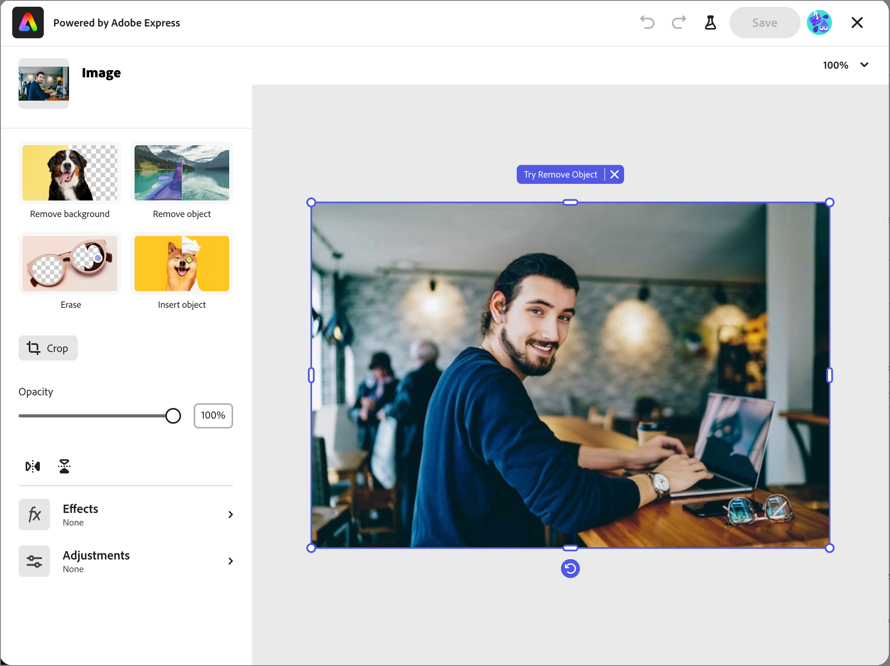

# Modificare le immagini con Adobe Express {#edit-images-adobe-express}

>[!CONTEXTUALHELP]
>id="ajo-b2b_assets_edit_adobe_express"
>title="Modificare le immagini in Adobe Express"
>abstract="Strumenti di editing delle immagini semplici e intuitivi, basati su tecnologia Adobe Express, sono disponibili direttamente all’interno di Adobe Journey Optimizer B2B edition per velocizzare la creazione dei contenuti."

Adobe Journey Optimizer B2B edition si integra in modo nativo con Adobe Express e consente di accedere a un set di strumenti di modifica delle immagini Adobe Express. Puoi utilizzare questi strumenti per modificare le immagini memorizzate nell’area di lavoro di Journey Optimizer B2B edition per l’archivio risorse di Marketo Engage connesso. L’integrazione offre i seguenti vantaggi chiave:

* È stato aumentato il riutilizzo dei contenuti modificando e salvando nuove risorse di immagini in Journey Optimizer B2B edition.

* Riduzione del tempo e dell&#39;impegno necessari per aggiornare le risorse immagine o creare nuove versioni di risorse immagine esistenti.

>[!NOTE]
>
>I diritti per le funzioni di modifica di Adobe Express sono inclusi in tutti gli abbonamenti a Journey Optimizer B2B edition.

Le funzioni di Adobe Express supportano i formati di file immagine PNG e JPEG.

_Per modificare un&#39;immagine :_

1. Vai alla navigazione a sinistra e fai clic su **[!UICONTROL Gestione contenuto]** > **[!UICONTROL Assets]**.

Questa azione apre una pagina di elenco con tutte le risorse elencate. L&#39;area di lavoro _[!UICONTROL Journey Optimizer B2B edition]_ è selezionata per impostazione predefinita.

1. Individua l’immagine da modificare o utilizza come originale per creare una nuova risorsa.

   * Per visualizzare le risorse per area di lavoro e cartella, apri la struttura facendo clic sull&#39;icona _Mostra cartelle_ in alto a sinistra.

   * Per ordinare la tabella in base a una delle colonne, fare clic sul titolo della colonna. La freccia nella riga del titolo indica la colonna e l&#39;ordine di ordinamento correnti.

   * Per cercare una risorsa immagine nell’area di lavoro o nella cartella selezionata, immetti una stringa di testo nella barra di ricerca.

   {width="800" zoomable="yes"}

1. Fai clic sul nome della risorsa immagine per aprirla e visualizzarne i dettagli.

   >[!TIP]
   >
   >È consigliabile selezionare [la scheda _[!UICONTROL Usato da]_](./marketo-engage-design-studio.md#view-asset-used-by-references) nei dettagli dell&#39;immagine e rivedere il contenuto in cui l&#39;immagine è attualmente utilizzata prima di procedere con le modifiche al file di immagine.

1. Nell&#39;immagine _[!UICONTROL Dettagli]_ a destra, fare clic su **[!UICONTROL Modifica con Adobe Express]**.

   {width="600" zoomable="yes"}

   Se l&#39;immagine è in uso, viene visualizzata una finestra di dialogo di avviso che informa che le modifiche hanno effetto sul contenuto. Fai clic su **[!UICONTROL Continua]** per passare all&#39;editor di Adobe Express.

   {width="300"}

## Licenza Adobe Express Enterprise

Se disponi di una licenza Enterprise per Adobe Express, puoi accedere e utilizzare l’editor rapido. Queste funzionalità di editing includono operazioni per la regolazione delle immagini, come colore, luminosità, nitidezza, contrasto e ritaglio. Includono anche operazioni di _IA magic_, ad esempio la rimozione di sfondi, l&#39;inserimento e la rimozione di oggetti e la cancellazione di parti dell&#39;immagine.

>[!NOTE]
>
>La licenza Adobe Express Enterprise deve essere acquistata presso la stessa organizzazione IMS per accedere a queste funzionalità complete dell’editor da Journey Optimizer B2B edition. In qualità di membro individuale dell’organizzazione IMS, devi disporre di una licenza assegnata nell’istanza di Adobe Express. In caso contrario, l&#39;accesso ad Adobe Express è limitato alle [azioni rapide su Adobe Express](#quick-actions-in-adobe-express) da Journey Optimizer B2B edition.

{width="600" zoomable="yes"}

La [Guida utente di Adobe Express](https://helpx.adobe.com/it/express/web.html){target="_blank"} fornisce informazioni dettagliate sulle funzionalità di modifica disponibili.

## Azioni rapide in Adobe Express

Se non disponi di una licenza Adobe Express Enterprise, puoi accedere all’editor delle azioni rapide di Adobe Express.

1. Nell’editor delle azioni rapide di Adobe Express, seleziona una delle funzioni di modifica delle immagini per modificare l’immagine.

   * [**[!UICONTROL Ridimensiona immagine]**](#resize-image)
   * [**[!UICONTROL Rimuovi sfondo]**](#remove-background)
   * [**[!UICONTROL Ritaglia immagine]**](#crop-image)
   * [**[!UICONTROL Converti in PNG]**](#convert-file-format) (quando viene caricata un&#39;immagine JPEG)
   * [**[!UICONTROL Converti in JPEG]**](#convert-file-format) (quando viene caricata un&#39;immagine PNG)

   {width="600" zoomable="yes"}

1. Quando ritorni all&#39;editor principale delle azioni rapide di Adobe Express, fai clic su **[!UICONTROL Salva]** per salvare il file immagine modificato nell&#39;area di lavoro risorse di Journey Optimizer B2B edition con lo stesso nome di file.

## Ridimensiona immagine

1. Utilizza le impostazioni di ridimensionamento per ridurre o espandere l’immagine:

   * Selezionare un&#39;opzione **[!UICONTROL Proporzioni]**. Utilizza una dimensione standard per il contenuto digitale oppure scegli **[!UICONTROL Personalizzato]** se vuoi immettere valori per **[!UICONTROL Larghezza]** e **[!UICONTROL Altezza]** per soddisfare le tue esigenze.

   * Le _[!UICONTROL dimensioni originali]_ e _[!UICONTROL dimensioni compresse]_ visualizzate mostrano le modifiche di dimensione che si verificano se si applicano le modifiche. Lo strumento **[!UICONTROL Zoom e ritaglio]** consente di controllare più da vicino le parti dell&#39;immagine visualizzata.

   * Per ripristinare lo stato originale dell&#39;immagine, fare clic su **[!UICONTROL Reimposta]**.

   {width="600" zoomable="yes"}

1. Quando si è soddisfatti del risultato, fare clic su **[!UICONTROL Applica]**.

## Rimuovi sfondo

{width="600" zoomable="yes"}

Adobe Express esegue una rimozione automatica dello sfondo per isolare l’oggetto principale nell’immagine. Se si è soddisfatti del risultato, fare clic su **[!UICONTROL Applica]**.

## Ritaglia immagine

1. Trascina le maniglie agli angoli dell’immagine per rimuovere le aree esterne che non desideri includere nella risorsa immagine.

   {width="600" zoomable="yes"}

1. Quando si è soddisfatti del risultato, fare clic su **[!UICONTROL Applica]**.

## Converti formato file

* **[!UICONTROL Converti in JPEG]** - Per un&#39;immagine PNG, è possibile convertirla in un file di immagine JPEG e salvarla come nuova risorsa nell&#39;area di lavoro.
* **[!UICONTROL Converti in PNG]** - Per un&#39;immagine JPEG, è possibile convertirla in un file di immagine PNG e salvarla come nuova risorsa nell&#39;area di lavoro.

{width="600" zoomable="yes"}

1. Fare clic su **[!UICONTROL Applica]**.
