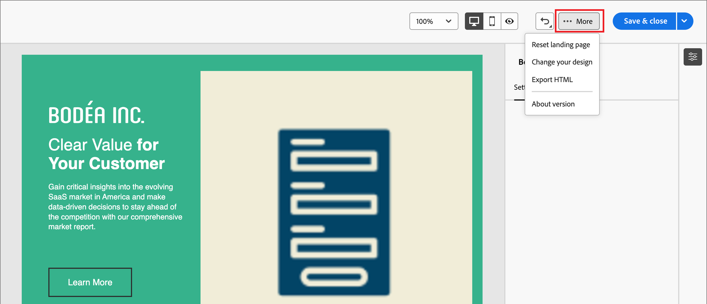

# Progettazione modello pagina di destinazione

Dopo aver [creato un modello di pagina di destinazione](./landing-page-templates.md#create-a-landing-page-template), utilizza lo spazio di progettazione visiva per creare i componenti struttura e contenuto nel modello di pagina.

## Aggiungere struttura e contenuto {#structure-content-landing-page}

{{$include /help/_includes/content-design-components.md}}

### Aggiungere CSS personalizzato

Puoi aggiungere un CSS personalizzato direttamente nello spazio di progettazione della pagina di destinazione. Utilizza CSS personalizzato per applicare uno stile avanzato e specifico, per una maggiore flessibilità e un maggiore controllo sull’aspetto del contenuto. È consigliabile aggiungere questo stile di livello più alto prima di includere componenti quali immagini, pulsanti e testo.

Con almeno un componente di contenuto nell&#39;area di lavoro, seleziona il componente **[!UICONTROL Corpo]** nella struttura di navigazione a sinistra per accedere all&#39;editor CSS personalizzato.

{width="800" zoomable="yes"}

{{$include /help/_includes/content-design-custom-css.md}}

### Aggiungere risorse

{{$include /help/_includes/content-design-assets.md}}

### Aggiungi moduli

{{$include /help/_includes/content-design-add-forms.md}}

### Spostarsi tra livelli, impostazioni e stili

{{$include /help/_includes/content-design-navigation.md}}

### Personalizzazione dei contenuti

{{$include /help/_includes/content-design-personalization.md}}

### Modifica tracciamento URL collegato

{{$include /help/_includes/content-design-links.md}}

### Salvare i dati

Fai clic su **[!UICONTROL Salva]** in qualsiasi momento per salvare il modello della pagina di destinazione.
<!--
You can continue to make edits to the draft page template. When you are ready to make it available for using in page creation, you can [publish the template](./landing-page-templates.md#). 
-->

### Opzioni di visualizzazione

Sfrutta le opzioni di convalida della visualizzazione e del contenuto disponibili nello spazio di progettazione visiva.

* Zoom in/out del contenuto tra le opzioni di zoom predefinite.

* Cambia la visualizzazione del contenuto tra desktop, dispositivi mobili o solo testo/solo testo.
   * Fai clic sull&#39;icona _Visualizza_ per l&#39;anteprima del contenuto tra i dispositivi.
   * Seleziona uno dei dispositivi predefiniti o immetti dimensioni personalizzate per visualizzare in anteprima il contenuto.

### Altre opzioni

Dal menu _[!UICONTROL Altro ...]_ nella parte superiore dello spazio di progettazione visiva, è possibile eseguire le azioni seguenti:

{width="500"}

* **[!UICONTROL Ripristina pagina di destinazione]** - Fare clic su questa opzione per cancellare l&#39;area di lavoro di progettazione visiva e ricominciare a creare il contenuto della pagina.
* **[!UICONTROL Modifica la progettazione]** - Torna alla _[!UICONTROL home page di creazione della pagina di destinazione principale]_. A questo punto è possibile scegliere un altro modello per riavviare il processo di progettazione oppure scegliere di progettare la pagina da zero in un&#39;area di lavoro vuota.
<!-- * **[!UICONTROL Save as content template]** - Save the page body as a landing page template to be reused across multiple landing pages. You provide a name and description for the template and save it to the list of saved  landing page templates. -->
* **[!UICONTROL Esporta HTML]** - Scarica il contenuto nell&#39;area di lavoro visiva nel tuo sistema locale in formato HTML racchiuso in un file zip.
