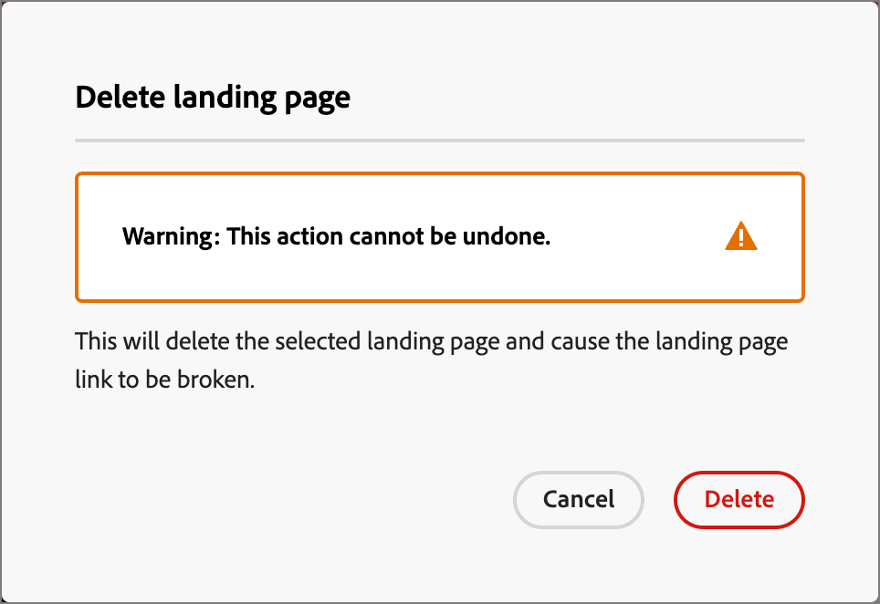

# Pagine di destinazione

Una pagina di destinazione è una pagina web indipendente in cui puoi indirizzare contatti e clienti dopo che hanno fatto clic su un elemento collegato in un’e-mail, un messaggio SMS o qualsiasi posizione digitale. Puoi incorporare queste pagine nei tuoi percorsi di account per consentire ai potenziali clienti e ai clienti di visualizzare i messaggi sul web e i progressi nei tuoi percorsi di account. Puoi creare, personalizzare e visualizzare in anteprima le pagine di destinazione nell’area di progettazione visiva della pagina di destinazione.

Per indirizzare i clienti a una pagina web definita quando fanno clic su un collegamento specifico, crea una pagina di destinazione in Journey Optimizer B2B edition.

* Creare la pagina
* Progettare la pagina di destinazione e creare i contenuti
* Verifica la pagina
* Pubblicare la pagina
* Collega alla pagina dal contenuto del percorso

Ad esempio, puoi creare e progettare pagine di destinazione per indirizzare gli utenti a informazioni online. La pagina potrebbe includere un modulo in cui gli utenti possono dare il consenso o rinunciare alla ricezione delle comunicazioni. Oppure potrebbe essere l&#39;opportunità di abbonarsi a comunicazioni ricorrenti, come una newsletter.

Nello spazio di progettazione visiva puoi creare, personalizzare e visualizzare in anteprima le pagine di destinazione.
<!-- 
For the Beta phase, you can only design landing pages from scratch and publish your landing pages. The landing pages will be served on adobe hosted domain for the Beta phase. The capability to define your branded domains for hosting will be delivered in a future release. -->

## Accedere e gestire le pagine di destinazione

Per accedere alle pagine di destinazione in Adobe Journey Optimizer B2B edition, vai alla navigazione a sinistra e fai clic su **[!UICONTROL Gestione contenuto]** > **[!UICONTROL Pagine di destinazione]**. Questa azione apre una pagina di elenco con tutte le pagine di destinazione create nell’istanza elencata in una tabella.

{width="800" zoomable="yes"}

La tabella è ordinata in base alla colonna _[!UICONTROL Modificato]_, con gli elementi aggiornati più di recente nella parte superiore per impostazione predefinita. Fai clic sul titolo della colonna per passare da crescente a decrescente.

### Filtrare l’elenco delle pagine di destinazione

Per cercare una pagina di destinazione per nome, immetti una stringa di testo nella barra di ricerca per trovare una corrispondenza. Fai clic sull&#39;icona _Filtro_ (  ) per visualizzare le opzioni di filtro disponibili e modificare le impostazioni per filtrare gli elementi visualizzati in base ai criteri specificati.

{width="700" zoomable="yes"}

### Personalizzare la visualizzazione delle colonne

Personalizza le colonne da visualizzare nella tabella facendo clic sull&#39;icona _Personalizza tabella_ (  ) in alto a destra.

Nella finestra di dialogo, seleziona le colonne da visualizzare e fai clic su **[!UICONTROL Applica]**.

{width="300"}

### Stato e ciclo di vita della pagina di destinazione

Lo stato della pagina di destinazione determina la disponibilità del collegamento nei contenuti e-mail e SMS e le modifiche che puoi apportare.

| Stato | Descrizione |
| -------------------- | ----------- |
| Bozza | Quando crei una pagina di destinazione, questa si trova nello stato Bozza. Rimane in questo stato mentre definisci o modifichi il contenuto visivo e fino a quando non lo pubblichi come pagina in hosting. Azioni disponibili: <ul><li>Modifica nome o descrizione<li>Modifica URL collegamento<li>Modifica nello spazio di progettazione visiva<li>Pubblica<li>Duplica<li>Elimina |
| Pubblicato | Quando pubblichi una pagina di destinazione, questa viene ospitata nell’istanza B2B edition di Journey Optimizer e diventa disponibile per il collegamento in un contenuto di e-mail o SMS. Azioni disponibili: <ul><li>Modifica nome o descrizione<li>Modifica URL collegamento<li>Aggiungere un collegamento nel contenuto di un messaggio e-mail o SMS<li>Crea versione bozza<li>Duplica<li>Elimina |
| Pubblicato con bozza | Quando crei una bozza da una pagina di destinazione pubblicata, la versione pubblicata rimane e il contenuto della bozza può essere modificato nello spazio di progettazione visiva. Se pubblichi la bozza della versione, questa sostituisce la versione pubblicata corrente e il contenuto viene aggiornato nella pagina ospitata. Azioni disponibili: <ul><li>Modifica nome o descrizione<li>Modifica URL collegamento<li>Aggiungere un collegamento nel contenuto di un messaggio e-mail o SMS<li>Modifica versione bozza in Visual Design Space<li>Pubblica versione bozza<li>Duplica<li>Elimina (elimina entrambe le versioni)<li>Elimina bozza (torna allo stato pubblicato) |

{zoomable="yes"}

## Creare una pagina di destinazione

Puoi aggiungere una nuova pagina di destinazione in Journey Optimizer B2B edition facendo clic su **[!UICONTROL Crea pagina di destinazione]** in alto a destra.

1. Nella finestra di dialogo _[!UICONTROL Crea pagina di destinazione]_, immetti un **[!UICONTROL Nome]** e una **[!UICONTROL Descrizione]** utili (facoltativi).

   Requisiti della pagina di destinazione:

   * Nome: massimo 100 caratteri, deve essere univoco, senza distinzione tra maiuscole e minuscole

   * Descrizione: massimo 300 caratteri

   * Alpha, caratteri numerici e speciali sono consentiti

   * I caratteri riservati sono **_non consentiti_**: `\ / : * ? " < > |`

   {width="400"}

1. Se necessario e se sono configurati più sottodomini, modifica il **[!UICONTROL Sottodominio]** da utilizzare per la pagina di destinazione.

1. Fai clic su **[!UICONTROL Crea]**.

   Viene aperta la home page di _[!UICONTROL Crea pagina di destinazione principale]_ e sono disponibili più opzioni per la creazione della pagina: _[!UICONTROL Progetta da zero]_, _[!UICONTROL Importa HTML]_ o utilizza un modello salvato.

   {width="800" zoomable="yes"}

   Dopo aver selezionato il metodo da utilizzare per avviare la progettazione della pagina di destinazione, utilizzare lo spazio di progettazione visiva per [progettare la pagina](./landing-page-design.md).

### Creare da zero

Utilizza l’editor di contenuto visivo per definire la struttura del contenuto della pagina di destinazione. Aggiungendo e spostando componenti strutturali con semplici azioni di trascinamento della selezione, puoi progettare la forma del contenuto della pagina in pochi secondi.

1. Dalla home page _[!UICONTROL Crea la pagina di destinazione principale]_, seleziona l&#39;opzione **[!UICONTROL Progetta da zero]**.

1. [Aggiungi struttura e contenuto](./landing-page-design.md#add-structure-and-content) alla pagina.

### Importa HTML

Adobe Journey Optimizer B2B edition consente di importare contenuti HTML esistenti per progettare le pagine di destinazione.

{{$include /help/_includes/content-design-import.md}}

{width="500"}

>[!NOTE]
>
>L&#39;utilizzo di un tag `<table>` come primo livello in un file HTML può causare la perdita di stile, incluse le impostazioni di sfondo e larghezza nel tag del livello superiore.

Puoi personalizzare il contenuto importato in base alle esigenze con lo spazio di progettazione visiva.

### Seleziona un modello salvato

Puoi scegliere tra:

* **Modelli di esempio**. L’interfaccia di Journey Optimizer offre una raccolta di modelli di pagina di destinazione pronti all’uso tra cui puoi scegliere.

* **Modelli salvati**. Utilizza un modello personalizzato salvato creato da un membro dell&#39;organizzazione utilizzando il menu _[!UICONTROL Modelli]_ <!-- or the _[!UICONTROL Save as content template]_ option when designing a landing page. -->

Utilizza la sezione _[!UICONTROL Seleziona modello struttura]_ per iniziare a creare il contenuto da un modello. Puoi utilizzare un modello di esempio o un modello di pagina di destinazione personalizzato salvato dall’istanza di Journey Optimizer B2B edition.

>[!BEGINTABS]

>[!TAB Modelli salvati]

Nella home page _Crea la pagina di destinazione principale_, la scheda _Modelli di esempio_ è selezionata per impostazione predefinita. Per utilizzare un modello personalizzato, selezionare la scheda **[!UICONTROL Modelli salvati]**.

Viene visualizzato l’elenco di tutti i modelli di pagina di destinazione salvati. Puoi ordinarli per _[!UICONTROL Nome]_, _[!UICONTROL Ultima modifica]_ e _[!UICONTROL Ultima creazione]_.

{width="700" zoomable="yes"}

Selezionare il modello desiderato dall&#39;elenco.

Dopo la selezione, viene visualizzata un&#39;anteprima del modello. In modalità anteprima puoi spostarti tra tutti i modelli di una categoria (campione o salvato, a seconda della selezione) utilizzando le frecce destra e sinistra.

{width="800" zoomable="yes"}

Quando la visualizzazione corrisponde a quella che si desidera utilizzare, fare clic su **[!UICONTROL Usa questo modello]** in alto a destra nella finestra di anteprima.

Questa azione copia il contenuto nello spazio di progettazione visiva, dove puoi modificarlo in base alle esigenze.

>[!TAB Modelli di esempio]

Adobe Journey Optimizer B2B edition offre una selezione di _modelli predefiniti_ di pagina di destinazione, che possono essere utilizzati per creare pagine di destinazione e modelli di pagina di destinazione personalizzati.

<!-- {width="800" zoomable="yes"} -->

>[!ENDTABS]

<!-- 
>[!NOTE]
>
> Saved templates may have governance (content locking) settings applied to one or more components. The visual designer provides guidelines about locked components when you [author an email from a governed template](./email-authoring-governance.md). -->

## Modificare una pagina di destinazione

Le modifiche apportate a una pagina di destinazione dipendono dal suo stato corrente:

* Quando una pagina di destinazione è in stato **_Bozza_**, puoi modificarne i dettagli, l&#39;URL e il contenuto visivo.
* Quando una pagina di destinazione si trova nello stato **_Pubblicato_**, puoi modificare la descrizione, ma non il nome. Per modificare il contenuto visivo, è necessario creare una versione bozza della pagina.
* Quando una pagina di destinazione è in stato **_Pubblicato con bozza_**, la modifica dei dettagli è limitata alla descrizione. Puoi anche modificare il contenuto visivo della versione bozza.

>[!BEGINTABS]

>[!TAB Bozza]

1. Dalla pagina di elenco _[!UICONTROL Pagine di destinazione]_, fai clic sul nome della pagina di destinazione per aprirla.

   Viene visualizzata un’anteprima del contenuto visivo, con i dettagli della pagina di destinazione a destra.

1. Modifica uno dei dettagli, ad esempio nome e descrizione.

   {width="700" zoomable="yes"}

1. Per apportare modifiche al contenuto nello spazio di progettazione visivo, fare clic su **[!UICONTROL Modifica pagina di destinazione]**.

   Utilizza gli strumenti di progettazione visiva secondo necessità:

   * [Aggiungere struttura e contenuto](./landing-page-design.md#add-structure-and-content)
   * [Aggiungi Assets](./landing-page-design.md#add-assets)
   * [Spostarsi tra livelli, impostazioni e stili](./landing-page-design.md#navigate-the-layers-settings-and-styles)
   * [Personalizzare il contenuto](./landing-page-design.md#personalize-content)
   * [Modifica tracciamento URL collegato](./landing-page-design.md#edit-linked-url-tracking)

1. Fai clic su **[!UICONTROL Salva]** o **[!UICONTROL Salva e chiudi]** per tornare ai dettagli della pagina di destinazione.

1. Quando la pagina soddisfa i criteri e desideri renderla disponibile per la visualizzazione, fai clic su **[!UICONTROL Pubblica]**.

>[!TAB Pubblicato]

1. Dalla pagina di elenco _[!UICONTROL Pagina di destinazione]_, fare clic sul nome della pagina per aprirla.

   Viene visualizzata un’anteprima del contenuto visivo, con i dettagli della pagina di destinazione a destra.

1. Se necessario, modifica la descrizione.

   Per una pagina di destinazione pubblicata, tutti gli altri dettagli non possono essere modificati.

1. Se desideri aggiornare il contenuto, fai clic su **[!UICONTROL Modifica pagina di destinazione]** a destra.

   Fare clic su **[!UICONTROL Crea bozza versione]** nella finestra di dialogo per aprire la bozza versione nello spazio di progettazione visivo.

   {width="300"}

   Utilizza gli strumenti di progettazione visiva secondo necessità:

   * [Aggiungere struttura e contenuto](./landing-page-design.md#add-structure-and-content)
   * [Aggiungi Assets](./landing-page-design.md#add-assets)
   * [Spostarsi tra livelli, impostazioni e stili](./landing-page-design.md#navigate-the-layers-settings-and-styles)
   * [Personalizzare il contenuto](./landing-page-design.md#personalize-content)
   * [Modifica tracciamento URL collegato](./landing-page-design.md#edit-linked-url-tracking)

1. Fai clic su **[!UICONTROL Salva]** o **[!UICONTROL Salva e chiudi]** per tornare ai dettagli della pagina di destinazione.

1. Quando la bozza della pagina di destinazione soddisfa i criteri e desideri rendere le modifiche disponibili nella pagina pubblicata, fai clic su **[!UICONTROL Pubblica]**.

   Quando pubblichi la versione bozza, questa sostituisce la versione pubblicata corrente e il contenuto viene aggiornato per l’URL della pagina.

>[!TAB Pubblicato con bozza]

Quando apri la pagina di destinazione, per impostazione predefinita viene visualizzata la versione bozza. Le schede nella parte superiore dello spazio di anteprima consentono di alternare la visualizzazione tra la versione pubblicata e quella bozza. Le bozze delle azioni e dei dettagli sono visualizzate a destra.

{width="700" zoomable="yes"}

Per aggiornare il contenuto:

1. Fai clic su **[!UICONTROL Modifica pagina di destinazione]** in alto a destra. Utilizza gli strumenti di progettazione visiva secondo necessità:

   * [Aggiungere struttura e contenuto](./landing-page-design.md#add-structure-and-content)
   * [Aggiungi Assets](./landing-page-design.md#add-assets)
   * [Spostarsi tra livelli, impostazioni e stili](./landing-page-design.md#navigate-the-layers-settings-and-styles)
   * [Personalizzare il contenuto](./landing-page-design.md#personalize-content)
   * [Modifica tracciamento URL collegato](./landing-page-design.md#edit-linked-url-tracking)

1. Fai clic su **[!UICONTROL Salva]** o **[!UICONTROL Salva e chiudi]** per tornare ai dettagli della pagina di destinazione.

1. Quando la pagina della bozza soddisfa i criteri e desideri rendere disponibili le modifiche, fai clic su **[!UICONTROL Pubblica]**.

   Quando pubblichi la versione bozza, questa sostituisce la versione pubblicata corrente e il contenuto viene aggiornato nella pagina ospitata.

>[!ENDTABS]

### Controllare gli avvisi

Durante la progettazione del contenuto della pagina di destinazione, gli avvisi vengono visualizzati nell’interfaccia (in alto a destra) quando mancano le impostazioni chiave.

{width="250"}

Se non trovi questo pulsante, non sono stati rilevati problemi.

È possibile rilevare due tipi di avvisi:

* **_Avvisi_** che fanno riferimento a consigli e best practice, ad esempio:

   * `Placeholder links are present in the landing page body`: non dimenticare di sostituire i segnaposto con collegamenti validi.

   * `Text version of HTML is empty`: non dimenticare di definire una versione testuale del corpo della pagina, che viene utilizzata quando non è possibile visualizzare il contenuto HTML.

   * `Empty link is present in page body`: verificare che tutti i collegamenti nella pagina siano corretti.

* **_Errori_** che impediscono di testare o attivare il percorso o la campagna finché non vengono risolti, ad esempio:

   * `The landing page content is empty`: contenuto pagina obbligatorio.

## Duplicare una pagina di destinazione

Puoi duplicare una pagina di destinazione utilizzando uno dei seguenti metodi:

* Dalla pagina di elenco _[!UICONTROL Pagina di destinazione]_, fai clic sull&#39;icona _Altro_ (**...**) accanto al nome della pagina di destinazione e scegli **[!UICONTROL Duplica]**.
* Nella parte superiore destra della pagina dei dettagli della pagina di destinazione, fare clic su **[!UICONTROL ... Altro]** e scegli **[!UICONTROL Duplicato]**.

{width="600" zoomable="yes"}

Nella finestra di dialogo, inserisci un nome utile (univoco) e una descrizione (facoltativa). Fai clic su **[!UICONTROL Duplica]** per completare l&#39;azione.

{width="350"}

La pagina duplicata (nuova) viene quindi visualizzata nell&#39;elenco _Pagine di destinazione_.

## Eliminare una pagina di destinazione

Puoi eliminare una pagina di destinazione utilizzando uno dei seguenti metodi:

* Dalla pagina di elenco _[!UICONTROL Pagina di destinazione]_, fare clic sull&#39;icona _Altro_ (**...**) accanto al nome della pagina di destinazione e scegliere **[!UICONTROL Elimina]**.
* Nella parte superiore destra della pagina dei dettagli della pagina di destinazione, fare clic su **[!UICONTROL ... Altro]** e scegliere **[!UICONTROL Elimina]**.

Questa azione apre una finestra di dialogo di conferma. È possibile interrompere il processo facendo clic su **[!UICONTROL Annulla]** oppure su **[!UICONTROL Elimina]** per confermare l&#39;eliminazione.

{width="400"}

## Collegamento a una pagina di destinazione

In qualità di addetto al marketing o Designer che crea contenuti per e-mail, frammenti e pagine, puoi incorporare collegamenti alle pagine di destinazione pubblicate (live) create nell’istanza di Journey Optimizer B2B edition.

1. Quando lavori nello spazio di progettazione visiva per un frammento, un’e-mail, una pagina di destinazione o un modello, seleziona una parte di testo, un componente pulsante o un componente immagine per il collegamento.

   Le opzioni **[!UICONTROL Collegamento]** sono visualizzate nel pannello di destra.

1. Per l&#39;opzione **[!UICONTROL Tipo]**, scegliere **[!UICONTROL Pagina di destinazione]**.

   {width="700" zoomable="yes"}

1. Per l&#39;opzione **[!UICONTROL Pagina di destinazione]**, fare clic sull&#39;icona _Seleziona pagina_ (  ).

1. Nella finestra di dialogo Seleziona pagina di destinazione, imposta **[!UICONTROL Origine pagina di destinazione]** come **[!UICONTROL Journey Optimizer B2B edition]**, seleziona la casella di controllo per la pagina di destinazione dall&#39;elenco delle pagine pubblicate e fai clic su **[!UICONTROL Seleziona]**.

   {width="600" zoomable="yes"}

1. Per l&#39;opzione **[!UICONTROL Target]**, scegliere il comportamento della destinazione di collegamento:

   * **[!UICONTROL Nessuno]** - apre il collegamento utilizzando il comportamento predefinito del browser.
   * **[!UICONTROL Vuoto]** - apre il collegamento in una nuova finestra o scheda.
   * **[!UICONTROL Autonomo]** - apre il collegamento nello stesso frame.
   * **[!UICONTROL Elemento padre]** - apre il collegamento nel frame principale.
   * **[!UICONTROL Top]** - apre il collegamento nel corpo completo della finestra.

1. (Solo collegamento di testo) Per sottolineare il testo collegato, selezionare la casella di controllo **[!UICONTROL Sottolinea collegamento]**.

   Puoi impostare stili aggiuntivi per il testo del collegamento, incluso il colore del collegamento, selezionando la scheda **[!UICONTROL Stili]** nel pannello di destra.
