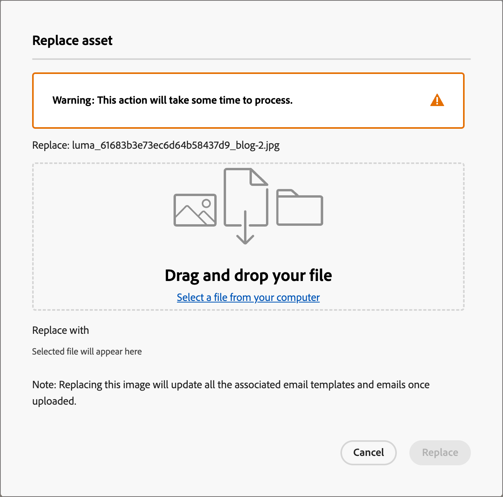

# Utilizzare le risorse di Marketo Engage

Marketo Engage Design Studio è l&#39;origine predefinita delle risorse per Journey Optimizer B2B edition e puoi gestire e utilizzare facilmente le risorse disponibili per progettare contenuti che supportano i percorsi del tuo account.

In Marketo Engage, le organizzazioni di marketing utilizzano le aree di lavoro per organizzare le risorse di contenuto e aiutare i team ad accedere alla risorsa corretta. Spazi di lavoro ben definiti sono particolarmente utili per le grandi aziende che hanno un ampio portafoglio di offerte di prodotti o operano a livello globale con requisiti diversi per il marketing in aree geografiche diverse.

## Gestione centralizzata delle risorse

Per impostazione predefinita, è disponibile un&#39;area di lavoro **_[!UICONTROL Journey Optimizer B2B edition]_** che è possibile utilizzare in modo specifico per il contenuto del percorso di account. Le risorse aggiunte a questa area di lavoro non sono visibili o disponibili per l’utilizzo in Marketo Engage. Per le risorse che risiedono in questa area di lavoro, disponi di tutte le funzioni di gestione risorse di Journey Optimizer B2B edition. Queste funzioni includono:

* [Sostituisci](#replace-assets)
* [Elimina](#delete-assets)
* [Sposta](#create-a-folder)
* [Modifica con Adobe Express](./image-edit-adobe-express.md)

Assets, che risiede nelle aree di lavoro di Marketo Engage, è limitato all’accesso in sola lettura per l’utilizzo in e-mail, modelli e frammenti di e-mail. Puoi aggiungere nuove risorse a queste aree di lavoro e scaricare una copia di una risorsa.

## Sfogliare e accedere alle risorse

Per accedere alle risorse Adobe Marketo Engage da Journey Optimizer B2B edition, passa alla navigazione a sinistra e fai clic su **[!UICONTROL Gestione contenuto]** > **[!UICONTROL Assets]**. Questa azione apre una pagina di elenco con tutte le risorse elencate.

{width="800" zoomable="yes"}

L&#39;area di lavoro di Journey Optimizer B2B edition è selezionata per impostazione predefinita. Le altre aree di lavoro sono elencate di seguito.

* Per visualizzare le risorse per area di lavoro e cartella, apri la struttura facendo clic sull&#39;icona _Mostra cartelle_ in alto a sinistra.

* Per ordinare la tabella in base a una delle colonne, fare clic sul titolo della colonna. La freccia nella riga del titolo indica la colonna e l&#39;ordine di ordinamento correnti.

* Per cercare una risorsa immagine nell’area di lavoro o nella cartella selezionata, immetti una stringa di testo nella barra di ricerca.

* Per personalizzare le colonne visualizzate nella tabella, fai clic sull&#39;icona _Personalizza tabella_ (  ) in alto a destra.

  Selezionare le colonne da visualizzare nell&#39;elenco e fare clic su **[!UICONTROL Applica]**.

## Visualizza dettagli risorsa

Fai clic sul nome di una risorsa per aprirne la pagina dei dettagli.

{width="700" zoomable="yes"}

## Visualizza riferimenti risorsa utilizzata da

Nella pagina dei dettagli della risorsa, fai clic sulla scheda **[!UICONTROL Usato da]** per visualizzare i dettagli sulla posizione in cui la risorsa è attualmente utilizzata all&#39;interno di Journey Optimizer B2B edition, tra e-mail, modelli e frammenti di e-mail.

>[!IMPORTANT]
>
>Qualsiasi risorsa attualmente _IN USO_ in uno dei messaggi e-mail, modelli e-mail o frammenti **non può** essere eliminata.

Il pannello visualizza i riferimenti per categoria: _E-mail_, _Modello e-mail_ o _Frammento_. Le e-mail in Journey Optimizer B2B edition vengono incorporate e create entro pochi percorsi, pertanto il percorso principale dell’e-mail che utilizza la risorsa viene visualizzato in riferimenti.

Fai clic sul collegamento per passare all’e-mail, al modello e-mail o al frammento corrispondenti in cui viene utilizzata la risorsa.

{width="700" zoomable="yes"}

## Aggiungere risorse

Dalla pagina dell&#39;elenco _Assets_ è possibile aggiungere risorse immagine all&#39;area di lavoro di Journey Optimizer B2B edition o a un&#39;area di lavoro di Marketo Engage.

1. Fai clic su **[!UICONTROL Aggiungi Assets]** in alto a destra.

1. Nella finestra di dialogo _[!UICONTROL Aggiungi risorse]_, trascina uno o più file dal sistema alla casella del file.

   {width="500"}

   Puoi anche fare clic sul collegamento _[!UICONTROL Seleziona un file dal computer]_ per utilizzare il file system locale per trovare e selezionare i file.

   Puoi caricare dal tuo sistema locale fino a 10 file alla volta. La dimensione massima del file è 100 MB.

   I nomi dei file delle immagini selezionate vengono visualizzati nella finestra di dialogo. I nomi dei file di risorse devono essere univoci (per tutte le cartelle) e, se esiste già un file con questo nome, viene visualizzato un messaggio. I nomi possono contenere un massimo di 100 caratteri e non possono contenere caratteri speciali (ad esempio `;`, `:`, `\` e `|`).

1. Seleziona l’area di lavoro o la cartella di destinazione in cui archiviare le risorse.

   >[!NOTE]
   >
   >Se si seleziona un percorso nell&#39;area di lavoro _[!UICONTROL Journey Optimizer B2B edition]_, è possibile gestire la risorsa nell&#39;app. Se aggiungete la risorsa a un&#39;area di lavoro Marketo Engage, le funzioni di gestione delle risorse sono disponibili solo in Marketo Engage Design Studio.

1. Per sovrascrivere (sostituire) i file quando si caricano uno o più file con un nome esistente, selezionare la casella di controllo **[!UICONTROL Sovrascrivi file esistenti]**.

1. Fai clic su **[!UICONTROL Aggiungi]**.

## Eliminare risorse

Non è possibile eliminare le risorse attualmente in uso in e-mail, modelli e frammenti di e-mail. Prima di avviare la rimozione di una risorsa, controlla i riferimenti utilizzati da. Inoltre, un’azione di eliminazione non può essere annullata, pertanto controlla prima di avviare un’azione di rimozione.

Utilizzare uno dei metodi seguenti per eliminare una risorsa che risiede nell&#39;area di lavoro _[!UICONTROL Journey Optimizer B2B edition]_:

* Vai ai dettagli della risorsa, fai clic su **[!UICONTROL ... Altro]** in alto a destra e scegli **[!UICONTROL Elimina]** tra le opzioni.

  {width="600" zoomable="yes"}

* Nella pagina dell&#39;inserzione _[!UICONTROL Assets]_, fai clic sull&#39;icona _Altro_ (**[!UICONTROL ...]**) accanto all&#39;elemento della risorsa e scegli **[!UICONTROL Elimina]** dalle opzioni.

  {width="600" zoomable="yes"}

  >[!NOTE]
  >
  >Solo le risorse che risiedono nell&#39;area di lavoro _[!UICONTROL Journey Optimizer B2B edition]_ dispongono di funzioni di gestione delle risorse disponibili nel menu _Altro_.

Questa azione apre una finestra di dialogo di conferma. È possibile interrompere il processo facendo clic su **[!UICONTROL Annulla]** oppure su **[!UICONTROL Elimina]** per confermare l&#39;eliminazione.

Se la risorsa è attualmente in uso, l’azione apre una finestra di dialogo informativa che avvisa che non può essere eliminata. Fare clic su **[!UICONTROL OK]** per interrompere la rimozione.

## Sostituire le risorse

Utilizzare uno dei metodi seguenti per sostituire una risorsa che risiede nell&#39;area di lavoro _[!UICONTROL Journey Optimizer B2B edition]_:

* Vai ai dettagli della risorsa, fai clic su **[!UICONTROL ... Altro]** in alto a destra e scegli **[!UICONTROL Sostituisci]** tra le opzioni.

* Nella pagina dell&#39;inserzione _[!UICONTROL Assets]_, fai clic sull&#39;icona _Altro_ (**[!UICONTROL ...]**) accanto all&#39;elemento della risorsa e scegli **[!UICONTROL Sostituisci]** tra le opzioni.

Nella finestra di dialogo _[!UICONTROL Sostituisci risorsa]_, trascina e rilascia il file di sostituzione dal sistema nella casella del file. Puoi anche fare clic sul collegamento _[!UICONTROL Seleziona un file dal computer]_ per utilizzare il file system locale per selezionare un file. Se si selezionano più file nel sistema locale, il primo file selezionato viene utilizzato per la sostituzione.

{width="500"}

Per continuare, fare clic su **[!UICONTROL Sostituisci]**. È possibile interrompere il processo facendo clic su **[!UICONTROL Annulla]**.

Se il file da sostituire è in uso, una finestra di dialogo ti avvisa che il nuovo file immagine sostituisce l’immagine in cui viene utilizzata (e-mail, modelli e frammenti e-mail).

## Scaricare le risorse

Puoi scaricare una risorsa utilizzando uno dei seguenti metodi:

* Vai ai dettagli della risorsa e fai clic su **[!UICONTROL Scarica]** in alto a destra.

* Nella pagina dell&#39;inserzione _[!UICONTROL Assets]_, fai clic sui _puntini di sospensione_ (**[!UICONTROL ...]**) accanto all&#39;elemento della risorsa e scegli **[!UICONTROL Scarica]** dalle opzioni.

Nella finestra di dialogo di conferma, fai clic su **[!UICONTROL Scarica]** per avviare il download della risorsa nel sistema locale. È possibile interrompere il processo facendo clic su **[!UICONTROL Annulla]**.

## Applica azioni in blocco alle risorse selezionate

Dalla pagina dell&#39;elenco (_[!UICONTROL Gestione contenuto]_ > _[!UICONTROL Assets]_), seleziona più risorse alla volta selezionando ogni casella di controllo a sinistra. Quando selezioni più risorse, nella parte inferiore viene visualizzato un banner di messaggio.

{width="700" zoomable="yes"}

Per le risorse selezionate che risiedono nell&#39;area di lavoro _[!UICONTROL Journey Optimizer B2B edition]_ è possibile eseguire le azioni in blocco seguenti:

+++Spostare le risorse

1. Nel banner di selezione, fare clic su **[!UICONTROL Sposta]**.

   Questa azione apre la finestra di dialogo _[!UICONTROL Sposta Assets]_, in cui sono elencati i nomi delle risorse selezionate e ti consente di selezionare la cartella _target_ in cui spostare queste risorse.

1. Seleziona una cartella.

   Il percorso accanto a _[!UICONTROL Risorse selezionate verrà spostato in:]_ riflette la modifica.

1. Fare clic su **[!UICONTROL Sposta]**.

+++

+++Eliminare risorse

>[!NOTE]
>
>Puoi applicare un’eliminazione in blocco per un massimo di 20 risorse selezionate.

1. Nel banner della selezione, fare clic su **[!UICONTROL Elimina]**.

1. Nella finestra di dialogo di conferma, fai clic su **[!UICONTROL Elimina]**.

   Se una delle risorse selezionate è attualmente in uso, la rimozione della risorsa viene interrotta e viene visualizzato un messaggio di avviso.

+++

## Creare una cartella

1. Nella pagina dell&#39;inserzione _[!UICONTROL Assets]_, fai clic su **[!UICONTROL Crea cartella]** in alto a destra.

1. Nella finestra di dialogo, immetti il nome della cartella e seleziona la cartella di destinazione (principale) per la nuova cartella.

   I nomi delle cartelle devono essere univoci, con un massimo di 100 caratteri, e non possono contenere caratteri speciali, ad esempio `;`, `:`, `\`, `|`.

   {width="500"}

1. Fai clic su **[!UICONTROL Aggiungi]**.

## Applicare azioni a livello di cartella

Nell&#39;area di lavoro _[!UICONTROL Journey Optimizer B2B edition]_ è possibile applicare azioni a una cartella o a risorse all&#39;interno della cartella. Fai clic sull&#39;icona _Altro_ (**...**) accanto alla cartella per visualizzare le azioni applicabili.

{width="700" zoomable="yes"}

A livello di cartella è possibile effettuare le seguenti operazioni:

+++Aggiungere risorse

1. Scegli **[!UICONTROL Aggiungi risorse]** per caricare i file immagine nella cartella.

1. Nella finestra di dialogo _[!UICONTROL Aggiungi risorse]_, trascina e rilascia i file dal sistema. È inoltre possibile fare clic sul collegamento per utilizzare il file system per selezionare i file.

   Puoi aggiungere dal sistema locale fino a 10 file alla volta. È possibile sovrascrivere i file quando si caricano uno o più file con un nome esistente.

   I nomi dei file delle immagini selezionate vengono visualizzati nella finestra di dialogo. I nomi dei file di risorse devono essere univoci (in più cartelle) e se esiste già un file con questo nome viene visualizzato un messaggio di errore. I nomi possono contenere un massimo di 100 caratteri e non possono contenere caratteri speciali (ad esempio `;`, `:`, `\` e `|`).

1. Fai clic su **[!UICONTROL Aggiungi]**.

+++

+++Creare una sottocartella

1. Scegliere **[!UICONTROL Crea cartella]**.

1. Nella finestra di dialogo, immetti il nome della cartella.

   I nomi delle cartelle devono essere univoci, con un massimo di 100 caratteri, e non possono contenere caratteri speciali, ad esempio `;`, `:`, `\`, `|`.

1. Fai clic su **[!UICONTROL Aggiungi]**.

+++

+++Rinomina la cartella

1. Scegliere **[!UICONTROL Rinomina]**.

1. Nella finestra di dialogo, immetti il nome della nuova cartella.

   I nomi delle cartelle devono essere univoci, con un massimo di 100 caratteri, e non possono contenere caratteri speciali, ad esempio `;`, `:`, `\`, `|`.

1. Fai clic su **[!UICONTROL Salva]**.

+++

+++Spostare la cartella

1. Per spostare la cartella in un&#39;altra cartella padre, scegliere **[!UICONTROL Sposta]**.

1. Nella finestra di dialogo, seleziona la cartella di destinazione come nuovo elemento principale per la sottocartella.

1. Fare clic su **[!UICONTROL Sposta]**.

   Se si tenta di spostare una cartella in una delle relative sottocartelle (all&#39;interno della struttura della cartella selezionata), viene visualizzato un messaggio di errore e lo spostamento viene annullato.

+++

+++Elimina la cartella

1. Scegliere **[!UICONTROL Elimina]**.

1. Nella finestra di dialogo di conferma, fai clic su **[!UICONTROL Elimina]**.

Se una delle risorse nella cartella è attualmente in uso, l’azione apre una finestra di dialogo di avviso per informarti che non può essere eliminata. Fare clic su **[!UICONTROL OK]** per interrompere la rimozione.

+++

+++Converti in una cartella di archivio

L&#39;archiviazione di una cartella rende impossibile eseguire ricerche nei relativi file. Utilizza la funzione di archiviazione per i file di risorse che non desideri vengano utilizzati in futuro dal membro del team, ad esempio un badge promozionale per un evento non aggiornato o contenuti stagionali. In seguito, puoi annullare l’archiviazione di una cartella se desideri che il contenuto sia nuovamente disponibile.

* Scegliere **[!UICONTROL Converti in cartella di archivio]**. Viene visualizzato un banner di conferma per confermare che lo stato della cartella è stato modificato in archiviato.

* Scegliere **[!UICONTROL Annulla archiviazione cartella]**. Viene visualizzato un banner di conferma per confermare che lo stato della cartella è stato modificato in non archiviato.

+++

## Utilizzare le risorse nel contenuto

Assets può essere utilizzato nell’e-mail del team, nel modello e-mail o nell’authoring di frammenti visivi dall’editor di contenuti visivi.

Nello spazio di progettazione visivo, seleziona l&#39;icona _Marketo Engage Assets_ (  ) nella barra laterale a sinistra.

Questa azione modifica il pannello strumenti che visualizza un elenco strutturato delle risorse disponibili nell’area di lavoro selezionata. Seleziona l’area di lavoro da visualizzare per scegliere una risorsa.

{width="700" zoomable="yes"}

Esistono diversi metodi per aggiungere una risorsa immagine all’area di lavoro visiva:

* Trascina e rilascia la miniatura di un’immagine dal menu di navigazione a sinistra.

* Aggiungi un componente immagine all&#39;area di lavoro e fai clic su **[!UICONTROL Marketo Engage Assets]** nel componente per aprire la finestra di dialogo _[!UICONTROL Seleziona risorsa da Adobe Marketo Engage]_.

  {width="700" zoomable="yes"}

  Dalla finestra di dialogo, puoi scegliere un’immagine dall’archivio selezionato. Fai clic su **[!UICONTROL Seleziona]** per aggiungere la risorsa.

  Sono disponibili alcuni strumenti per individuare la risorsa di cui hai bisogno:

   * Fai clic sull&#39;icona _Filtro_ in alto a sinistra per filtrare gli elementi visualizzati in base ai criteri.

   * Immetti il testo nel campo _Ricerca_ per filtrare gli elementi visualizzati in modo che corrispondano al nome della risorsa.

  {width="700" zoomable="yes"}
