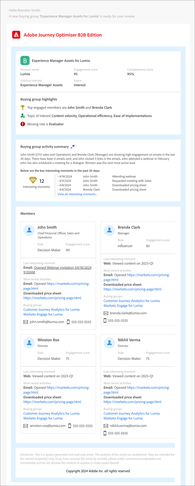

# E-mail di avviso vendite

Un messaggio e-mail di _avviso vendite_ segnala la consegna dei gruppi di acquisto alle vendite. L’e-mail contiene un riepilogo del gruppo di acquisto e informazioni sui membri del gruppo di acquisto e sulle loro attività.

In qualità di addetto al marketing, puoi configurare un nodo e-mail di avviso sulle vendite nei tuoi percorsi di account per avvisare il team di vendita del completamento del percorso per particolari gruppi di acquisto. All’interno del nodo, puoi specificare gli indirizzi e-mail del team vendite o un alias di distribuzione che raggiunge un set di account.

>[!IMPORTANT]
>
>Assicurati che il inserisco nell&#39;elenco Consentiti di della tua organizzazione sia aggiornato in modo da poter inviare un messaggio e-mail di avviso relativo alle vendite. Per ulteriori informazioni, consulta [Protocolli per il tracciamento e la consegna e-mail](../start/email-protocols.md).

## Contenuto e-mail

+++E-mail di avviso sulle vendite di esempio
{width="500" zoomable="yes"}

+++

| Sezione | Nome | Descrizione |
| - | ---- | ----------- |
| Informazioni sul gruppo di acquisto | Nome gruppo di acquisto | Nome visualizzato per il gruppo di acquisto. |
|   | Nome account | Nome dell’account. |
|   | Punteggio di coinvolgimento | Punteggio di coinvolgimento del gruppo di acquisto, in base alle attività di coinvolgimento attive negli ultimi 30 giorni. |
|   | Punteggio di completezza | Punteggio di completezza del gruppo di acquisto. |
|   | Interesse della soluzione | Interesse della soluzione collegato al gruppo di acquisto |
|   | Stato | Stato del gruppo di acquisto. |
| Punti salienti del gruppo acquisti | Membri principali coinvolti | Membri principali coinvolti del gruppo di acquisto per punteggio e ruolo del coinvolgimento dei membri del gruppo di acquisto. |
|   | Argomento di interesse | Parole chiave più frequenti che si verificano nel coinvolgimento dei contenuti, in base a e-mail, download, chat, revisione PDF, riepilogo delle attività e domande sui webinar. |
|   | Ruoli mancanti | Ruoli obbligatori nel modello ma mancanti nel gruppo di acquisto. |
| Riepilogo gruppo acquisti | Riepilogo delle attività (basato su IA generativa) | Riepilogo generato da IA del gruppo di acquisto in base alle attività dei membri. Vengono considerate le attività degli ultimi 30 giorni. |
|   | Momenti di interesse chiave | Recenti momenti interessanti relativi ai membri del gruppo di acquisto. |
| Membri | Elenco di quattro membri di acquisto | Dettagli dei quattro principali membri del gruppo di acquisto per punteggio e ruolo del coinvolgimento. |
| Ogni membro del gruppo di acquisto | Nome membro | Nome del membro del gruppo di acquisto. |
|   | Titolo | Titolo del membro del gruppo di acquisto. |
|   | Ruolo | Ruolo del gruppo Acquisti del membro. |
|   | Punteggio di coinvolgimento | Punteggio di coinvolgimento del membro del gruppo di acquisto. Il punteggio si basa sulle attività di coinvolgimento attive negli ultimi 30 giorni. |
|   | Ultimo momento interessante | Il momento più interessante recente relativo al membro. |
|   | Attività più recenti | Le ultime due attività relative al membro del gruppo di acquisto. |
|   | ID e-mail | ID e-mail del membro del gruppo di acquisto. |
|   | Numero di telefono | Numero di telefono del membro del gruppo di acquisto. |

## Aggiungere un’azione e-mail di avviso sulle vendite in un percorso di account

Puoi impostare le consegne e-mail per gli avvisi di vendita in un percorso di account quando aggiungi un nodo _[!UICONTROL Esegui un&#39;azione]_ ed effettua le seguenti operazioni:

1. Per l&#39;azione _[!UICONTROL sulla destinazione]_, scegliere **[!UICONTROL Account]**.

1. Per _[!UICONTROL Azione sugli account]_, scegli **[!UICONTROL Invia avviso vendite]**.

1. Per **[!UICONTROL Seleziona interesse soluzione]**, scegli l&#39;interesse soluzione da utilizzare per il contenuto e-mail generato.

1. Per **[!UICONTROL Invia e-mail a]**, immettere ogni indirizzo e-mail o alias che si desidera includere per la consegna.

   {width="600" zoomable="yes"}

   Dopo la pubblicazione del percorso dell’account, l’avviso di vendita viene inviato in base a questi parametri.
