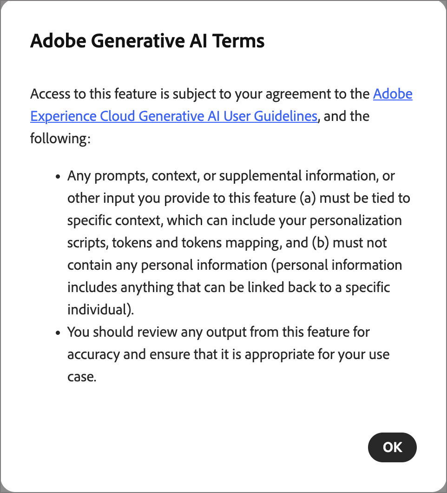

# Generatore di script

_Script Builder_ è un assistente basato sull&#39;intelligenza artificiale disponibile nello spazio di progettazione delle e-mail di [!DNL Adobe Journey Optimizer B2B Edition]. Consente agli addetti al marketing e agli sviluppatori di e-mail di creare script di personalizzazione più rapidamente e facilita la migrazione da [!DNL Marketo Engage] convertendo la logica di personalizzazione esistente in [!DNL Journey Optimizer B2B Edition] senza riscrivere il codice manualmente.

>[!AVAILABILITY]
>
>Script Builder è attualmente disponibile per alcuni clienti come versione beta limitata per le e-mail solo in **_percorsi di account_**. Il supporto per percorsi di persone è pianificato per una versione futura. Per ottenere l’accesso, contatta il tuo rappresentante Adobe.

Per creare la personalizzazione delle e-mail condizionali, ad esempio passare da un blocco di lingua all&#39;altro in base alle impostazioni internazionali, scambiare il contenuto in base all&#39;area geografica o all&#39;utente, oppure inserire valori di oggetti personalizzati o di profilo dinamico, è necessario creare _Handlebars_ espressioni. Se esegui la migrazione da [!DNL Marketo Engage], hai la sfida di riscrivere gli script _Velocity_ riga per riga. Script Builder risolve entrambi gli ostacoli da un’unica interfaccia di conversazione:

* Genera un nuovo script di personalizzazione Handlebars da una descrizione in linguaggio semplice.
* Incollare uno script Velocity [!DNL Marketo Engage] e convertirlo in uno script Handlebars equivalente con mappatura token automatica.
* Puoi visualizzare in anteprima, modificare, convalidare e salvare l’output direttamente nell’e-mail, senza copiare e incollare tra gli strumenti.

## Linee guida e limitazioni

>[!IMPORTANT]
>
>L&#39;accesso utente a Script Builder è controllato tramite le stesse autorizzazioni utilizzate per altre funzionalità di IA generativa in [!DNL Journey Optimizer B2B Edition]. Per informazioni sulla concessione delle autorizzazioni per le funzionalità, vedere [Abilitare l&#39;accesso all&#39;Assistente AI](../ai-assistant/enable-ai-assistant-access.md).

Prima di utilizzare Script Builder, rivedere le [linee guida e limitazioni](../ai-assistant/generative-ai-content.md#general-guidelines-and-limitations) applicabili alle funzionalità di intelligenza artificiale generativa in [!DNL Journey Optimizer B2B Edition]. Per poter utilizzare le funzionalità di intelligenza artificiale è inoltre necessario accettare il [Contratto utente](https://www.adobe.com/it/legal/licenses-terms/adobe-gen-ai-user-guidelines.html){target="_blank"}.

Acquisisci familiarità con il [linguaggio di modelli Handlebars](https://handlebarsjs.com/guide/){target="_blank"}, la [sintassi di personalizzazione](./personalization-syntax.md) e le [funzioni helper](./personalization-helper-functions.md) supportate in [!DNL Journey Optimizer B2B Edition]. Script Builder genera Handlebars valide, ma comprendere la sintassi ti aiuta a rivedere e modificare l’output con affidabilità.

## Apri Generatore di script {#open-script-builder}

Script Builder è disponibile dall&#39;[editor di personalizzazione](./personalization.md) mentre [crei contenuti e-mail](./email-authoring.md) per un percorso di account.

1. Nell’area di progettazione e-mail, seleziona il componente in cui desideri aggiungere o sostituire uno script di personalizzazione.

1. Per aprire l&#39;editor di personalizzazione, fai clic sull&#39;icona _Aggiungi personalizzazione_ (  ).

1. Nell&#39;editor, selezionare **[!UICONTROL Generatore di script]**.

   {width="700" zoomable="yes"}

   >[!BEGINSHADEBOX]

   La prima volta che accedi a Script Builder, controlla le [_[!UICONTROL Condizioni d&#39;uso di IA generativa &#x200B;]_](https://www.adobe.com/it/legal/licenses-terms/adobe-gen-ai-user-guidelines.html){target="_blank"} e conferma il tuo contratto.

   {width="400"}

   >[!ENDSHADEBOX]

   Il pannello Generatore di script si apre con un&#39;interfaccia di chat conversazionale.

   {width="700" zoomable="yes"}

1. Avvia la chat in base a ciò che desideri fare:

   * [Genera un nuovo script](#generate-personalization-script)
   * [Convertire uno script Velocity esistente](#convert-marketo-velocity-script)

## Generare uno script di personalizzazione {#generate-personalization-script}

Utilizza Script Builder per creare un nuovo script di personalizzazione Handlebars da una descrizione in linguaggio semplice, senza scrivere personalmente l’espressione.

Script Builder include una libreria di mappatura che risolve i campi lead e account [!DNL Marketo Engage] nei loro attributi di profilo XDM [!DNL Journey Optimizer B2B Edition] equivalenti, in base al [mapping dei campi XDM](../admin/xdm-field-management.md) definito per la tua organizzazione.

1. Nell’interfaccia di chat di Script Builder, descrivi la logica di personalizzazione desiderata.

   Ad esempio, descrivi l’attributo, l’oggetto personalizzato o la condizione che determina la variante di contenuto da visualizzare.

1. Rivedi lo script Handlebars generato nel riquadro di anteprima.

1. Se desideri perfezionare la logica o il testo, modifica lo script direttamente nel riquadro di anteprima.

1. Fai clic su **[!UICONTROL Convalida]** per verificare lo script in base allo schema [!DNL Journey Optimizer B2B Edition].

   La convalida rileva gli errori di sintassi e i riferimenti ai token non risolti prima di salvare lo script, in modo che la personalizzazione interrotta non venga mai pubblicata in un messaggio e-mail live.

1. Fai clic su **[!UICONTROL Salva]** per inserire lo script direttamente nel percorso selezionato nell&#39;e-mail.

## Conversione di uno script Marketo Engage Velocity {#convert-marketo-velocity-script}

Utilizza Script Builder per migrare uno script Velocity [!DNL Marketo Engage] esistente in uno script Handlebars equivalente per [!DNL Journey Optimizer B2B Edition].

1. Nella chat di Script Builder, immetti `Convert this` e incolla lo script Velocity che desideri convertire.

   Script Builder analizza i costrutti Velocity, associa i riferimenti del token agli attributi del profilo XDM e genera lo script Handlebars equivalente.

1. Rivedi il [rapporto conversione](#review-conversion-report) e [risolvi eventuali token che richiedono la mappatura manuale](#resolve-tokens-without-mapping).

1. [Anteprima e convalida](#preview-validate-script) dello script generato, quindi salvalo direttamente nell&#39;e-mail.

### Costrutti Velocity supportati {#supported-velocity-constructs}

Script Builder converte i seguenti costrutti del flusso di controllo Velocity [!DNL Marketo Engage] nelle espressioni Handlebar o Contenuto condizionale equivalenti:

| Costruzione Velocity | Handlebars o Contenuto condizionale equivalente |
| ------------------- | --------------------------------------------- |
| `#if` / `#elseif` / `#else` | Handlebars `{{#if}}`, `{{else if}}` e `{{else}}` block helpers o una regola [!DNL Journey Optimizer B2B Edition] [di contenuto condizionale](./conditional-content.md) |
| `#set` | Assegnazione di una variabile Handlebars nello script generato |

Traduce la logica condizionale basata su segmenti in [regole di contenuto condizionale](./conditional-content.md) che replicano il comportamento di diramazione, incluse le e-mail con molti blocchi di varianti di linguaggio.

Se un costrutto Velocity non dispone di Handlebar diretti o di un equivalente di Contenuto condizionale, Script Builder lo contrassegna nel [report di conversione](#review-conversion-report) invece di generare un&#39;espressione incompleta o errata.

### Rivedi il rapporto di conversione {#review-conversion-report}

Dopo ogni conversione, Script Builder genera un rapporto strutturato che elenca:

* Token mappati correttamente.
* Token che richiedono la risoluzione manuale.
* Velocity costruisce senza un equivalente diretto di Handlebars.

Utilizza il rapporto per confermare che la conversione è stata completata prima di risolvere gli eventuali token rimanenti e salvare lo script.

### Risolvere i token senza mappatura {#resolve-tokens-without-mapping}

Per i token non inclusi nella libreria di mappatura, ad esempio attributi lead personalizzati o oggetti [!DNL Marketo Engage] personalizzati, Script Builder tenta di risolvere una mappatura nell&#39;ordine seguente:

1. Suggerisce una probabile mappatura basata sui campi XDM disponibili e, per gli oggetti personalizzati, sulle [classi basate su modello](./personalization.md#custom-datasets) configurate per la tua organizzazione, quando esiste una corrispondenza sicura.

1. Se non può suggerire una corrispondenza sicura, ti chiede la mappatura corretta nella chat.

Quando confermi una mappatura per un token che non era nella libreria, Script Builder chiede se desideri ricordare la decisione. Se si accetta, la mappatura viene memorizzata per l&#39;istanza di origine [!DNL Marketo Engage], identificata dal relativo ID Munchkin, in modo che lo stesso token venga risolto automaticamente alla successiva conversione di uno script da tale istanza.

### Anteprima e convalida dello script {#preview-validate-script}

Prima di confermare una conversione, Script Builder visualizza un’anteprima affiancata dello script Velocity originale e dell’output Handlebars generato, con il supporto per la modifica in linea. Utilizza l’anteprima per confrontare le due versioni e apportare le modifiche direttamente nello script generato.

Fai clic su **[!UICONTROL Convalida]** per verificare che le Handlebar generate siano conformi allo schema [!DNL Journey Optimizer B2B Edition]. La convalida viene eseguita nuovamente al momento del salvataggio, in modo che la personalizzazione interrotta non venga mai pubblicata in un messaggio e-mail live.

Quando si è soddisfatti del risultato, fare clic su **[!UICONTROL Salva]** per inserire lo script direttamente nel percorso scelto nell&#39;e-mail.

<!--
### Save reusable conversion profiles {#save-reusable-conversion-profiles}

Save your field mappings and segment mappings as a reusable conversion profile so that your token schema does not need to be re-entered for each script or migration batch. Select a saved profile at the start of a conversion to apply its mappings automatically.

### Audit logs {#conversion-audit-logs}

Script Builder records an audit log for every conversion event, including which scripts were processed, which tokens were remapped, which tokens required manual intervention, and who approved the final output. Use the audit log to review migration activity across your organization.

-->
