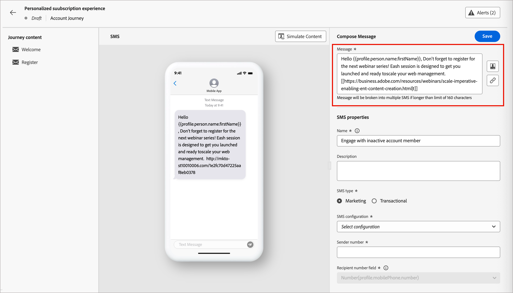
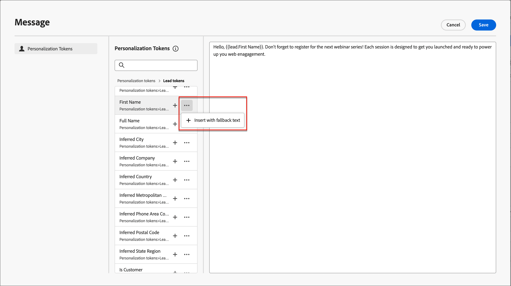
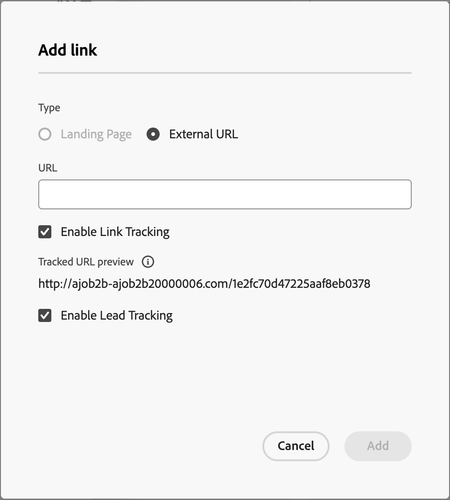
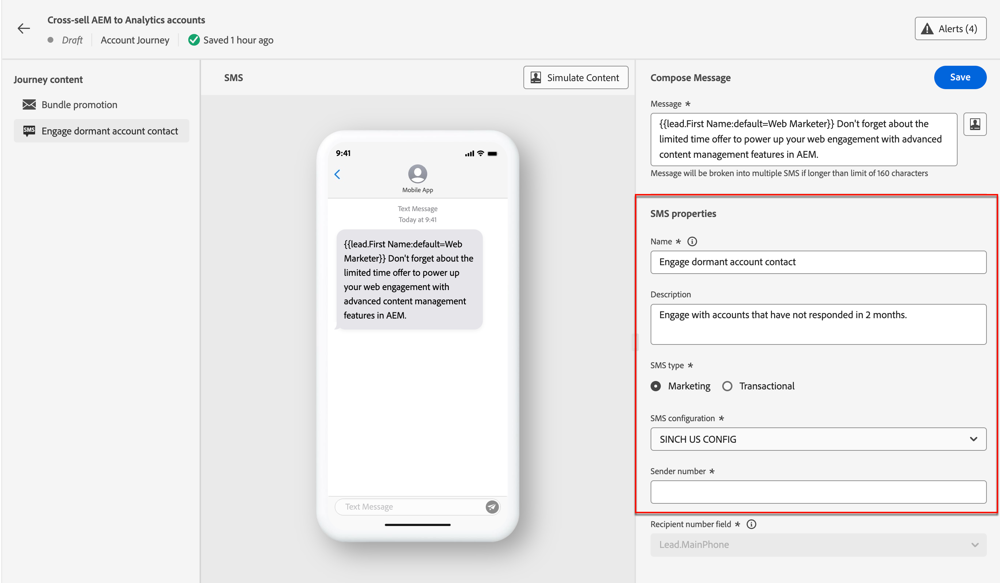

# Authoring di SMS

Utilizza Adobe Journey Optimizer B2B edition per inviare SMS ai clienti sui loro dispositivi mobili. Puoi creare, personalizzare e visualizzare in anteprima i messaggi in formato testo dall’editor SMS.

Prima di creare messaggi SMS per percorsi di account, verificare che il provider di servizi SMS [sia configurato](../admin/configure-channels-sms.md) dalle impostazioni _[!UICONTROL Amministratore]_.

>[!IMPORTANT]
>
>**Gestione del consenso SMS** 
>
>In conformità agli standard e alle normative del settore, tutti i messaggi SMS di marketing devono consentire ai destinatari di annullare facilmente l’abbonamento. A questo scopo, i destinatari di SMS possono rispondere con parole chiave di consenso e rinuncia. Tutte le parole chiave di consenso e rinuncia standard sono supportate e rispettate. Sono inoltre supportate e rispettate tutte le parole chiave personalizzate configurate per l’account del provider di servizi SMS. Per informazioni dettagliate sulla valutazione delle preferenze di consenso SMS al momento della consegna, consulta [Preferenze di consenso](./channels-consent-preferences.md).

## Aggiungere un’azione SMS in un percorso di account {#add-action}

Puoi impostare le consegne di messaggi di testo in un percorso di account quando aggiungi un nodo _[!UICONTROL Esegui un&#39;azione]_ ed effettua le seguenti operazioni:

1. Per l&#39;azione _[!UICONTROL sulla destinazione]_, scegliere **[!UICONTROL Persone]**.

1. Per l&#39;_[!UICONTROL azione sulle persone]_, scegli **[!UICONTROL Invia SMS]**.

   {width="800" zoomable="yes"}

1. Nella parte inferiore del pannello _[!UICONTROL Esegui un&#39;azione]_, fai clic su **[!UICONTROL Crea SMS]**.

1. Nella finestra di dialogo, immetti un **[!UICONTROL Nome]** univoco per il messaggio SMS.

   {width="400"}

1. Fai clic su **[!UICONTROL Crea]**.

   Viene aperta la mappa del _Percorso_ ed è possibile creare il messaggio e impostare le proprietà SMS per l&#39;invio del messaggio.

### Creare il messaggio SMS {#create-message}

Immetti il testo da inviare nel campo **[!UICONTROL Messaggio]**.

Puoi creare un messaggio composto da un massimo di 1600 caratteri, ogni 160 caratteri vengono considerati come un singolo messaggio SMS.

{width="800" zoomable="yes"}

#### Personalizzare il messaggio di testo {#personalize}

1. Posiziona il cursore nel punto del messaggio in cui desideri aggiungere il token di personalizzazione.

1. Fai clic sull&#39;icona _Personalizza_ (  ) a destra della casella di testo.

   La finestra di dialogo consente di accedere ai token dell’account, ai token di persona e ai token di sistema. Sono inclusi sia i token standard che quelli personalizzati. È possibile utilizzare la barra di _Ricerca_ per individuare il token necessario oppure spostarsi nella struttura delle cartelle per trovare e selezionare uno dei token.

1. Aggiungere un token facendo clic sul simbolo più ( **+** ) accanto a esso.

   Se desideri aggiungere il token con un fallback, fai clic sull&#39;icona _Altro_ ( **...** ) e scegli **[!UICONTROL Inserisci con testo di fallback]**. Il fallback è l’impostazione predefinita che viene visualizzata se tale campo non è disponibile per un lead.

   {width="700" zoomable="yes"}

1. Nella finestra di dialogo _[!UICONTROL Immetti valore di fallback]_, immetti il testo che viene visualizzato come fallback, quindi fai clic su **[!UICONTROL Aggiungi]**.

   {width="450"}

1. Una volta inseriti i token di personalizzazione, fai clic su **[!UICONTROL Salva]** per salvare le modifiche e tornare all&#39;area di lavoro di authoring SMS principale.

   Puoi continuare a modificare il messaggio con i token, in base alle esigenze.

#### Aggiungere collegamenti (URL) al messaggio di testo {#add-links}

1. Dopo aver immesso il testo del messaggio, fai clic sull&#39;icona _Collegamento_ (  ) a destra della casella di testo.

1. Immetti l&#39;**[!UICONTROL URL]** per il collegamento.

1. Nella finestra di dialogo, scegli il tipo di URL da collegare:

   * **[!UICONTROL Pagina di destinazione]** - Scegliere questa opzione per selezionare una delle pagine di destinazione pubblicate.

   * **[!UICONTROL URL esterno]** - Questo tipo è qualsiasi URL esterno immesso nella casella di testo.

<!--

1. If you choose to use a Marketo Engage landing page, set the tracking options.

   * **[!UICONTROL Enable tracking]** - Select this checkbox to enable tracking, which requires _shortening_ the URL. For a landing page, it uses the Marketo Engage subdomain for the shortened URL. A sample of the shortened URL format is displayed. The actual URL is created when the SMS is sent to the recipient.

   * **[!UICONTROL Include mkt_tok]** - Select this checkbox to track activity against a user. 

      >[!NOTE] 
      >
      >When you allow tracking but disable _[!UICONTROL Include mkt_tok]_, the destination URL does not include the `mkt_tok` query string parameter after redirect. This parameter is used by Marketo Engage landing pages and Munchkin to ensure that tracking of person activities (such as when a person unsubscribes from an email). Do not disable this option unless the parameter is causing issues on your website. 
      >For more information about using Munchkin tracking codes on your website, refer to the [Marketo Engage documentation](https://experienceleague.adobe.com/en/docs/marketo/using/product-docs/administration/additional-integrations/add-munchkin-tracking-code-to-your-website){target="_blank"}.

-->

{width="470"}

1. Una volta completate le opzioni di collegamento, fai clic su **[!UICONTROL Aggiungi]** per salvare le modifiche e aggiungere il collegamento URL al messaggio SMS.

### Impostare le proprietà di SMS {#sms-properties}

1. Nella sezione _[!UICONTROL Proprietà SMS]_, immetti un **[!UICONTROL Nome]** (obbligatorio, massimo 100 caratteri) e una **[!UICONTROL Descrizione]** (facoltativo, massimo 300 caratteri) per il messaggio.

   Per questi campi sono consentiti caratteri Alpha, numerici e speciali. I seguenti caratteri riservati sono **non consentiti**: `\`, `/`, `:`, `*`, `?`, `"`, `<`, `>` e `|`.

1. Scegli il tipo di SMS **&#x200B;**:

   * Utilizza `Marketing` per i messaggi di testo promozionali, che richiedono il consenso dell&#39;utente.
   * Utilizzare `Transactional` per i messaggi non commerciali, ad esempio la conferma di un ordine, le notifiche di reimpostazione della password o le informazioni di consegna.

1. Per la **[!UICONTROL configurazione SMS]**, scegli una delle [configurazioni API SMS predefinite](../admin/configure-channels-sms.md#create-new-api-credentials-for-an-sms-service-provider).

   Questa impostazione determina il provider del servizio gateway SMS e l’account utilizzati per recapitare il messaggio.

1. Immettere il **[!UICONTROL numero mittente]** &#x200B;che si desidera utilizzare per le comunicazioni.

   {width="500" zoomable="yes"}

   Il numero del destinatario è sempre mappato al campo `profile.mobilePhone.number` in Experience Platform.

### Simulare il contenuto del messaggio di testo {#preview-test}

>[!CONTEXTUALHELP]
>id="ajo-b2b_sms_preview_simulate"
>title="Controllare come viene eseguito il rendering del contenuto"
>abstract="Una volta definito il contenuto, puoi visualizzarne l’anteprima e controllare se viene riprodotto correttamente per il canale in uso."

Una volta definito il contenuto del messaggio, puoi utilizzare i profili di test per simulare (visualizzare in anteprima) il contenuto. Se hai inserito dei contenuti personalizzati, puoi verificare come questi contenuti vengono visualizzati nel messaggio utilizzando i dati del profilo di test.

>[!IMPORTANT]
>
>Assicurati di salvare il messaggio SMS prima di procedere con la simulazione.

1. Fai clic su **[!UICONTROL Simula contenuto]** nella parte superiore dell&#39;area di lavoro di authoring SMS.

1. Dalla pagina _[!UICONTROL Simula contenuto]_, fare clic su **[!UICONTROL Aggiungi persone]**.

1. Utilizza la pagina _Simula contenuto_ per gestire i lead utilizzati per il tuo profilo di test.

   Nell’elenco visualizzato, puoi cercare e aggiungere qualsiasi lead (fino a 10 lead alla volta).

   Per eseguire la ricerca, immettere l&#39;intero indirizzo di posta elettronica e premere _Invio_. Viene visualizzato il profilo di lead corrispondente per la selezione.

   L’anteprima viene aggiornata ai campi di personalizzazione per il profilo selezionato.

   Tutti i lead aggiunti vengono visualizzati a sinistra.

   Puoi gestire questo elenco aggiungendo più persone ed eliminando singoli lead dall’elenco dei profili (non li rimuove dal database).

1. Simula contenuto per un lead selezionato.

   Seleziona uno dei lead elencati a sinistra. L’anteprima SMS sulla pagina viene aggiornata per il lead selezionato.

   Puoi anche selezionare un lead dal selettore sopra lo spazio di anteprima per aggiornare l’anteprima SMS sulla pagina per il lead corrispondente.

1. Per uscire dalla pagina _[!UICONTROL Simula contenuto]_ e tornare all&#39;area di lavoro di creazione SMS, fai clic su **[!UICONTROL Chiudi]** in alto a destra.

## Gestione del consenso SMS {#consent-management}

Come requisito legale, è necessario dare ai destinatari la possibilità di annullare l’abbonamento alla ricezione di comunicazioni da un marchio e di rispettare questa scelta. Il mancato rispetto di queste normative comporta rischi legali per il tuo marchio. Questa funzione consente di evitare l’invio di comunicazioni non richieste ai destinatari. Questo impedisce loro di contrassegnare i messaggi come spam e danneggiare la tua reputazione.

Quando fornisci questa opzione, i destinatari di SMS possono rispondere con parole chiave di consenso e rinuncia. Sono supportate e rispettate tutte le parole chiave standard di consenso e rinuncia, nonché tutte le parole chiave personalizzate configurate con il provider di servizi SMS. Quando l’abbonamento viene annullato, i profili vengono rimossi automaticamente dal pubblico dei messaggi di marketing futuri.

Journey Optimizer B2B edition consente di gestire la rinuncia nei messaggi SMS utilizzando la seguente logica:

* Per impostazione predefinita, se un lead ha rinunciato a ricevere comunicazioni dall’utente, il profilo corrispondente viene escluso dalle consegne SMS successive

* Questo consenso lead, proveniente da origini diverse (ad esempio AEP o il provider di servizi SMS), viene sincronizzato con Journey Optimizer B2B edition. Attualmente, supporta solo un singolo stato di consenso per lead a livello di istanza (un lead &quot;John Doe&quot; è abbonato o annullato da tutti gli SMS promozionali nell’istanza). Al momento non supporta il doppio consenso a livello di marchio/elenco di iscrizioni individuale.
