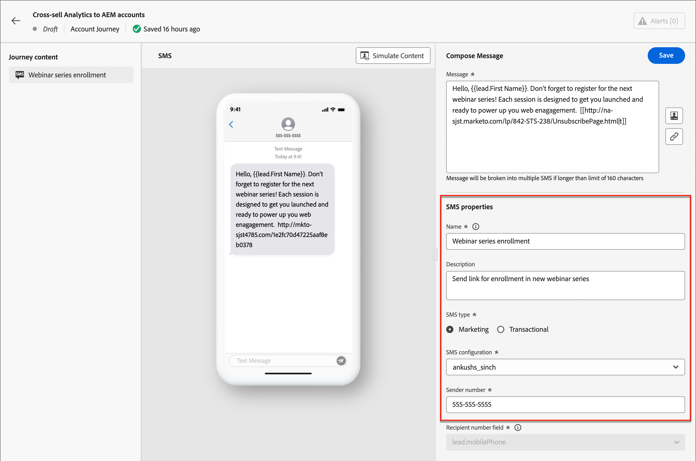

# Authoring di SMS

Utilizza Adobe Journey Optimizer B2B Edition per inviare messaggi di testo (SMS) ai clienti sui loro dispositivi mobili. Dall’editor SMS puoi creare, personalizzare e visualizzare in anteprima i messaggi in formato testo.

## Configurazioni SMS

Adobe Journey Optimizer B2B Edition invia messaggi di testo tramite provider di servizi SMS (o provider di gateway SMS). Prima di creare il messaggio SMS, configura il provider di servizi dalle impostazioni dell’amministratore.

### Provider del servizio gateway SMS

Adobe Journey Optimizer B2B Edition si integra attualmente con provider di terze parti che offrono servizi di messaggistica di testo in modo indipendente. I provider supportati per i messaggi di testo sono Sinch, Twilio e Infobip.

Prima di configurare un canale SMS in Adobe Journey Optimizer B2B Edition, è necessario creare un account con uno di questi provider per ottenere il token API e l’ID servizio. Queste credenziali sono necessarie per configurare la connessione tra Adobe Journey Optimizer B2B Edition e il provider applicabile.

>[!IMPORTANT]
>
>L’utilizzo dei servizi di messaggistica di testo è soggetto a termini e condizioni aggiuntivi da parte del provider applicabile. In qualità di soluzioni di terze parti, Sinch, Twilio e Infobip sono disponibili per gli utenti di Adobe Journey Optimizer B2B Edition tramite un’integrazione. Adobe non controlla e non è responsabile per i prodotti di terze parti. Per eventuali problemi o richieste di assistenza relativi ai servizi di messaggistica di testo (SMS), contatta il provider.

### Verifica una configurazione API SMS esistente

>[!NOTE]
>
>Le impostazioni descritte sono accessibili solo agli utenti con privilegi di amministratore SMS.

Nella barra di navigazione a sinistra, espandere la sezione **[!UICONTROL Amministratore]** e fare clic su **[!UICONTROL Configurazione]**.

{width="800" zoomable="yes"}

Nella pagina sono elencate le configurazioni API disponibili per l’istanza. Puoi filtrare le credenziali API visualizzate in base al provider di servizi SMS o al creatore.

{width="500"}

### Creare nuove credenziali API per un provider di servizi SMS

>[!BEGINTABS]

>[!TAB Sinch]

_Per configurare Sinch come provider SMS con Adobe Journey Optimizer B2B Edition:_

1. Nella barra di navigazione a sinistra, espandere la sezione **[!UICONTROL Amministratore]** e fare clic su **[!UICONTROL Configurazione]**.

1. Fai clic su **[!UICONTROL Crea nuove credenziali API]** in alto a destra nell&#39;elenco delle _[!UICONTROL credenziali API]_.

1. Configura le credenziali API SMS:

   {width="500"}

   * **[!UICONTROL Fornitore SMS]** - Scegliere `Sinch` come provider SMS.

   * **[!UICONTROL Nome]** - Immettere un nome per le credenziali API.

   * **[!UICONTROL ID servizio]** e **[!UICONTROL Token API]** - Accedi alla pagina API dal tuo account Sinch (puoi trovare le tue credenziali nella scheda SMS).

   Per ulteriori informazioni su come trovare queste informazioni per il tuo account Sinch, consulta la [documentazione per gli sviluppatori di Sinch](https://developers.sinch.com/docs/sms/getting-started/#2-get-credentials)

1. Fai clic su **[!UICONTROL Invia]** una volta completati i dettagli di configurazione delle credenziali API.

>[!TAB Twilio]

_Per configurare Twilio come provider SMS con Adobe Journey Optimizer B2B Edition:_

1. Nella barra di navigazione a sinistra, espandere la sezione **[!UICONTROL Amministratore]** e fare clic su **[!UICONTROL Configurazione]**.

1. Fai clic su **[!UICONTROL Crea nuove credenziali API]** in alto a destra nell&#39;elenco delle _[!UICONTROL credenziali API]_.

1. Configura le credenziali API SMS:

   {width="500"}

   * **[!UICONTROL Fornitore SMS]** - Scegliere `Twilio` come provider SMS.

   * **[!UICONTROL Nome]** - Immettere un nome per la definizione delle credenziali API.

   * **[!UICONTROL SID account]** e **[!UICONTROL Token autenticazione]**. Per trovare le credenziali, accedi al riquadro _Informazioni account_ della pagina del dashboard di Twilio Console.

   Per ulteriori informazioni su come trovare queste informazioni per l&#39;account Twilio, visitare il [Centro assistenza Twilio](https://help.twilio.com/articles/14726256820123-What-is-a-Twilio-Account-SID-and-where-can-I-find-it-).

1. Fai clic su **[!UICONTROL Invia]** in alto a destra della pagina al completamento dei dettagli di configurazione delle credenziali API.

>[!TAB Informazioni]

_Per configurare Infobip come provider SMS con Adobe Journey Optimizer B2B Edition:_

1. Nella barra di navigazione a sinistra, espandere la sezione **[!UICONTROL Amministratore]** e fare clic su **[!UICONTROL Configurazione]**.

1. Fai clic su **[!UICONTROL Crea nuove credenziali API]** in alto a destra nell&#39;elenco delle _[!UICONTROL credenziali API]_.

1. Configura le credenziali API SMS:

   {width="500"}

   * **[!UICONTROL Fornitore SMS]** - Scegliere `Infobip` come provider SMS.

   * **[!UICONTROL Nome]** - Immettere un nome per la definizione delle credenziali API.

   * **[!UICONTROL URL di base API]** e **[!UICONTROL chiave API]**. Per trovare le credenziali, accedere alla home page dell&#39;interfaccia Web o alla pagina di gestione delle chiavi API per l&#39;account Infobip.

   Per ulteriori informazioni su come trovare queste informazioni per l&#39;account Infobip, vedere la [documentazione di Infobip](https://www.infobip.com/docs/api/_blank).

1. Fai clic su **[!UICONTROL Invia]** in alto a destra della pagina al completamento dei dettagli di configurazione delle credenziali API.

>[!ENDTABS]

Quando fai clic su _[!UICONTROL Invia]_, le credenziali vengono immediatamente convalidate e salvate, reindirizzandoti alla pagina dell&#39;elenco delle _[!UICONTROL credenziali API]_. Se le credenziali inviate non sono valide, il sistema visualizza un messaggio di errore nella pagina dell&#39;elenco. In questo caso, puoi scegliere di annullare la configurazione o di aggiornarla e inviarla nuovamente.

## Aggiungere un’azione SMS in un percorso di account

Puoi impostare le consegne di messaggi di testo in un Percorso di account quando aggiungi un nodo _[!UICONTROL Esegui un&#39;azione]_ ed effettua le seguenti operazioni:

1. Per l&#39;azione _[!UICONTROL sulla destinazione]_, scegliere **[!UICONTROL Persone]**.

1. Per l&#39;_[!UICONTROL azione sulle persone]_, scegli **[!UICONTROL Invia SMS]**.

   {width="800" zoomable="yes"}

1. Nella parte inferiore del pannello _[!UICONTROL Esegui un&#39;azione]_, fai clic su **[!UICONTROL Crea SMS]**.

1. Nella finestra di dialogo, immetti un **[!UICONTROL Nome]** univoco per l&#39;e-mail e una **[!UICONTROL riga Oggetto]**.

   {width="500"}

## Creare il messaggio SMS

>[!IMPORTANT]
>
>**Gestione del consenso SMS** 
> 
>In conformità agli standard e alle normative del settore, tutti i messaggi SMS di marketing devono consentire ai destinatari di annullare facilmente l’iscrizione alla ricezione di messaggi. A questo scopo, i destinatari di SMS possono rispondere con parole chiave di consenso e rinuncia. Tutte le parole chiave di consenso e rinuncia standard sono supportate e rispettate. Sono inoltre supportate e rispettate tutte le parole chiave personalizzate configurate per l’account del provider di servizi SMS.

1. Immetti il testo da inviare nel campo **[!UICONTROL Messaggio]**.

   Puoi creare un messaggio composto da un massimo di 1600 caratteri, ogni 160 caratteri vengono considerati come un singolo messaggio SMS.

1. **Personalizzare il messaggio di testo**.

   In qualsiasi momento durante la creazione del messaggio di testo, fai clic sull&#39;icona _Personalizza_ a destra della casella del messaggio di testo.

   {width="800" zoomable="yes"}

   La pagina visualizzata consente di accedere ai token di Adobe Marketo Engage Lead e System. Sono inclusi sia i token standard che quelli personalizzati. È possibile utilizzare la barra di ricerca per individuare il token desiderato oppure spostarsi nella struttura delle cartelle per trovare e selezionare uno dei token di sistema/lead.

   Posiziona il cursore nel punto del messaggio in cui desideri aggiungere il token. Aggiungere un token facendo clic sul simbolo più ( **+** ) accanto a esso. Se desideri aggiungere il token con un fallback (impostazione predefinita che viene visualizzata se il campo non è disponibile per un lead), fai clic sui puntini di sospensione ( **...** ) e scegli **[!UICONTROL Inserisci con testo di fallback]**.

   {width="700" zoomable="yes"}

   Nella finestra di dialogo _[!UICONTROL Immetti valore di fallback]_, immetti il testo che viene visualizzato come fallback, quindi fai clic su **[!UICONTROL Aggiungi]**.

   {width="400"}

   Una volta inseriti i token di personalizzazione, fai clic su **[!UICONTROL Salva]** per salvare le modifiche e tornare all&#39;area di lavoro di authoring SMS principale. Puoi continuare a modificare il messaggio con i token, in base alle esigenze.

<!-- 1. **Add URLs to text message**.

   After defining your content, you can add URLs to your message by clicking the _Link_ icon.
   
   You can add two types of URLs: 

   External URLs - This is ANY external URL that can be directly typed into/ pasted into the input text box
   Adobe Marketo Engage Design Studio Landing Pages - Selecting this option, you will see a 'Landing Page picker' from which you can select any of the listed approved Landing Pages from Marketo Engage

   You can choose to 'shorten' either of these URLs by selecting the checkbox
   Note that the URL shortening function, uses the Marketo subdomain for shortening
   The shortened URL appears as a read-only field within the modal
   You can optionally track clicks on the URL
   You can also choose to include 'mkt_tok' for tracking activity against a user
   Click on Add to save changes & add the chosen URL to the SMS message
-->

## Impostare le proprietà di SMS

1. Nella sezione _[!UICONTROL Proprietà SMS]_, immetti un **[!UICONTROL Nome]** (obbligatorio, massimo 100 cha\rcaratteri) e **[!UICONTROL Descrizione]** (facoltativo, massimo 300 caratteri) per il messaggio.

   Ad Alpha, per questi campi sono consentiti caratteri numerici e speciali. I seguenti caratteri riservati sono **non consentiti**: `\`, `/`, `:`, `*`, `?`, `"`, `<`, `>` e `|`.

1. Scegli il tipo di SMS ****:

   * Utilizza `Marketing` per i messaggi di testo promozionali, che richiedono il consenso dell&#39;utente.
   * Utilizzare `Transactional` per i messaggi non commerciali, ad esempio la conferma di un ordine, le notifiche di reimpostazione della password o le informazioni di consegna.

1. Per la **[!UICONTROL configurazione SMS]**, scegli una delle configurazioni API predefinite.

   Questa impostazione determina il provider del servizio gateway SMS e l’account utilizzati per recapitare il messaggio.

1. Immettere il **[!UICONTROL numero mittente]** &#x200B;che si desidera utilizzare per le comunicazioni.

   {width="700" zoomable="yes"}

   Il numero del destinatario è sempre mappato al campo `Lead.MainPhone` nel Marketo Engage.

<!-- ## Preview the text message content

When your message content is defined, you can use test profiles to preview its content. If you inserted personalized content, you can check how this content is displayed in the message, using test profile data.

1. Click **[!UICONTROL Simulate Content]** at the top of the SMS authoring workspace.

1. From the _[!UICONTROL Simulate Content]_ page, click **[!UICONTROL Add People]**.

1. Use the # page to manage the leads used for your test profile.

   In the displayed list, you can search for and add any of the leads (up to 10 leads at a time) from the Marketo Engage lead database.

   To search, enter the whole email address and click enter. The corresponding lead profile shows up for selection.

   The preview updated to the personalization fields for the selected profile.

   All the added leads appear on the left rail of the 'Simulate Content' page

   You can manage this list by adding more people and deleting individual leads from the profile listing (it does not remove them from the database).

1. Simulate content for a lead.

   Select any of the leads listed on the left rail of the Simulate Content page and the SMS preview on the page updates for the corresponding lead.

   You can also select a lead from the 'drop-down' box above the preview space and the SMS preview on the page updates for the corresponding lead

1. To exit the _[!UICONTROL Simulate Content]_ page and return back to the SMS authoring workspace, click Close. -->
