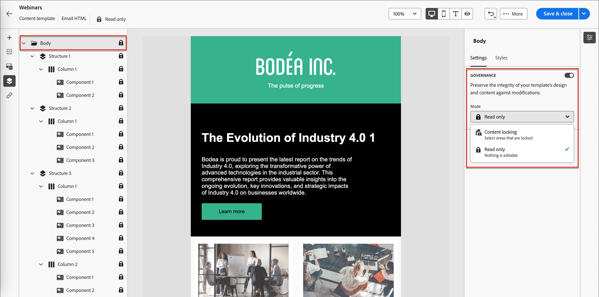

# Governance dei contenuti dei modelli

In molte organizzazioni di marketing esistono professionisti dei contenuti che progettano campagne e-mail. Una determinata progettazione può essere utilizzata come base per percorsi di account personalizzati in tutta l’organizzazione. Per garantire il rispetto delle progettazioni di contenuto approvate, puoi utilizzare le funzioni di governance dei contenuti per bloccare i componenti dei modelli. Attivando il blocco del contenuto nel modello e-mail, gli esperti di marketing possono modificare solo gli elementi consentiti per mantenerlo allineato alla strategia per i contenuti.

Ad esempio, puoi bloccare l’intestazione e il piè di pagina progettati per la continuità delle comunicazioni del brand. Puoi anche bloccare la colonna che contiene la sezione corpo principale, ma consentire agli autori di modificare il testo in modo che soddisfi il loro scopo all’interno della progettazione del percorso di account.

## Attiva governance dei contenuti per il modello

Dopo aver utilizzato la finestra di progettazione visiva per [creare i componenti strutturali e di contenuto](./email-template-authoring.md) per il modello di e-mail, abilitare la governance e applicare un blocco di contenuto specifico in base alle esigenze.

1. Nella finestra di progettazione visiva, accedere ai livelli/contenitori e agli elementi utilizzando la _struttura di navigazione_.

   Fai clic sull&#39;icona _Struttura di navigazione_ (  ) a sinistra dell&#39;area di lavoro per visualizzare la struttura.

1. Nella struttura, selezionare il componente **[!UICONTROL Body]** principale.

   Il pannello delle proprietà a destra dell&#39;area di lavoro visualizza la scheda _[!UICONTROL Impostazioni]_ per impostazione predefinita.

1. Abilita l&#39;opzione **[!UICONTROL Governance]**.

   {width="800" zoomable="yes"}

   Se questa opzione è abilitata, la _[!UICONTROL Modalità]_ predefinita è **[!UICONTROL Sola lettura]**. Con questa modalità impostata a livello principale, tutti gli elementi del modello sono bloccati. Nella struttura ad albero a sinistra viene visualizzata l&#39;icona _Sola lettura_ (  ) accanto alla radice e a tutti gli elementi figlio.

1. Per abilitare il blocco di contenuto specifico all&#39;interno del modello, modificare la **[!UICONTROL Modalità]** in **[!UICONTROL Blocco di contenuto]**.

   Con questa modalità impostata a livello principale, tutti gli elementi del modello vengono sbloccati. La struttura ad albero a sinistra visualizza l&#39;icona _Blocco contenuto_ (  ) accanto all&#39;elemento radice. Se necessario, applica il blocco dei contenuti ai componenti di contenuto (strutturali) e ai singoli componenti di contenuto.

   Per consentire agli autori di e-mail di percorso di aggiungere elementi strutturali o di contenuto, attivare **[!UICONTROL Abilita aggiunta contenuto]**. Scegliere il tipo di aggiunte da consentire:

   * **[!UICONTROL Consenti aggiunta struttura e contenuto]** - Scegliere questa opzione se si desidera consentire agli autori di aggiungere sia elementi strutturali che elementi di contenuto.

   * **[!UICONTROL Consenti solo aggiunta contenuto]** - Scegliere questa opzione se si desidera consentire agli autori di aggiungere solo elementi di contenuto.

   {width="600" zoomable="yes"}

   Con questa modalità impostata a livello principale, tutti gli elementi del modello sono bloccati. Nella struttura ad albero a sinistra viene visualizzata l&#39;icona _Sola lettura_ (  ) accanto alla radice e a tutti gli elementi figlio.
<!-- 

   
- 
- 
- 
- 
-  -->

## Applicare il blocco a una struttura

Utilizzando il modello di ereditarietà strutturale, pianifica il layout e la struttura del modello e-mail in base alla governance che desideri applicare. I componenti strutturali vengono utilizzati come contenitori per raggruppare gli elementi in modo da poterli designare facilmente come bloccati o modificabili. Quando la progettazione del modello e-mail è attiva, controlla la struttura e applica le funzioni di blocco in base al piano.

L&#39;applicazione di un tipo di blocco a livello di struttura fornisce un&#39;impostazione predefinita per i componenti figlio. Puoi quindi applicare un’impostazione di blocco specifica a livello di colonna o di elemento di contenuto, in base alle esigenze.

1. Fai clic sull&#39;icona _Struttura di navigazione_ (  ) a sinistra dell&#39;area di lavoro per visualizzare la struttura.

1. Seleziona la struttura nella struttura.

   Il pannello delle proprietà a destra dell&#39;area di lavoro visualizza la scheda _[!UICONTROL Impostazioni]_ per impostazione predefinita.

1. Imposta il tipo **[!UICONTROL Blocca]**:

   * **[!UICONTROL Bloccato]** - Con questa impostazione, tutti i componenti figlio sono bloccati per impostazione predefinita. Nella struttura ad albero a sinistra viene visualizzata l&#39;icona _Sola lettura_ (  ) accanto a tutti i componenti figlio.

   * **[!UICONTROL Modificabile]** - Con questa impostazione, tutti i componenti figlio sono modificabili per impostazione predefinita. La struttura ad albero a sinistra non visualizza icone accanto ai componenti figlio.

   {width="800" zoomable="yes"}

## Impostare il blocco per un componente figlio

1. Seleziona il componente nella struttura.

   Il pannello delle proprietà a destra dell&#39;area di lavoro visualizza la scheda _[!UICONTROL Impostazioni]_ per impostazione predefinita.

1. Abilita l&#39;opzione **[!UICONTROL Usa blocco specifico]**.

1. Scegli il tipo di governance da applicare:

   * **[!UICONTROL Modificabile]** - Consente il controllo editoriale completo del componente durante la creazione di e-mail.
   * **[!UICONTROL Solo contenuto modificabile]** - Consente agli autori delle e-mail di modificare il contenuto, ma non il componente stesso.
   * **[!UICONTROL Bloccato]** - Impedisce qualsiasi modifica al componente durante l&#39;authoring delle e-mail.

     Per un componente bloccato, puoi consentire la rimozione del componente durante la creazione di e-mail attivando l&#39;opzione **[!UICONTROL Consenti eliminazione]**.

   {width="800" zoomable="yes"}
