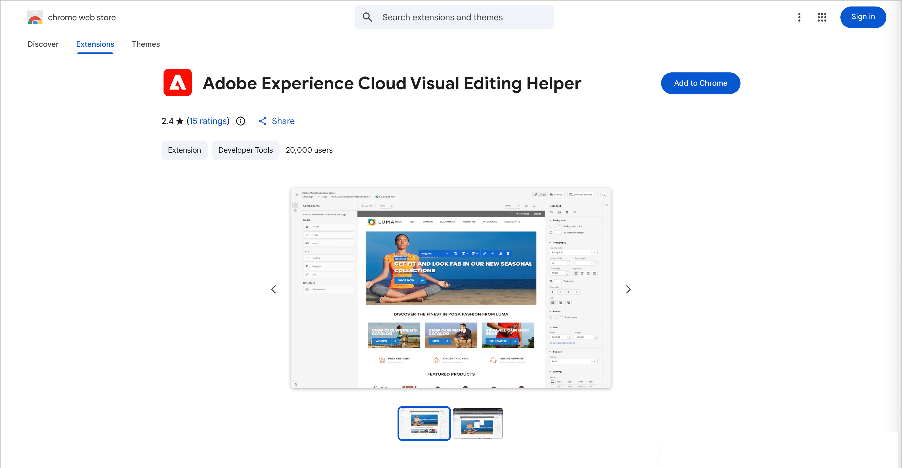
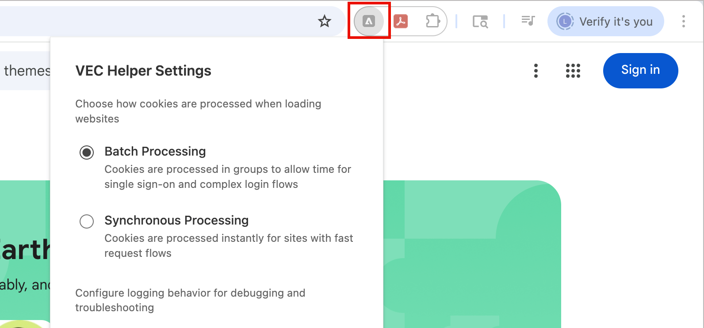
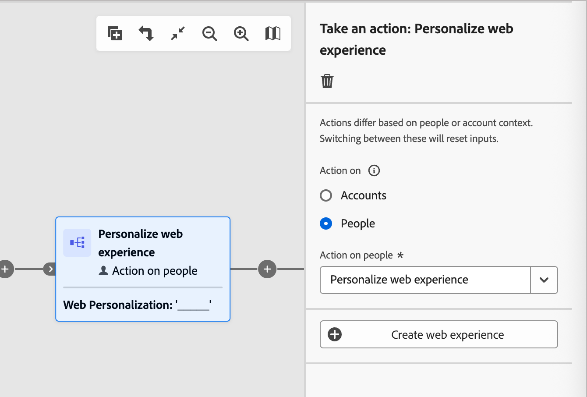
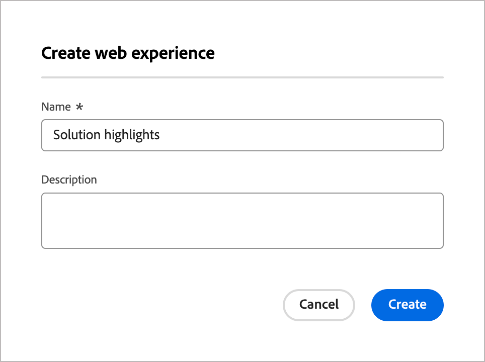
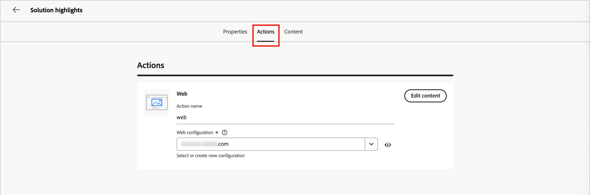
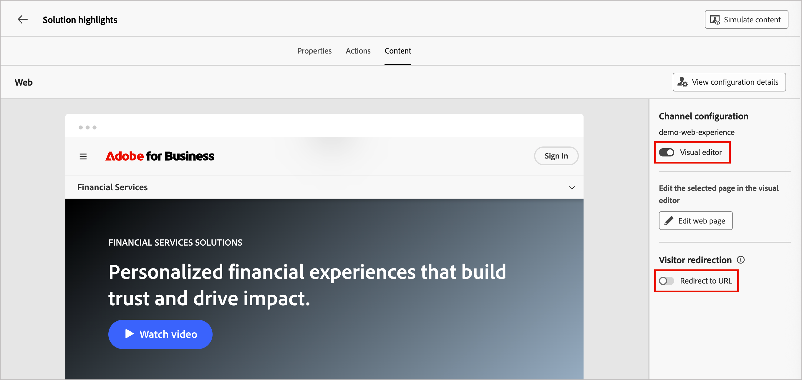
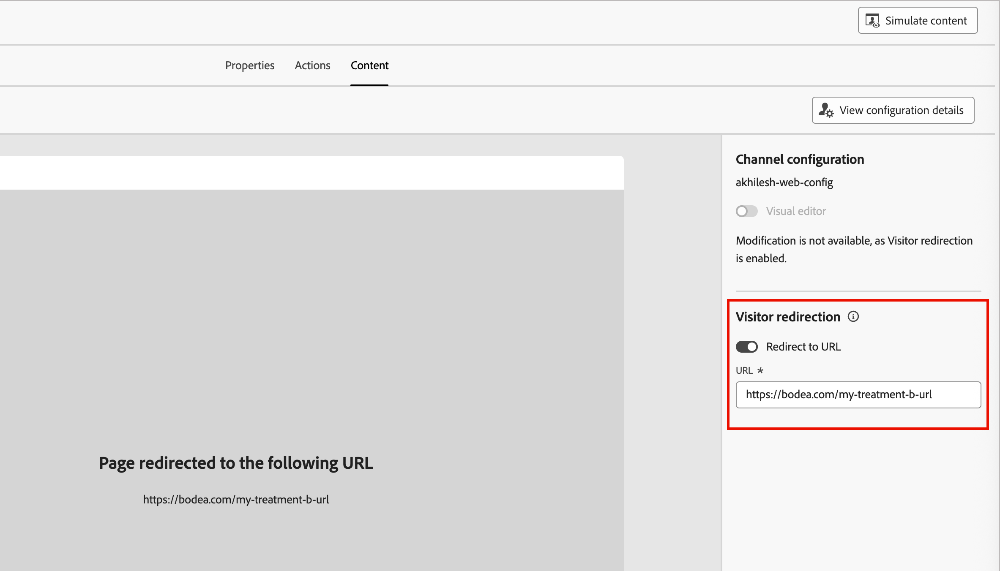

# Esperienze web

Il canale web in Adobe Journey Optimizer B2B Edition consente di creare esperienze personalizzate direttamente sul sito web, consentendoti di connettersi con i clienti in modo significativo. Questa funzione offre un set flessibile di strumenti che puoi utilizzare per migliorare il coinvolgimento con contenuti personalizzati e integrarli facilmente con altri canali, come e-mail e SMS.

Le esperienze web consentono di:

* Consegnare modifiche personalizzate ai contenuti mirati ai visitatori del sito web
* Personalizza elementi del sito web come banner, testo, immagini e pulsanti con attributi account
* Eseguire il targeting di pagine specifiche o applicare modifiche su più pagine utilizzando le regole di corrispondenza URL
* Tracciare il coinvolgimento e monitorare l’impatto delle attività di personalizzazione web

>[!BEGINSHADEBOX]

## Prerequisiti

Prima di poter creare esperienze web, assicurati di soddisfare i seguenti requisiti:

* Un amministratore di prodotto ha configurato uno o più canali web per definire gli URL (pagine) da includere per un’esperienza web. Per ulteriori informazioni, vedere [Configurazioni del canale Web](../admin/configure-channels-web.md).

* Il sito Web include [Adobe Experience Platform Web SDK](https://experienceleague.adobe.com/it/docs/experience-platform/collection/js/js-overview) (`alloy.js`) implementato per l&#39;identificazione dei visitatori e la distribuzione dei contenuti. Verificare che la versione di Adobe Experience Platform Web SDK sia 2.16 o successiva.

* Hai le [autorizzazioni](../admin/user-management.md#b2b-product-permissions) necessarie per creare e gestire esperienze Web in un percorso:
  * _[!UICONTROL Creare esperienze Web B2B]_
  * _[!UICONTROL Gestione Percorsi di persone B2B]_
  * _[!UICONTROL Gestione Percorsi di account B2B]_

* Hai installato l&#39;estensione del browser Adobe Experience Cloud [Helper per editing video](#install-the-visual-editing-helper-extension) per il browser Web. Questa estensione è necessaria per aprire, creare e visualizzare in anteprima le pagine web in modo affidabile nello spazio di progettazione dei contenuti di Journey Optimizer B2B Edition.

  >[!NOTE]
  >
  >Google Chrome e Microsoft Edge sono attualmente gli unici browser che supportano l’authoring di pagine web in Journey Optimizer B2B Edition.

>[!ENDSHADEBOX]

## Installare l’estensione Helper per editing video

1. Apri una nuova scheda nel browser ([!DNL Google Chrome] o [!DNL Microsoft Edge]).

1. Vai al [Google Chrome Web Store](https://chromewebstore.google.com/category/extensions).

   Se utilizzi [!DNL Microsoft Edge], seleziona _Consenti estensioni_ da altri store nel banner superiore. L&#39;attivazione di questa opzione consente di aggiungere estensioni da [!DNL Chrome Web Store] a [!DNL Microsoft Edge].

1. Cercare e passare all&#39;estensione del browser _[!DNL Adobe Experience Cloud Visual Editing Helper]_.

   {width="800" zoomable="yes"}

1. Fare clic su **[!UICONTROL Aggiungi a Chrome]** e quindi su **[!UICONTROL Aggiungi estensione]** nella finestra di dialogo di conferma.

   Se utilizzi [!DNL Microsoft Edge], questa azione aggiunge l&#39;estensione a [!DNL Edge].

1. Verificare che l&#39;estensione del browser [!DNL Visual Editing Helper] sia abilitata correttamente nella barra degli strumenti del browser.

   {width="450"}

L&#39;abilitazione di [!DNL Adobe Experience Cloud Visual Editing Helper] viene ora eseguita automaticamente all&#39;apertura di un sito Web nell&#39;editor visivo di Journey Optimizer B2B Edition per le esperienze Web. L’estensione non dispone di impostazioni condizionali e gestisce automaticamente tutte le impostazioni, incluse le impostazioni dei cookie SameSite.

>[!NOTE]
>
>Alcuni siti web potrebbero non essere aperti in modo affidabile nell’editor web di Journey Optimizer B2B Edition per uno dei seguenti motivi:
>
>* Il sito web dispone di criteri di sicurezza rigidi.
>* Il sito web si trova in un iframe.
>* Il sito per il controllo qualità o il sito di staging del cliente non è disponibile esternamente (il sito è interno).

## Creare un’esperienza web

Puoi impostare le esperienze Web in un percorso quando [aggiungi un _[!UICONTROL Esegui un&#39;azione]_ nodo](../journeys/action-nodes.md) ed esegui le seguenti operazioni:

1. Per l&#39;azione _[!UICONTROL sulla destinazione]_, scegliere **[!UICONTROL Persone]**.

1. Per l&#39;_[!UICONTROL azione sulle persone]_, scegli **[!UICONTROL Personalizza esperienza Web]**.

   {width="500"}

1. Fai clic su **[!UICONTROL Crea esperienza Web]**.

1. Nella finestra di dialogo _[!UICONTROL Crea esperienza Web]_, immetti un **[!UICONTROL Nome]** e una **[!UICONTROL Descrizione]** utili (facoltativi).

   * Nome: massimo 100 caratteri, deve essere univoco, senza distinzione tra maiuscole e minuscole

   * Descrizione: massimo 300 caratteri

   >[!NOTE]
   >
   >I campi Nome e Descrizione supportano caratteri alfanumerici, numerici e speciali. I caratteri riservati (`\ / : * ? " < > |`) sono **_non consentiti_**.

   {width="400"}

1. Nella scheda **[!UICONTROL Proprietà]** immettere la descrizione per l&#39;esperienza Web.

1. Fare clic sulla scheda **[!UICONTROL Azioni]** e selezionare il **[!UICONTROL canale Web]** da utilizzare per l&#39;esperienza Web.

   La configurazione del canale web determina dove vengono applicate le modifiche al contenuto in base alle regole di corrispondenza della pagina configurate. Per ulteriori informazioni, vedere [Configurazioni del canale Web](../admin/configure-channels-web.md).

   {width="700" zoomable="yes"}

1. Per definire le modifiche Web, fare clic su **[!UICONTROL Modifica contenuto]**.

   L&#39;editor si apre nella scheda _[!UICONTROL Contenuto]_, dove puoi definire le modifiche per la tua esperienza Web. Consulta [Progettazione esperienza Web](./web-experience-design.md) per informazioni dettagliate sull&#39;utilizzo degli strumenti di progettazione per aggiungere le modifiche al contenuto dell&#39;esperienza Web.

1. Nel pannello a destra, imposta le proprietà dell’esperienza web in base alla modalità di definizione e gestione.

   * **[!UICONTROL Editor visivo]** - Consente di passare dall&#39;editor visivo all&#39;editor non visivo [e viceversa](./web-experience-design.md#web-experience-editors) per la struttura di modifica dell&#39;esperienza Web.
   * **[!UICONTROL Reindirizzamento visitatori]** - Abilita questa opzione per [reindirizzare i visitatori a un altro URL esistente](#redirect-to-url) anziché creare una nuova variante nella scheda dei contenuti.

   {width="700" zoomable="yes"}

1. Fai clic su **[!UICONTROL Modifica pagina Web]** per [progettare le modifiche Web](./web-experience-design.md).

1. Al termine delle modifiche, fai clic sulla freccia a sinistra sopra l’editor per tornare alla scheda dei contenuti e alle proprietà personalizzate del nodo esperienza web.

   Fai clic sulla freccia sinistra nella parte superiore per tornare all’area di lavoro del percorso.

## Modificare un’esperienza web

1. Apri il percorso e seleziona il nodo dell&#39;azione **[!UICONTROL Personalizza esperienza Web]**.

1. Per apportare modifiche alla configurazione o al contenuto del canale Web, fare clic su **[!UICONTROL Modifica esperienza Web]**.

1. Seleziona la scheda **[!UICONTROL Azioni]** e modifica la configurazione Web in base alle esigenze.

1. Seleziona la scheda **[!UICONTROL Contenuto]** e utilizza gli strumenti di progettazione visiva in base alle esigenze.

   * _Editor visivo_ - Fare clic su **[!UICONTROL Modifica contenuto]**.
   * _Editor non visivo_ - Fare clic su **[!UICONTROL Aggiungi una modifica]**.

   Per informazioni dettagliate, consulta [Progettazione esperienza Web](./web-experience-design.md).

1. Una volta completate le definizioni di modifica, fai clic sulla freccia a sinistra sopra l’editor per tornare alla scheda dei contenuti e alle proprietà dell’esperienza web.

   Fai clic sulla freccia sinistra nella parte superiore per tornare all’area di lavoro del percorso.

## Reindirizzare a un URL

Durante la creazione di un’esperienza web, puoi reindirizzare i visitatori a un altro URL esistente anziché creare una nuova variante nell’editor di contenuti. Questa opzione è utile quando si desidera eseguire un esperimento sui contenuti confrontando due esperienze diverse, anziché modificare alcuni elementi all’interno di una pagina.

Ad esempio, crea una campagna web con due trattamenti:

In Trattamento A, crea un’esperienza web utilizzando l’editor dei contenuti per metà della popolazione target.

Nel trattamento B, selezionare l&#39;opzione _[!UICONTROL Reindirizza all&#39;URL]_ per l&#39;altra metà della popolazione target. Inserisci l’URL di una pagina con una progettazione alternativa creata al di fuori di Journey Optimizer B2B Edition.

{width="500" zoomable="yes"}

>[!NOTE]
>
>Con questa opzione selezionata, l&#39;anteprima del sito Web non viene visualizzata e l&#39;interruttore _[!UICONTROL Editor visivo]_ è disabilitato.

Quando la campagna web è in esecuzione, puoi tenere traccia delle prestazioni dell’esperienza web definita in Journey Optimizer B2B Edition rispetto alle esperienze web che utilizzano un reindirizzamento alla pagina alternativa.

## Verificare l’esperienza web

Una volta completata la progettazione del contenuto per l&#39;esperienza Web, puoi utilizzare la funzione _Simula contenuto_ per visualizzare in anteprima le modifiche apportate alla pagina Web. Se hai inserito contenuti personalizzati, puoi utilizzare i dati del profilo di test per verificare come viene eseguito il rendering del contenuto. Gli strumenti di simulazione sono disponibili nella scheda _[!UICONTROL Contenuto]_ per l&#39;esperienza Web o per l&#39;editor di progettazione visiva dei contenuti.

1. Fai clic su **[!UICONTROL Simula contenuto]** in alto a destra.

1. Seleziona un profilo di test.

1. Per controllare la pagina web utilizzando i dati del profilo di test, aggiungi un profilo di test.

<!-- This works differently than emails (rely on Marketo data), currently. Will expand when we figure it out -->

## Attiva la tua esperienza web

L&#39;esperienza Web viene attivata e resa visibile al pubblico quando [pubblichi il percorso](../journeys/create-publish-journey.md#publish-a-journey). Prima di attivare un’esperienza web tramite un percorso, considera quanto segue:

* Se pubblichi un percorso con un’esperienza web che influisce sulle stesse pagine di un altro percorso già live, tutte le modifiche vengono applicate alle pagine web.

* Se più percorsi aggiornano gli stessi elementi del sito web, la modifica applicata più di recente ha la precedenza.

### Requisiti di consegna

Per abilitare la consegna di esperienze web, è necessario definire le seguenti impostazioni:

* Nella raccolta dati di Adobe Experience Platform, accertati di avere un flusso di dati definito. Assicurati che l’opzione Adobe Journey Optimizer B2B Edition sia abilitata nel servizio Adobe Experience Platform.

  Questa configurazione garantisce che Adobe Experience Platform Edge possa gestire correttamente gli eventi in entrata. [Ulteriori informazioni](https://experienceleague.adobe.com/it/docs/experience-platform/datastreams/configure)

* In Adobe Experience Platform, accertati di disporre di un criterio di unione con l&#39;opzione _[!UICONTROL Criterio di unione attivo su Edge]_ abilitata.

  Seleziona una policy nel menu Cliente > Profili > Criteri di unione in Experience Platform. [Ulteriori informazioni](https://experienceleague.adobe.com/it/docs/experience-platform/profile/merge-policies/ui-guide#configure)

  I canali in entrata Journey Optimizer B2B Edition utilizzano questo criterio di unione per attivare e pubblicare correttamente le esperienze web in entrata nel server Edge. [Ulteriori informazioni](https://experienceleague.adobe.com/it/docs/experience-platform/profile/merge-policies/ui-guide)

### Risoluzione dei problemi

Puoi utilizzare la vista Edge Delivery in Adobe Experience Platform Assurance per risolvere i problemi relativi alla distribuzione delle esperienze web di Journey Optimizer B2B Edition. Questo plug-in consente di esaminare in dettaglio le chiamate di richiesta, verificare le chiamate edge previste ed esaminare i dati del profilo. Questi dati profilo includono mappe di identità, appartenenze a segmenti e impostazioni di consenso. Puoi anche esaminare le attività qualificate e non qualificate per la richiesta.

Per ulteriori informazioni sulla visualizzazione Edge Delivery in Assurance, consulta la [documentazione di Experience Platform](https://experienceleague.adobe.com/it/docs/experience-platform/assurance/view/edge-delivery).
