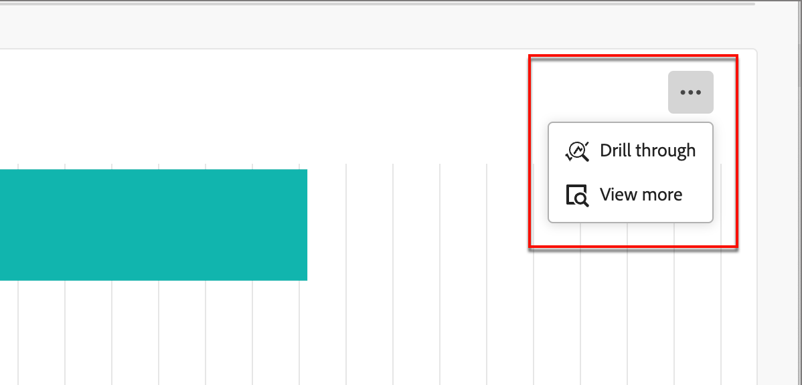

# Dashboard panoramica dei gruppi di acquisto

La dashboard Panoramica gruppo acquisti è progettata per il processo di handoff vendite B2B. Consente al team Marketing di condividere _ready_ gruppi di acquisto e i relativi membri insieme ai dati essenziali per il team Vendite per l&#39;esecuzione. Questo processo garantisce una transizione semplificata dal marketing alle vendite.

Il Sales Handoff comprende:

* **Handoff dati**: il marketing identifica i dati di destinazione _ready_ e li rende accessibili alle vendite in formato CSV. 
* **Accettazione vendite**: le vendite esaminano manualmente e incorporano _target pronti_ nella pipeline.

## Stato del gruppo di acquisto

Ottieni informazioni sulla progressione dei gruppi di acquisto con la visualizzazione Stato gruppo di acquisto. Questa visualizzazione mostra la distribuzione dei gruppi di acquisto classificati in base al loro aggiornamento di stato più recente entro un intervallo di tempo specificato.

{width="800" zoomable="yes"}

**[!UICONTROL Stato]** (asse y): tieni traccia del percorso di gruppi di acquisto in varie fasi.
**[!UICONTROL Numero di gruppi di acquisto]** (asse x): quantifica il numero di gruppi di acquisto per ogni stato, fornendo una metrica chiara dello stato e dell&#39;attività del funnel.
<!-- To generate a shareable PDF of your current view, click **[!UICONTROL Export]** at the top-right corner of the page. -->

### Filtro dati

* **Filtro dati** - Utilizza il _[!UICONTROL Filtro data]_, che riflette la data dell&#39;ultima modifica dello stato del gruppo di acquisto. La data di inizio è regolabile. Per impostazione predefinita, la data di fine corrisponde al giorno corrente.

  {width="400"}

* **Filtro attributi** - Fare clic sull&#39;icona _Filtro_ in alto a sinistra per filtrare la visualizzazione dei dati utilizzando uno degli attributi seguenti:

   * Interesse soluzione
   * Stato
   * Stati gruppo acquisti
   * Area dell’account
   * Settore account
  <!-- * Account's Industry -->

  {width="500"}

## Coinvolgi i dati

Per interagire con i dati, utilizza il menu Azioni nell’angolo in alto a destra.

{width="300"}

### [!UICONTROL Drill-through]

Scegliere **[!UICONTROL Esegui drill-through]** per un&#39;analisi approfondita dei singoli stati dei gruppi.

{width="600" zoomable="yes"}

Vengono riportati i filtri globali applicati al dashboard.

Fai clic sull&#39;icona del menu Azioni in alto a destra e scegli **[!UICONTROL Visualizza altro]** per [visualizzare dati e approfondimenti estesi](#view-more).

### [!UICONTROL Visualizza altro]

Scegli **[!UICONTROL Visualizza altri]** per dati e approfondimenti estesi. Il pop-up visualizzato include un grafico e una tabella che mostrano la suddivisione degli stati dei gruppi di acquisto:

* [!UICONTROL ID account ]
* [!UICONTROL Nome account]
* [!UICONTROL Area account]
* [!UICONTROL Settore account]
* [!UICONTROL Nome gruppo acquisti]
* [!UICONTROL Interesse soluzione]
* [!UICONTROL Stato]
* [!UICONTROL Punteggio di coinvolgimento]
* [!UICONTROL Punteggio di completezza]
* [!UICONTROL Ruolo membro]
* [!UICONTROL Data di iscrizione/creazione membro]
* [!UICONTROL ID persona]
* [!UICONTROL Nome]
* [!UICONTROL E-mail]
* [!UICONTROL Titolo]
* [!UICONTROL Numero di attività di coinvolgimento in entrata]
* [!UICONTROL Data ultimo coinvolgimento]

{width="600" zoomable="yes"}

Per scaricare i dati, fai clic su **[!UICONTROL Scarica CSV]** in alto a destra.
