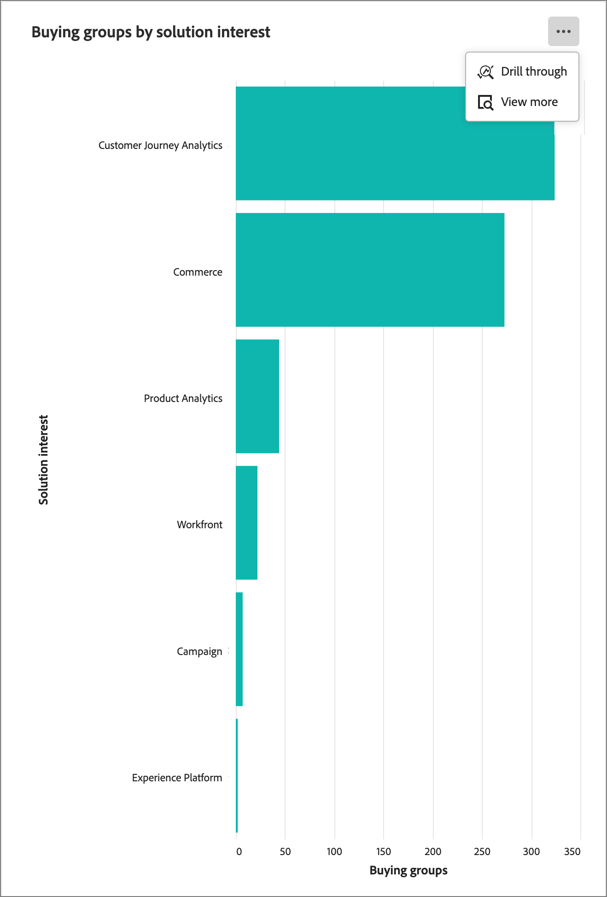

# Dashboard panoramica dei gruppi di acquisto

La dashboard Panoramica per i gruppi di acquisto è progettata per il processo di handoff vendite B2B. Consente al team Marketing di condividere _ready_ gruppi di acquisto e i relativi membri insieme ai dati essenziali per il team Vendite per l&#39;esecuzione. Questo processo garantisce una transizione semplificata dal marketing alle vendite.

L&#39;handoff delle vendite comprende:

* **Trasferimento dati**: il marketing identifica i dati di destinazione _ready_ e li rende accessibili alle vendite in formato CSV. 
* **Accettazione vendite**: le vendite esaminano manualmente e incorporano _target pronti_ nella pipeline.

Per accedere a questo dashboard, espandi **[!UICONTROL Account]** nel menu di navigazione a sinistra, quindi seleziona **[!UICONTROL Gruppi di acquisto]**. Selezionare la scheda **[!UICONTROL Panoramica]** se non è visualizzata per impostazione predefinita.

{width="800" zoomable="yes"}
<!--
## Buying Group Status

Gain insights into your buying groups' progression with the Buying Group Status view. This visualization showcases the distribution of your buying groups categorized by their most recent status update within a specified time frame.

{width="800" zoomable="yes"}

**[!UICONTROL Status]** (y-axis): Track the journey of buying groups through various stages.
**[!UICONTROL Number of Buying Groups]** (x-axis): Quantify the number of buying groups at each status, providing a clear metric of your funnel's health and activity.

To generate a shareable PDF of your current view, click **[!UICONTROL Export]** at the top-right corner of the page. -->

## Distribuzione del punteggio di completamento del gruppo acquisti

Questa visualizzazione illustra la distribuzione dei gruppi di acquisto in base ai punteggi di completamento ed è suddivisa in quattro fasce di punteggio distinte. La figura centrale rappresenta il numero totale di gruppi di acquisto e fornisce un’istantanea rapida dello stato di avanzamento complessivo. I colori segmentati indicano la proporzione di gruppi di acquisto all’interno di ogni intervallo di punteggio, che consente di valutare le tendenze di completamento in modo immediato.

Per visualizzare informazioni più dettagliate, fare clic sull&#39;icona del menu **...** in alto a destra.

{width="500"}

## Distribuzione del punteggio di coinvolgimento del gruppo acquisti

Questa visualizzazione illustra la distribuzione dei gruppi di acquisto in base ai loro punteggi di coinvolgimento ed è suddivisa in quattro fasce di punteggio distinte. La figura centrale rappresenta il numero totale di gruppi di acquisto e fornisce un’istantanea rapida dello stato di avanzamento complessivo. I colori segmentati indicano la proporzione di gruppi di acquisto all’interno di ogni intervallo di punteggio, che consente di valutare le tendenze di completamento in modo immediato.

Per visualizzare informazioni più dettagliate, fare clic sull&#39;icona del menu **...** in alto a destra.

{width="500"}

## Gruppi acquisti per interesse della soluzione

Questa visualizzazione illustra la distribuzione dei gruppi di acquisto in base all’interesse della soluzione e ti aiuta a identificare quali soluzioni generano l’interesse maggiore. Ogni barra rappresenta una soluzione specifica, la cui lunghezza indica il numero di gruppi di acquisto associati a tale interesse. Questo grafico a barre fornisce una chiara e immediata comprensione delle tendenze della domanda delle soluzioni.

Per visualizzare informazioni più dettagliate, fare clic sull&#39;icona del menu **...** in alto a destra. Scegliere **Drill-through** o **Visualizza altro**.

{width="500"}

## Filtrare i dati

Fai clic sull&#39;icona _Filtro_ (  ) in alto a sinistra per filtrare i dati visualizzati utilizzando uno dei seguenti attributi:

* Fase corrente
* Settore
* Area geografica
* Interesse della soluzione

{width="500"}

Selezionare tutti i valori per ogni attributo che si desidera utilizzare per filtrare i dati e fare clic su **[!UICONTROL Applica]**.

## Coinvolgi i dati

Per interagire con i dati, utilizza il menu _Altro_ (**...**) in alto a destra di ciascun grafico.

### [!UICONTROL Drill-through]

Scegliere **[!UICONTROL Drill-through]** per un&#39;analisi approfondita dei punteggi o delle distribuzioni dei singoli gruppi.

{width="700" zoomable="yes"}

Vengono riportati i filtri globali applicati al dashboard. Fai clic sull&#39;icona _Filtro_ (  ) in alto a sinistra per [modificare i filtri attributo](#filter-the-data) per la visualizzazione drill-through.

Puoi fare clic sul menu _Altro_ (**...**) in alto a destra e scegliere **[!UICONTROL Visualizza altro]** per [visualizzare dati estesi](#view-more).

### [!UICONTROL Visualizza altro]

Scegli **[!UICONTROL Visualizza altro]** per visualizzare dati e approfondimenti estesi.

{width="700" zoomable="yes"}

Il pop-up visualizzato include un grafico e una tabella che mostrano la suddivisione della distribuzione del gruppo di acquisto.

Per scaricare i dati, fai clic su **[!UICONTROL Scarica CSV]** in alto a destra nella tabella dei dati. Per tornare al dashboard Panoramica, fare clic su **[!UICONTROL Chiudi]**.
