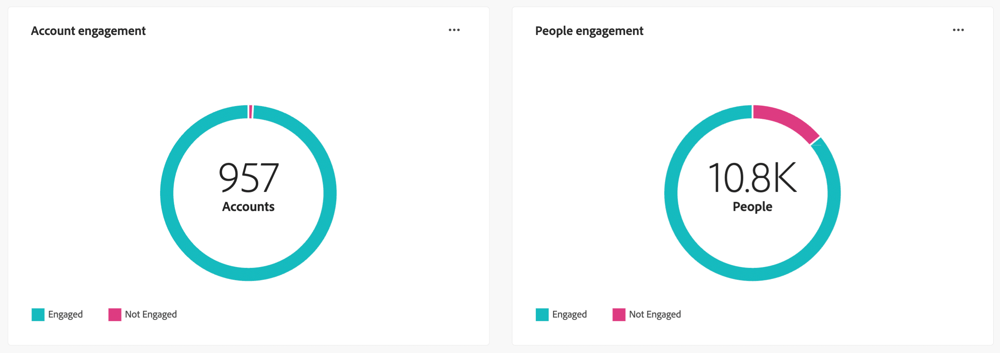
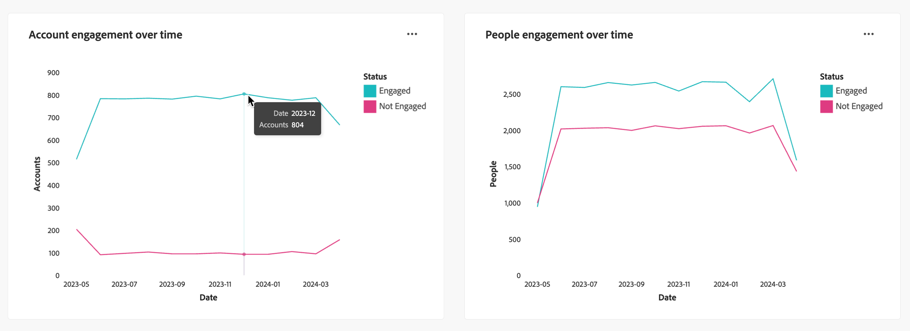

# Dashboard panoramica del coinvolgimento

Questa dashboard offre una visualizzazione completa del coinvolgimento e mostra metriche in tempo reale di account e interazioni individuali tramite istantanee di grafici ad anello e grafici a linee che rivelano le tendenze nel tempo. Consente di monitorare e pianificare in modo efficace le attività di coinvolgimento.

<!-- To generate a shareable PDF of your current view, click **[!UICONTROL Export]** at the top-right corner of the page. To engage with the data, use the action menu in the top-right corner. -->

## Coinvolgimento per account/persone

I grafici ad anello dividono chiaramente account o persone in categorie impegnate e non impegnate. La figura centrale indica il conteggio totale all’interno di ogni categoria, fornendo una visione immediata dell’impegno complessivo.

{width="700" zoomable="yes"}

## Coinvolgimento per account/persone nel tempo

Questi grafici a linee mostrano i livelli di coinvolgimento degli account o delle persone nel tempo. Con linee distinte per &quot;Coinvolto&quot; e &quot;Non Coinvolto&quot;, visualizzate lungo un asse orizzontale con marca temporale, puoi individuare tendenze e pattern. Puoi passare il cursore del mouse su una riga per visualizzare metriche precise per una data specifica.

{width="700" zoomable="yes"}

## Interazioni migliorate

Interagisci ulteriormente con i dati utilizzando l&#39;icona dell&#39;azione ( **...** ) nell&#39;angolo in alto a destra.

{width="400"}

### Visualizza altro

**[!UICONTROL Visualizza altro]**: per tutte le visualizzazioni del dashboard, viene visualizzato un pop-up con il grafico e una tabella che mostra la suddivisione del coinvolgimento per account/persone.

Pulsante Scarica CSV nell’angolo in alto a destra della tabella.
<!-- 
### Drill through

Choose **[!UICONTROL Drill through]** for an in-depth analysis of individual group statuses.

The global filters applied to the dashboard are carried over to this page.

The applied filters are displayed, but are not editable on this page. 
The only available filters that are enabled are _Account Name_ or _Person Name_.

To display or hide available columns, click **[!UICONTROL View more]** at the top-right corner:

Click **[!UICONTROL View more]** to open the download dialog.

Button on the top right corner to open a pop-up with the available column list:

* [!UICONTROL Account]
* [!UICONTROL Account name]
* [!UICONTROL Account ID]
* [!UICONTROL Status]
* [!UICONTROL People engaged]
* [!UICONTROL Engagement activities]
* [!UICONTROL Last engagement date]
* [!UICONTROL Region]
* [!UICONTROL Industry]
* [!UICONTROL People]
* [!UICONTROL Name]
* [!UICONTROL Person ID]
* [!UICONTROL Status]
* [!UICONTROL Email]
--->

### Filtro

Filtro globale: **[!UICONTROL Data]**, che riflette la data dell&#39;ultima modifica dello stato del gruppo di acquisto. La data di inizio è regolabile. Per impostazione predefinita, la data di fine corrisponde al giorno corrente.

Puoi anche filtrare la visualizzazione utilizzando uno dei seguenti attributi:

* Interesse soluzione
* Elenco interessi soluzione
* Tipo di coinvolgimento
* Elenco dei tipi di coinvolgimento
* Area dell’account
* Area geografica dell’account
* Settore account
* Settore dell&#39;account
