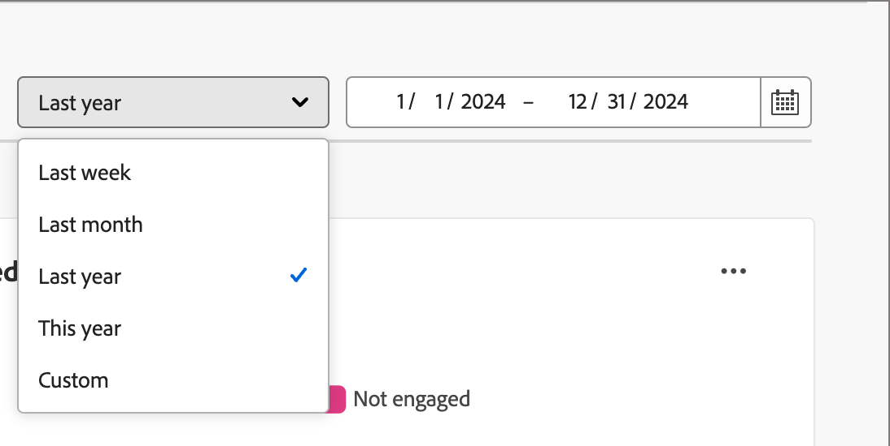

# Dashboard panoramica del coinvolgimento

Questa dashboard offre una visualizzazione completa del coinvolgimento e mostra metriche in tempo reale di account e interazioni individuali tramite istantanee di grafici ad anello e grafici a linee che rivelano le tendenze nel tempo. Consente di monitorare e pianificare in modo efficace le attività di coinvolgimento.

Per accedere al _Dashboard di coinvolgimento_, selezionare l&#39;elemento **[!UICONTROL Dashboard]** nell&#39;area di navigazione a sinistra. Selezionare quindi la scheda **[!UICONTROL Coinvolgimento]** nella parte superiore della pagina.

<!-- To generate a shareable PDF of your current view, click **[!UICONTROL Export]** at the top-right corner of the page. To engage with the data, use the action menu in the top-right corner. -->

{width="800" zoomable="yes"}

## Coinvolgimento per account/gruppo di acquisto/persone

I grafici a cerchi dividono account, gruppi di acquisto o persone in categorie impegnate e non impegnate. La figura centrale mostra il conteggio totale all’interno di ogni categoria, fornendo una visione immediata del coinvolgimento complessivo.

{width="500"}

## Account / gruppi di acquisto / persone impegnate nel tempo

Questi grafici a linee mostrano i livelli di coinvolgimento degli account o delle persone nel tempo. Con linee distinte per &quot;Coinvolto&quot; e &quot;Non Coinvolto&quot;, visualizzate lungo un asse orizzontale con marca temporale, puoi individuare tendenze e pattern. Puoi passare il cursore del mouse su una riga per visualizzare metriche precise per una data specifica.

{width="500"}

## Filtrare i dati

Puoi filtrare i dati visualizzati per intervallo di date e attributi.

### Filtro intervallo di date

Utilizza il filtro _[!UICONTROL Intervallo date]_ in alto a destra per filtrare i dati in base all&#39;intervallo di date.

{width="380"}

Per l&#39;intervallo **[!UICONTROL Personalizzato]**, è possibile utilizzare lo strumento Calendario per specificare una data di inizio e una data di fine. Per impostazione predefinita, la data di fine corrisponde al giorno corrente.

{width="380"}

### Filtro attributi

Fai clic sull&#39;icona _Filtro_ (  ) in alto a sinistra per filtrare i dati visualizzati utilizzando uno dei seguenti attributi:

* Soluzione di interesse
* Tipo di coinvolgimento
* Area geografica
* Settore
* Ruolo membro del gruppo acquisti

{width="500"}

Selezionare tutti i valori per ogni attributo che si desidera utilizzare per filtrare i dati e fare clic su **[!UICONTROL Applica]**.

## Coinvolgi i dati

Per interagire con i dati, utilizza il menu **...** in alto a destra di ciascun grafico.

{width="300"}

### Drill-through

Per un grafico a cerchi, scegliere **[!UICONTROL Esegui drill-through]** per un&#39;analisi approfondita dei dati di coinvolgimento dei singoli gruppi.

Vengono riportati i filtri globali (intervallo di dati e attributi) applicati al dashboard. Fai clic sull&#39;icona _Filtro_ (  ) in alto a sinistra per [modificare i filtri attributo](#filter-the-data) per la visualizzazione drill-through. Utilizza il selettore dell&#39;intervallo di date in alto a destra per [modificare l&#39;intervallo di date](#date-range-filter) per la visualizzazione drill-through.

{width="700" zoomable="yes"}

| Coinvolgimento per account | Coinvolgimento per gruppi acquisti | Coinvolgimento per persone |
| ---------------------- | --------------------------- | -------------------- |
| <li>Nome account <li>Stato <li>Persone impegnate (numero)<li>Attività di coinvolgimento (numero) <li>Ultimo coinvolgimento (data) | <li>Gruppo acquisti <li>Account <li>Soluzione di interesse <li>Stato <li>Attività di coinvolgimento (numero) | <li>Nome <li>Stato <li>E-mail (indirizzo) <li>Attività di coinvolgimento (numero) <li>Ultimo impegno (data) |

Puoi fare clic sull&#39;icona del menu **...** in alto a destra e scegliere **[!UICONTROL Visualizza altro]** per [visualizzare dati e approfondimenti estesi](#view-more).

### Visualizza altro

Scegli **[!UICONTROL Visualizza altri]** per dati e approfondimenti estesi.

{width="700" zoomable="yes"}

A seconda del grafico, sono disponibili dati estesi per i seguenti elementi:

| Coinvolgimento per account/gruppi di acquisto/persone | Account/gruppi di acquisto/persone coinvolte nel tempo |
| ----------------------------------------------- | -------------------------------------------------- | 
| <li>Coinvolti <li>Non coinvolto | <li>Data <li>Account / Gruppi di acquisto / Persone (numero) <li>Coinvolto/Non coinvolto |

Per copiare i dati estesi, fai clic su **[!UICONTROL Scarica CSV]** in alto a destra.
