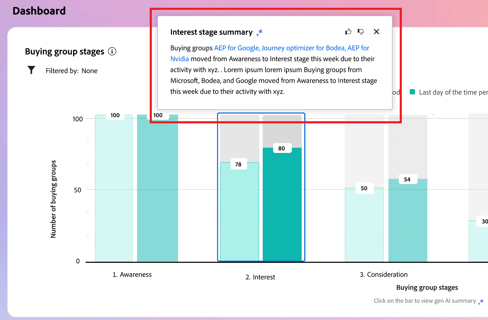
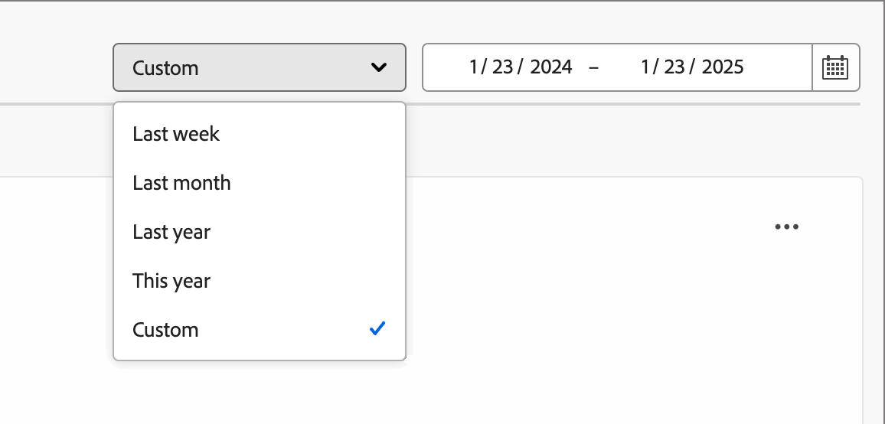
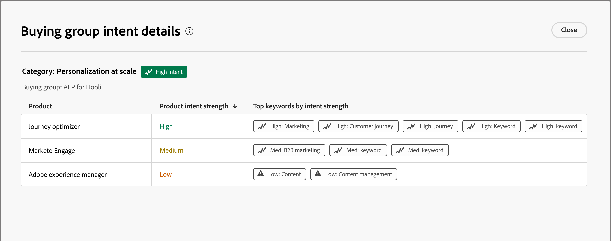
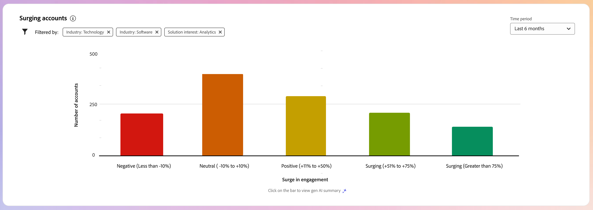
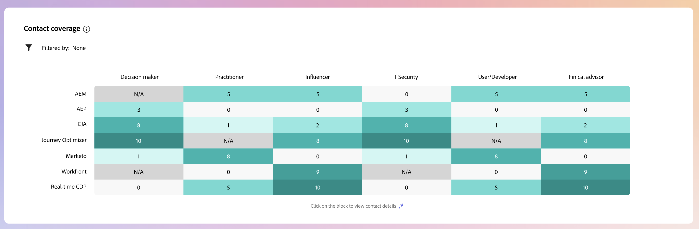

# Dashboard intelligente

La dashboard intelligente offre una panoramica completa delle metriche relative ai gruppi di acquisto e agli account, consentendoti di monitorare e strategizzare le attività di marketing in modo più efficace.

Per accedere a _Intelligent Dashboard_, seleziona l&#39;elemento **[!UICONTROL Dashboard]** nell&#39;area di navigazione a sinistra.

{width="800" zoomable="yes"}

La dashboard intelligente fornisce inoltre accesso alle pagine dei dettagli dell’account e del gruppo di acquisto, che includono due tipi di funzioni di intelligenza artificiale generative:

* Riepiloghi per account e gruppi di acquisto
* Rilevamento intento per persona, gruppo di acquisto e account

{{intent-data-note}}

## Fasi del gruppo di acquisto {#buying-group-stages}

>[!CONTEXTUALHELP]
>id="ajo-b2b_intelligent_dashboard_buying_group_stages"
>title="Fasi del gruppo di acquisto"
>abstract="Questo grafico fornisce una panoramica della progressione del gruppo di acquisto in diverse fasi, in base alle regole di transizione configurate. La prima barra indica il numero di gruppi di acquisto in una fase specifica nella prima data dell’intervallo di tempo selezionato, confrontato con l’ultima data dell’intervallo di tempo selezionato."

Il grafico _[!UICONTROL Fasi gruppo acquisti]_ fornisce una panoramica della progressione del gruppo acquisti in diverse fasi ([in base alle regole di transizione impostate da un amministratore](../buying-groups/buying-group-stages.md)).

>[!NOTE]
>
>La disponibilità delle fasi del gruppo di acquisto richiede la configurazione delle fasi del gruppo di acquisto. Per informazioni dettagliate sulle fasi e su come definire e abilitare le fasi per i gruppi di acquisto, vedere [Fasi del gruppo di acquisto](../buying-groups/buying-group-stages.md).

{width="800" zoomable="yes"}

Il grafico utilizza le fasi del gruppo di acquisto della versione più recente pubblicata del modello delle fasi del gruppo di acquisto. Ci sono due barre per ogni stadio. La prima barra indica il numero di gruppi di acquisto nella prima data dell’intervallo di tempo selezionato. E il secondo (in confronto) è il numero di gruppi di acquisto nell&#39;ultima data dell&#39;intervallo di tempo. Puoi passare il cursore sopra ogni barra per visualizzare il numero di gruppi di acquisto in ogni fase.

{width="400"}

### Riepilogo IA generativa

Fai clic su una barra per ottenere un riepilogo di IA generativo dei gruppi di acquisto in quella fase per il periodo di tempo selezionato.

{width="500"}

Il riepilogo generato fornisce una panoramica della progressione del gruppo di acquisto in diverse fasi in base alle regole di transizione configurate.

### Periodo temporale {#time-period-stages}

Utilizza il filtro delle date in alto a destra per modificare l’intervallo di date per le visualizzazioni dati. Fai clic sulla freccia rivolta verso il basso per impostare un intervallo di date relativo o per impostare date di inizio e fine personalizzate.

<!-- {width="300"} -->

### Filtro attributi {#attribute-filter-stages}

Fai clic sull&#39;icona _Filtro_ (  ) in alto a sinistra per filtrare la visualizzazione dei dati utilizzando uno dei seguenti attributi:

* Interesse soluzione
* Account
* Nome fase

<!-- Add screen when the UI is available {width="500"} -->

## Punti salienti del gruppo acquisti {#buying-group-highlights}

>[!CONTEXTUALHELP]
>id="ajo-b2b_intelligent_dashboard_buying_group_highlights_engagement"
>title="Principali 5 gruppi di acquisto per coinvolgimento"
>abstract="I principali gruppi di acquisto coinvolti in base al punteggio di coinvolgimento normalizzato."

>[!CONTEXTUALHELP]
>id="ajo-b2b_intelligent_dashboard_buying_group_highlights_velocity"
>title="Principali 5 gruppi di acquisto ad alta velocità"
>abstract="I gruppi di acquisto basati sulla velocità con cui progrediscono attraverso le fasi."

>[!CONTEXTUALHELP]
>id="ajo-b2b_intelligent_dashboard_buying_group_highlights_stagnant"
>title="Principali 5 gruppi di acquisto stagnanti"
>abstract="Gruppi di acquisto stagnanti che non progrediscono attraverso le fasi nonostante un punteggio di completezza elevato."

La sezione _[!UICONTROL Caratteristiche principali del gruppo di acquisto]_ è organizzata in tre righe per ottenere informazioni sui gruppi di acquisto di interesse per l&#39;organizzazione.

{width="800" zoomable="yes"}

* **Primi 5 gruppi di acquisto per coinvolgimento** - In questa riga vengono visualizzati i primi gruppi di acquisto coinvolti in base al punteggio di coinvolgimento normalizzato.
* **Primi 5 gruppi di acquisto ad alta velocità** - In questa riga vengono visualizzati i gruppi di acquisto principali in base alla velocità con cui stanno avanzando nelle fasi del gruppo di acquisto.
* **Primi 5 gruppi di acquisto stagnanti** - In questa riga vengono visualizzati i gruppi di acquisto più stagnanti che non avanzano nelle fasi nonostante un punteggio di completezza elevato.

Ogni scheda include i dati seguenti:

* **_Nome gruppo di acquisto_**. Fai clic sul nome per aprire la pagina dei dettagli del gruppo di acquisto.
* **_Nome account_**. Fare clic sul nome per aprire la pagina Dettagli account (collegamento ipertestuale alla pagina Dettagli account).
* **_Fase corrente_** per il gruppo di acquisto.
* **_Punteggio di coinvolgimento_** (normalizzato per tutti i gruppi di acquisto). Se tutti i gruppi di acquisto hanno lo stesso punteggio massimo, viene visualizzato l’ultimo punteggio aggiornato.
* **_Punteggio di completezza_** (da 1 a 100). Se tutti i gruppi di acquisto hanno lo stesso punteggio massimo, viene visualizzato l’ultimo punteggio aggiornato.
* **_Intento categoria_**. Fai clic su _[!UICONTROL Visualizza dettagli]_ per visualizzare i dati intento:

  {width="500" zoomable="yes"}

   * Nel menu a comparsa dei dettagli viene visualizzato il nome della categoria con il livello di intento nella parte superiore.
   * I dati di ogni riga sono organizzati in colonne: il nome del prodotto, la forza di intento del prodotto e le parole chiave principali in base alla forza di intento.
   * L&#39;ordinamento è da alto a basso per categoria, prodotto e parole chiave. Se uno o più tipi hanno lo stesso livello di intensità di intento, l&#39;ordinamento utilizza l&#39;ordine alfabetico.

  {{intent-data-note}}

Nella parte superiore destra del pannello _Elementi di rilievo del gruppo acquisti_, fai clic su **[!UICONTROL Visualizza tutto]** per passare alla pagina dell&#39;elenco dei gruppi acquisti.

### Filtro attributi {#attribute-filter-bg-highlights}

Fai clic sull&#39;icona _Filtro_ (  ) in alto a sinistra per filtrare la visualizzazione dei dati utilizzando uno dei seguenti attributi:

* Interesse per soluzione
* Gruppo acquisti
* Account

<!-- Add screen when the UI is available {width="500"} -->

### Periodo temporale {#time-period-bg-highlights}

Utilizza il filtro delle date in alto a destra per modificare l’intervallo di date per le visualizzazioni dati. Fai clic sulla freccia rivolta verso il basso per impostare un intervallo di date relativo o per impostare date di inizio e fine personalizzate.

<!-- {width="300"} -->

## Account in crescita rapida {#account-surge}

>[!CONTEXTUALHELP]
>id="ajo-b2b_intelligent_dashboard_account_surge"
>title="Account con aumento"
>abstract="Account con un cambiamento significativo nella dinamica del coinvolgimento all’interno dell’intervallo di tempo selezionato."

La sezione _[!UICONTROL Account chirurgici]_ visualizza una visualizzazione degli account con un cambiamento significativo nello slancio del coinvolgimento entro l&#39;intervallo di tempo selezionato.

>[!NOTE]
>
>I dati sull’aumento degli account sono limitati agli account che sono stati acquisiti da Journey Optimizer B2B edition in un pubblico di account tramite percorsi di account o gruppi di acquisto.

{width="800" zoomable="yes"}

Passa il cursore del mouse su ciascuna barra per visualizzare il numero di account in ciascuna categoria.

{width="400"}

Fai clic su una barra per ottenere un riepilogo di IA generativo dei conti nella categoria per l’intervallo di tempo selezionato.

{width="500"}

### Filtro attributi {#attribute-filter-acct-surge}

Fai clic sull&#39;icona _Filtro_ (  ) in alto a sinistra per filtrare la visualizzazione dei dati utilizzando uno dei seguenti attributi:

* Interesse per soluzione
* Settore
* Area geografica

<!-- Add screen when the UI is available {width="500"} -->

### Periodo temporale {#time-period-acct-surge}

Utilizza il filtro delle date in alto a destra per modificare l’intervallo di date per le visualizzazioni dati. Fai clic sulla freccia rivolta verso il basso per impostare un intervallo di date relativo o per impostare date di inizio e fine personalizzate.

<!-- {width="300"} -->

## Punti salienti Account {#account-highlights}

>[!CONTEXTUALHELP]
>id="ajo-b2b_intelligent_dashboard_account_highlights_surging"
>title="Account in crescita rapida"
>abstract="Account con un aumento significativo della dinamica del coinvolgimento nell’intervallo di tempo selezionato "

>[!CONTEXTUALHELP]
>id="ajo-b2b_intelligent_dashboard_account_highlights_at_risk"
>title="Account a rischio"
>abstract="Account con una diminuzione significativa della dinamica del coinvolgimento nell’intervallo di tempo selezionato."

La sezione _[!UICONTROL Caratteristiche principali del gruppo di acquisto]_ è organizzata in due righe per ottenere informazioni sugli account di interesse per l&#39;organizzazione.

>[!NOTE]
>
>I dati di evidenziazione account sono limitati agli account acquisiti da Journey Optimizer B2B edition in un pubblico di account tramite percorsi di account o gruppi di acquisto.

{width="800" zoomable="yes"}

* **Interventi chirurgici** - In questa riga vengono visualizzati gli account con un aumento significativo dello slancio del coinvolgimento nell&#39;intervallo di tempo selezionato.
* **Account a rischio** - In questa riga vengono visualizzati gli account con una riduzione significativa dello slancio del coinvolgimento nell&#39;intervallo di tempo selezionato.

Ogni scheda include i dati seguenti:

* **_Nome account_**. Fare clic sul nome per aprire la pagina dei dettagli dell&#39;account.
* **_Riepilogo IA generativa_** dell&#39;account.
* **_Intento parola chiave_**. Fai clic su _[!UICONTROL Visualizza dettagli]_ per visualizzare i dati intento:

  {width="500" zoomable="yes"}

   * Nel menu a comparsa dei dettagli viene visualizzato il nome della categoria con il livello di intento nella parte superiore.
   * I dati di ogni riga sono organizzati in colonne: il nome del prodotto, la forza di intento del prodotto e le parole chiave principali in base alla forza di intento.
   * L&#39;ordinamento è da alto a basso per categoria, prodotto e parole chiave. Se uno o più tipi hanno lo stesso livello di intensità di intento, l&#39;ordinamento utilizza l&#39;ordine alfabetico.

  {{intent-data-note}}
<!-- 
At the top right of the _Buying group highlights_ panel, click **[!UICONTROL View All]** to navigate to the Buying groups list page. -->

### Filtro attributi {#attribute-filter-acct-highlights}

Fai clic sull&#39;icona _Filtro_ (  ) in alto a sinistra per filtrare la visualizzazione dei dati utilizzando uno dei seguenti attributi:

* Interesse per soluzione
* Gruppo acquisti

<!-- Add screen when the UI is available {width="500"} -->

### Periodo temporale {#time-period-acct-highlights}

Utilizza il filtro delle date in alto a destra per modificare l’intervallo di date per le visualizzazioni dati. Fai clic sulla freccia rivolta verso il basso per impostare un intervallo di date relativo o per impostare date di inizio e fine personalizzate.

<!-- {width="300"} -->

## Copertura contatti {#contact-coverage}

>[!CONTEXTUALHELP]
>id="ajo-b2b_intelligent_dashboard_contact_coverage"
>title="Copertura contatti"
>abstract="Visualizza il numero di contatti con un ruolo specifico associato a un interesse di soluzione. L’assegnazione del ruolo e dell’interesse di soluzione è basata sul modello del gruppo acquisti."

La sezione _[!UICONTROL Copertura dei contatti]_ visualizza una visualizzazione del numero di contatti con un ruolo specifico associato a un interesse della soluzione. L’assegnazione del ruolo e dell’interesse di soluzione è basata sul modello del gruppo acquisti.

>[!NOTE]
>
>I dati di copertura dei contatti si basano sui gruppi di acquisto creati nell’istanza di Journey Optimizer B2B edition.

{width="800" zoomable="yes"}

Passa il puntatore del mouse su ciascuna cella per visualizzare il numero di contatti nel ruolo/soluzione interessati.

{width="400"}

Fare clic su una cella per visualizzare informazioni dettagliate per i contatti interessati al ruolo o alla soluzione.

{width="700" zoomable="yes"}

### Filtro attributi {#attribute-filter-contact-coverage}

Fai clic sull&#39;icona _Filtro_ (  ) in alto a sinistra per filtrare la visualizzazione dei dati utilizzando uno dei seguenti attributi:

* Interesse per soluzione
* Account

<!-- Add screen when the UI is available {width="500"} -->

## Sovrapposizione contatti {#contact-overlap}

>[!CONTEXTUALHELP]
>id="ajo-b2b_intelligent_dashboard_contact_overlap"
>title="Sovrapposizione contatti"
>abstract="Elenco di contatti che fanno parte di più di un gruppo di acquisti in quanto associati a più interessi di soluzione."

Nella sezione _[!UICONTROL Sovrapposizione contatti]_ viene visualizzato un elenco di contatti che fanno parte di più gruppi di acquisto in quanto associati a più interessi della soluzione.

>[!NOTE]
>
>I dati di sovrapposizione dei contatti si basano sui gruppi di acquisto creati nell’istanza di Journey Optimizer B2B edition.

{width="800" zoomable="yes"}

Fai clic su _Informazioni_ (  ) per visualizzare una tabella con i dettagli seguenti:

* Nome del gruppo di acquisto (fare clic sul nome per aprire la pagina dei dettagli del gruppo di acquisto)
* Ruolo
* Interesse per soluzione
* Intento prodotto
* Prodotto

{width="600" zoomable="yes"}

### Filtro attributi {#attribute-filter-contact-overage}

Fai clic sull&#39;icona _Filtro_ (  ) in alto a sinistra per filtrare la visualizzazione dei dati utilizzando uno dei seguenti attributi:

* Interesse per soluzione
* Ruoli
* Account

<!-- Add screen when the UI is available {width="500"} -->
