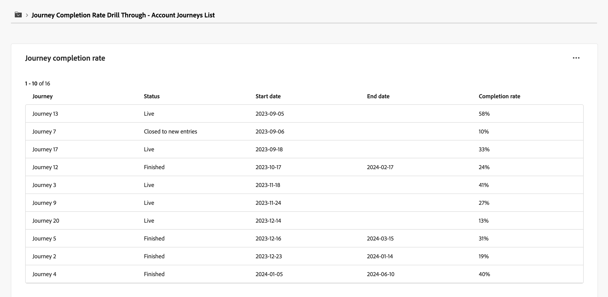

# Dashboard panoramica dei Percorsi di account

Questa dashboard offre una panoramica completa dei percorsi di account attivi, con informazioni dettagliate sull’avanzamento dell’account utilizzando grafici a cerchi e a barre che categorizzano e quantificano i completamenti e le attività di coinvolgimento. Aiuta gli addetti al marketing a valutare l’efficacia dei canali E-mail e SMS attraverso metriche chiave di consegna e coinvolgimento.

Questa panoramica è disponibile per i percorsi di account pubblicati e il popolamento dei grafici e delle tabelle richiede circa quattro ore per i dati.

{width="700" zoomable="yes"}

## Distribuzione del tasso di completamento del percorso

Questo grafico illustra la distribuzione dei percorsi in base al loro tasso di completamento ed è suddiviso in quattro fasce di punteggio distinte. La figura centrale rappresenta il numero totale di percorsi e fornisce un’istantanea rapida dello stato di avanzamento complessivo. I colori segmentati indicano la proporzione di percorsi all’interno di ogni intervallo di punteggio, che consente di valutare le tendenze di completamento in modo immediato.

Per visualizzare informazioni più dettagliate, fare clic sull&#39;icona del menu **...** in alto a destra.

Distribuzione percentuale di completamento di {width="500"}

## Percorsi per tipo di coinvolgimento

Questo grafico a barre mostra la distribuzione dei percorsi in base al tipo di coinvolgimento e consente di identificare quali impegni sono stati più utilizzati tra i percorsi. Ogni barra rappresenta un tipo di coinvolgimento specifico, la cui lunghezza indica il numero di percorsi con attività di quel tipo. Questa visualizzazione fornisce una comprensione chiara e immediata delle tendenze di coinvolgimento all’interno dei percorsi di account.

Per visualizzare informazioni più dettagliate, fare clic sull&#39;icona del menu **...** in alto a destra.

Distribuzione percentuale di completamento di {width="500"}

## Coinvolgi i dati

Per interagire con i dati, utilizza il menu **...** in alto a destra di ciascun grafico.

### [!UICONTROL Drill-through]

Per il grafico circolare, scegliere **[!UICONTROL Drill through]** per un&#39;analisi approfondita dei dati.

{width="700" zoomable="yes"}

Puoi fare clic sul menu _Altro_ (**...**) in alto a destra e scegliere **[!UICONTROL Visualizza altro]** per [visualizzare dati estesi](#view-more).

### [!UICONTROL Visualizza altro]

Scegli **[!UICONTROL Visualizza altro]** per visualizzare dati e approfondimenti estesi.

{width="700" zoomable="yes"}

Il pop-up visualizzato include un grafico e una tabella che mostrano la suddivisione dei dati del percorso.

Per scaricare i dati, fai clic su **[!UICONTROL Scarica CSV]** in alto a destra nella tabella dei dati. Per tornare alla dashboard _Panoramica_, fare clic su **[!UICONTROL Chiudi]**.
