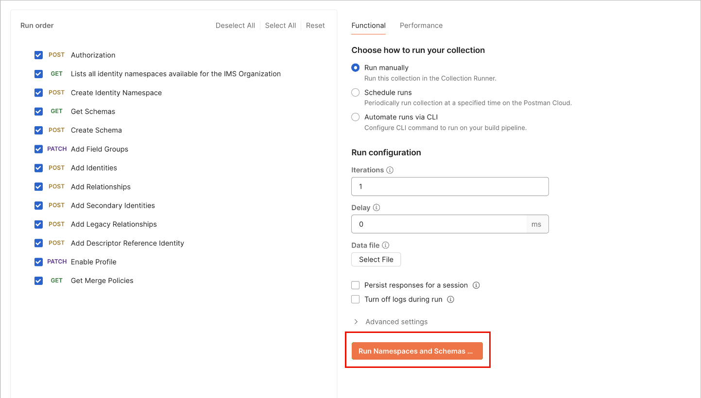

# Spazi dei nomi e schemi B2B

La configurazione di Journey Optimizer B2B edition per l’architettura semplificata include la configurazione degli spazi dei nomi e degli schemi di Experience Platform utilizzati con origini B2B. Per generare spazi dei nomi e schemi B2B è necessaria l’utility di automazione di Postman.

>[!AVAILABILITY]
>
>- Devi avere accesso a [Adobe Real-Time Customer Data Platform B2B edition](https://experienceleague.adobe.com/it/docs/experience-platform/rtcdp/intro/rtcdpb2b-intro/b2b-overview){target="_blank"} per i tuoi schemi B2B per qualificarti in [Profilo cliente in tempo reale](https://experienceleague.adobe.com/it/docs/experience-platform/profile/home){target="_blank"}.
>
>- Le entità B2B di Experience Platform devono utilizzare le relazioni standard descritte nella [guida degli spazi dei nomi e degli schemi B2B](https://experienceleague.adobe.com/it/docs/experience-platform/rtcdp/schemas/b2b){target="_blank"}.

Rivedi le seguenti informazioni sulla configurazione di base per gli spazi dei nomi e gli schemi da utilizzare con le origini B2B. Fornisce inoltre dettagli per la configurazione dell’utility di automazione Postman, necessaria per generare spazi dei nomi e schemi B2B.

## Configurare l&#39;utilità di generazione automatica

Fare riferimento alle risorse seguenti per i prerequisiti e informazioni dettagliate su come impostare l&#39;ambiente [!DNL Postman] per il supporto dello spazio dei nomi B2B e dell&#39;utilità di generazione automatica dello schema.

- Scarica la raccolta di utilità di generazione automatica dello spazio dei nomi e dello schema e l&#39;ambiente dall&#39;archivio [GitHub](https://github.com/adobe/experience-platform-postman-samples/tree/master/Postman%20Collections/CDP%20Namespaces%20and%20Schemas%20Utility){target="_blank"}.
- Per informazioni sull&#39;utilizzo delle API di Experience Platform, inclusi i dettagli sulla raccolta dei valori per le intestazioni richieste e sulla lettura delle chiamate API di esempio, vedi [_Guida introduttiva alle API di Adobe Experience Platform_](https://experienceleague.adobe.com/it/docs/experience-platform/landing/platform-apis/api-guide){target="_blank"}.
- Per informazioni sulla generazione delle credenziali per le API Experience Platform, vedi [_Autenticare e accedere alle API Experience Platform_](https://experienceleague.adobe.com/it/docs/experience-platform/landing/platform-apis/api-authentication){target="_blank"}.
- Per informazioni sulla configurazione di [!DNL Postman] per le API Experience Platform, vedere [_[!DNL Postman] in Adobe Experience Platform _](https://experienceleague.adobe.com/it/docs/experience-platform/landing/platform-apis/postman){target="_blank"}.

### Valori dell’ambiente

Con una console per sviluppatori Experience Platform e la configurazione di [!DNL Postman], puoi applicare i valori di ambiente appropriati all&#39;ambiente [!DNL Postman]. La tabella seguente fornisce valori di esempio e informazioni aggiuntive sul popolamento dell&#39;ambiente [!DNL Postman]:

| Variable | Descrizione | Esempio |
| --- | --- | --- |
| `CLIENT_SECRET` | Identificatore univoco utilizzato per generare `{ACCESS_TOKEN}`. | `{CLIENT_SECRET}` |
| `API_KEY` | Identificatore univoco utilizzato per autenticare le chiamate alle API di Experience Platform. | `c8d9a2f5c1e03789bd22e8efdd1bdc1b` |
| `ACCESS_TOKEN` | Il token di autorizzazione necessario per completare le chiamate alle API di Experience Platform. | `Bearer {ACCESS_TOKEN}` |
| `META_SCOPE` | Per quanto riguarda [!DNL Journey Optimizer B2B] e [!DNL Marketo Engage], questo valore è fisso ed è sempre impostato su: `ent_dataservices_sdk`. | `ent_dataservices_sdk` |
| `CONTAINER_ID` | Il contenitore `global` contiene tutte le classi, i gruppi di campi di schema, i tipi di dati e gli schemi standard forniti dai partner Adobe e Experience Platform. Per quanto riguarda [!DNL Marketo], questo valore è fisso ed è sempre impostato su `global`. | `global` |
| `TECHNICAL_ACCOUNT_ID` | Credenziali utilizzate per l’integrazione in Adobe I/O. | `D42AEVJZTTJC6LZADUBVPA15@techacct.adobe.com` |
| `IMS` | Identity Management System (IMS) fornisce il framework per l’autenticazione nei servizi Adobe. Per quanto riguarda [!DNL Journey Optimizer B2B] e [!DNL Marketo Engage], questo valore è fisso ed è sempre impostato su: `ims-na1.adobelogin.com`. | `ims-na1.adobelogin.com` |
| `IMS_ORG` | Entità aziendale che può possedere o concedere in licenza prodotti e servizi e consentire l&#39;accesso ai propri membri. | `ABCEH0D9KX6A7WA7ATQE0TE@adobeOrg` |
| `SANDBOX_NAME` | Nome della partizione sandbox virtuale in uso. | `prod` |
| `TENANT_ID` | ID utilizzato per garantire che le risorse create abbiano lo spazio dei nomi corretto e siano contenute all’interno dell’organizzazione. | `b2bcdpproductiontest` |
| `PLATFORM_URL` | L’endpoint URL a cui stai effettuando chiamate API. Questo valore è fisso ed è sempre impostato su: `http://platform.adobe.io/`. | `http://platform.adobe.io/` |

{style="table-layout:auto"}

### Eseguire gli script

Dopo aver impostato i valori dell&#39;ambiente, utilizzare l&#39;interfaccia [!DNL Postman] per eseguire lo script per la creazione degli spazi dei nomi e degli schemi. Selezionare la cartella principale dell&#39;utilità di generazione automatica, quindi selezionare **[!DNL Run]** dall&#39;intestazione superiore.

{width="500" zoomable="yes"}

Viene visualizzata l&#39;interfaccia [!DNL Runner]. Da qui, assicurarsi che tutte le caselle di controllo siano selezionate, quindi selezionare **[!DNL Run Namespaces and Schemas Autogeneration Utility]**.

{width="800" zoomable="yes"}

In caso di esito positivo, la richiesta crea gli spazi dei nomi e gli schemi B2B richiesti.

## Spazi dei nomi B2B

Gli spazi dei nomi di identità sono un componente di Experience Platform [[!DNL Identity Service]](https://experienceleague.adobe.com/it/docs/experience-platform/identity/home){target="_blank"} che serve a distinguere il contesto di un&#39;identità. Un’identità completa include un valore di identità e uno spazio dei nomi. Per ulteriori informazioni, vedere [panoramica degli spazi dei nomi](https://experienceleague.adobe.com/it/docs/experience-platform/identity/features/namespaces){target="_blank"}.

Gli spazi dei nomi B2B vengono utilizzati nell’identità primaria dell’entità.

| Nome visualizzato | Simbolo identità | Tipo di identità |
| --- | --- | --- |
| Persona B2B | `b2b_person` | `CROSS_DEVICE` |
| Account B2B | `b2b_account` | `B2B_ACCOUNT` |
| Opportunità B2B | `b2b_opportunity` | `B2B_OPPORTUNITY` |
| Relazione persona opportunità B2B | `b2b_opportunity_person_relation` | `B2B_OPPORTUNITY_PERSON` |
| Campagna B2B | `b2b_campaign` | `B2B_CAMPAIGN` |
| Iscritto campagna B2B | `b2b_campaign_member` | `B2B_CAMPAIGN_MEMBER` |
| Elenco di marketing B2B | `b2b_marketing_list` | `B2B_MARKETING_LIST` |
| Iscritto elenco di marketing B2B | `b2b_marketing_list_member` | `B2B_MARKETING_LIST_MEMBER` |
| Relazione della persona dell’account B2B | `b2b_account_person_relation` | `B2B_ACCOUNT_PERSON` |

{style="table-layout:auto"}

## Schemi B2B

Experience Platform utilizza gli schemi per descrivere la struttura dei dati in modo coerente e riutilizzabile. Definendo i dati in modo coerente tra i sistemi, diventa più semplice mantenere un significato e quindi ottenere valore dai dati.

Prima che Experience Platform possa acquisire i dati, è necessario uno schema che descriva la struttura dei dati e fornisca vincoli al tipo di dati che possono essere contenuti all’interno di ciascun campo. Gli schemi sono costituiti da una classe base e da zero o più gruppi di campi schema.

Per ulteriori informazioni sul modello di composizione dello schema, inclusi i principi di progettazione e le best practice, vedere [_Nozioni di base sulla composizione dello schema_](https://experienceleague.adobe.com/it/docs/experience-platform/xdm/schema/composition){target="_blank"}.

+++ Account B2B

<table>
    <tr>
        <td style="width: 30%;">Classe base</td>
        <td style="width: 70%;"><a href="https://experienceleague.adobe.com/it/docs/experience-platform/xdm/classes/b2b/business-account" target="_blank">Account aziendale XDM</a></td>
    </tr>
    <tr>
        <td>Gruppi di campi</td>
        <td>Dettagli dell’account aziendale XDM</td>
    </tr>
    <tr>
        <td>[!DNL Profile] nello schema</td>
        <td>Abilitata</td>
    </tr>
    <tr>
        <td>Identità primaria</td>
        <td><code>accountKey.sourceKey</code> nella classe base</td>
    </tr>
    <tr>
        <td>Spazio dei nomi identità primaria</td>
        <td>Account B2B</td>
    </tr>
    <tr>
        <td>Identità secondaria</td>
        <td><code>extSourceSystemAudit.externalKey.sourceKey</code> nella classe base</td>
    </tr>
    <tr>
        <td>Spazio dei nomi dell’identità secondaria</td>
        <td>Account B2B</td>
    </tr>
    <tr>
        <td>Relazione</td>
        <td><ul><li><code>accountParentKey.sourceKey</code> nel gruppo di campi Dettagli account aziendale XDM</li><li>Proprietà di destinazione: <code>/accountKey/sourceKey</code></li><li>Tipo: uno a uno</li><li>Schema di riferimento: account B2B</li><li>Spazio dei nomi: Account B2B</li></ul> </td>
    </tr>
</table>

+++

+++ Persona B2B

<table>
    <tr>
        <td style="width: 30%;">Classe base</td>
        <td style="width: 70%;"><a href="https://experienceleague.adobe.com/it/docs/experience-platform/xdm/classes/individual-profile">Profilo individuale XDM</a>{target="_blank"}</td>
    </tr>
    <tr>
        <td>Gruppi di campi</td>
        <td><ul><li>Dettagli persona aziendale XDM</li><li>Componenti della persona aziendale XDM</li><li>IdentityMap</li><li>Dettagli su consenso e preferenze</li></ul> </td>
    </tr>
    <tr>
        <td>[!DNL Profile] nello schema</td>
        <td>Abilitata</td>
    </tr>
    <tr>
        <td>Identità primaria</td>
        <td><code>b2b.personKey.sourceKey</code> nel gruppo di campi Dettagli persona aziendale XDM</td>
    </tr>
    <tr>
        <td>Spazio dei nomi identità primaria</td>
        <td>Persona B2B</td>
    </tr>
    <tr>
        <td>Identità secondaria</td>
        <td><ol><li><code>extSourceSystemAudit.externalKey.sourceKey</code> del gruppo di campi Dettagli persona aziendale XDM</li><li><code>workEmail.address</code> del gruppo di campi Dettagli persona aziendale XDM</li></ol></td>
    </tr>
    <tr>
        <td>Spazio dei nomi dell’identità secondaria</td>
        <td><ol><li>Persona B2B</li><li>E-mail</li></ol></td>
    </tr>
    <tr>
        <td>Relazione</td>
        <td><ul><li><code>personComponents.sourceAccountKey.sourceKey</code> del gruppo di campi Componenti persona aziendale XDM</li><li>Tipo: molti-a-uno</li><li>Schema di riferimento: account B2B</li><li>Spazio dei nomi: Account B2B</li><li>Proprietà di destinazione: accountKey.sourceKey</li><li>Nome di relazione dallo schema corrente: Account</li><li>Nome di relazione dallo schema di riferimento: Persone</li></ul> </td>
    </tr>
</table>

+++

<!--

+++B2B Opportunity

<table>
    <tr>
        <td style="width: 30%;">Base class</td>
        <td style="width: 70%;"><a href="https://experienceleague.adobe.com/it/docs/experience-platform/xdm/classes/b2b/business-opportunity">XDM Business Opportunity</a>{target="_blank"}</td>
    </tr>
    <tr>
        <td>Field groups</td>
        <td>XDM Business Opportunity Details</td>
    </tr>
    <tr>
        <td>[!DNL Profile] in Schema</td>
        <td>Enabled</td>
    </tr>
    <tr>
        <td>Primary identity</td>
        <td><code>opportunityKey.sourceKey</code> in the base class</td>
    </tr>
    <tr>
        <td>Primary identity namespace</td>
        <td>B2B Opportunity</td>
    </tr>
    <tr>
        <td>Secondary identity</td>
        <td><code>extSourceSystemAudit.externalKey.sourceKey</code> in the base class</td>
    </tr>
    </tr>
    <tr>
        <td>Secondary identity namespace</td>
        <td>B2B Opportunity</td>
    </tr>
    <tr>
        <td>Relationship</td>
        <td><ul><li><code>accountKey.sourceKey</code> in the base class</li><li>Type: Many-to-one</li><li>Reference Schema: B2B Account</li><li>Namespace: B2B Account</li><li>Destination property: <code>accountKey.sourceKey</code></li><li>Relationship name from current schema: Account</li><li>Relationship name from reference schema: Opportunities</li></ul></td>
    </tr>
</table>

+++

+++B2B Opportunity Person Relation

<table>
    <tr>
        <td style="width: 30%;">Base class</td>
        <td style="width: 70%;"><a href="https://experienceleague.adobe.com/it/docs/experience-platform/xdm/classes/b2b/business-opportunity-person-relation">XDM Business Opportunity Person Relation</a>{target="_blank"}</td>
    </tr>
    <tr>
        <td>Field groups</td>
        <td>None</td>
    </tr>
    <tr>
        <td>[!DNL Profile] in Schema</td>
        <td>Enabled</td>
    </tr>
    <tr>
        <td>Primary identity</td>
        <td><code>opportunityPersonKey.sourceKey</code> in the base class</td>
    </tr>
    <tr>
        <td>Primary identity namespace</td>
        <td>B2B Opportunity Person Relation</td>
    </tr>
    <tr>
        <td>Secondary identity</td>
        <td>None</td>
    </tr>
    </tr>
    <tr>
        <td>Secondary identity namespace</td>
        <td>None</td>
    </tr>
    <tr>
        <td>Relationship</td>
        <td> **First relationship**<ul><li><code>personKey.sourceKey</code> in the base class</li><li>Type: Many-to-one</li><li>Reference Schema: B2B Person</li><li>Namespace: B2B Person</li><li>Destination property: <code>b2b.personKey.sourceKey</code></li><li>Relationship name from current schema: Person</li><li>Relationship name from reference schema: Opportunities</li></ul>**Second relationship**<ul><li><code>opportunityKey.sourceKey</code> in the base class</li><li>Type: Many-to-one</li><li>Reference Schema: B2B Opportunity </li><li>Namespace: B2B Opportunity </li><li>Destination property: <code>opportunityKey.sourceKey</code></li><li>Relationship name from current schema: Opportunity</li><li>Relationship name from reference schema: People</li></ul> </td>
    </tr>
</table>

+++

+++B2B Campaign

<table>
    <tr>
        <td style="width: 30%;">Base class</td>
        <td style="width: 70%;"><a href="https://experienceleague.adobe.com/it/docs/experience-platform/xdm/classes/b2b/business-campaign">XDM Business Campaign</a>{target="_blank"}</td>
    </tr>
    <tr>
        <td>Field groups</td>
        <td>XDM Business Campaign Details</td>
    </tr>
    <tr>
        <td>[!DNL Profile] in Schema</td>
        <td>Enabled</td>
    </tr>
    <tr>
        <td>Primary identity</td>
        <td><code>campaignKey.sourceKey</code> in the base class</td>
    </tr>
    <tr>
        <td>Primary identity namespace</td>
        <td>B2B Campaign</td>
    </tr>
    <tr>
        <td>Secondary identity</td>
        <td>None</td>
    </tr>
    </tr>
    <tr>
        <td>Secondary identity namespace</td>
        <td>None</td>
    </tr>
    <tr>
        <td>Relationship</td>
        <td>None</td>
    </tr>
</table>

+++

+++B2B Campaign Member

<table>
    <tr>
        <td style="width: 30%;">Base class</td>
        <td style="width: 70%;"><a href="https://experienceleague.adobe.com/it/docs/experience-platform/xdm/classes/b2b/business-campaign-members">XDM Business Campaign Members</a>{target="_blank"}</td>
    </tr>
    <tr>
        <td>Field groups</td>
        <td>XDM Business Campaign Member Details</td>
    </tr>
    <tr>
        <td>[!DNL Profile] in Schema</td>
        <td>Enabled</td>
    </tr>
    <tr>
        <td>Primary identity</td>
        <td><code>campaignMemberKey.sourceKey</code> in the base class</td>
    </tr>
    <tr>
        <td>Primary identity namespace</td>
        <td>B2B Campaign Member</td>
    </tr>
    <tr>
        <td>Secondary identity</td>
        <td>None</td>
    </tr>
    </tr>
    <tr>
        <td>Secondary identity namespace</td>
        <td>None</td>
    </tr>
    <tr>
        <td>Relationship</td>
        <td>**First relationship**<ul><li><code>personKey.sourceKey</code> in the base class</li><li>Type: Many-to-one</li><li>Reference Schema: B2B Person</li><li>Namespace: B2B Person</li><li>Destination property: <code>b2b.personKey.sourceKey</code></li><li>Relationship name from current schema: Person</li><li>Relationship name from reference schema: Campaigns</li></ul>**Second relationship**<ul><li><code>campaignKey.sourceKey</code> in the base class</li><li>Type: Many-to-one</li><li>Reference Schema: B2B Campaign</li><li>Namespace: B2B Campaign</li><li>Destination property: <code>campaignKey.sourceKey</code></li><li>Relationship name from current schema: Campaign</li><li>Relationship name from reference schema: People</li></ul></td>
    </tr>
</table>

+++B2B Marketing List

<table>
    <tr>
        <td style="width: 30%;">Base class</td>
        <td style="width: 70%;"><a href="https://experienceleague.adobe.com/it/docs/experience-platform/xdm/classes/b2b/business-marketing-list">XDM Business Marketing List</a>{target="_blank"}</td>
    </tr>
    <tr>
        <td>Field groups</td>
        <td>None</td>
    </tr>
    <tr>
        <td>[!DNL Profile] in Schema</td>
        <td>Enabled</td>
    </tr>
    <tr>
        <td>Primary identity</td>
        <td><code>marketingListKey.sourceKey</code> in the base class</td>
    </tr>
    <tr>
        <td>Primary identity namespace</td>
        <td>B2B Marketing List</td>
    </tr>
    <tr>
        <td>Secondary identity</td>
        <td>None</td>
    </tr>
    </tr>
    <tr>
        <td>Secondary identity namespace</td>
        <td>None</td>
    </tr>
    <tr>
        <td>Relationship</td>
        <td>None</td>
    </tr>
</table>

>[!NOTE]
>
>Static List in [!UICONTROL Marketo Engage] is not synced from Salesforce and therefore does not have a secondary identity.

+++

+++B2B Marketing List Member

<table>
    <tr>
        <td style="width: 30%;">Base class</td>
        <td style="width: 70%;"><a href="https://experienceleague.adobe.com/it/docs/experience-platform/xdm/classes/b2b/business-marketing-list-members">XDM Business Marketing List Members</a>{target="_blank"}</td>
    </tr>
    <tr>
        <td>Field groups</td>
        <td>None</td>
    </tr>
    <tr>
        <td>[!DNL Profile] in Schema</td>
        <td>Enabled</td>
    </tr>
    <tr>
        <td>Primary identity</td>
        <td><code>marketingListMemberKey.sourceKey</code> in the base class</td>
    </tr>
    <tr>
        <td>Primary identity namespace</td>
        <td>B2B Marketing List Member</td>
    </tr>
    <tr>
        <td>Secondary identity</td>
        <td>None</td>
    </tr>
    </tr>
    <tr>
        <td>Secondary identity namespace</td>
        <td>None</td>
    </tr>
    <tr>
        <td>Relationship</td>
        <td>**First relationship**<ul><li><code>personKey.sourceKey</code> in the base class</li><li>Type: Many-to-one</li><li>Reference Schema: B2B Person</li><li>Namespace: B2B Person</li><li>Destination property: <code>b2b.personKey.sourceKey</code></li><li>Relationship name from current schema: Person</li><li>Relationship name from reference schema: Marketing Lists</li></ul>**Second relationship**<ul><li><code>marketingListKey.sourceKey</code> in the base class</li><li>Type: Many-to-one</li><li>Reference Schema: B2B Marketing List</li><li>Namespace: B2B Marketing List</li><li>Destination property: <code>marketingListKey.sourceKey</code></li><li>Relationship name from current schema: Marketing List</li><li>Relationship name from reference schema: People</li></ul></td>
    </tr>
</table>

>[!NOTE]
>
>Static List member in [!UICONTROL Marketo Engage] is not synced from Salesforce and therefore does not have a secondary identity.

+++

+++B2B Account Person Relation

<table>
    <tr>
        <td style="width: 30%;">Base class</td>
        <td style="width: 70%;"><a href="https://experienceleague.adobe.com/it/docs/experience-platform/xdm/classes/b2b/business-account-person-relation">XDM Business Account Person Relation</a>{target="_blank"}</td>
    </tr>
    <tr>
        <td>Field groups</td>
        <td>Identity Map</td>
    </tr>
    <tr>
        <td>[!DNL Profile] in Schema</td>
        <td>Enabled</td>
    </tr>
    <tr>
        <td>Primary identity</td>
        <td><code>accountPersonKey.sourceKey</code> in the base class</td>
    </tr>
    <tr>
        <td>Primary identity namespace</td>
        <td>B2B Account Person Relation</td>
    </tr>
    <tr>
        <td>Secondary identity</td>
        <td>None</td>
    </tr>
    </tr>
    <tr>
        <td>Secondary identity namespace</td>
        <td>None</td>
    </tr>
    <tr>
        <td>Relationship</td>
        <td>**First relationship**<ul><li><code>personKey.sourceKey</code> in the base class</li><li>Type: Many-to-one</li><li>Reference Schema: B2B Person</li><li>Namespace: B2B Person</li><li>Destination property: <code>b2b.personKey.sourceKey</code></li><li>Relationship name from current schema: People</li><li>Relationship name from reference schema: Account</li></ul>**Second relationship**<ul><li><code>accountKey.sourceKey</code> in the base class</li><li>Type: Many-to-one</li><li>Reference Schema: B2B Account</li><li>Namespace: B2B Account</li><li>Destination property: <code>accountKey.sourceKey</code></li><li>Relationship name from current schema: Account</li><li>Relationship name from reference schema: People</li></ul></td>
    </tr>
</table>

+++
-->
