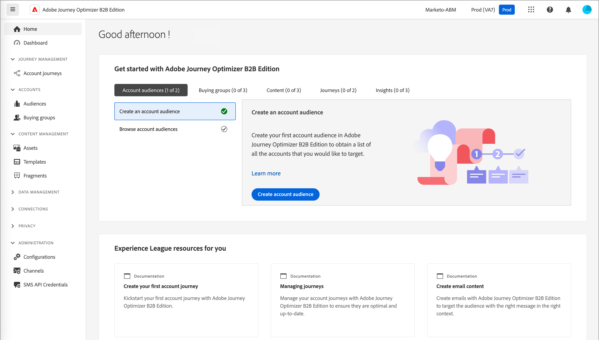

# Accedi e home page

Con Adobe Journey Optimizer B2B Edition, puoi orchestrare account e percorsi di gruppi di acquisto utilizzando l’intelligenza artificiale generativa integrata e l’automazione leader del settore per massimizzare la domanda di offerte specifiche utilizzando gruppi di acquisto qualificati per il marketing.

<!-- Requirements?
-->
Per accedere a [!DNL Adobe Journey Optimizer B2B Edition], connettiti a Adobe Experience Cloud con il tuo Adobe ID e seleziona [!DNL Journey Optimizer B2B Edition].

{width="800" zoomable="yes"}

La pagina Home viene visualizzata quando accedi a Adobe Experience Platform e selezioni l’app Adobe Journey Optimizer B2B Edition. Questa pagina fornisce una panoramica dello stato attuale delle iniziative B2B di Journey Optimizer sotto forma di informazioni approfondite e di accesso rapido ai moduli pertinenti. Fornisce inoltre informazioni sull’azione successiva ideale da intraprendere e su dove trovare il set completo di tutorial e documentazione.

La Journey Optimizer B2B Edition dispone di due utenti tipo principali: un addetto al marketing e un amministratore. Ogni utente tipo ha una home page specifica per diverse fasi di maturità (nuove o avanzate). Il contenuto della pagina è basato su ciò di cui ogni utente ha bisogno in termini di informazioni e sulle azioni successive da intraprendere. Queste pagine includono anche l&#39;accesso a [Assistente AI](./start/ai-assistant.md), che consente agli utenti di ottenere informazioni rapide su qualsiasi domanda o argomento specifico necessario<!-- and to obtain specific recommendations for their challenges or objectives-->.

{width="800" zoomable="yes"}

* **Addetto marketing - nuovo utente** - La home page _Addetto marketing_ per un nuovo utente consente di abituarsi a Journey Optimizer B2B e alle relative funzionalità. Include una procedura guidata che consente al nuovo addetto al marketing di ottenere una procedura dettagliata per l’onboarding, in modo che possa comprendere le sfumature del sistema e diventare efficiente nello sviluppo di strategie e iniziative di marketing B2B.
* **Addetto marketing - utente avanzato** - La home page di _Addetto marketing_ per un addetto marketing avanzato consente di ottenere ulteriori informazioni sull&#39;avanzamento corrente delle iniziative e sulle azioni specifiche, nonché sulle azioni migliori successive da intraprendere e sull&#39;accesso rapido alle sezioni rilevanti.
* **Amministratore - nuovo utente** - La home page di _Amministratore_ per un nuovo amministratore consente di abituarsi all&#39;edizione B2B di Journey Optimizer e alle relative funzionalità. Include una procedura guidata che consente al nuovo amministratore di ottenere un percorso di onboarding passo per passo per comprenderne le sfumature e diventare efficiente nello sviluppo di strategie e iniziative di marketing B2B.
* **Amministratore - utente avanzato** - La home page _Amministratore_ per un amministratore avanzato consente di ottenere ulteriori informazioni sullo stato corrente dell&#39;istanza e su azioni specifiche che possono essere intraprese per renderla più efficiente ed efficace per gli addetti al marketing.

<!-- 

## Marketer - new user

The Marketer home page for a new user consists of three rows that assist the marketer in getting accustomed to Journey Optimizer B2B and its capabilities. It also provides a view of the latest journeys that have been created, which can serve as a starting point for a new user.

The first row consists of a guided walkthrough for the new marketer to obtain an onboarding walkthrough so that they can understand the nuances of the system and become efficient in developing B2B marketing strategies and initiatives.

The second row consists of the recent AJO B2B journeys that have been created across the platform so that the marketer can get inspiration for the best practices to create an account journey.

The third row consists of the learning resources that can help a marketer gain more information on a specific topic.

## Marketer - advanced user

The Marketer home page for an advanced marketer consists of four rows that assists the marketer in obtaining more information on the current progress of the initiatives and on specific actions and on the next best action to be taken along with quick access to relevant sections.

The first row consists of the next set of actions that a B2B marketer can take based on the previous actions taken and the current state of the initiative, which provides a prompt for the user to make the next move that would align to the objective of the initiatives and help them reach the goals quickly.

The second row consists of the most recent assets accessed by the marketer to make it easier for the marketer to locate them and make updates to the same.

The third row consists of the Key Performance Indicators that can help the marketer gauge the overall performance of the marketing initiatives.

The fourth row consists of the learning resources that can help a marketer gain more information on a specific topic.

## Administrator - new user

The _Admin_ home page for a new administrator consists of three rows that assists the administrator in getting accustomed to Journey Optimizer B2B Edition and its capabilities, and provides a view of the latest journeys that have been created that can serve as a starting point for a new user.

The first row consists of a guided walkthrough for the new marketer to obtain a step-by-step onboarding journey to understand the nuances of the system and become efficient in developing B2B marketing strategies and initiatives with AJO B2B.

The second row consists of the recent assets used by the B2B marketers in a single table to make it easier for the administrator to know which assets are currently under focus.

The third row consists of the learning resources that would help an administrator gain more information on a specific topic.

## Administrator - advanced user

The _Admin_ home page for an advanced administrator consists of four rows that assists the administrator in obtaining more information about the current status of the instance and on specific actions that can be taken to make it more efficient and effective for the marketers.

The first row consists of the next set of actions that an administrator can take based on the previous actions taken and the current state of the instance. It serves as a prompt for the administrator to make the necessary updates to the parameters of the instances such as user permissions or any specific module configurations.

The second row consists of the recent assets used by the B2B marketers in a single table to make it easier for the administrator to know which assets are currently under focus.

The third row consists of the Key Performance Indicators that would help the administrators gauge the progress of the instance in terms of operational parameters such as users and usage.

The fourth row consists of the learning resources that would help the administrator gain more information on a specific topic.

-->