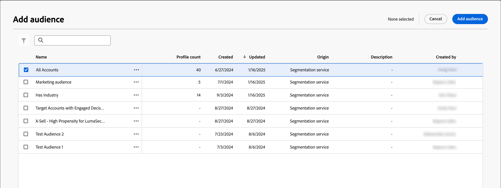
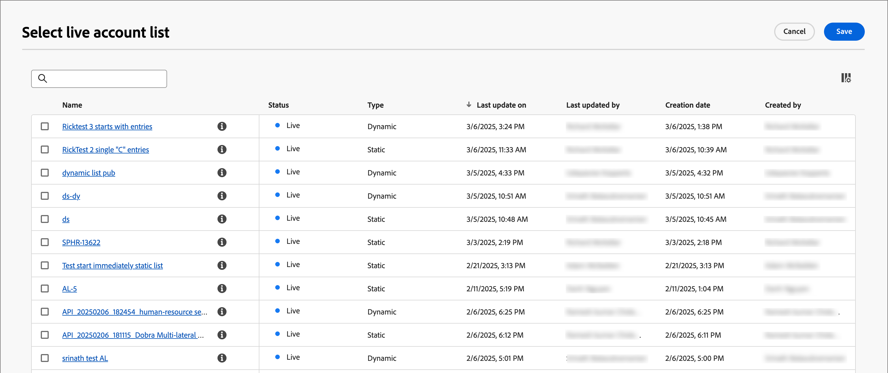

# Nodi del percorso di pubblico dell’account

Il nodo Pubblico account definisce gli account di input per il percorso. Quando [crei un percorso di account](./journey-overview.md#create-an-account-journey), questo inizia sempre con un nodo _Pubblico account_ che definisce l&#39;input per il percorso.

Esistono due tipi di input che è possibile utilizzare per questo nodo:

* **[Pubblico dell&#39;account](../audiences/account-audience-overview.md)** - Si tratta del pubblico di base sincronizzato dal servizio di segmentazione di Experience Platform.
* **[Elenco account](../accounts/account-lists.md)** - Si tratta di una raccolta di account denominati che è possibile utilizzare per l&#39;orchestrazione di percorso di destinazione. Un elenco di conti esegue il targeting dei conti denominati in base ai criteri definiti, ad esempio settore, ubicazione o dimensioni della società.

_Per impostare il pubblico per il nodo:_

1. Fai clic sul nodo **[!UICONTROL Pubblico account]** per visualizzare le proprietà del nodo a destra.

   {width="700" zoomable="yes"}

1. Scegliere il tipo di input per i conti da inserire nel percorso:

   * **[!UICONTROL Pubblico account]**

     Scegliere questo tipo e quindi fare clic su **[!UICONTROL Aggiungi pubblico account]**.

     Nella finestra di dialogo _[!UICONTROL Aggiungi pubblico]_, seleziona un segmento di pubblico creato in precedenza e fai clic su **[!UICONTROL Aggiungi pubblico]**.

     {width="700" zoomable="yes"}

   * **[!UICONTROL Elenco account]**

     Scegliere questo tipo e quindi fare clic su **[!UICONTROL Aggiungi elenco account]**.

     Nella finestra di dialogo _[!UICONTROL Seleziona elenco account live]_, seleziona un elenco account pubblicato in precedenza e fai clic su **[!UICONTROL Salva]**.

     {width="700" zoomable="yes"}

     Per informazioni dettagliate sulla creazione e la pubblicazione di elenchi di account, vai a [Elenchi account](../accounts/account-lists.md).

_Per creare un segmento di pubblico:_

1. Nel menu di navigazione a sinistra, scegli **[!UICONTROL Account]** > **[!UICONTROL Tipi di pubblico]**.

1. Fai clic su **[!UICONTROL Crea pubblico]** in alto a destra.

   {width="800" zoomable="yes"}

1. Segui i passaggi descritti nella [Guida al servizio di segmentazione](https://experienceleague.adobe.com/en/docs/experience-platform/segmentation/ui/account-audiences){target="_blank"}.
