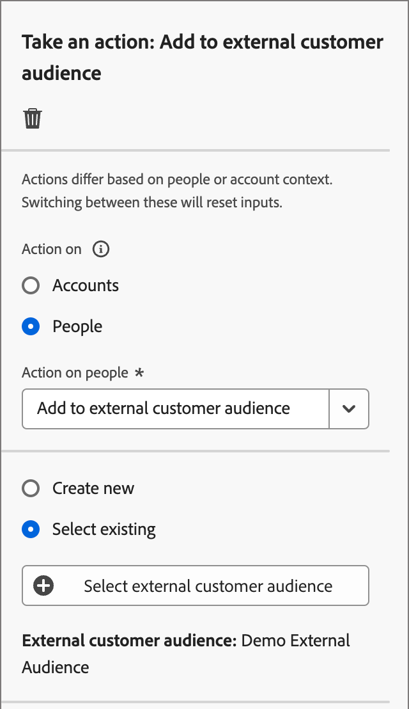
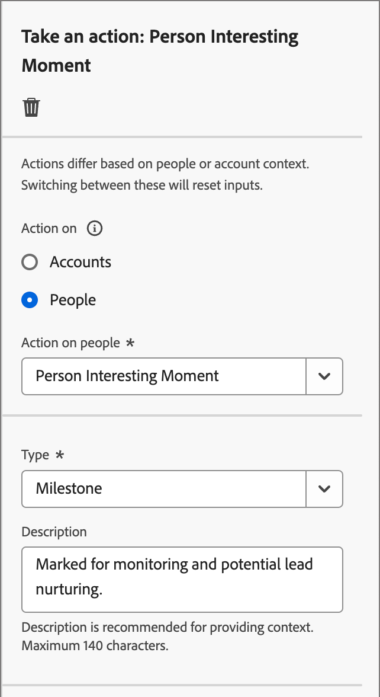

# Intraprendere un’azione

Nel tuo percorso di account puoi aggiungere un nodo _[!UICONTROL Esegui un&#39;azione]_ per eseguire un&#39;azione, ad esempio inviare un&#39;e-mail, modificare un punteggio, assegnare un gruppo di acquisto e così via. Le azioni sono in genere ciò che desideri che accada come risultato di un qualche tipo di trigger, ad esempio un evento o un’azione precedente.

{width="30"} [Guarda il video introduttivo](#overview-video)

## Azioni account

Utilizza un’azione sugli account quando desideri applicare una modifica a tutte le persone che fanno parte degli account nel percorso del nodo.

### Azioni e vincoli {#account-action-constraints}

| Azione | Vincoli |
| ------ | ----------- |
| [!UICONTROL Valore dati modifica account] | Seleziona attributo Nuovo valore |
| [!UICONTROL Momento di interesse account] | Tipo (e-mail, milestone o web) Descrizione (facoltativo) |
| [!UICONTROL Aggiungi account a (altro) Percorso] | Seleziona percorso di account live |
| [!UICONTROL Aggiungi all&#39;elenco account] | Seleziona elenco account statico live |
| [!UICONTROL Rimuovi account dal Percorso] | Seleziona percorso di account live |
| [!UICONTROL Rimuovi dall&#39;elenco account] | Seleziona un elenco di account statici attivi |
| [!UICONTROL Invia avviso vendite] | Seleziona interesse soluzione Invia e-mail a |
| [!UICONTROL Aggiorna fase gruppo acquisti] | Seleziona interesse soluzione Seleziona fase gruppo acquisti |
| [!UICONTROL Aggiorna stato gruppo acquisti] | Seleziona interesse soluzione Stato (obbligatorio, massimo 50 caratteri) |

### Aggiungere un’azione basata sull’account

1. Passa alla mappa del percorso.

1. Fai clic sull&#39;icona più ( **+** ) in un percorso e scegli **[!UICONTROL Esegui un&#39;azione]**.

   {width="400"}

1. Nelle proprietà del nodo a destra, scegliere **[!UICONTROL Account]** per l&#39;azione.

1. Seleziona un&#39;azione dall&#39;elenco e imposta i valori per l&#39;azione.

   {width="700" zoomable="yes"}

## Azioni persone

Utilizza un’azione sulle persone quando desideri applicare una modifica a tutte le persone nel percorso del nodo. Questo tipo di nodo può essere utilizzato all’interno del percorso suddiviso da persone o dal percorso suddiviso da account.

### Azioni e vincoli {#people-action-constraints}

| Contesto | Azione | Vincoli |
| ------- | ------ | ----------- |
| [Journey Optimizer B2B](#journey-optimizer-b2b-actions) | [!UICONTROL Aggiungi a pubblico cliente esterno] | Seleziona un pubblico di clientela esterno |
| | [!UICONTROL Assegna al gruppo di acquisto] | Seleziona interesse soluzione Seleziona ruolo |
| | [!UICONTROL Modifica valore dati] | Seleziona attributo persona Imposta nuovo valore |
| | [!UICONTROL Modifica punteggio] | Nome punteggio Modifica del punteggio |
| | [!UICONTROL Momento di interesse della persona] | Tipo Descrizione |
| | [!UICONTROL Rimuovi dal gruppo di acquisto] | Seleziona l’interesse della soluzione |
| | [!UICONTROL Invia e-mail] | Crea nuova e-mail Seleziona e-mail da Marketo Engage |
| | [!UICONTROL Invia SMS] | Crea SMS |
| [Marketo Engage](#marketo-engage-actions) | [!UICONTROL Aggiungi all&#39;elenco] | Seleziona area di lavoro Marketo Engage Nome elenco |
| | [!UICONTROL Aggiungi alla campagna di richiesta Marketo Engage] | Seleziona area di lavoro Marketo Engage Seleziona campagna di richiesta |
| | [!UICONTROL Cambia partizione persone in Marketo Engage] | Nuova partizione |
| | [!UICONTROL Rimuovi dall&#39;elenco] | Seleziona area di lavoro Marketo Engage Nome elenco |

### Aggiungere un&#39;azione basata sulle persone

1. Passa alla mappa del percorso.

1. Fai clic sull&#39;icona più ( **+** ) in un percorso e scegli **[!UICONTROL Esegui un&#39;azione]**.

1. Nelle proprietà del nodo a destra, scegli **[!UICONTROL Persone]** per l&#39;azione.

1. Seleziona un&#39;azione dall&#39;elenco e imposta i valori per l&#39;azione.

{width="700" zoomable="yes"}

### Azioni B2B di Journey Optimizer

Le azioni basate sulle persone B2B di Journey Optimizer sono progettate per gestire le comunicazioni tramite i canali configurati e la categorizzazione delle persone all’interno dei gruppi di acquisto e degli account. Il percorso applica l’azione quando un account idoneo con profili persona raggiunge il nodo.

+++[!UICONTROL Aggiungi a pubblico cliente esterno]

Utilizza questa azione per indirizzare le persone a un pubblico esterno che può essere attivato su un canale multimediale a pagamento per rivolgerti ulteriormente ai membri dei gruppi di acquisto. Questa azione viene eseguita tramite Real-Time CDP B2B/P Edition.

>[!NOTE]
>
>Quando un account qualificato con profili persona raggiunge il nodo _Aggiungi al pubblico cliente esterno_ in un percorso pubblicato, possono essere necessarie fino a 48 ore perché tali profili si popolino nel pubblico esterno.

{width="300"}

Quando selezioni questa azione basata sulle persone, puoi creare un nuovo pubblico esterno o selezionarlo da un pubblico esterno esistente. Per i tipi di pubblico esistenti, puoi scegliere uno dei tipi di pubblico dei clienti esterni che sono stati creati solo in Journey Optimizer B2B edition. Quando crei un pubblico e lo utilizzi per questa azione di percorso, accertati di connettere la destinazione. Per ulteriori informazioni, consulta [Creare una nuova connessione di destinazione](https://experienceleague.adobe.com/it/docs/experience-platform/destinations/ui/connect-destination){target="_blank"} e [Panoramica attivazione](https://experienceleague.adobe.com/it/docs/experience-platform/destinations/ui/activate/activation-overview#activate-audiences-from-the-destinations-catalog){target="_blank"} nella documentazione di Experience Platform.

{width="30"} [Guarda una panoramica video per l&#39;orchestrazione a pagamento](../data/linkedin-account-matched-audiences.md#orchestrate-paid-media-engagement)

_Per creare un pubblico esterno:_

1. Scegli **[!UICONTROL Crea nuovo]**.

1. Fai clic su **[!UICONTROL Crea pubblico cliente esterno]**.

1. Immetti **[!UICONTROL Nome]** (obbligatorio) e **[!UICONTROL Descrizione]** (facoltativo) per il nuovo pubblico esterno.

   {width="300"}

1. Fai clic su **[!UICONTROL Crea]**.

   Il sistema crea il nuovo pubblico e visualizza un messaggio di conferma. Puoi quindi continuare a utilizzarlo come pubblico esistente per l’azione del nodo.

   >[!NOTE]
   >
   >Quando viene creato un nuovo pubblico di clienti esterno da Journey Optimizer B2B edition, questo viene preimpostato con un record fittizio (`test@email.com`). Questo record viene sovrascritto non appena il primo profilo reale viene aggiunto al pubblico esterno dal percorso.

_Per utilizzare un pubblico esistente:_

1. Fai clic su **[!UICONTROL Seleziona pubblico cliente esterno]**.

1. Nella finestra di dialogo, seleziona il pubblico che desideri utilizzare.

   {width="700" zoomable="yes"}

1. Fai clic su **[!UICONTROL Aggiungi pubblico]**.

+++

+++[!UICONTROL Assegna al gruppo di acquisto]

Utilizza questa azione per aggiungere profili di persone a un [gruppo di acquisto](../buying-groups/buying-groups-overview.md) in base all&#39;interesse e al ruolo selezionati per la soluzione.

{width="300"}

+++

+++[!UICONTROL Modifica valore dati]

Utilizzare questa azione per modificare il valore di un attributo del profilo [persone](../data/field-mapping.md#xdm-business-person-attributes). Selezionare l&#39;attributo e quindi impostare il nuovo valore.

{width="300"}

+++

+++[!UICONTROL Modifica punteggio]

Utilizza questa azione per modificare il punteggio della persona in Marketo Engage. [Ulteriori informazioni](https://experienceleague.adobe.com/it/docs/marketo-learn/tutorials/lead-and-data-management/lead-scoring-learn){target="_blank"}

{width="300"}

+++

+++[!UICONTROL Momento di interesse della persona]

Utilizza questa azione per registrare un momento interessante per i profili delle persone. Scegli un tipo (E-mail, Milestone o Web) e aggiungi una descrizione (facoltativa).

{width="300"}

+++

+++[!UICONTROL Rimuovi dal gruppo di acquisto]

Utilizza questa azione per rimuovere i profili di persone da un [gruppo di acquisto](../buying-groups/buying-groups-overview.md) in base all&#39;interesse di una soluzione selezionata.

{width="300"}

+++

+++[!UICONTROL Invia e-mail]

Utilizza questa azione per inviare un messaggio e-mail. Puoi creare, personalizzare e visualizzare in anteprima i messaggi e-mail nella finestra di progettazione visiva (vedi [Authoring di e-mail](../content/email-authoring.md)). Puoi anche inviare un messaggio e-mail [da Marketo Engage](https://experienceleague.adobe.com/it/docs/marketo/using/product-docs/email-marketing/general/creating-an-email/create-an-email){target="_blank"}. Seleziona l’area di lavoro di Marketo Engage, quindi fai clic sull’e-mail da inviare.

{width="300"}

+++

+++[!UICONTROL Invia SMS]

Utilizza questa azione per inviare un messaggio SMS. Puoi creare, personalizzare e visualizzare in anteprima i messaggi SMS nella finestra di progettazione visiva (vedi [Creazione di SMS](../content/sms-authoring.md)).

{width="300"}

+++

### Azioni Marketo Engage

Le azioni basate sulle persone di Marketo Engage sono progettate per coordinare l’orchestrazione marketing basata sull’account in Journey Optimizer B2B edition con le attività di marketing basate sui lead in Marketo Engage. Utilizza queste azioni per orchestrare l’appartenenza a un elenco, le partizioni delle persone e le campagne di richiesta.

+++[!UICONTROL Aggiungi all&#39;elenco]

Utilizzare questa azione per rimuovere persone da un [elenco avanzato](https://experienceleague.adobe.com/it/docs/marketo/using/product-docs/core-marketo-concepts/smart-lists-and-static-lists/understanding-smart-lists){target="_blank"} in Marketo Engage.

Selezionare innanzitutto l&#39;area di lavoro nell&#39;istanza di Marketo Engage connessa. Quindi, selezionare il nome dell&#39;elenco.

{width="300"}

+++

+++[!UICONTROL Aggiungi alla campagna di richiesta Marketo]

Utilizza questa azione per aggiungere profili di persone a una [campagna di richieste](https://experienceleague.adobe.com/it/docs/marketo/using/product-docs/core-marketo-concepts/smart-campaigns/flow-actions/request-campaign){target="_blank"} in Marketo Engage.

Selezionare innanzitutto l&#39;area di lavoro nell&#39;istanza di Marketo Engage connessa. Quindi, seleziona il nome della campagna di richiesta.

{width="300"}

+++

+++[!UICONTROL Cambia partizione persone in Marketo Engage]

Utilizzare questa azione per modificare la partizione [persona](https://experienceleague.adobe.com/it/docs/marketo/using/product-docs/administration/workspaces-and-person-partitions/understanding-workspaces-and-person-partitions#person-partitions){target="_blank"} in Marketo Engage.

{width="300"}

+++

+++[!UICONTROL Rimuovi dall&#39;elenco]

Utilizzare questa azione per rimuovere persone da un [elenco avanzato](https://experienceleague.adobe.com/it/docs/marketo/using/product-docs/core-marketo-concepts/smart-lists-and-static-lists/understanding-smart-lists){target="_blank"} in Marketo Engage. Selezionare innanzitutto l&#39;area di lavoro nell&#39;istanza di Marketo Engage connessa. Quindi, selezionare il nome dell&#39;elenco.

{width="300"}

Se il profilo della persona non era un membro dell’elenco smart, l’azione viene ignorata.

+++

## Video di panoramica

>[!VIDEO](https://video.tv.adobe.com/v/3443253/?learn=on&captions=ita)
