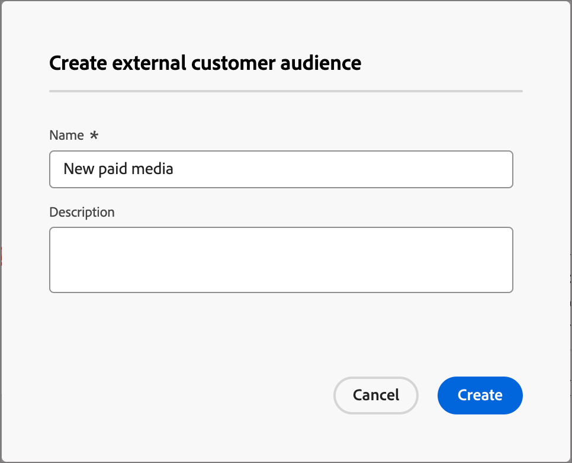

# Intraprendere un’azione

Nel tuo percorso di account puoi aggiungere un nodo _[!UICONTROL Esegui un&#39;azione]_ per eseguire un&#39;azione, ad esempio inviare un&#39;e-mail, modificare un punteggio, assegnare un gruppo di acquisto e così via. Le azioni sono in genere ciò che desideri che accada come risultato di un qualche tipo di trigger, ad esempio un evento o un’azione precedente.

{width="30"} [Guarda il video introduttivo](#overview-video)

## Azioni account

Utilizza un’azione sugli account quando desideri applicare una modifica a tutte le persone che fanno parte degli account nel percorso del nodo.

### Azioni e vincoli {#account-action-constraints}

| Azione | Vincoli |
| ------ | ----------- |
| [!UICONTROL Momento di interesse account] | Tipo (e-mail, milestone o web) Descrizione (facoltativo) |
| [!UICONTROL Attiva nella destinazione] | Seleziona una destinazione |
| [!UICONTROL Aggiungi account a (altro) Percorso] | Seleziona percorso di account live |
| [!UICONTROL Aggiungi all&#39;elenco account] | Seleziona elenco account statico live |
| [!UICONTROL Rimuovi account dal Percorso] | Seleziona percorso di account live |
| [!UICONTROL Rimuovi dall&#39;elenco account] | Seleziona un elenco di account statici attivi |
| [!UICONTROL Invia avviso vendite] | Seleziona interesse soluzione Invia e-mail a |
| [!UICONTROL Aggiorna profilo account] | Seleziona attributo Nuovo valore |
| [!UICONTROL Aggiorna fase gruppo acquisti] | Seleziona interesse soluzione Seleziona fase gruppo acquisti |
| [!UICONTROL Aggiorna stato gruppo acquisti] | Seleziona interesse soluzione Stato (obbligatorio, massimo 50 caratteri) |

>[!NOTE]
>
>L&#39;azione _[!UICONTROL Valore dati modifica account]_ è obsoleta per la versione 2025.10. _[!UICONTROL Aggiorna profilo account]_ sostituisce questa azione per la [architettura semplificata](../simplified-architecture.md). 
>
>Un amministratore può configurare gli attributi disponibili per l&#39;account aziendale XDM aggiornando i campi nelle _[!UICONTROL classi XDM]_ > _[!UICONTROL classi standard]_. Per ulteriori informazioni, vedere [Classi standard](../admin/xdm-field-management.md#standard-classes).

### Aggiungere un’azione basata sull’account

1. Passa alla mappa del percorso.

1. Fai clic sull&#39;icona più ( **+** ) in un percorso e scegli **[!UICONTROL Esegui un&#39;azione]**.

   {width="400"}

1. Nelle proprietà del nodo a destra, scegliere **[!UICONTROL Account]** per l&#39;azione.

1. Seleziona un&#39;azione dall&#39;elenco e imposta i valori per l&#39;azione.

   {width="700" zoomable="yes"}

>[!BEGINSHADEBOX]

### Attiva in una destinazione LinkedIn

Utilizza l&#39;azione _Attiva nella destinazione_ per gli account per attivare gli account nelle destinazioni Experience Platform direttamente dal tuo percorso. Questa azione ti consente di inviare account qualificati (in base ai filtri dei gruppi di acquisto, ai punteggi di coinvolgimento e ad altri criteri) ai tipi di pubblico corrispondenti sulle destinazioni supportate. It

A partire dalla versione 2025.10, **_LinkedIn_** è il primo tipo di destinazione supportato. Utilizza l’azione per una destinazione LinkedIn per semplificare l’esecuzione della campagna eliminando gli handoff tra più sistemi e riducendo la latenza. Ad esempio, in qualità di esperto di marketing, puoi attivare automaticamente account con intenti elevati in LinkedIn per il retargeting quando mancano ruoli di acquisto chiave oppure puoi coinvolgere nuovamente account inattivi basati su filtri di inattività.

Per ulteriori informazioni sull&#39;utilizzo di tipi di pubblico con corrispondenza account per una destinazione LinkedIn, vedere [Tipi di pubblico con corrispondenza account LinkedIn](../data/linkedin-account-matched-audiences.md).

+++ Impostare l&#39;attivazione degli account su una destinazione LinkedIn

1. Con il nodo _Esegui un&#39;azione_ selezionato nell&#39;area di lavoro del percorso, impostare **[!UICONTROL Azione sugli account]** su **[!UICONTROL Attiva nella destinazione]**.

1. Fare clic su **[!UICONTROL Seleziona destinazione]**.

   {width="600" zoomable="yes"}

1. Nella finestra di dialogo, seleziona la destinazione LinkedIn configurata e fai clic su **[!UICONTROL Salva]**.

{width="700" zoomable="yes"}

1. Immetti il **[!UICONTROL Nome pubblico]** utilizzato per identificare il pubblico attivato nella destinazione.

   {width="550" zoomable="yes"}

+++

>[!ENDSHADEBOX]

## Azioni persone

Utilizza un’azione sulle persone quando desideri applicare una modifica a tutte le persone nel percorso del nodo. Questo tipo di nodo può essere utilizzato all’interno del percorso suddiviso da persone o dal percorso suddiviso da account.

### Azioni e vincoli {#people-action-constraints}

| Contesto | Azione | Vincoli |
| ------- | ------ | ----------- |
| [Journey Optimizer B2B](#journey-optimizer-b2b-actions) | [!UICONTROL Aggiungi a pubblico cliente esterno] | Seleziona un pubblico di clienti esterno |
| | [!UICONTROL Assegna al gruppo di acquisto] | Seleziona interesse soluzione Seleziona ruolo |
| | [!UICONTROL Modifica punteggio] | Nome punteggio Modifica del punteggio |
| | [!UICONTROL Momento di interesse della persona] | Tipo Descrizione |
| | [!UICONTROL Rimuovi dal gruppo di acquisto] | Seleziona l’interesse della soluzione |
| | [!UICONTROL Invia e-mail] | Crea e-mail |
| | [!UICONTROL Invia SMS] | Crea SMS |
| | [!UICONTROL Aggiorna profilo persona] | Seleziona attributo persona Imposta nuovo valore |
| [Marketo Engage](#marketo-engage-actions) | [!UICONTROL Aggiungi alla campagna di richiesta Marketo Engage] | Seleziona area di lavoro Marketo Engage Seleziona campagna di richiesta |
| | [!UICONTROL Aggiungi a elenco Marketo] | Seleziona il nome della connessione Marketo esterna  Nome elenco |
| | [!UICONTROL Rimuovi dall&#39;elenco di Marketo] | Seleziona il nome della connessione Marketo esterna  Nome elenco |

>[!NOTE]
>
>L&#39;azione _[!UICONTROL Cambia partizione persone in Marketo Engage]_ è obsoleta per la versione 2025.10 e non è disponibile nell&#39;[architettura semplificata](../simplified-architecture.md) per Journey Optimizer B2B edition. 
>
>L&#39;azione _[!UICONTROL Modifica valore dati]_ è obsoleta per la versione 2025.10. Viene sostituito con _[!UICONTROL Aggiorna profilo persona]_ nell&#39;architettura semplificata.

### Aggiungere un&#39;azione basata sulle persone

1. Passa alla mappa del percorso.

1. Fai clic sull&#39;icona più ( **+** ) in un percorso e scegli **[!UICONTROL Esegui un&#39;azione]**.

1. Nelle proprietà del nodo a destra, scegli **[!UICONTROL Persone]** per l&#39;azione.

1. Seleziona un&#39;azione dall&#39;elenco e imposta i valori per l&#39;azione.

{width="700" zoomable="yes"}

### Azioni B2B di Journey Optimizer

Le azioni basate sulle persone B2B di Journey Optimizer sono progettate per gestire le comunicazioni tramite i canali configurati e la categorizzazione delle persone all’interno dei gruppi di acquisto e degli account. Il percorso applica l’azione quando un account idoneo con profili persona raggiunge il nodo.

+++[!UICONTROL Aggiungi a pubblico cliente esterno]

Utilizza questa azione per indirizzare le persone a un pubblico esterno che può essere attivato su un canale multimediale a pagamento per rivolgerti ulteriormente ai membri dei gruppi di acquisto. Questa azione viene eseguita tramite Real-Time CDP B2B edition.

>[!NOTE]
>
>Quando un account qualificato con profili persona raggiunge il nodo _Aggiungi al pubblico cliente esterno_ in un percorso pubblicato, possono essere necessarie fino a 48 ore perché tali profili si popolino nel pubblico esterno.

{width="300"}

Quando selezioni questa azione basata sulle persone, puoi creare un nuovo pubblico esterno o selezionarlo dall’elenco dei tipi di pubblico esterni esistenti.

* Per i tipi di pubblico esistenti, è possibile scegliere tra tipi di pubblico clienti esterni creati solo in [!DNL Journey Optimizer B2B Edition].
* Quando crei un pubblico e lo utilizzi per questa azione di percorso, accertati di connettere la destinazione. Per ulteriori informazioni, vedere [Creare una nuova connessione di destinazione](https://experienceleague.adobe.com/it/docs/experience-platform/destinations/ui/connect-destination){target="_blank"} e [Panoramica attivazione](https://experienceleague.adobe.com/it/docs/experience-platform/destinations/ui/activate/activation-overview#activate-audiences-from-the-destinations-catalog){target="_blank"} nella documentazione di [!DNL Experience Platform].

{width="30"} [Guarda una panoramica video per l&#39;orchestrazione a pagamento](../data/linkedin-account-matched-audiences.md#orchestrate-paid-media-engagement)

A partire dalla versione 2025.10, è inoltre possibile orchestrare tramite tipi di pubblico esterni creati in [!DNL Experience Platform], ad esempio [!DNL Adobe Target] destinazioni. Per informazioni più dettagliate su questa integrazione di pubblico, consulta [Tipi di pubblico esterni di Adobe Target](../audiences/target-external-audience.md).

_Per creare un pubblico esterno :_

1. Scegli **[!UICONTROL Crea nuovo]**.

1. Fai clic su **[!UICONTROL Crea pubblico cliente esterno]**.

1. Immetti **[!UICONTROL Nome]** (obbligatorio) e **[!UICONTROL Descrizione]** (facoltativo) per il nuovo pubblico esterno.

   {width="300"}

1. Fai clic su **[!UICONTROL Crea]**.

   Il sistema crea il nuovo pubblico e visualizza un messaggio di conferma. Puoi quindi continuare a utilizzarlo come pubblico esistente per l’azione del nodo.

   >[!NOTE]
   >
   >Quando viene creato un nuovo pubblico di clienti esterno da Journey Optimizer B2B edition, questo viene preimpostato con un record fittizio (`test@email.com`). Questo record viene sovrascritto non appena il primo profilo reale viene aggiunto al pubblico esterno dal percorso.

_Per utilizzare un pubblico esistente :_

1. Fai clic su **[!UICONTROL Seleziona pubblico cliente esterno]**.

1. Nella finestra di dialogo, seleziona il pubblico che desideri utilizzare.

   {width="700" zoomable="yes"}

1. Fai clic su **[!UICONTROL Aggiungi pubblico]**.

+++

+++[!UICONTROL Assegna al gruppo di acquisto]

Utilizza questa azione per aggiungere profili di persone a un [gruppo di acquisto](../buying-groups/buying-groups-overview.md) in base all&#39;interesse e al ruolo selezionati per la soluzione.

{width="300"}

+++

+++[!UICONTROL Modifica punteggio]

Utilizza questa azione per modificare il punteggio della persona in Marketo Engage. [Ulteriori informazioni](https://experienceleague.adobe.com/it/docs/marketo-learn/tutorials/lead-and-data-management/lead-scoring-learn){target="_blank"}

{width="300"}

+++

+++[!UICONTROL Momento di interesse della persona]

Utilizza questa azione per registrare un momento interessante per le persone. Scegli un tipo (E-mail, Milestone o Web) e aggiungi una descrizione (facoltativa).

{width="300"}

+++

+++[!UICONTROL Rimuovi dal gruppo di acquisto]

Utilizza questa azione per rimuovere i profili di persone da un [gruppo di acquisto](../buying-groups/buying-groups-overview.md) in base all&#39;interesse di una soluzione selezionata.

{width="300"}

+++

+++[!UICONTROL Invia e-mail]

Utilizza questa azione per inviare un messaggio e-mail. Dopo aver [creato l&#39;e-mail](../content/add-email.md#add-an-email-to-your-journey) per il nodo, puoi progettare, personalizzare e visualizzare in anteprima i messaggi e-mail nello spazio di progettazione e-mail (vedi [Authoring e-mail](../content/email-authoring.md)). Puoi anche inviare un messaggio e-mail [da Marketo Engage](https://experienceleague.adobe.com/it/docs/marketo/using/product-docs/email-marketing/general/creating-an-email/create-an-email){target="_blank"}. Seleziona l’area di lavoro di Marketo Engage, quindi fai clic sull’e-mail da inviare.

{width="300"}

>[!NOTE]
>
>Puoi utilizzare la deduplicazione delle e-mail nei percorsi di account per garantire che la stessa e-mail non venga inviata più volte allo stesso indirizzo e-mail all’interno di un percorso. Per ulteriori informazioni, vedere [Deduplicazione e-mail](../content/email-deduplication.md).

+++

+++[!UICONTROL Invia SMS]

Utilizza questa azione per inviare un messaggio SMS. Puoi creare, personalizzare e visualizzare in anteprima i messaggi SMS nello spazio di progettazione visiva (vedi [Creazione di SMS](../content/sms-authoring.md)).

{width="300"}

+++

+++[!UICONTROL Aggiorna profilo persona]

Utilizzare questa azione per modificare il valore di un attributo del profilo [persone](../admin/field-mapping.md#xdm-business-person-attributes). Selezionare l&#39;attributo e quindi impostare il nuovo valore.

{width="300"}

>[!NOTE]
>
>Il _[!UICONTROL Aggiorna profilo persona]_ sostituisce l&#39;azione _[!UICONTROL Modifica valore dati]_ nell&#39;architettura [semplificata](../simplified-architecture.md). 
>
>Un amministratore può configurare gli attributi disponibili per il profilo individuale XDM aggiornando i campi nelle _[!UICONTROL classi XDM]_ > [!UICONTROL classi standard]. Per ulteriori informazioni, vedere [Classi standard](../admin/xdm-field-management.md#standard-classes).

+++

### Azioni Marketo Engage

Le azioni basate sulle persone di Marketo Engage sono progettate per coordinare l’orchestrazione marketing basata sull’account in Journey Optimizer B2B edition con le attività di marketing basate sui lead in Marketo Engage. Utilizza queste azioni per orchestrare l’iscrizione all’elenco e richiedere campagne.

>[!NOTE]
>
>Le azioni Marketo Engage richiedono un’integrazione configurata con una o più istanze Marketo Engage esterne. <!-- For detailed information about configuring these connections, see #. -->

Ad esempio, potrebbe essere utile eliminare le campagne in Marketo Engage per gli utenti che fanno parte di gruppi di acquisto in Journey Optimizer B2B edition. In questo caso, puoi creare un elenco statico in Marketo Engage specifico per la soluzione in questione. Quindi, in un percorso suddiviso acquistando il gruppo, utilizza l&#39;azione _Aggiungi a elenco Marketo_ da un nodo di percorso. Questa azione aggiunge i membri del gruppo di acquisto a un particolare elenco statico in un’istanza di Marketo Engage connessa. Quindi, utilizza l’elenco statico incentrato sugli interessi della soluzione per un filtro elenco avanzato in Marketo Engage.

+++[!UICONTROL Aggiungi alla campagna di richiesta Marketo Engage]

Utilizza questa azione per aggiungere profili di persone a una [campagna di richieste](https://experienceleague.adobe.com/it/docs/marketo/using/product-docs/core-marketo-concepts/smart-campaigns/flow-actions/request-campaign){target="_blank"} in Marketo Engage.

Selezionare innanzitutto un&#39;istanza di Marketo Engage connessa. Quindi, seleziona il nome della campagna di richiesta.

{width="300"}

+++

+++[!UICONTROL Aggiungi a elenco Marketo]

Utilizzare questa azione per aggiungere persone a un [elenco statico](https://experienceleague.adobe.com/it/docs/marketo/using/product-docs/core-marketo-concepts/smart-lists-and-static-lists/static-lists/understanding-static-lists){target="_blank"} in Marketo Engage.

Selezionare innanzitutto un&#39;istanza di Marketo Engage connessa. Quindi, selezionare il nome dell&#39;elenco.

{width="300"}

+++

+++[!UICONTROL Rimuovi dall&#39;elenco di Marketo]

Utilizzare questa azione per rimuovere persone da un [elenco statico](https://experienceleague.adobe.com/it/docs/marketo/using/product-docs/core-marketo-concepts/smart-lists-and-static-lists/static-lists/understanding-static-lists){target="_blank"} in Marketo Engage.

Selezionare innanzitutto un&#39;istanza di Marketo Engage connessa. Quindi, selezionare il nome dell&#39;elenco.

{width="300"}

+++

## Video di panoramica

>[!VIDEO](https://video.tv.adobe.com/v/3443207/?learn=on)
