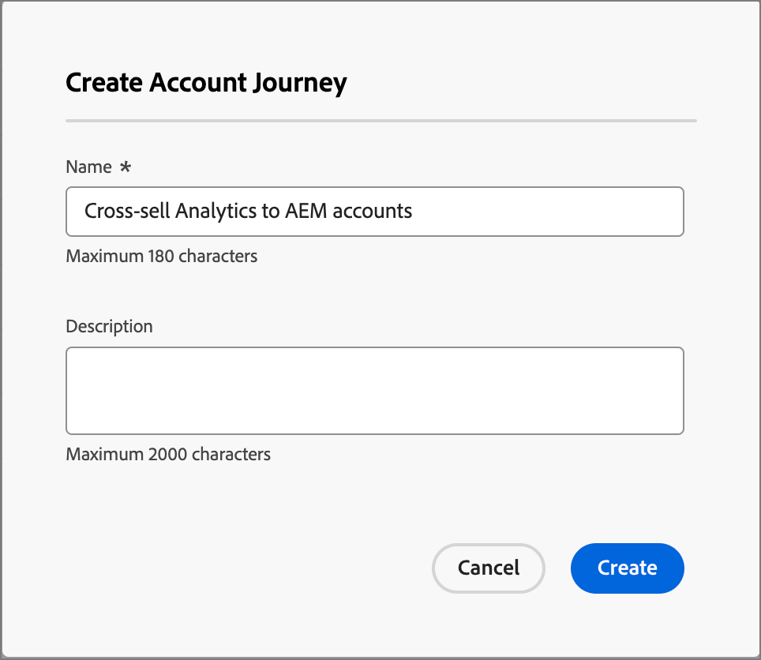
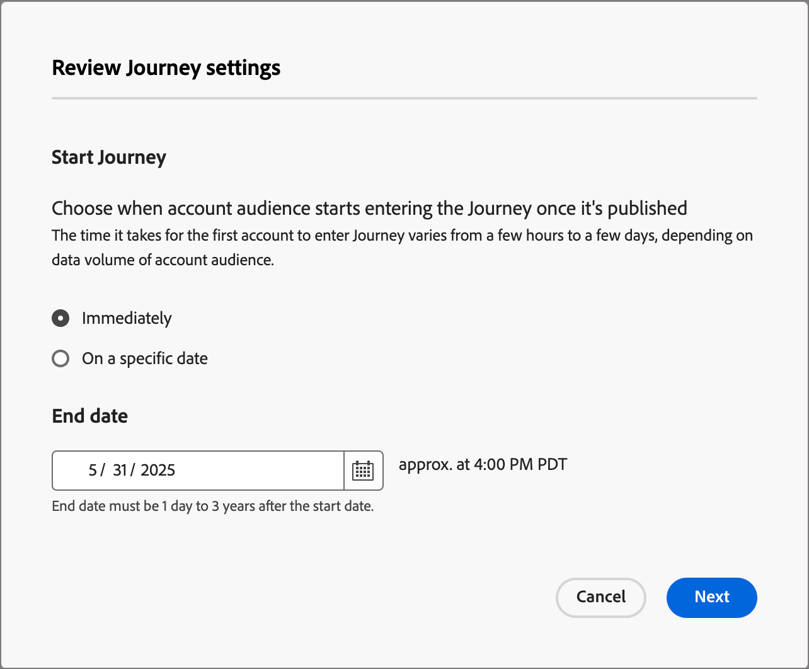

# Creazione e pubblicazione di un percorso di account

Per iniziare a utilizzare un percorsi percorso di account, crealo e quindi costruisci i nodi e il flusso del percorso nella mappa del percorso.

{width="30"} [Guarda il video introduttivo](#overview-video)

## Creazione di un percorso di account

1. Nel menu di navigazione a sinistra, fai clic su **[!UICONTROL percorsi di account]**.

1. Fai clic su **[!UICONTROL Crea Percorso di account]** in alto a destra nella pagina.

1. Nella finestra di dialogo, immetti un **[!UICONTROL Nome]** (obbligatorio) e una **[!UICONTROL Descrizione]** (facoltativo) univoci.

   {width="400"}

1. Fai clic su **[!UICONTROL Crea]**.

## Elementi di base di un percorso

La mappa del percorso __ è la zona centrale nell&#39;area di lavoro del percorso. È in questa zona che puoi aggiungere nodi di percorso e configurarli. Fai clic su un nodo per aprire il relativo riquadro delle proprietà a destra dell’area di lavoro e impostarlo in base alla progettazione. Un percorso di account inizia sempre con un [nodo Pubblico account](./account-audience-nodes.md) in cui puoi aggiungere input al percorso.

Dopo aver creato un percorso di account e aver aggiunto il pubblico, crea il percorso utilizzando i nodi. La mappa del percorso fornisce un’area di lavoro in cui puoi creare casi di utilizzo del marketing B2B a più passaggi utilizzando i seguenti tipi di nodo per creare un percorso di account:

* [Intraprendere un’azione](./action-nodes.md)
* [Ascoltare un evento](./listen-for-event-nodes.md)
* [Suddividi percorsi](./split-merge-paths-nodes.md)
* [Attendere](./wait-nodes.md)
* [Unisci percorsi](./split-merge-paths-nodes.md)

## Guardrail

Per facilitare la creazione di un percorso senza che si verifichino errori, sono presenti le seguenti barre di protezione:

* _Eliminazione di un nodo di percorso suddiviso_: l&#39;eliminazione di un nodo richiede l&#39;eliminazione di tutti i nodi successivi in ciascun percorso.
* _Eliminazione di un nodo di unione_: un nodo di unione può essere eliminato solo quando vi è un percorso connesso. Per eliminare un nodo di unione, lasciare selezionato un solo percorso.
* _Passaggio tra account e persone_: la modifica della selezione da account a persone comporta l&#39;eliminazione di tutti i nodi successivi in ogni percorso.

## Aggiungi un nodo

1. Passa alla mappa del percorso.

1. Fai clic sull&#39;icona più ( **+** ) sul percorso e seleziona il tipo di nodo.

1. Imposta le proprietà del nodo a destra.

## Eliminare un nodo

1. Passa alla mappa del percorso.

1. Nelle proprietà del nodo a destra, fai clic sull&#39;icona _Elimina_ (  ).

1. Nella finestra di dialogo di conformazione, fare clic su **[!UICONTROL Elimina]**.

## Aggiungere ed eliminare un percorso

1. Passa alla mappa del percorso.

1. Fai clic sull&#39;icona più ( **+** ) sul percorso e aggiungi il [nodo percorso diviso](./split-merge-paths-nodes.md#split-paths).

1. Nelle proprietà del nodo a destra, seleziona **[!UICONTROL Account]**.

1. Per aggiungere altri percorsi, fare clic su **[!UICONTROL Aggiungi percorso]**.

   Per ogni percorso creato nel percorso, nelle proprietà viene visualizzata una nuova scheda percorso.

1. Passa a uno dei percorsi nel percorso e aggiungi i nodi [action](./action-nodes.md) o [event](./listen-for-event-nodes.md) a questo percorso utilizzando l&#39;icona più.

1. Seleziona il nodo [split path](./split-merge-paths-nodes.md) per aprire le proprietà a destra.

   Impossibile eliminare i percorsi con nodi.

1. Per eliminare questi percorsi, è necessario eliminare prima tutti i nodi del percorso.

## Pianificare un percorso

Quando pubblichi un percorso, può iniziare immediatamente o in una data futura pianificata. La data di fine può essere un massimo di tre anni dalla data di inizio. Dopo la pubblicazione di un percorso (_Stato Live_), puoi aggiornare la data di fine del percorso ma non la data di inizio.

1. Passa alla mappa del percorso.

1. Pianifica il percorso facendo clic su **[!UICONTROL Impostazioni Percorso]** nell&#39;intestazione.

1. Nella finestra di dialogo, imposta le opzioni di pianificazione:

   * Scegli un tipo di pianificazione.

     Per attivare il percorso in fase di pubblicazione, scegliere **[!UICONTROL Immediatamente]**.

     Per attivare il percorso in una data futura, scegli **[!UICONTROL In una data specifica]** e fai clic sull&#39;icona _Calendario_ per selezionare la data.

     {width="400" zoomable="no"}

   * Specifica la **[!UICONTROL data di fine]** per il percorso. Può essere fino a tre anni dalla data di inizio (questo campo è obbligatorio per la pubblicazione).

1. Fai clic su **[!UICONTROL Salva]**.

   Quando sei pronto a pubblicare il tuo percorso, puoi rivedere queste impostazioni facendo clic su _[!UICONTROL Pubblica]_.

## Pubblicare un percorso di account

È possibile pubblicare un percorso se non sono presenti errori di blocco. Quando viene pubblicato, lo stato del percorso cambia in _Live_. Se il percorso presenta errori, il pulsante _[!UICONTROL Pubblica]_ è inattivo con le informazioni sul contenuto: `Resolve errors before publishing`.

>[!NOTE]
>
>Dopo la pubblicazione di un percorso di account, si verifica un ritardo di 24 ore per l&#39;inserimento degli account idonei nel percorso.

1. Nella parte superiore destra della mappa del percorso, fai clic su **[!UICONTROL Pubblica]**.

1. Nella finestra di dialogo _[!UICONTROL Rivedi impostazioni percorso]_, imposta le opzioni di avvio del percorso.

   Se hai già impostato le impostazioni di percorso per definire una pianificazione, controlla le impostazioni.

   Se è necessario impostare l&#39;attivazione del percorso, scegliere un tipo di pianificazione:

   * Per attivare il percorso in fase di pubblicazione, scegliere **[!UICONTROL Immediatamente]**.

   * Per attivare il percorso in una data futura, scegli **[!UICONTROL In una data specifica]** e fai clic sull&#39;icona _Calendario_ per selezionare la data.

1. Se necessario, specifica la **[!UICONTROL data di fine]** per il percorso.

   {width="400" zoomable="no"}

   Può essere fino a tre anni dalla data di inizio (questo campo è obbligatorio per la pubblicazione).

1. Fai clic su **[!UICONTROL Avanti]**.

1. Nella finestra di dialogo di conferma, fai clic su **[!UICONTROL Pubblica]**.

## Video di panoramica

>[!VIDEO](https://video.tv.adobe.com/v/3443227/?learn=on&captions=ita)
