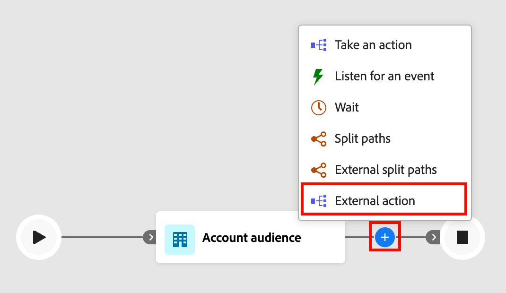

# Nodi esterni

Utilizzare nodi esterni per collegare il percorso a un servizio esterno. Quando un pubblico raggiunge uno di questi nodi, [!DNL Journey Optimizer B2B Edition] invia in modo asincrono i dati degli attributi del pubblico al servizio esterno. Il servizio elabora i dati e risponde utilizzando un callback, restituendo informazioni sul pubblico e metadati utilizzati dal percorso per procedere.

>[!NOTE]
>
>Un amministratore deve [configurare e attivare l&#39;azione esterna](../admin/configure-external-actions.md) prima che gli addetti al marketing possano aggiungere e implementare questi nodi in un percorso.

Esistono due tipi di nodo di azione esterna:

* **[Azione esterna](#external-action)** - Chiama un servizio esterno e continua lungo un singolo percorso in uscita. Utilizzare questo nodo quando si desidera attivare un processo esterno senza logica di diramazione, ad esempio l&#39;aggiornamento di un record in un sistema esterno o l&#39;invio di un segnale a un servizio downstream.
* **[Percorsi di suddivisione esterni](#external-split-paths)** - Chiama un servizio esterno e valuta la risposta per instradare gli account o le persone lungo uno dei diversi percorsi definiti. Usa questo nodo quando il servizio esterno restituisce un valore, ad esempio un punteggio o un livello, che determina il passaggio successivo nel percorso.

## Nodo azione esterna {#external-action}

Il nodo _Azione esterna_ chiama un servizio esterno e continua lungo un singolo percorso in uscita, indipendentemente dal contenuto della risposta. Utilizzalo per le integrazioni in cui non è necessario alcun ramo dopo la chiamata esterna.

1. Passa all’area di lavoro del percorso account o persona.

1. Fai clic sull&#39;icona più ( **+** ) in un percorso e scegli **[!UICONTROL Azione esterna]**.

   {width="400"}

1. (Solo percorsi di account) Nelle proprietà del nodo a destra, imposta il contesto **[!UICONTROL Azione su]** per l&#39;azione esterna:

   * Scegliere **[!UICONTROL Account]** per applicare l&#39;azione esterna a tutte le persone che fanno parte degli account nel percorso del nodo.
   * Scegliere **[!UICONTROL Persone]** per applicare una modifica a tutte le persone nel percorso del nodo.

1. Selezionare il **[!UICONTROL nome servizio]** esterno.

   {width="600" zoomable="yes"}

   L&#39;elenco include tutte le azioni esterne configurate attive e designate per il tipo _Azione esterna_ e il contesto.

1. Se il servizio dispone di attributi globali, immettere i valori richiesti nei campi visualizzati sotto il nome del servizio.

1. Continua a creare il percorso dai percorsi in uscita del nodo.

   Il percorso _[!UICONTROL Timeout o errore]_ viene creato automaticamente. Se il periodo di timeout (configurato nel servizio) scade prima che venga ricevuta una risposta, l’account o la persona procede lungo questo percorso. Lo stesso vale se si riceve una risposta di errore. Per gestire questi scenari, puoi aggiungere nodi di percorso a questo percorso oppure il percorso termina per il membro del pubblico.

## Nodo percorsi suddivisi esterni {#external-split-paths}

Il nodo Percorsi suddivisi esterni richiama un servizio esterno e utilizza la risposta per determinare quali account percorso o persone seguire. Ogni percorso è definito da una condizione basata su una variabile (funzione di accesso) restituita dal servizio esterno. Il percorso valuta la risposta in base alle condizioni del percorso definito e indirizza ogni account o persona lungo il primo percorso corrispondente. Le condizioni del percorso vengono valutate in ordine decrescente. Ogni account o persona procede lungo il primo percorso la cui condizione corrisponde al valore restituito dal servizio esterno.

1. Passa all’area di lavoro del percorso account o persona.

1. Fai clic sull&#39;icona più ( **+** ) in un percorso e scegli **[!UICONTROL Percorsi di suddivisione esterni]**.

   {width="400"}

1. (Solo percorsi di account) Nelle proprietà del nodo a destra, scegli un **[!UICONTROL Dividi percorsi per]** tipo:

   * **[!UICONTROL Account]** - Per i percorsi suddivisi per account, è possibile aggiungere nodi account e persone all&#39;interno dei percorsi definiti.
   * **[!UICONTROL Persone]** - Per i percorsi suddivisi per persone, è possibile aggiungere solo nodi di azione persone all&#39;interno dei percorsi definiti. Una suddivisione basata sulle persone viene automaticamente chiusa con un nodo _[!UICONTROL Percorsi di unione]_ in modo che tutte le persone possano passare al passaggio successivo senza perdere il contesto dell&#39;account.

1. Selezionare **[!UICONTROL Nome servizio]**.

1. Se la configurazione del servizio contiene _attributi globali_, immettere i valori richiesti nei campi visualizzati sotto il nome del servizio.

1. Per _[!UICONTROL Percorso 1]_, definire la condizione di diramazione:

   * Per **[!UICONTROL Label]**, sostituire il valore predefinito con un&#39;etichetta più descrittiva.
   * Per **[!UICONTROL Selezionare la variabile]**, scegliere una funzione di accesso. Le funzioni di accesso sono valori restituiti dal servizio esterno e sono definiti al momento della configurazione dell&#39;azione.
   * Per **[!UICONTROL Selezionare l&#39;operatore]**, scegliere l&#39;operatore.
   * Per **[!UICONTROL Immettere i valori]**, immettere il valore da confrontare.

   {width="600" zoomable="yes"}

   >[!NOTE]
   >
   >Le variabili di condizione disponibili e il contesto di percorso supportato (_Account_, _Persone_ o _Persone nell&#39;account_) sono determinati dalla configurazione dell&#39;azione esterna. Se il servizio o le variabili previsti non sono disponibili, contatta l’amministratore.

1. Per aggiungere altri percorsi, fai clic su **[!UICONTROL Aggiungi percorso]** e definisci una condizione per ciascuno di essi.

1. Continua a creare il percorso da ogni percorso in uscita del nodo.

   Il percorso _[!UICONTROL Timeout o errore]_ viene creato automaticamente. Se il periodo di timeout (configurato nel servizio) scade prima che venga ricevuta una risposta, l’account o la persona procede lungo questo percorso. Lo stesso vale se si riceve una risposta di errore. Per gestire questi scenari, puoi aggiungere nodi di percorso a questo percorso oppure il percorso termina per il membro del pubblico.

1. Per combinare due o più percorsi in base alle esigenze per _Dividi per account_, è possibile aggiungere un [nodo percorsi unione](./split-merge-paths-nodes.md#merge-paths).
