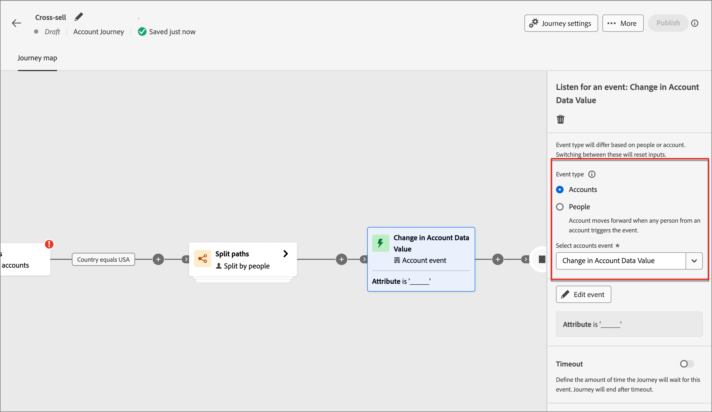

# Nodi del Percorso di account

Dopo aver [creato un percorso di account](journey-overview.md#create-an-account-journey) e [aggiunto il pubblico](journey-overview.md#add-the-account-audience-for-your-journey), crea il percorso utilizzando i nodi. La mappa del percorso fornisce un’area di lavoro in cui puoi creare i tuoi casi d’uso di marketing B2B a più passaggi.

Crea il tuo percorso di account combinando i diversi nodi di azione, evento e orchestrazione come uno scenario multi-passaggio cross-channel. Ogni nodo di un percorso rappresenta un passo lungo un percorso logico. Utilizza i seguenti tipi di nodo per creare un percorso di account:

* [Pubblico dell’account](#account-audience-node)
* [Esegui un&#39;azione](#take-an-action)
* [Ascolta un evento](#listen-for-an-event)
* [Dividere i percorsi](#split-paths)
* [Attendere](#wait)
* [Unisci percorsi](#merge-paths)

## Nodo Pubblico account

Il nodo [Pubblico account](journey-overview.md#add-the-account-audience-for-your-journey) definisce il pubblico dell&#39;account di input (creato e gestito in Adobe Experience Platform) per il percorso. Questo nodo è sempre il primo e viene creato automaticamente per impostazione predefinita.

## Esegui un&#39;azione

Esegui un’azione come l’invio di un’e-mail, la modifica di un punteggio, l’assegnazione a un gruppo di acquisto e così via.

**Azione sugli account**: l&#39;azione viene applicata a tutte le persone che fanno parte degli account in questo percorso.

**Azione sulle persone**: l&#39;azione viene applicata a tutte le persone in questo percorso. Un&#39;azione sulle persone può essere utilizzata all&#39;interno del percorso suddiviso da persone o suddiviso da account.

### Azioni e vincoli {#action-nodes}

| Contesto del nodo | Azione | Vincoli |
| ------------ | ------ | ----------- |
| [Persone](#add-a-people-action) | Aggiungi all&#39;elenco | Seleziona area di lavoro Marketo Engage Nome elenco |
| | Aggiungi alla campagna di richiesta Marketo Engage | Seleziona area di lavoro Marketo Engage Seleziona campagna di richiesta |
| | Assegna a gruppo di acquisto | Seleziona interesse soluzione Seleziona ruolo |
| | Cambia partizione persone nel Marketo Engage | Nuova partizione |
| | Modifica punteggio | Nome punteggio Modifica |
| | Momento di interesse della persona | Tipo Descrizione |
| | Rimuovi dal gruppo di acquisto | Seleziona interesse soluzione |
| | Rimuovi dall’elenco | Seleziona area di lavoro Marketo Engage Nome elenco |
| | Invia e-mail | Crea nuova e-mail Seleziona e-mail da Marketo Engage |
| | Inviare SMS | Creare un SMS |
| [Account](#add-an-account-action) | Valore dati modifica account | Seleziona attributo Nuovo valore |
| | Momento di interesse dell’account | Tipo (e-mail, milestone o web) Descrizione (facoltativo) |
| | Aggiungi account a (altro) Percorso | Seleziona Percorso di account live |
| | Rimuovi account dal Percorso | Seleziona Percorso di account live |
| | Invia avviso vendite | Seleziona interesse soluzione Invia e-mail a |
| | Aggiorna stato gruppo acquisti | Seleziona interesse soluzione Stato (obbligatorio, massimo 50 caratteri) |

### Aggiungi un&#39;azione account

1. Passa all’editor di percorso.

1. Fai clic sull&#39;icona più ( **+** ) in un percorso e scegli **[!UICONTROL Esegui un&#39;azione]**.

   {width="400"}

1. Nelle proprietà del nodo a destra, scegliere **[!UICONTROL Account]** per l&#39;azione.

1. Seleziona un&#39;azione dall&#39;elenco e imposta i valori per l&#39;azione.

   {width="700" zoomable="yes"}

### Aggiungi un&#39;azione persone

1. Passa all’editor di percorso.

1. Fai clic sull&#39;icona più ( **+** ) in un percorso e scegli **[!UICONTROL Esegui un&#39;azione]**.

1. Nelle proprietà del nodo a destra, scegli **[!UICONTROL Persone]** per l&#39;azione.

1. Seleziona un&#39;azione dall&#39;elenco e imposta i valori per l&#39;azione.

{width="700" zoomable="yes"}

## Ascolta un evento

Porta il pubblico al passaggio successivo nel percorso quando si verifica un evento.

* Puoi anche definire il tempo che il percorso attende per questo evento. Il percorso termina dopo un timeout.
* Inoltre, puoi scegliere di aggiungere altri nodi nel percorso di timeout.

**Ascolta gli eventi sugli account**: se almeno una persona di un account attiva un evento, l&#39;account passa al passaggio successivo del percorso.

**Ascolta eventi sulle persone**: gli eventi sulle persone possono essere applicati solo su un percorso account; non è disponibile per un nodo suddiviso per persone.

### Eventi e vincoli {#event-nodes}

| Contesto del nodo | Evento | Vincoli |
| ------------ | ----- | ----------- |
| [Persone](#add-a-people-event) | Assegnato al gruppo di acquisto | Interesse soluzione Vincoli aggiuntivi (facoltativo): <ul><li>Ruolo</li><li>Data di attività</li></ul> Timeout (facoltativo) |
| | Clic sul collegamento nell’e-mail | E-mail Vincoli aggiuntivi (facoltativo): <ul><li>Collegamento</li><li>ID collegamento</li><li>È un dispositivo mobile</li><li>Dispositivo</li><li>Piattaforma</li><li>Browser</li><li>Contenuto predittivo</li><li>È un’attività bot</li><li>Pattern di attività bot</li><li>Browser</li><li>Data di attività</li><li>Min numero di volte</li></ul> Timeout (facoltativo) |
| | Clic sul collegamento in SMS | E-mail Vincoli aggiuntivi (facoltativo):<ul><li>Collegamento</li><li>Dispositivo</li><li>Piattaforma</li><li>Data di attività</li><li>Min numero di volte</li></ul> Timeout (facoltativo) |
| | Modifiche al valore dei dati | Attributo persona Vincoli aggiuntivi (facoltativo):<ul><li>Nuovo valore</li><li>Valore precedente</li><li>Motivo</li><li>Origine</li><li>Data di attività</li><li>Min numero di volte</li></ul> Timeout (facoltativo) |
| | Apre l&#39;e-mail | E-mail Vincoli aggiuntivi (facoltativo): <ul><li>Collegamento</li><li>ID collegamento</li><li>È un dispositivo mobile</li><li>Dispositivo</li><li>Piattaforma</li><li>Browser</li><li>Contenuto predittivo</li><li>È un’attività bot</li><li>Pattern di attività bot</li><li>Browser</li><li>Data di attività</li><li>Min numero di volte</li></ul> Timeout (facoltativo) |
| | Rimosso dal gruppo di acquisto | Interesse soluzione Data di attività (facoltativo) Timeout (facoltativo) |
| | Punteggio modificato | Nome punteggio Vincoli aggiuntivi (facoltativo):<ul><li>Cambia</li><li>Nuovo punteggio</li><li>Urgenza</li><li>Priorità</li><li>Punteggio relativo</li><li>Urgenza relativa</li><li>Data di attività</li><li>Min numero di volte</li></ul> Timeout (facoltativo) |
| | Mancati recapiti SMS | Messaggio SMS Vincoli aggiuntivi (facoltativo):<ul><li>Data di attività</li><li>Numero minimo di volte</li></ul> Timeout (facoltativo) |
| [Account](#add-an-account-event) | L&#39;account ha avuto un momento interessante | Tipo (E-mail, Milestone o Web) Vincoli aggiuntivi (facoltativo):<ul><li>Descrizione</li><li>Origine</li><li>Data di attività</li></ul>  Timeout (facoltativo) |
| | Modifica del valore dei dati dell’account | Attributo Vincoli aggiuntivi (facoltativo):<ul><li>Nuovo valore</li><li>Valore precedente</li><li>Data di attività</li></ul>  Timeout (facoltativo) |
| | Modifica dello stato del gruppo acquisti | Interesse soluzione Vincoli aggiuntivi (facoltativo):<ul><li>Nuovo stato</li><li>Stato precedente</li><li>Data di attività</li></ul>  Timeout (facoltativo) |
| | Modifica nel punteggio di completezza | Interesse soluzione Vincoli aggiuntivi (facoltativo):<ul><li>Nuovo punteggio</li><li>Punteggio precedente</li><li>Data di attività</li></ul>  Timeout (facoltativo) |
| | Modifica nel punteggio di coinvolgimento | Interesse soluzione Vincoli aggiuntivi (facoltativo):<ul><li>Nuovo punteggio</li><li>Punteggio precedente</li><li>Data di attività</li></ul>  Timeout (facoltativo) |

### Aggiungere un evento account

1. Passa all’editor di percorso.

1. Fai clic sull&#39;icona più ( **+** ) in un percorso e scegli **[!UICONTROL Ascolta un evento]**.

1. Nelle proprietà del nodo a destra, scegliere **[!UICONTROL Account]** per il tipo di evento.

   {width="700" zoomable="yes"}

1. Seleziona un evento dall’elenco.

1. Fai clic su **[!UICONTROL Modifica evento]** e definisci i dettagli dell&#39;evento.

### Aggiungere un evento persone

1. Passa all’editor di percorso.

1. Fai clic sull&#39;icona più ( **+** ) in un percorso e scegli **[!UICONTROL Ascolta un evento]**.

1. Nelle proprietà del nodo a destra, scegli **[!UICONTROL Persone]** per il tipo di evento.

   {width="700" zoomable="yes"}

1. Seleziona un evento dall’elenco.

1. Fai clic su **[!UICONTROL Modifica evento]** e definisci i dettagli dell&#39;evento.

### Aggiungere un timeout a un nodo evento

Se necessario, definisci il tempo di attesa dell’evento da parte del percorso. Il percorso termina dopo un timeout.

1. Attiva/disattiva timeout.

1. Selezionare la durata per la quale il percorso attende che si verifichi un evento prima del timeout.

   Puoi scegliere di terminare il percorso qui o intraprendere un’azione diversa impostando un altro percorso.

1. Per creare un nuovo percorso nel percorso in cui è possibile aggiungere azioni ed eventi applicabili agli account quando l&#39;evento non si verifica, selezionare la casella di controllo **[!UICONTROL Imposta percorso di timeout]**.

   {width="700" zoomable="yes"}

## Dividi percorsi

Dividi il pubblico in base alle condizioni del filtro.

>[!NOTE]
>
>Sono supportati un massimo di 25 percorsi.

**Dividi percorsi per account**: i percorsi suddivisi per account possono includere azioni ed eventi sia per account che per persone. Questi percorsi possono essere ulteriormente suddivisi.

_Come funziona un percorso di suddivisione per nodo account?_

* Quando aggiungi un nodo di percorso diviso e scegli _Account_, ogni percorso aggiunto include un nodo finale con la possibilità di aggiungere nodi a ogni nodo perimetrale.
* È possibile suddividere il percorso per account ripetutamente, ad esempio in modo nidificato. Un percorso diviso include un&#39;opzione che consente di non aggiungere il percorso predefinito.
* Se un account/persona non è idoneo per uno dei percorsi suddivisi, non procede nel percorso.
* Questi percorsi possono essere combinati utilizzando un nodo di unione.

{width="700" zoomable="yes"}

**Dividi percorsi per persone**: percorsi suddivisi per persone e possono includere solo azioni persone. Questi percorsi non possono essere nuovamente suddivisi e uniti automaticamente.

_Come funziona un percorso diviso per nodo persone?_

* I nodi di suddivisione del percorso per persone sono nodi raggruppati. Si uniscono automaticamente in modo che tutte le persone nel pubblico possano passare al passaggio successivo senza perdere il contesto degli account a cui appartengono.
* Il percorso di divisione per le persone non può essere nidificato. Non è possibile aggiungere il percorso di divisione per le persone in un percorso che si trova in questo nodo raggruppato.
* Il percorso suddiviso include un&#39;opzione che consente di non aggiungere un percorso predefinito. Gli account/persone che non sono idonei non avanzano nel Percorso.

{width="700" zoomable="yes"}

### Condizioni del percorso {#path-conditions}

| Contesto del nodo | Condizioni del percorso | Descrizione |
| ------------ | --------------- | ----------- |
| [Persone](#add-a-split-path-by-people-node) | [!UICONTROL Attributi della persona] | Attributi dal profilo della persona, tra cui: <ul><li>Città</li><li>Paese</li><li>Data di nascita</li><li>Indirizzo e-mail</li><li>E-mail non valida</li><li>E-mail sospesa</li><li>Nome</li><li>Area dello stato dedotta</li><li>Qualifica</li><li>Cognome</li><li>Numero di telefono cellulare</li><li>Numero di telefono</li><li>Codice postale</li><li>Stato</li><li>Annulla l&#39;iscrizione</li><li>Motivo per annullamento abbonamento</li></ul> |
| | [!UICONTROL Cronologia attività] > [!UICONTROL E-mail] | Attività e-mail associate al percorso: <ul><li>[!UICONTROL Collegamento selezionato nell&#39;e-mail]</li><li>E-mail aperta</li><li>E-mail consegnata</li><li>È stato inviato un messaggio e-mail</li></ul> Queste condizioni vengono valutate utilizzando un messaggio e-mail selezionato in precedenza nel percorso. |
| | [!UICONTROL Cronologia attività] > [!UICONTROL Valore dati modificato] | Per un attributo persona selezionato, si è verificata una modifica del valore. Questi tipi di modifica includono: <ul><li>Nuovo valore</li><li>Valore precedente</li><li>Motivo</li><li>Origine</li><li>Data di attività</li><li>Min numero di volte</li></ul> |
| | [!UICONTROL Cronologia attività] > [!UICONTROL Momento di interesse] | L’attività del momento di interesse definita nell’istanza di Marketo Engage associata. I vincoli includono: ul><li>Milestone</li><li>E-mail</li><li>Web</li></ul> |
| | [!UICONTROL Filtri speciali] > [!UICONTROL Membro del gruppo di acquisto] | La persona è o non è un membro del gruppo di acquisto valutato in base a uno o più dei seguenti criteri: <ul><li>Interesse soluzione</li><li>Stato gruppo acquisti</li><li>Punteggio di completezza</li><li>Punteggio di coinvolgimento</li><li>Ruolo</li></ul> |
| [Account](#add-a-split-path-by-account-node) | Attributi dell’account | Attributi dal profilo dell’account, tra cui: <ul><li>Entrate annuali</li><li>Città</li><li>Paese</li><li>Dimensione dipendente</li><li>Settore</li><li>Nome</li><li>Codice SIC</li><li>Stato</li></ul> |
| | [!UICONTROL Filtri speciali] > [!UICONTROL Ha un gruppo di acquisto] | I membri dei gruppi di acquisto dell’account non vengono valutati in base a uno o più dei seguenti criteri: <ul><li>Interesse soluzione</li><li>Stato gruppo acquisti</li><li>Punteggio di completezza</li><li>Punteggio di coinvolgimento</li></ul> |

### Aggiungere un percorso di suddivisione per nodo account

1. Passa all’editor di percorso.

1. Fare clic sull&#39;icona più ( **+** ) in un percorso e scegliere **[!UICONTROL Dividi percorsi]**.

   {width="300"}

1. Nelle proprietà del nodo a destra, scegli **[!UICONTROL Account]** per la suddivisione.

1. Per definire una condizione applicabile a _[!UICONTROL Percorso 1]_, fare clic su **[!UICONTROL Applica condizione]**.

   {width="500"}

1. Nell’editor delle condizioni, aggiungi uno o più filtri per definire il percorso di divisione.

   * Trascina e rilascia gli attributi del filtro dal menu di navigazione a sinistra e completa la definizione della corrispondenza.

   * Ottimizza le condizioni applicando la **[!UICONTROL logica filtro]** nella parte superiore. Scegli di soddisfare tutte le condizioni dell’attributo o qualsiasi condizione.

     {width="700" zoomable="yes"}

   * Fai clic su **[!UICONTROL Fine]**.

1. Per aggiungere altri percorsi, fare clic su **[!UICONTROL Aggiungi percorso]** e ripetere i passaggi precedenti per aggiungere le condizioni applicabili al percorso.

   È inoltre possibile etichettare ogni percorso in base a queste condizioni o utilizzare le etichette predefinite.

1. (Facoltativo) Aggiungi un percorso predefinito per gli account non qualificati per gli altri percorsi. In caso contrario, il percorso termina per questi account.

   {width="700" zoomable="yes"}

### Aggiungere un percorso suddiviso per nodo persone

1. Passa all’editor di percorso.

1. Fare clic sull&#39;icona più ( **+** ) in un percorso e scegliere **[!UICONTROL Dividi percorsi]**.

   {width="300"}

1. Nelle proprietà del nodo a destra, scegli **[!UICONTROL Persone]** per la suddivisione.

1. Per definire una condizione applicabile a _[!UICONTROL Percorso 1]_, fare clic su **[!UICONTROL Applica condizione]**.

1. Nell’editor delle condizioni, aggiungi uno o più filtri per definire il percorso di divisione.

   * Trascina e rilascia gli attributi del filtro dal menu di navigazione a sinistra e completa la definizione della corrispondenza.

   * Ottimizza le condizioni applicando la **[!UICONTROL logica filtro]** nella parte superiore. Scegli di soddisfare tutte le condizioni dell’attributo o qualsiasi condizione.

   * Fai clic su **[!UICONTROL Fine]**.

1. Per aggiungere altri percorsi, fare clic su **[!UICONTROL Aggiungi percorso]** e ripetere i passaggi precedenti per aggiungere le condizioni applicabili al percorso.

   È inoltre possibile etichettare ogni percorso in base a queste condizioni o utilizzare le etichette predefinite.

1. Infine, puoi aggiungere un percorso predefinito per le persone non qualificate per i percorsi di cui sopra. In caso contrario, il percorso finirà per queste persone

Quando hai definito le condizioni per ogni percorso per suddividere il pubblico a livello di persone, puoi aggiungere azioni che desideri eseguire sulle persone.

>[!NOTE]
>
>Quando dividi il pubblico per persone, puoi aggiungere solo azioni persone.

## Attendere

Attendi un certo periodo di tempo prima di passare al passaggio successivo.

1. Passa all’editor di percorso.

1. Fai clic sull&#39;icona più ( **+** ) in un percorso e scegli **[!UICONTROL Attendi]**.

1. Nelle proprietà del nodo a destra, imposta la **[!UICONTROL Durata]** di tempo di attesa prima che il percorso proceda al nodo successivo nel percorso.

{width="700" zoomable="yes"}

## Unisci percorsi

Utilizzando questo nodo è possibile unire e separare percorsi diversi nel percorso.

1. Passa all’editor di percorso.

1. Fare clic sull&#39;icona più ( **+** ) in un percorso e scegliere **[!UICONTROL Dividi percorsi]**.

1. Fai clic sul nodo diviso per aprirne le proprietà a destra.

1. Fai clic su [!UICONTROL Aggiungi percorso] per creare tre percorsi.

1. Aggiungi una combinazione di azioni ed eventi a ciascun percorso.

1. Fai clic sull&#39;icona più ( **+** ) per uno di questi percorsi e scegli **[!UICONTROL Unisci]** dalle opzioni visualizzate.

   {width="400"}

1. Nelle proprietà del nodo di unione, seleziona i percorsi che desideri unire.

   {width="600" zoomable="yes"}

   A questo punto, i percorsi vengono uniti in modo che gli account dei percorsi selezionati si combinino in un unico percorso che può continuare a progredire attraverso il percorso.

1. Se necessario, puoi annullare l’unione dei percorsi tornando alle proprietà del nodo di unione e deselezionando la casella di controllo di tutti i percorsi che desideri rimuovere.
