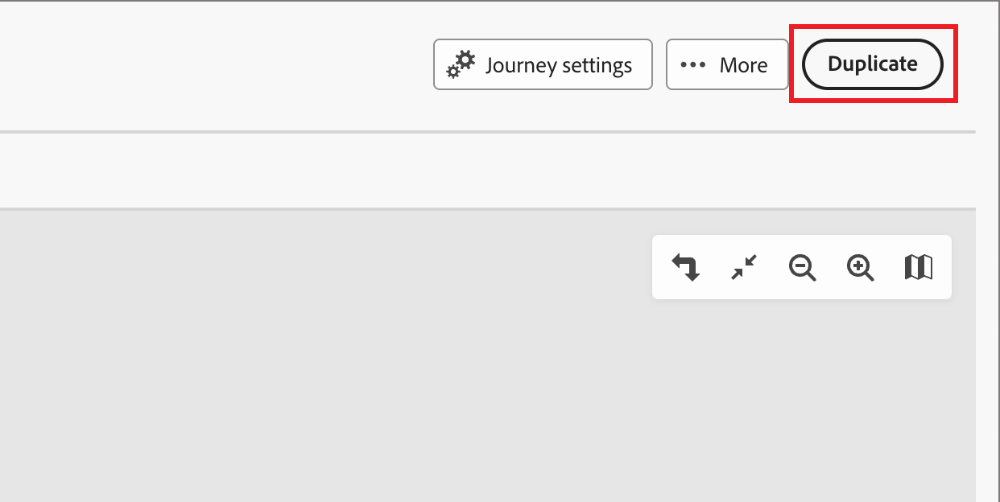

# Percorsi account

Con i percorsi di account è possibile semplificare la generazione della domanda e la qualificazione dei gruppi di acquisto e aumentare la domanda qualificata per i programmi di acquisizione, upselling/cross-selling e fidelizzazione. Personalizza i tuoi percorsi per ogni gruppo di acquisto e membro del gruppo di acquisto utilizzando il coinvolgimento automatico per e-mail, SMS, eventi e altro ancora.

Definisci un coinvolgimento basato sulle vendite che includa e-mail, SMS e altri percorsi account interni per coordinare le attività di marketing in entrata con le attività di vendita in uscita per ciascun membro del gruppo acquisti.

{width="30"} [Guarda il video introduttivo](#overview-video)

## Introduzione a un percorso

Per iniziare a utilizzare i percorsi account:

1. [Crea un percorso](./create-publish-journey.md#create-an-account-journey).
1. [Aggiungi i nodi](./create-publish-journey.md#add-a-node) e [definisci il flusso del percorso](./create-publish-journey.md#add-and-delete-a-path) nella relativa mappa.
1. [Pubblica il percorso](./create-publish-journey.md#publish-an-account-journey).

## Accedere e sfogliare i percorsi di account

1. Nella pagina Home di Adobe Experience Platform, fai clic su Adobe Journey Optimizer B2B Edition.

1. Nel menu di navigazione a sinistra, fai clic su **[!UICONTROL percorsi di account]**.

   {width="800" zoomable="yes"}

   La pagina dei percorsi visualizzata include le colonne riportate di seguito:

   * [!UICONTROL Nome] (fare clic sul nome per aprire il percorso per la modifica)
   * [!UICONTROL Stato]
   * [!UICONTROL Descrizione]
   * [!UICONTROL Creato da]
   * [!UICONTROL Ultimo aggiornamento il]
   * [!UICONTROL Ultimo aggiornamento effettuato da]
   * [!UICONTROL Pubblicato il]
   * [!UICONTROL Pubblicato da]

Utilizza lo strumento _Ricerca_ nella parte superiore per individuare il percorso in base al nome. Puoi ordinare l&#39;elenco in base a _[!UICONTROL Stato]_ facendo clic sull&#39;intestazione della colonna.

Puoi personalizzare le colonne visualizzate nella tabella facendo clic sull&#39;icona _Personalizza tabella_ (  ) nell&#39;angolo in alto a destra. Selezionare o deselezionare le caselle di controllo nella finestra di dialogo e fare clic su **[!UICONTROL Applica]**.

{width="800" zoomable="yes"}

## Anatomia di un percorso account

Fai clic sul nome (visualizzato come collegamento) nell’elenco _[!UICONTROL percorsi account]_ per rivedere i dettagli, apportare modifiche ed eseguire azioni.

{width="800" zoomable="yes"}

L’intestazione di ciascuna mappa del percorso di conti include:

* Nome del percorso
* Accesso per modificare il nome del percorso (  _icona Modifica_)
* Stato del percorso

Lo stato di un percorso può variare in base alle azioni che applichi. In base allo stato di un percorso, alcune azioni sono/non sono disponibili dal lato destro dell&#39;intestazione.

| Stato | Descrizione | Azioni disponibili |
| ------ | ----------- | ----------------- |
| _**Bozza**_ | Un percorso non pubblicato che può essere modificato. | <ul><li>[Pubblica](./create-publish-journey.md#publish-an-account-journey)</li><li>Duplica </li><li>Elimina </li></ul> |
| _**Live**_ | Quando un percorso viene pubblicato, il relativo stato cambia da Bozza a Live. Se il percorso si trova in questo stato, non può più essere modificato. | <ul><li>Duplica </li><li>Chiudi a nuove voci </li><li>Annulla </li></ul> |
| _**Chiuso alle nuove voci**_ | Lo stato del percorso cambia da _Live_ a _Chiuso alle nuove voci_ quando fai clic su [!UICONTROL Chiudi alle nuove voci] nel menu di navigazione superiore. | <ul><li>Duplica </li><li>Annulla </li></ul> |
| _**Annullato**_ | Lo stato del percorso cambia da _Live_ o _Chiuso alle nuove voci_ quando interrompi un percorso. Un percorso annullato non può essere riavviato. | <ul><li>Duplica </li><li>Elimina </li></ul> |
| _**Completato**_ | Quando tutti gli account completano il percorso, lo stato cambia da Live o Chiuso a Completato. | <ul><li>Duplica </li><li>Elimina </li></ul> |

## Gestisci percorsi

L&#39;elenco _Percorsi account_ include tutti i percorsi nell&#39;istanza di Journey Optimizer B2B edition.

### Interrompi percorso

Se interrompi (interrompi) un percorso live o pianificato, gli account nel percorso interrompono immediatamente l’avanzamento e non può verificarsi un ulteriore ingresso nel percorso. Un percorso annullato non può essere riavviato.

>[!IMPORTANT]
>
>Quando il percorso di account viene utilizzato in un altro percorso da un nodo _Esegui un&#39;azione_ con l&#39;azione _Aggiungi account a (altro) Percorso_, l&#39;interruzione del percorso blocca l&#39;azione da tale percorso.

1. Fare clic sul nome del percorso per aprirlo.

1. Fai clic sul menu **[!UICONTROL Altro...]** in alto a destra e scegli **[!UICONTROL Interrompi]**.

   {width="450"}

1. Nella finestra di dialogo di conferma, fai clic su **[!UICONTROL Interrompi]**.

### Chiudi a nuove voci

Se chiudi un percorso in tempo reale, gli account attualmente presenti nel percorso continuano il loro percorso in quel percorso e non è possibile che accada un ulteriore ingresso nel percorso. Un percorso chiuso non può essere riavviato, ma può essere duplicato.

>[!IMPORTANT]
>
>Quando il percorso account viene utilizzato in un altro percorso da un _nodo Intraprendere un&#39;azione_ con l&#39;azione _Aggiungi account a (altro) percorso_ , chiuderlo alle nuove voci blocca tale azione da quel percorso.

1. Fare clic sul nome del percorso per aprirlo.

1. Fai clic sul menu **[!UICONTROL Altro...]** in alto a destra e scegli **[!UICONTROL Chiudi alle nuove voci]**.

1. Nella finestra di dialogo di conferma, fai clic su **[!UICONTROL Chiudi per visualizzare le nuove voci]**.

### Duplica percorso

Un’azione duplicata è simile a una funzione di clonazione, ma un percorso duplicato non include alcuna risorsa di contenuto del percorso creata. Puoi duplicare i dettagli per il percorso di account o solo una semplice _ossatura_ della struttura del flusso e del percorso.s

1. Fai clic sull&#39;icona _Altro_ (**...**) accanto al nome del percorso e scegli **[!UICONTROL Duplica]**.

   {width="450"}

   A seconda dello stato del percorso di account, puoi anche accedere all’azione duplicata dai dettagli del percorso o dalla mappa del percorso:

   * Per un percorso bozza, fai clic sul menu **[!UICONTROL Altro...]** in alto a destra e scegli **[!UICONTROL Duplica]**.

   * Per tutti gli altri stati del percorso, fai clic su **[!UICONTROL Duplica]** in alto a destra.

     {width="450"}

1. Nella finestra di dialogo _Percorso duplicato_, impostare **[!UICONTROL Nome]** e **[!UICONTROL Descrizione]** per il nuovo percorso.

   Per impostazione predefinita, la finestra di dialogo utilizza il nome del percorso duplicato a cui è stata aggiunta __copia_. Immettere un altro nome univoco per il percorso, in base alle esigenze.

   {width="400"}

1. Scegli il duplicato **[!UICONTROL Tipo]**:

   * **[!UICONTROL Duplicazione parziale del contenuto]** - Utilizzare questo tipo per copiare tutto ciò che si trova nel percorso, esclusi i messaggi e-mail o SMS creati. I nodi che fanno riferimento a un messaggio e-mail o SMS di Marketo Engage sono completamente intatti.

   * **[!UICONTROL Duplica senza dettagli]** - Utilizzare questo tipo per copiare solo la struttura e i percorsi dei nodi. Tutte le impostazioni del nodo e le condizioni del percorso non sono definite (impostazione predefinita), pertanto puoi riutilizzare il flusso di base con diverse impostazioni di pubblico, azioni e segmentazione del percorso. Tutti i nodi _Wait_ utilizzano il valore predefinito di cinque giorni.

1. Fai clic su **[!UICONTROL Duplicazione]**.

   Il percorso account duplicato viene aperto nella mappa del percorso, dove è possibile impostare i dettagli e creare contenuto di viaggio in base alle esigenze.

### Elimina percorso

Utilizzare un&#39;azione di eliminazione per eliminare definitivamente un percorso. Non puoi eliminare un percorso live o pianificato.

1. Fai clic sull&#39;icona _Altro_ (**...**) accanto al nome del percorso e scegli **[!UICONTROL Elimina]**.

   A seconda dello stato del percorso di account, puoi anche accedere all’azione di eliminazione dai dettagli del percorso o dalla mappa del percorso:

   * Per un percorso bozza, fai clic sul menu **[!UICONTROL Altro...]** in alto a destra e scegli **[!UICONTROL Elimina]**.

   * Per altri stati del percorso, ad esempio _Completato_ o _Interrotto_, fare clic su **[!UICONTROL Elimina]** in alto a destra.

1. Nella finestra di dialogo di conferma, fai clic su **[!UICONTROL Elimina]**.

## Video di panoramica

>[!VIDEO](https://video.tv.adobe.com/v/3443202/?learn=on)
