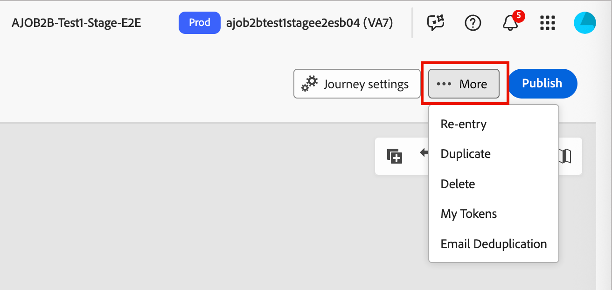

# Reinserimento percorso

_Solo percorsi di account_

Quando si abilita la reimmissione per un percorso di account, è possibile controllare quando e con quale frequenza un account può reimmettere lo stesso percorso. Utilizzare le impostazioni di reinserimento per impostare criteri, limiti e tempi di attesa in modo che gli account possano essere riqualificati per il percorso in modo controllato.

Un account può essere riqualificato per un percorso quando sono soddisfatte le seguenti condizioni:

* L’account rientra nel numero di reinserimenti consentiti per il percorso.
* L’account ha raggiunto la soglia del tempo di attesa (il tempo minimo di attesa prima della riqualificazione).
* L’account non è attualmente nel percorso.

## Abilita reinserimento per un percorso di account

È possibile abilitare il reinserimento e modificare le impostazioni di reinserimento quando il percorso è in stato _Bozza_.

1. Aprire il percorso di conti provvisori.

1. Fai clic sul menu **[!UICONTROL Altro...]** in alto a destra e scegli **[!UICONTROL Rientro]**.

   {width="450"}

1. Nella finestra di dialogo _[!UICONTROL Rientro Percorso]_, attiva l&#39;opzione **[!UICONTROL Abilita rientro]**.

   Quando la funzione è attivata, vengono visualizzate le opzioni per la temporizzazione, il ritardo e i limiti.

   {width="450"}

1. Per **[!UICONTROL Intervallo di rientro]**, scegliere la modalità di calcolo dell&#39;attesa:

   * **[!UICONTROL Attesa dalla fine del percorso]** - Il periodo di attesa inizia quando l&#39;account esce o completa il percorso. Ad esempio, &quot;30 percorsi dopo il completamento del conto, è possibile reinserirli&quot;.

   * **[!UICONTROL Attesa dall&#39;inizio del percorso]** - Il periodo di attesa si basa sul momento in cui l&#39;account è entrato per la prima volta nel percorso. Ad esempio, &quot;30 percorsi dopo l’inizio del conto, è possibile reinserirli&quot;.

1. Imposta il **[!UICONTROL ritardo rientro]**, che è la durata dell&#39;attesa in ore o giorni.

   Questa impostazione determina quanto tempo un account deve attendere dopo essere uscito o aver avviato il percorso prima di poter rientrare.

1. Imposta il **[!UICONTROL limite di ingresso]** per definire il numero massimo di volte in cui un account può entrare nel percorso.

   Quando un account raggiunge il limite, non è più idoneo per l’ingresso fino a quando il limite non viene reimpostato o il percorso non viene ripubblicato con un nuovo limite.

   Questo limite si applica per ogni account di quel percorso.

1. Fai clic su **[!UICONTROL Salva]**.

## Progressione e attività dell’account

Per un percorso di account pubblicato, la mappa del percorso visualizza [progressione account](./journeys-overview.md#review-account-progression) per i nodi del percorso. Ogni nodo sulla mappa mostra il numero di account che hanno raggiunto quel nodo e, per i percorsi live, il numero di account che si trovano attualmente a quel nodo. Ogni volta che un account viene reinserito in un percorso, viene conteggiato come voce distinta.

<!-- 
You can see how many times accounts have entered the journey. ?? 

When you drill in to [account details](../accounts/account-details.md), the account activity shows each time the account entered the journey. It includes explicit activity and a recurrence count so that you can see re-entries clearly.
-->
