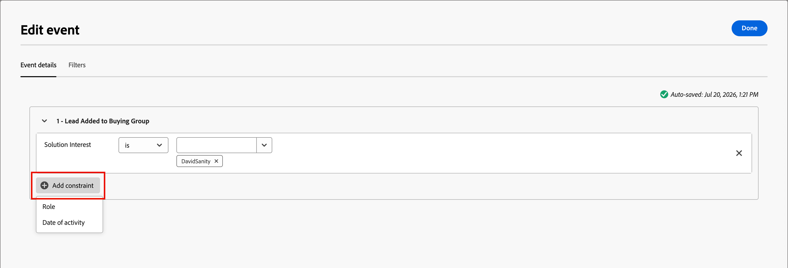
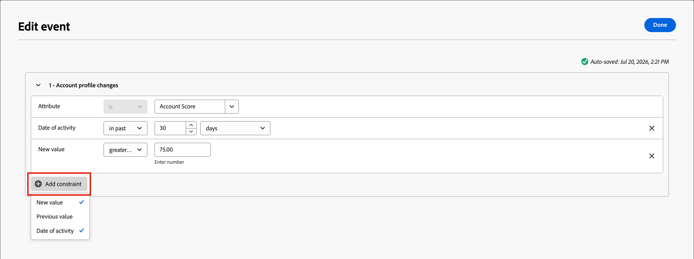
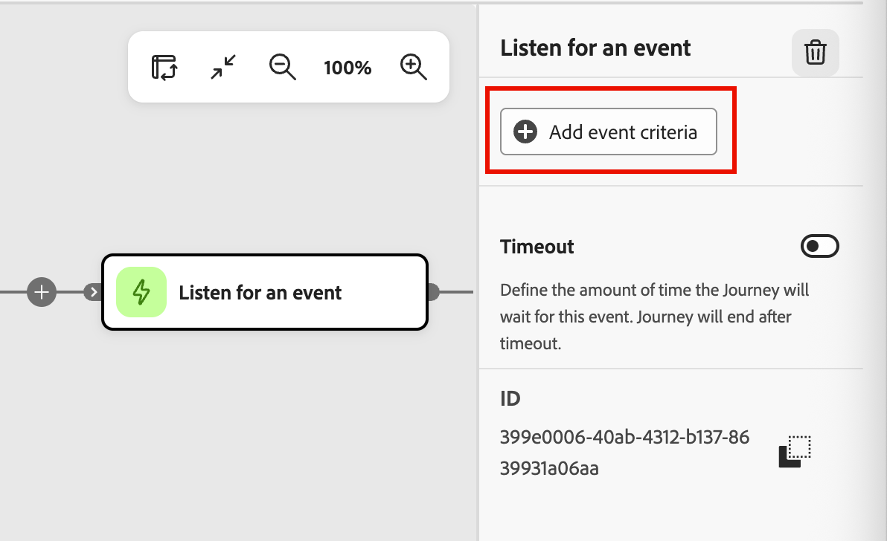
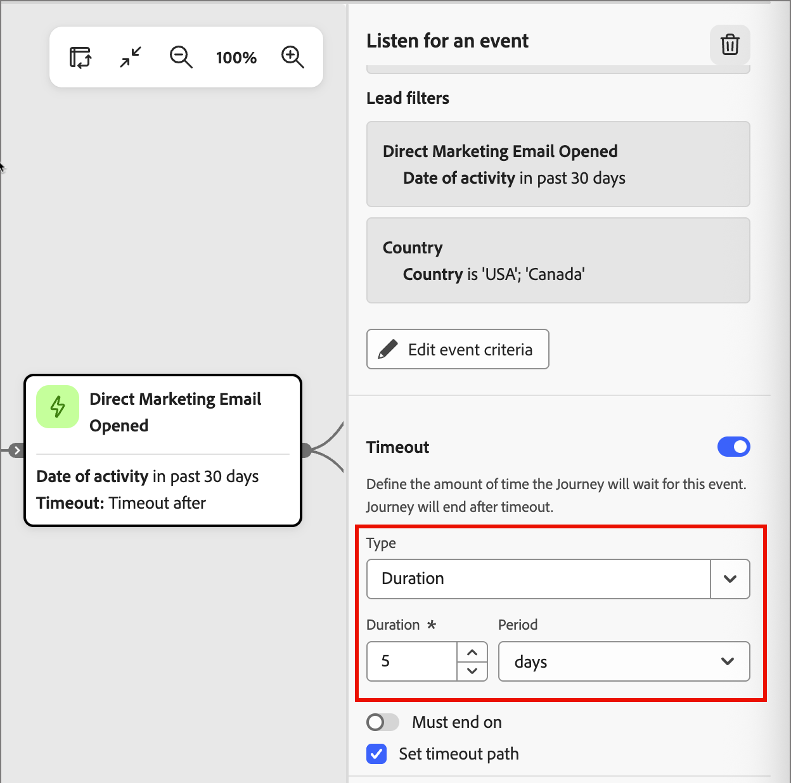
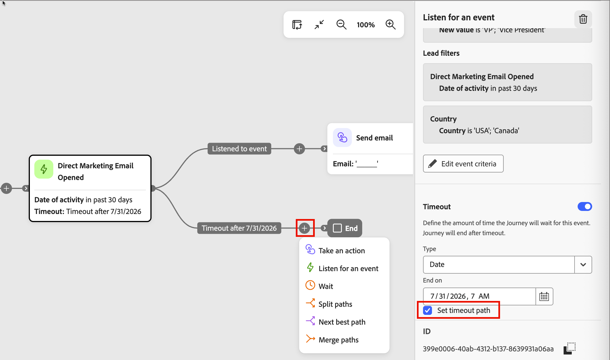

# Ascoltare un evento

Per spostare il pubblico al passaggio successivo nel [percorso](./journeys-overview.md) quando si verifica un evento, aggiungi il nodo _Ascolta un evento_. A seconda del tipo di percorso, puoi utilizzare questo nodo per attivare il nodo successivo nel percorso in base agli eventi relativi alle persone o all’account.

<!--
{width="30", vertical-align="middle"} [Watch the overview video](#overview-video)
-->

## Percorsi account {#account-journeys}

>[!NOTE]
>
>Per un percorso di account, non è possibile aggiungere il nodo _[!UICONTROL Ascolta un tipo di nodo evento]_ in un percorso suddiviso da persone.

1. Apri l’area di lavoro del percorso di account.

1. Fai clic sull&#39;icona più ( **+** ) in un percorso e scegli **[!UICONTROL Ascolta un evento]**.

   {width="400"}

1. Nelle proprietà del nodo a destra, utilizza il selettore _Tipo evento_ per scegliere tra **[!UICONTROL Account]** e **[!UICONTROL Persone]**.

1. Seleziona un evento dall’elenco.

   * Per il tipo di evento _Persone_, scegli l&#39;[evento persone](#people-events) che desideri utilizzare per il trigger.

     {width="500" zoomable="yes"}

   * Per il tipo di evento _Account_, scegliere l&#39;[evento account](#account-events) che si desidera utilizzare per il trigger.

     {width="500" zoomable="yes"}

1. Fai clic su **[!UICONTROL Modifica evento]** e definisci i dettagli dell&#39;evento.

   A seconda del tipo e dell’evento selezionati, definisci i criteri di corrispondenza dell’evento.

   * [Eventi persone](#people-events)
   * [Eventi account](#account-events)

   Puoi anche includere [filtri](#filters-people-event) per l&#39;evento.

1. Fai clic su **[!UICONTROL Fine]**.

   Le definizioni di evento e filtro vengono visualizzate nel nodo e nelle proprietà del nodo.

   {width="500"}

### Eventi persone per percorsi di account {#people-events}

In un percorso di account, puoi ascoltare un evento basato sulle persone quando desideri spostare l’account in avanti nel percorso in base agli eventi attivati dall’attività delle persone. Puoi anche filtrare gli eventi in base alla cronologia degli eventi e agli attributi delle persone.

>[!TIP]
>
>Gli eventi di esperienza possono verificarsi _prima che_ persone entrino nel percorso (ad esempio un clic e-mail precedente o un&#39;interazione web). Per instradare le persone in base a questi eventi, utilizzare il filtro [!UICONTROL Cronologia eventi] in un nodo [Dividi percorsi per persone](./split-merge-paths-nodes.md#experience-event-history-filtering).

#### Eventi B2B di Journey Optimizer {#events-account-people}

| Evento | Vincoli |
| ----- | ----------- |
| [!UICONTROL Assegnato al gruppo di acquisto] | Interesse soluzione (obbligatorio)  Vincoli aggiuntivi (facoltativo): <li>Ruolo</li><li>Data dell’attività</li> Timeout (facoltativo) |
| [!UICONTROL Modifiche al profilo della persona] | Attributo (obbligatorio) Data di attività (facoltativo) Nuovo valore (facoltativo) Valore precedente (facoltativo) Motivo (facoltativo) Source (facoltativo) |
| [!UICONTROL Rimosso dal gruppo di acquisto] | Interesse soluzione (obbligatorio) Data attività (facoltativo) Timeout (facoltativo) |

1. Imposta il valore richiesto per la corrispondenza per l’evento.

   Se necessario, impostare l&#39;operatore per la valutazione.

1. Per ogni vincolo facoltativo che si desidera includere per la corrispondenza evento, fare clic su **[!UICONTROL Aggiungi vincolo]** e selezionare un vincolo nell&#39;elenco.

   {width="700" zoomable="yes"}

1. (Facoltativo) Seleziona la scheda **[!UICONTROL Filtri]** per [aggiungere filtri per l&#39;evento](#filters-people-event).

1. Fai clic su **[!UICONTROL Fine]**.

#### Eventi esperienza {#experience-events-account-people}

>[!PREREQUISITES]
>
>Gli amministratori configurano [Adobe Experience Platform (AEP) Experience Events](https://experienceleague.adobe.com/it/docs/experience-platform/xdm/classes/experienceevent){target="_blank"}, che consentono agli addetti al marketing di creare percorsi di account e persone che reagiscono agli eventi in tempo reale.
>
>Per rendere Experience Events disponibili per percorsi, un amministratore di prodotto deve prima [aggiungere i tipi di evento e i campi di interesse](../admin/configure-aep-events.md#add-an-event) in [!DNL Journey Optimizer B2B Edition].

1. Fare clic su **[!UICONTROL Aggiungi vincolo]** e scegliere il campo che si desidera utilizzare per il vincolo.

   I vincoli disponibili vengono definiti come campi gestiti per la configurazione dell’evento.

1. Completare la condizione per il vincolo.

   È possibile utilizzare l&#39;operatore predefinito **[!UICONTROL is]** per far corrispondere uno o più valori di campo. In alternativa, è possibile utilizzare l&#39;operatore **[!UICONTROL is not]** per la corrispondenza su tutti i valori con l&#39;esclusione di uno o più valori specificati.

   {width="700" zoomable="yes"}

1. (Facoltativo) Seleziona la scheda **[!UICONTROL Filtri]** per [aggiungere filtri per l&#39;evento](#filters-people-event).

1. Fai clic su **[!UICONTROL Fine]**.

### Eventi account {#account-events}

In un percorso di account, è possibile ascoltare un evento basato sull&#39;account quando si desidera spostare l&#39;account in avanti nel percorso in base agli eventi attivati dall&#39;attività dell&#39;account.

| Evento | Vincoli |
| ----- | ----------- |
| [!UICONTROL L&#39;account ha avuto un momento interessante] | Tipo (E-mail, Milestone o Web) Vincoli aggiuntivi (facoltativo): <li>Descrizione</li><li>Origine</li><li>Data dell’attività</li>  Timeout (facoltativo) |
| [!UICONTROL Modifica del valore dei dati dell&#39;account] | Attributo Vincoli aggiuntivi (facoltativo): <li>Nuovo valore</li><li>Valore precedente</li><li>Data dell’attività</li>  Timeout (facoltativo) |
| [!UICONTROL Modifica in fase gruppo acquisti] | Interesse soluzione Vincoli aggiuntivi (facoltativo): <li>Nuova fase</li><li>Fase precedente</li><li>Data dell’attività</li>  Timeout (facoltativo) |
| [!UICONTROL Modifica dello stato del gruppo di acquisto] | Interesse soluzione Vincoli aggiuntivi (facoltativo): <li>Nuovo stato</li><li>Stato precedente</li><li>Data dell’attività</li>  Timeout (facoltativo) |
| [!UICONTROL Modifica del punteggio di completezza] | Interesse soluzione Vincoli aggiuntivi (facoltativo): <li>Nuovo punteggio</li><li>Punteggio precedente</li><li>Data dell’attività</li>  Timeout (facoltativo) |
| [!UICONTROL Modifica del punteggio di coinvolgimento] | Interesse soluzione Vincoli aggiuntivi (facoltativo): <li>Nuovo punteggio</li><li>Punteggio precedente</li><li>Data dell’attività</li>  Timeout (facoltativo) |

1. Imposta il vincolo richiesto da associare all&#39;evento.

1. Per ogni vincolo facoltativo che si desidera includere per la corrispondenza evento, fare clic su **[!UICONTROL Aggiungi vincolo]** e selezionare il campo.

   {width="700" zoomable="yes"}

   Imposta l’operatore e il valore per la valutazione.

1. Fai clic su **[!UICONTROL Fine]**.

<!--

Removed from AJO B2B people events 

| [!UICONTROL Clicks link in email] | Email  Additional constraints (optional): <li>Link</li><li>Link ID</li><li>Is mobile device</li><li>Device</li><li>Platform</li><li>Browser</li><li>Is predictive content</li><li>Is bot activity</li><li>Bot activity pattern</li><li>Browser</li><li>Date of activity</li><li>Min. number of times</li> Timeout (optional) |
| [!UICONTROL Clicks link in SMS] | Email  Additional constraints (optional): <li>Link</li><li>Device</li><li>Platform</li><li>Date of activity</li><li>Min. number of times</li> Timeout (optional) |
| [!UICONTROL Data value changes] | Person attribute  Additional constraints (optional): <li>New value</li><li>Previous value</li><li>Reason</li><li>Source</li><li>Date of activity</li><li>Min. number of times</li> Timeout (optional) |
| [!UICONTROL Opens email] | Email  Additional constraints (optional): <li>Link</li><li>Link ID</li><li>Is mobile device</li><li>Device</li><li>Platform</li><li>Browser</li><li>Is predictive content</li><li>Is bot activity</li><li>Bot activity pattern</li><li>Browser</li><li>Date of activity</li><li>Min. number of times</li> Timeout (optional) |
| [!UICONTROL Score is changed] | Score name  Additional constraints (optional):<li>Change</li><li>New score</li><li>Urgency</li><li>Priority</li><li>Relative score</li><li>Relative urgency</li><li>Date of activity</li><li>Min. number of times</li> Timeout (optional) |
| [!UICONTROL SMS Bounces]| SMS message  Additional constraints (optional): <li>Date of activity</li><li>Min number of times</li> Timeout (optional) |

### Listen for a Marketo Engage event {#listen-for-marketo-engage-event}

| Marketo Engage | [!UICONTROL Visits Web Page] | Web page   Select one or more Marketo Engage pages to match.   Additional constraints (optional): <li>Querystring</li><li>Client IP address</li><li>Referrer</li><li>User Agent</li><li>Search engine</li><li>Search query</li><li>Token</li><li>Browser</li><li>Platform</li><li>Device</li><li>Date of activity</li> |
| | [!UICONTROL Fills out form] | Form   Select one or more Marketo Engage forms to match.   Additional constraints (optional): <li>Date of activity</li><li>Querystring</li><li>Client IP address</li><li>Referrer</li><li>User agent</li><li>Platform</li><li>Device</li> Timeout (optional) |
| Adobe Experience Platform | [!UICONTROL Event definition] | Event type   Additional constraints (optional): <li>Fields</li>  Additional constraints (not supported): <li>Date of activity</li><li>Min. number of times</li>  Timeout (optional) |

If you have web pages in your connected Marketo Engage instance, you can trigger an event based on a visit/no visit to these web pages, as well as Marketo Engage forms that were/were not filled. 

1. Use the **[!UICONTROL Select people event]** selector and scroll the menu to the **[!UICONTROL Marketo Engage]** section.

1. Select a Marketo Engage activity type:

   * **[!UICONTROL Visits Web Page]**.
   * **[!UICONTROL Fills Out Form]**

   {width="700" zoomable="yes"}

1. Click **[!UICONTROL Edit event]** and define one or more web pages to match and any additional constraints for the event.

   * (Required) In the _[!UICONTROL Edit event]_ dialog, define the **[!UICONTROL Web page]** or **[!UICONTROL Fills out form]** constraint. Use **[!UICONTROL is]** (default) to match on one or more selected pages or forms. Use **[!UICONTROL is not]** to match on all page visits/forms with the exclusion of one or more selected pages/forms. Or, use the **[!UICONTROL is any]** operator to match on any Marketo Engage web page visit or filled form.

   * (Optional) Click **[!UICONTROL Add constraint]** and choose the field that you want to use for the constraint. Set the operator and the value for the field.

     {width="700" zoomable="yes"}

     To include additional field constraints as needed, repeat this action.

   * If needed, select the **[!UICONTROL Filters]** tab to [add filters for the event](#add-a-filter-to-the-people-event).

   * When the constraints and filters are defined, click **[!UICONTROL Done]**.

1. If needed, set the **[!UICONTROL Timeout]** option to limit the time period to listen for the event (see [Add a timeout to an event node](#add-a-timeout-to-an-event-node)). 

1. In the journey canvas, add the next node to execute when the event occurs.

-->

## Percorsi di persone {#person-journeys}

1. Apri l’area di lavoro del percorso di persone.

1. Fai clic sull&#39;icona più ( **+** ) in un percorso e scegli **[!UICONTROL Ascolta un evento]**.

   {width="350"}

1. Nelle proprietà del nodo a destra, fai clic su **[!UICONTROL Aggiungi criterio evento]**.

   {width="450"}

1. Aggiungi un evento e imposta i vincoli a cui desideri corrispondere per il trigger.

   Puoi utilizzare [Eventi esperienza](#experience-events-person) e [Modifiche al profilo della persona](#person-profile-changes) per definire il trigger dell&#39;evento.

   Trascina e rilascia il trigger di evento nello spazio del generatore e imposta la definizione. Fare clic su **[!UICONTROL Aggiungi vincolo]** per ogni vincolo che si desidera utilizzare per perfezionare la corrispondenza dell&#39;evento.

   Puoi aggiungere più eventi da associare. Il primo evento qualificante fa avanzare il profilo della persona nel percorso.

1. (Facoltativo) Seleziona la scheda **[!UICONTROL Filtri]** per [aggiungere filtri per l&#39;evento](#filters-people-event).

1. Fai clic su **[!UICONTROL Fine]**.

   Le definizioni di evento e filtro vengono visualizzate nel nodo e nelle proprietà del nodo.

   {width="450"}

### Eventi esperienza per percorsi di persone {#experience-events-person}

>[!PREREQUISITES]
>
>Gli amministratori configurano [Adobe Experience Platform (AEP) Experience Events](https://experienceleague.adobe.com/it/docs/experience-platform/xdm/classes/experienceevent){target="_blank"}, che consentono agli addetti al marketing di creare percorsi di account e persone che reagiscono agli eventi in tempo reale.
>
>Per rendere Experience Events disponibili per percorsi, un amministratore di prodotto deve prima [aggiungere i tipi di evento e i campi di interesse](../admin/configure-aep-events.md#add-an-event) in [!DNL Journey Optimizer B2B Edition].

È possibile utilizzare Eventi esperienza per attivare il nodo in percorsi di persone nella finestra di dialogo _[!UICONTROL Modifica evento]_.

1. Espandi **[!UICONTROL Eventi Sapphire AEP]** nell&#39;elenco _[!UICONTROL Triggers]_ a sinistra.

1. Trascina e rilascia Experience Event nello spazio del generatore di corrispondenze degli eventi.

   È possibile utilizzare il campo _Ricerca_ per filtrare una parola chiave nel nome dell&#39;evento, ad esempio `email`.

1. Fare clic su **[!UICONTROL Aggiungi vincolo]** e scegliere il campo che si desidera utilizzare per perfezionare la corrispondenza dell&#39;evento.

   I vincoli disponibili vengono definiti come campi gestiti per la configurazione dell’evento.

   {width="700" zoomable="yes"}

1. Imposta l’operatore e i valori da far corrispondere per il campo evento.

1. (Facoltativo) Aggiungi un altro evento esperienza o una [modifica del profilo persona](#person-profile-changes).

   Quando aggiungi più eventi da associare. Il primo evento qualificante fa avanzare il profilo della persona nel percorso.

1. (Facoltativo) Seleziona la scheda **[!UICONTROL Filtri]** per [aggiungere filtri per l&#39;evento](#filters-people-event).

1. Fai clic su **[!UICONTROL Fine]**.

### Variazioni in profilo persona {#person-profile-changes}

È possibile utilizzare una modifica negli attributi del profilo di persona B2B per attivare il nodo nei percorsi di persone nella finestra di dialogo _[!UICONTROL Modifica evento]_.

1. Trascina **[!UICONTROL Modifica del profilo della persona]**&#x200B;s dall&#39;elenco _[!UICONTROL Triggers]_ nello spazio del generatore di corrispondenze eventi.

1. Fare clic su **[!UICONTROL Aggiungi vincolo]** e selezionare la modifica dell&#39;attributo che si desidera utilizzare per l&#39;attivazione dell&#39;evento.

   Imposta il valore del campo in base alla modifica che desideri applicare.

   {width="700" zoomable="yes"}

1. (Facoltativo) Aggiungi un altro attributo _Person profile change_ che desideri utilizzare come attivatore di evento o un [Experience Event](#experience-events-person).

   Quando aggiungi più eventi da associare. Il primo evento qualificante fa avanzare il profilo della persona nel percorso.

1. (Facoltativo) Seleziona la scheda **[!UICONTROL Filtri]** per [aggiungere filtri per l&#39;evento](#filters-people-event).

1. Fai clic su **[!UICONTROL Fine]**.

## Filtri per gli eventi {#filters-people-event}

Quando definisci un evento [persone in un percorso di account](#people-events) o un evento [in un percorso di persone](#person-journeys), puoi includere un filtro per limitare i trigger di eventi corrispondenti in base a vari criteri:

| Filtri | Descrizione |
| ------------ | ----------- |
| [!UICONTROL Cronologia eventi] | Eventi esperienza configurati da un amministratore. Vedi _[Seleziona eventi e campi esperienza](../admin/configure-aep-events.md)_. |
| [!UICONTROL Attributi della persona] | Attributi dal profilo persona B2B, tra cui: <li>Città <li>Paese <li>Data di nascita <li>Indirizzo e-mail <li>E-mail non valida <li>E-mail sospesa <li>Nome <li>Area geografica dello stato dedotta<li>Posizione lavorativa <li>Cognome <li>Numero di cellulare <li>Punteggio di coinvolgimento della persona <li>Numero di telefono <li>Codice postale <li>Stato <li>Annulla l&#39;iscrizione <li>Motivo dell’annullamento dell’iscrizione |
| [!UICONTROL Attributi persona] | (Solo percorsi di persone) Valore attributo |
| [!UICONTROL Filtri speciali] > [!UICONTROL Membro del gruppo di acquisto] | La persona è o non è un membro del gruppo di acquisto valutato in base a uno o più dei seguenti criteri: <li>Interesse soluzione</li><li>Stato gruppo acquisti</li><li>Punteggio di completezza</li><li>Punteggio di coinvolgimento</li><li>È stato rimosso</li><li>Ruolo</li> |

<!--
| [!UICONTROL Special filters] > [!UICONTROL Member of List] | The person is or is not a member of one or more Marketo Engage lists. |
| [!UICONTROL Special filters] > [!UICONTROL Member of Program] | The person is or is not a member of one or more Marketo Engage programs. |
-->

1. Dopo aver definito il trigger dell&#39;evento, selezionare la scheda **[!UICONTROL Filtri]** nella finestra di dialogo _[!UICONTROL Modifica evento]_.

   {width="700" zoomable="yes"}

1. Per filtrare le corrispondenze per l’evento, aggiungi uno o più criteri di filtro.

   * Trascina e rilascia uno dei filtri dalla navigazione a sinistra e completa la definizione della corrispondenza.

     >[!NOTE]
     >
     >Se hai dei campi persona personalizzati definiti nello schema del pubblico dell&#39;account in Experience Platform, questi campi sono disponibili anche in **[!UICONTROL Attributi]** da usare come attributi persona nei filtri.

   * Affina il filtro applicando la **[!UICONTROL logica filtro]** nella parte superiore. Puoi scegliere di far corrispondere tutti i filtri o qualsiasi filtro.

     {width="600" zoomable="yes"}

1. Al termine delle definizioni dell&#39;evento e del filtro, fare clic su **[!UICONTROL Fine]**.

## Aggiungere un timeout a un nodo evento {#timeouts}

Se necessario, definisci il tempo di attesa dell’evento da parte del percorso. Il percorso termina dopo un timeout a meno che non si definisca un percorso di timeout in cui è possibile aggiungere altri nodi.

Abilita l&#39;opzione **[!UICONTROL Timeout]** nelle proprietà del nodo per specificare un timeout per il nodo _Ascolta per evento_.

1. Con le opzioni abilitate, scegli il _Tipo_ e specifica i parametri per il timeout:

   * **[!UICONTROL Durata]** - Utilizzare questo tipo per specificare un periodo di tempo per l&#39;attivazione dell&#39;evento. Se l’evento non si attiva entro tale periodo, la persona o l’account non procede nel percorso.

     Selezionare la durata per la quale il percorso attende che si verifichi un evento prima del timeout. Specifica il numero di minuti, ore, giorni, settimane o mesi.

     {width="500" zoomable="yes"}

     Se desideri che il periodo di tempo termini in un giorno specifico della settimana, abilita l&#39;opzione **[!UICONTROL Deve finire il]**. **[!UICONTROL Qualsiasi giorno]** è selezionato per impostazione predefinita, con tutti i giorni selezionati. Deselezionare la casella di controllo e quindi selezionare uno o più giorni per una data di fine. Quindi seleziona **Ora** e **[!UICONTROL Fuso orario]**.

     {width="300"}

   * **[!UICONTROL Data]** - Utilizzare questo tipo per impostare una data di scadenza per il nodo. Se l’evento non viene attivato entro la data/ora specificata, la persona o l’account non procede nel percorso.

     Fai clic sull&#39;icona _Calendario_ per impostare la data e l&#39;ora per il timeout.

     {width="500" zoomable="yes"}

1. Definisci il percorso di timeout.

   L&#39;opzione **[!UICONTROL Imposta percorso di timeout]** è selezionata per impostazione predefinita. Puoi utilizzare questo percorso per definire cosa accade se il nodo Ascolta per evento scade. Puoi aggiungere azioni ed eventi alternativi che si applicano ai profili delle persone quando l’evento non si verifica.

   {width="600" zoomable="yes"}

   Se non si desidera definire il percorso, deselezionare la casella di controllo _[!UICONTROL Imposta percorso di timeout]_.

<!--
 ## Overview video

>[!VIDEO](https://video.tv.adobe.com/v/3443242/?captions=ita&learn=on) 
-->
